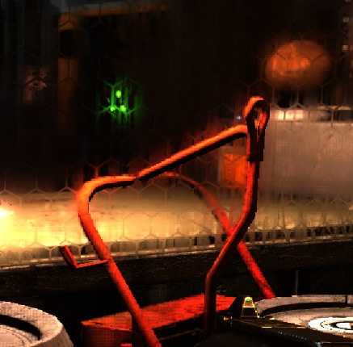
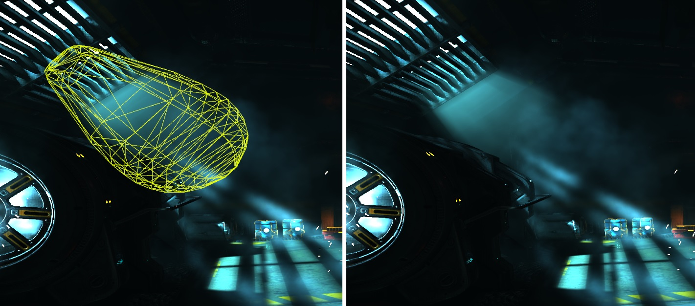
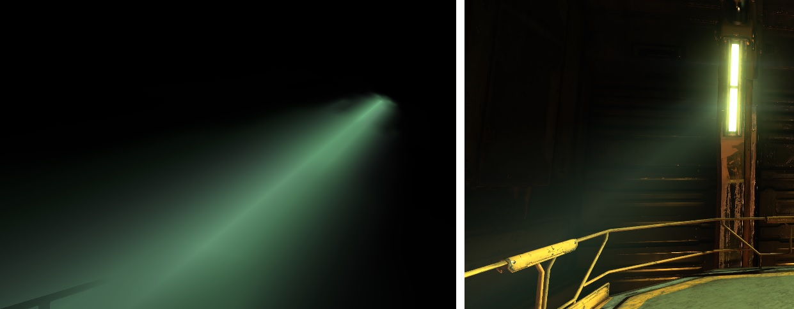
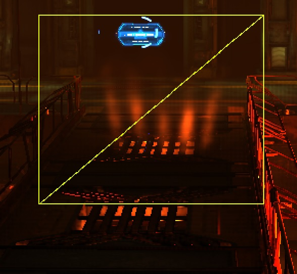
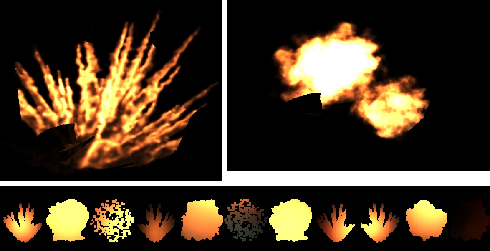

## Glass

В Doom 2016 стекла рисуются в forward pass. Сначала строятся 5 мипов для сцены за стеклом, потом они размываются в 2 прохода, затем рисуется стекло с декалями.

В шейдере запускается цикл по всем декалям для стекла, рассчитывается финальная гладкость (smoothness) стекла, затем выбирается нужный мип:
* smoothness > 0.975, тогда берется мип 1/2
* smoothness > 0.75, блендится мип 1/2 и 1/4
* smoothness > 0.5, блендится мип 1/4 и 1/8
* smoothness > 0.25, блендится мип 1/8 и 1/16
* в остальных случаях - блендится мип 1/16 и 1/32

Детали перед стеклом также размываются, что некорректно. В Doom Eternal это исправили закрасив черным все что перед стеклом. 

В статье [Refracting Pixels](https://www.froyok.fr/blog/2024-12-refraction/) разбираются подходы из разных игр, все используют аналогичный подход, отличаются только детали.

## Screen-space Distortion

В отдельную текстуру, размера 1/4, рисуется карта искажения для каждого объекта с рефракцией.
Последний проход применяет искажения, добавляет тонемапинг и выводит на экран.

Эффект описан еще в [GPU Gems 2: Generic Refraction Simulation](https://developer.nvidia.com/gpugems/gpugems2/part-ii-shading-lighting-and-shadows/chapter-19-generic-refraction-simulation).

[Пример DistortionMap](https://github.com/azhirnov/as-en/blob/dev/AE/samples/res_editor/_data/scripts/samples-posteffects/DistortionMap.as).

В статье [Refracting Pixels](https://www.froyok.fr/blog/2024-12-refraction/) также рассматривается и рефракция.
Так в Half-Life 2 и F.E.A.R. каждый прозрачный объект с рефракцией копирует рендер таргет и затем читает из него с учетом рефракции.
Так как все непрозрачные объекты рисуются до прозрачных, то при наложении рефракции, объекты которые расположены перед прозрачным также скопируются и будут использоваться для рефракции, что неправильно.

Позднее в играх убрали копирование и искажения накладываются один раз в финальном постпроцессе.

## Glow

В Doom 2016 эффект состоит из двух частей:
* Обычный bloom с даунскейлом
* Отдельный RT куда рисуются flares несколькими спрайтами.

Затем две части комбинируются, bloom дополнительно комбинируется с lensDirt.

В Horizon Zero Dawn аналогично сделан свет от роботов. Блики на линзе рисуются геометрией.

Такое разделение нужно так как bloom дает однообразную размытую картинку, а заранее подготовленные четкие спрайты придают более красивый вид и имитируют рассеивание света на линзе.

Другой вариант эффекта разбирается в [Doom 3 – Volumetric Glow](https://simonschreibt.de/gat/doom-3-volumetric-glow/).
Более дешевый эффект строится геометрией и накладывается текстура с градиентом, либо рассчитывается затухание в FS, но тут стоит учитывать, что интерполяция может давать артефакты на стыках геометрии, поэтому нужно считать расстояние после интерполяции.

Если доработать построение геометрии, то получится имитировать и объемный свет.

[Пример](https://github.com/azhirnov/as-en/blob/dev/AE/samples/res_editor/_data/scripts/samples-vfx/FakeGlow.as)

## Light Volume

В Doom 2016 как и в Doom 3 объемный свет рисуется через геометрию.

Также в Doom 2016 есть имитация освещения дыма. Сделано также через геометрию, сбоку смотрится хорошо, но при взгляде прямо на источник света геометрия нереалистично уходит вбок.

## Light Bulbs

В GTA V спрайтами рисуют источники света вдали.

Разобрано в [GTA V - Graphics Study - Part 2](https://www.adriancourreges.com/blog/2015/11/02/gta-v-graphics-study-part-2/).

## Light Shafts

Быстрая версия эффекта выглядит так:
* Создаем маску по буферу глубины, небо считается за 1, остальное за 0. Для оптимизации работают в 1/4 от разрешения экрана.
* Маска умножается на цвет солнца/луны.
* Используется радиальный блур с центром в месте, где находится солнце.
  Для оптимизации радиальный блур делается в 2 прохода с разным шагом. Первый дает ступенчатую картинку, а второй сглаживает ее. Но двухпроходная версия дает другую форму лучей, что выглядит даже красивее.
* Размытая картинка прибавляется к цвету.

Нюансы:
* Так как эффект работает в 2D, то это может создавать артефакты, когда луч света накладывается поверх объекта, тогда как в 3D он должен быть за ним.
* После размытия цвет вблизи солнца остается очень ярким и при сложении яркость солнца удваивается и небо поблизости пересвечивается, что плохо смотрится.
  При наложении эффекта нужно корректировать яркость, учитывая что это имитация рассеивания света частицами пыли и туманом/дымкой, поэтому испускаемый свет от угла между светом и камерой, от плотности дымки.

[Пример](https://github.com/azhirnov/as-en/blob/dev/AE/samples/res_editor/_data/scripts/samples-vfx/LightShafts.as)

[GDC2014: Adding High-End Graphical Effects to GT Racing 2 on Android x86 (слайды 15-21)](https://gdcvault.com/play/1020220/Adding-High-End-Graphical-Effects) - другая версия эффекта.
Здесь размывают только точку от солнца, что дает все те же лучи, но не дает тени. Поэтому для более красивого эффекта важно рисовать область намного большую чем солнце.

Более дорогая, но физически корректная версия реализована в Fallout 4 с помощью NVIDIA Volumetric Lighting ([pdf](https://d29g4g2dyqv443.cloudfront.net/sites/default/files/akamai/gameworks/downloads/papers/NVVL/Fast_Flexible_Physically-Based_Volumetric_Light_Scattering.pdf), [video](https://gdcvault.com/play/1023519/Fast-Flexible-Physically-Based-Volumetric)).

* Рендерится shadow map для источника освещения (солнца).
* По shadow map строится геометрия и вытягивается.
* Геометрия рисуется с тестом глубины, где геометрия видна запускается маршинг, чтобы физически-корректно рассчитать рассеивание света.

## Screen-space Reflections

В Doom 2016 происходит после заполнения G-буфера, поэтому не происходит отставания на кадр и картинка не содержит тумана.

## Screen-space Ambient Occlusion

В Doom 2016 используется вариант SSDO с темпоральными техниками.
Глубина конвертируется в R16F линейную глубину для более быстрего доступа (?).

В GTA V используют блур для уменьшения шума.

[Stable SSAO in Battlefield 3 with Selective Temporal Filtering](https://gdcvault.com/play/1015325/Stable-SSAO-in-Battlefield-3)

bilateral blur for upscaling SSAO

## Particles

### Screen Space Particles

Искры и другие короткоживущие частицы симулируются в экранном пространсве, для обработки столкновений берется буфер глубины и нормали.

[Пример](https://github.com/azhirnov/as-en/blob/dev/AE/samples/res_editor/_data/scripts/samples-vfx/SS-Particles.as)

### Explosion

Эффект взрыва рисуется анимированными текстурами, которые хранятся в большом атласе (8к*8к).
R канал хранит яркость, а G - прозрачность.

Отдельным проходом симулируется освещенность каждого спрайта в низком разрешении, результат записывается в отдельный атлас (4к*2к).

Эффект комбинируется из небольшого количества спрайтов, на картинке слева - 4 спрайтов, справа - 3.

В Starwars Battlefront II эффект состоит из намного большего количества спрайтов.
Подробно разбирается в статье [Battlefront II: Layered Explosion](https://simonschreibt.de/gat/battlefront-ii-layered-explosion/) и [Community Transmission — Visual Effects in Star Wars Battlefront II](https://www.reddit.com/r/StarWarsBattlefront/comments/cho15m/community_transmission_visual_effects_in_star/).

Пример эффекта: 

Геометрия: 

[Fallout 4 – The Mushroom Case](https://simonschreibt.de/gat/fallout-4-the-mushroom-case/).

### Splash

Подробно разобрано в [Jedi: Fallen Order – Splishy Splashy](https://simonschreibt.de/gat/jedi-fallen-order-splishy-splashy/).

Эффект брызг состоит из частиц для мелких капель и геометрии для более крупных деталей.
Геометрия нужна когда направление на камеру может сильно меняться и спрайты в таком случае выглядят нереалистично. Также геометрию можно вращать.

### Rain

Дождь делается частицами перед камерой. Вдали заменяется туманом.

Можно объединить с симуляцией частиц по буферу глубины для обнаружения мест столкновения со сценой и включения эффекта брызг.

Рефракция в капле делается аналогично стеклу, когда читается уменьшенная и заблуреная сцена.

### Следы / Декали

Отметки от лазера и сварки. Разбирается в [Alien vs Wolfenstein – Cutting Torch](https://simonschreibt.de/gat/alien-vs-wolfenstein-cutting-torch/).

[GDC2014: Advanced Visual Effects with DirectX 11: Compute-Based GPU Particle Systems](https://gdcvault.com/play/1020002/Advanced-Visual-Effects-with-DirectX)
[GDC2014: Scripting Particles: Getting Native Speed from a Virtual Machine](https://gdcvault.com/play/1020176/Scripting-Particles-Getting-Native-Speed)

## Spotlight

## Depth of Field (DOF)

Из цвета в отдельные текстуры вырезается дальняя и ближния часть. Они блурятся и используются в DOF пост-эффекте.

## Bloom

Рассеивания света на линзе. Чем больше яркость, тем больше площадь/радиус пятна.

Эффект состоит из нескольких частей:
* Из HDR цвета извлекаются самые яркие пиксели.
	- В Doom 2016 берут максимальную яркость покомпонентно, в результате получается немного искаженный цвет.
* Генерация мипов с размытием.
* Апскейл, нижние мипы прибавляются к верхним.
* Перед тонемапингом верхний размытый мип прибавляется к цвету сцены.

Примеры:
* [Gaussian blur, без оптимизаций](https://github.com/azhirnov/as-en/blob/dev/AE/samples/res_editor/_data/scripts/perf/Blur-1.as)
* [Gaussian blur в 2 прохода](https://github.com/azhirnov/as-en/blob/dev/AE/samples/res_editor/_data/scripts/perf/Blur-2.as)
* [Dual filter blur, быстрее на мобилках](https://github.com/azhirnov/as-en/blob/dev/AE/samples/res_editor/_data/scripts/perf/Blur-3.as)
* [Kawase blur, похож на Dual filter](https://github.com/azhirnov/as-en/blob/dev/AE/samples/res_editor/_data/scripts/perf/Blur-4.as)
* [Bloom](https://github.com/azhirnov/as-en/blob/dev/AE/samples/res_editor/_data/scripts/samples-2d/Bloom.as)

## Tonemapping

Преобразование HDR цвета в совместимые с монитором диапазон цветов.

Подробнее про цветовые пространства экранов разобрано в [HDR Display](HDR_Display-ru.md).

## Motion Blur

Одно из назначений эффекта - скрыть задержку переключения пикселей монитора.
Так неподвижная яркая точка на экране имеет одну видимую яркость, а при движении другую, потому что пиксели меняют яркость не сразу.

Эффект ухудшает графику, поэтому он должен применяться, когда это требуется.

## LOD Switch

Эффект переключения уровня детализации меша.

Есть вариант с альфа-блендингом, когда одновременно рисуется оба меша, один становится прозрачнее, другой наоборот, так и происходит переключение.
Из минусов - рисуется оба меша и запускается в 2 раза больше FS и еще работает блендинг.

Другой вариант - заполнить стенсильный буфер шумом и делать смешивание через стенсил тест.
Так вызывается всего один FS на пиксель.
