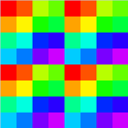

GPUs:
* [Adreno 660](bench/Adreno_660.md)
* [Adreno 505](bench/Adreno_505.md)
* [AMD RX 570](bench/AMD_RX570.md)
* [Apple M1](bench/Apple_M1.md)
* [Intel UHD 620](bench/Intel_UHD620.md)
* [Mali G57](bench/ARM_Mali_G57.md)
* [Mali T830](bench/ARM_Mali_T830.md)
* [NVidia RTX 2080](bench/NVidia_RTX2080.md)
* [PowerVR BXM-8-256](bench/PowerVR_BXM.md)

Other:
* [Comparison of Results](#Comparison-of-Results)
	- [Subgroups](#Subgroups)
	- [Shader instructions](#Shader-instructions)
	- [Subgroup threads order](#Subgroup-threads-order)
	- [NaN](#NaN)
	- [Memory](#Memory)
	- [Render target compression](#Render-target-compression)
* [Test Sources](#Test-Sources)
	- [1](#1-fp16-instruction-performance)
	- [2](#2-fp32-instruction-performance)
	- [3](#3-Render-target-compression)
	- [4](#4-Shader-instruction-benchmark)
	- [5](#5-Texture-lookup-performance)
	- [6](#6-Subgroups)
	- [7](#7-BufferImage-storage-access)
	- [9](#9-Texture-cache)
	- [10](#10-Shared-memory)
	- [11](#11-NaN)

# Comparison of Results

## Subgroups

* Some GPU has early termination for helper invocation if derivatives are not used.
* TBR architectures can fill multiple triangles with a single subgroup, but only with the same instance.
* TBDR architectures can fill multiple triangles and instances with a single subgroup.
* TB* architectures can fill triangles with a single subgroup only inside tile region.

| GPU | subgroup size | tile size | helper invocation early termination | merge triangles | merge between instances | always full subgroup in FS |
|---|---|---|---|---|---|---|
| Adreno 5xx            | ?      | as large as possible | -       | | -       | -       |
| Adreno 6xx            | 64/128 | as large as possible | **yes** | | **yes** | no      |
| AMD GCN4              | 64     | -     | no      | **yes** | no             | ?       |
| Apple M1              | 32     | 16x16 | ?       | ?       | ?              | ?       |
| ARM Mali Midgard gen4 | (4)    | 16x16 | -       | -       | -              | -       |
| ARM Mali Valhall gen1 | 16     | 16x16 | **yes** | **yes** | **yes** (rare) | no      |
| Intel UHD 6xx 9.5gen  | 16     | -     | no      | no      | no             | ?       |
| NV RTX 20xx           | 32     | 16x16 | no      | **yes** | no             | no      |
| PowerVR B‑Series      | 128    | 32x32?| no      | **yes** | no             | **yes** |

## Shader instructions

* FMA and MAD has 2 instructions (Mul, Add) but can execute at 1 cycle.
* Some GPUs supports HFMA2 - FMA for half2 with 2x performance.
* Some GPUs supports FAdd with 2x performance.
* FMA can be implemented only for fp32 and fp16 will lost performance to use this FMA, so MAD should be used instead.
* GPU has parallel datapath for fp32 and i32, scheduler can execute i32 instruction in parallel with fp32 without performance lost.
	- NV Turing has 1:1 fp32:i32 config.
	- NV Ampere has 1 full fp32 and 1 fp32:i32, so it can **not** execute i32 in parallel without fp32 performance lost.

| GPU | fp32 FMA/MAD | fp16x2 FMA/MAD | fp16 FMA/MAD | FAdd | parallel fp32 & i32 (confirmed in specs) |
|----------|---|---|---|---|---|
| Adreno 5xx            | fma | mad | -   | 1 | no  |
| Adreno 6xx            | fma | mad | -   | 1 | 2:1 |
| AMD GCN4              | fma | -   | -   | 1 | no  |
| Apple M1              | fma | no  | fma | 1 | 2:1 |
| ARM Mali Midgard gen4 | mad | no  | mad | 1 | no  |
| ARM Mali Valhall gen1 | fma | mad | -   | 1 | 2:1 |
| Intel UHD 6xx 9.5gen  | fma | **fma** | -   | **2** | 2:1 | 
| NV RTX 20xx (Turing)  | fma | **fma** | -   | **2** | 1:1 **(specs)** |
| PowerVR B‑Series      | fma | no  | mad | 1 | 1:1 |

## Subgroup threads order

| GPU | graphics (quads) | graphics (image) | compute wg:8x8 (threads) | compute (image) |
|----------|---|---|---|---|
| Adreno 5xx            | ? |
| Adreno 6xx            | grid of 4 large quads (4x4 threads) with 4 quads, row major |    | row major 8x8    |  |
| AMD GCN4              | grid of 4 large quads (4x4 threads) with 4 quads, row major |      | column major 8x4, 2 threads in row per column |  |
| Apple M1              | row major 4x2                                               |        | row major 8x4    |  |
| ARM Mali Valhall gen1 | random                                                      |     | row major 8x2    |  |
| Intel UHD 6xx 9.5gen  | grid of 4 quads, row major                                  |  | column major 4x4 |  |
| NV RTX 20xx (Turing)  | column major 2x4                                            |     | row major 8x4    |  |
| PowerVR B‑Series      | [_]-curve, row major 8x4 (Hilbert curve?)                   |   | row major 8x16   |  |

## NaN

### FP32

| op \ type | nan1 | nan2 | nan3 | nan4 | inf | -inf | max | -max |
|---|---|---|---|---|---|---|---|---|
| x | nan | nan | nan | nan | inf | -inf | max | -max |
| Min(x,0) | 0 | 0 | 0 | 0 | 0 | -inf | 0 | -max |
| Min(0,x) | 0 | 0 | 0 | 0 | 0 | -inf | 0 | -max |
| Max(x,0) | 0 | 0 | 0 | 0 | inf | 0 | max | 0 |
| Max(0,x) | 0 | 0 | 0 | 0 | inf | 0 | max | 0 |
| Clamp(x,0,1) | 0 | 0 | 0 | 0 | 1 | 0 | 1 | 0 |
| Clamp(x,-1,1) | -1 | -1 | -1 | -1 | 1 | -1 | 1 | -1 |
| IsNaN | 1 | 1 | 1 | 1 | 0 | 0 | 0 | 0 |
| IsInfinity | 0 | 0 | 0 | 0 | 1 | 1 | 0 | 0 |
| bool(x) | 1 | 1 | 1 | 1 | 1 | 1 | 1 | 1 |
| x != x |  |  |  |  | 0 | 0 | 0 | 0 |
| Step(0,x) |  |  |  |  | 1 | 0 | 1 | 0 |
| Step(x,0) |  |  |  |  | 0 | 1 | 0 | 1 |
| Step(0,-x) |  |  |  |  | 0 | 1 | 0 | 1 |
| Step(-x,0) |  |  |  |  | 1 | 0 | 1 | 0 |
| SignOrZero(x) |  |  |  |  | 1 | -1 | 1 | -1 |
| SignOrZero(‑x) |  |  |  |  | -1 | 1 | -1 | 1 |
| SmoothStep(x,0,1) | 0 | 0 | 0 | 0 | 1 | 0 | 1 | 0 |
| Normalize(x) | nan | nan | nan | nan |  |  |  |  |

differences

* FP32 on **NV Turing**, **Adreno 5xx/6xx**

	| op \ type | nan1 | nan2 | nan3 | nan4 | inf | -inf | max | -max |
	|---|---|---|---|---|---|---|---|---|
	| x != x | 1 | 1 | 1 | 1 |  |  |  |  |
	| Step(0,x) | 1 | 1 | 1 | 1 |  |  |  |  |
	| Step(x,0) | 1 | 1 | 1 | 1 |  |  |  |  |
	| Step(0,-x) | 1 | 1 | 1 | 1 |  |  |  |  |
	| Step(-x,0) | 1 | 1 | 1 | 1 |  |  |  |  |
	| SignOrZero(x) | 0 | 0 | 0 | 0 |  |  |  |  |
	| SignOrZero(‑x) | 0 | 0 | 0 | 0 |  |  |  |  |
	| Normalize(x) |  |  |  |  | nan | nan | 0 | -0 |

* FP32 on **Intel gen 9**

	| op \ type | nan1 | nan2 | nan3 | nan4 | inf | -inf | max | -max |
	|---|---|---|---|---|---|---|---|---|
	| x != x | 1 | 1 | 1 | 1 |  |  |  |  |
	| Step(0,x) | 1 | 1 | 1 | 1 |  |  |  |  |
	| Step(x,0) | 1 | 1 | 1 | 1 |  |  |  |  |
	| Step(0,-x) | 1 | 1 | 1 | 1 |  |  |  |  |
	| Step(-x,0) | 1 | 1 | 1 | 1 |  |  |  |  |
	| SignOrZero(x) | -1 | -1 | -1 | -1 |  |  |  |  |
	| SignOrZero(‑x) | -1 | -1 | -1 | -1 |  |  |  | |
	| Normalize(x) |  |  |  |  | nan | nan | 0 | -0 |

* FP32 on **Mali Valhall gen1**

	| op \ type | nan1 | nan2 | nan3 | nan4 | inf | -inf | max | -max |
	|---|---|---|---|---|---|---|---|---|
	| x != x | 1 | 1 | 1 | 1 |  |  |  |  |
	| Step(0,x) | 0 | 0 | 0 | 0 |  |  |  |  |
	| Step(x,0) | 0 | 0 | 0 | 0 |  |  |  |  |
	| Step(0,-x) | 0 | 0 | 0 | 0 |  |  |  |  |
	| Step(-x,0) | 0 | 0 | 0 | 0 |  |  |  |  |
	| SignOrZero(x) | 0 | 0 | 0 | 0 |  |  |  |  |
	| SignOrZero(‑x) | 0 | 0 | 0 | 0 |  |  |  |  |
	| Normalize(x) |  |  |  |  | 0 | -0 | 0 | -0 |

* FP32 on **Mali Midgard gen4**

	| op \ type | nan1 | nan2 | nan3 | nan4 | inf | -inf | max | -max |
	|---|---|---|---|---|---|---|---|---|
	| x != x | 1 | 1 | 1 | 1 |  |  |  |  |
	| Step(0,x) | 1 | 1 | 1 | 1 |  |  |  |  |
	| Step(x,0) | 1 | 1 | 1 | 1 |  |  |  |  |
	| Step(0,-x) | 1 | 1 | 1 | 1 |  |  |  |  |
	| Step(-x,0) | 1 | 1 | 1 | 1 |  |  |  |  |
	| SignOrZero(x) | 0 | 0 | 0 | 0 |  |  |  |  |
	| SignOrZero(‑x) | 0 | 0 | 0 | 0 |  |  |  |  |
	| SmoothStep(x,0,1) | 0 | 0 | 0 | 0 |  |  |  |  |
	| Normalize(x) |  |  |  |  | 0 | -0 | 0 | -0 |

* FP32 on **PowerVR B-Series**

	| op \ type | nan1 | nan2 | nan3 | nan4 | inf | -inf | max | -max |
	|---|---|---|---|---|---|---|---|---|
	| x != x | 0 | 0 | 0 | 0 |  |  |  |  |
	| Step(0,x) | 1 | 1 | 1 | 1 |  |  |  |  |
	| Step(x,0) | 1 | 1 | 1 | 1 |  |  |  |  |
	| Step(0,-x) | 1 | 1 | 1 | 1 |  |  |  |  |
	| Step(-x,0) | 1 | 1 | 1 | 1 |  |  |  |  |
	| SignOrZero(x) | nan | nan | nan | nan |  |  |  |  |
	| SignOrZero(‑x) | nan | nan | nan | nan |  |  |  |  |
	| Normalize(x) |  |  |  |  | nan | nan | 18446742974197923840 | -18446742974197923840 |

* FP32 on **AMD GCN4**

	| op \ type | nan1 | nan2 | nan3 | nan4 | inf | -inf | max | -max |
	|---|---|---|---|---|---|---|---|---|
	| x != x | 1 | 1 | 1 | 1 |  |  |  |  |
	| Step(0,x) | 1 | 1 | 1 | 1 |  |  |  |  |
	| Step(x,0) | 1 | 1 | 1 | 1 |  |  |  |  |
	| Step(0,-x) | 1 | 1 | 1 | 1 |  |  |  |  |
	| Step(-x,0) | 1 | 1 | 1 | 1 |  |  |  |  |
	| SignOrZero(x) | 1 | 1 | 1 | 1 |  |  |  |  |
	| SignOrZero(‑x) | 1 | 1 | 1 | 1 |  |  |  |  |
	| Normalize(x) |  |  |  |  | 0 | 0 | 0 | 0 |

* FP32 on **Apple M1**

	| op \ type | nan1 | nan2 | nan3 | nan4 | inf | -inf | max | -max |
	|---|---|---|---|---|---|---|---|---|
	| x != x | 0 | 0 | 0 | 0 |  |  |  |  |
	| Step(0,x) | 0 | 0 | 0 | 0 |  |  |  |  |
	| Step(x,0) | 0 | 0 | 0 | 0 |  |  |  |  |
	| Step(0,-x) | 0 | 0 | 0 | 0 |  |  |  |  |
	| Step(-x,0) | 0 | 0 | 0 | 0 |  |  |  |  |
	| SignOrZero(x) | 0 | 0 | 0 | 0 |  |  |  |  |
	| SignOrZero(‑x) | 0 | 0 | 0 | 0 |  |  |  |  |
	| Normalize(x) |  |  |  |  | nan | nan | 0 | -0 |

### FP16

| op \ type | nan1 | nan2 | nan3 | nan4 | inf | -inf | max | -max |
|---|---|---|---|---|---|---|---|---|
| x | nan | nan | nan | nan | inf | -inf | max | -max |
| Min(x,0) | 0 | 0 | 0 | 0 | 0 | -inf | 0 | -max |
| Min(0,x) | 0 | 0 | 0 | 0 | 0 | -inf | 0 | -max |
| Max(x,0) | 0 | 0 | 0 | 0 | inf | 0 | max | 0 |
| Max(0,x) | 0 | 0 | 0 | 0 | inf | 0 | max | 0 |
| Clamp(x,0,1) | 0 | 0 | 0 | 0 | 1 | 0 | 1 | 0 |
| Clamp(x,-1,1) | -1 | -1 | -1 | -1 | 1 | -1 | 1 | -1 |
| IsNaN | 1 | 1 | 1 | 1 | 0 | 0 | 0 | 0 |
| IsInfinity | 0 | 0 | 0 | 0 | 1 | 1 | 0 | 0 |
| bool(x) | 1 | 1 | 1 | 1 | 1 | 1 | 1 | 1 |
| x != x |  |  |  |  | 0 | 0 | 0 | 0 |
| Step(0,x) |  |  |  |  | 1 | 0 | 1 | 0 |
| Step(x,0) |  |  |  |  | 0 | 1 | 0 | 1 |
| Step(0,-x) |  |  |  |  | 0 | 1 | 0 | 1 |
| Step(-x,0) |  |  |  |  | 1 | 0 | 1 | 0 |
| SignOrZero(x) |  |  |  |  | 1 | -1 | 1 | -1 |
| SignOrZero(‑x) |  |  |  |  | -1 | 1 | -1 | 1 |
| SmoothStep(x,0,1) | 0 | 0 | 0 | 0 | 1 | 0 | 1 | 0 |
| Normalize(x) |  |  |  |  | |  | 0 | -0 |

differences

* FP16 is not supported on **Adreno 5xx**, **Mali Midgard gen4**, **AMD GCN4**

* FP16 on **NV Turing**, **Adreno 6xx**

	| op \ type | nan1 | nan2 | nan3 | nan4 | inf | -inf | max | -max |
	|---|---|---|---|---|---|---|---|---|
	| x != x | 1 | 1 | 1 | 1 |  |  |  |  |
	| Step(0,x) | 1 | 1 | 1 | 1 |  |  |  |  |
	| Step(x,0) | 1 | 1 | 1 | 1 |  |  |  |  |
	| Step(0,-x) | 1 | 1 | 1 | 1 |  |  |  |  |
	| Step(-x,0) | 1 | 1 | 1 | 1 |  |  |  |  |
	| SignOrZero(x) | 0 | 0 | 0 | 0 |  |  |  |  |
	| SignOrZero(‑x) | 0 | 0 | 0 | 0 |  |  |  |  |
	| Normalize(x) | nan | nan | nan | nan | nan | nan |  |  |
	
* FP16 on **Intel gen 9**

	| op \ type | nan1 | nan2 | nan3 | nan4 | inf | -inf | max | -max |
	|---|---|---|---|---|---|---|---|---|
	| x != x | 1 | 1 | 1 | 1 |  |  |  |  |
	| Step(0,x) | 1 | 1 | 1 | 1 |  |  |  |  |
	| Step(x,0) | 1 | 1 | 1 | 1 |  |  |  |  |
	| Step(0,-x) | 1 | 1 | 1 | 1 |  |  |  |  |
	| Step(-x,0) | 1 | 1 | 1 | 1 |  |  |  |  |
	| SignOrZero(x) | -1 | -1 | -1 | -1 |  |  |  |  |
	| SignOrZero(‑x) | -1 | -1 | -1 | -1 |  |  |  |  |
	| Normalize(x) | nan | nan | nan | nan | nan | nan |  |  |
	
* FP16 on **Mali Valhall gen1**

	| op \ type | nan1 | nan2 | nan3 | nan4 | inf | -inf | max | -max |
	|---|---|---|---|---|---|---|---|---|
	| x != x | 1 | 1 | 1 | 1 |  |  |  |  |
	| Step(0,x) | 0 | 0 | 0 | 0 |  |  |  |  |
	| Step(x,0) | 0 | 0 | 0 | 0 |  |  |  |  |
	| Step(0,-x) | 0 | 0 | 0 | 0 |  |  |  |  |
	| Step(-x,0) | 0 | 0 | 0 | 0 |  |  |  |  |
	| SignOrZero(x) | 0 | 0 | 0 | 0 |  |  |  |  |
	| SignOrZero(‑x) | 0 | 0 | 0 | 0 |  |  |  |  |
	| Normalize(x) | -1 | -1 | -1 | -1 | 1 | -1 |  |  |
	
* FP16 on **PowerVR B-Series**

	| op \ type | nan1 | nan2 | nan3 | nan4 | inf | -inf | max | -max |
	|---|---|---|---|---|---|---|---|---|
	| x != x | 0 | 0 | 0 | 0 |  |  |  |  |
	| Step(0,x) | 1 | 1 | 1 | 1 |  |  |  |  |
	| Step(x,0) | 1 | 1 | 1 | 1 |  |  |  |  |
	| Step(0,-x) | 1 | 1 | 1 | 1 |  |  |  |  |
	| Step(-x,0) | 1 | 1 | 1 | 1 |  |  |  |  |
	| SignOrZero(x) | nan | nan | nan | nan |  |  |  |  |
	| SignOrZero(‑x) | nan | nan | nan | nan |  |  |  |  |
	| Normalize(x) | nan | nan | nan | nan | nan | nan |  |  |
	
* FP16 on **Apple M1**

	| op \ type | nan1 | nan2 | nan3 | nan4 | inf | -inf | max | -max |
	|---|---|---|---|---|---|---|---|---|
	| x != x | 0 | 0 | 0 | 0 |  |  |  |  |
	| Step(0,x) | 0 | 0 | 0 | 0 |  |  |  |  |
	| Step(x,0) | 0 | 0 | 0 | 0 |  |  |  |  |
	| Step(0,-x) | 0 | 0 | 0 | 0 |  |  |  |  |
	| Step(-x,0) | 0 | 0 | 0 | 0 |  |  |  |  |
	| SignOrZero(x) | 0 | 0 | 0 | 0 |  |  |  |  |
	| SignOrZero(‑x) | 0 | 0 | 0 | 0 |  |  |  |  |
	| Normalize(x) | nan | nan | nan | nan | nan | nan | 0 | -0 |

### FP Mediump

| op \ type | nan1 | nan2 | nan3 | nan4 | inf | -inf | max | -max |
|---|---|---|---|---|---|---|---|---|
| x | nan | nan | nan | nan | inf | -inf |  |  |
| Min(x,0) | 0 | 0 | 0 | 0 | 0 | -inf | 0 |  |
| Min(0,x) | 0 | 0 | 0 | 0 | 0 | -inf | 0 |  |
| Max(x,0) | 0 | 0 | 0 | 0 | inf | 0 |  | 0 |
| Max(0,x) | 0 | 0 | 0 | 0 | inf | 0 |  | 0 |
| Clamp(x,0,1) | 0 | 0 | 0 | 0 | 1 | 0 | 1 | 0 |
| Clamp(x,-1,1) | -1 | -1 | -1 | -1 | 1 | -1 | 1 | -1 |
| IsNaN | 1 | 1 | 1 | 1 | 0 | 0 | 0 | 0 |
| IsInfinity | 0 | 0 | 0 | 0 | 1 | 1 | 0 | 0 |
| bool(x) | 1 | 1 | 1 | 1 | 1 | 1 | 1 | 1 |
| x != x |  |  |  |  | 0 | 0 | 0 | 0 |
| Step(0,x) |  |  |  |  | 1 | 0 | 1 | 0 |
| Step(x,0) |  |  |  |  | 0 | 1 | 0 | 1 |
| Step(0,-x) |  |  |  |  | 0 | 1 | 0 | 1 |
| Step(-x,0) |  |  |  |  | 1 | 0 | 1 | 0 |
| SignOrZero(x) |  |  |  |  | 1 | -1 | 1 | -1 |
| SignOrZero(‑x) |  |  |  |  | -1 | 1 | -1 | 1 |
| SmoothStep(x,0,1) | 0 | 0 | 0 | 0 | 1 | 0 | 1 | 0 |
| Normalize(x) |  |  |  |  |  |  |  |  |

differences

* FP Mediump on **NV Turing**

	| op \ type | nan1 | nan2 | nan3 | nan4 | inf | -inf | max | -max |
	|---|---|---|---|---|---|---|---|---|
	| x |  |  |  |  |  |  | max | -max |
	| Min(x,0) |  |  |  |  |  |  |  | -max |
	| Min(0,x) |  |  |  |  |  |  |  | -max |
	| Max(x,0) |  |  |  |  |  |  | max |  |
	| Max(0,x) |  |  |  |  |  |  | max |  |
	| x != x | 1 | 1 | 1 | 1 |  |  |  |  |
	| Step(0,x) | 1 | 1 | 1 | 1 |  |  |  |  |
	| Step(x,0) | 1 | 1 | 1 | 1 |  |  |  |  |
	| Step(0,-x) | 1 | 1 | 1 | 1 |  |  |  |  |
	| Step(-x,0) | 1 | 1 | 1 | 1 |  |  |  |  |
	| SignOrZero(x) | 0 | 0 | 0 | 0 |  |  |  |  |
	| SignOrZero(‑x) | 0 | 0 | 0 | 0 |  |  |  |  |
	| Normalize(x) | nan | nan | nan | nan | nan | nan | 0 | -0 |

* FP Mediump on **Adreno 5xx/6xx**

	| op \ type | nan1 | nan2 | nan3 | nan4 | inf | -inf | max | -max |
	|---|---|---|---|---|---|---|---|---|
	| x |  |  |  |  |  |  | 65504 | -65504 |
	| Min(x,0) |  |  |  |  |  |  |  | -65504 |
	| Min(0,x) |  |  |  |  |  |  |  | -65504 |
	| Max(x,0) |  |  |  |  |  |  | 65504 |  |
	| Max(0,x) |  |  |  |  |  |  | 65504 |  |
	| x != x | 1 | 1 | 1 | 1 |  |  |  |  |
	| Step(0,x) | 1 | 1 | 1 | 1 |  |  |  |  |
	| Step(x,0) | 1 | 1 | 1 | 1 |  |  |  |  |
	| Step(0,-x) | 1 | 1 | 1 | 1 |  |  |  |  |
	| Step(-x,0) | 1 | 1 | 1 | 1 |  |  |  |  |
	| SignOrZero(x) | 0 | 0 | 0 | 0 |  |  |  |  |
	| SignOrZero(‑x) | 0 | 0 | 0 | 0 |  |  |  |  |
	| Normalize(x) | nan | nan | nan | nan | nan | nan | 255 | -255 |
	
* FP Mediump on **Intel gen9**

	| op \ type | nan1 | nan2 | nan3 | nan4 | inf | -inf | max | -max |
	|---|---|---|---|---|---|---|---|---|
	| x |  |  |  |  |  |  | max | -max |
	| Min(x,0) |  |  |  |  |  |  |  | -max |
	| Min(0,x) |  |  |  |  |  |  |  | -max |
	| Max(x,0) |  |  |  |  |  |  | max |  |
	| Max(0,x) |  |  |  |  |  |  | max |  |
	| x != x | 1 | 1 | 1 | 1 |  |  |  |  |
	| Step(0,x) | 1 | 1 | 1 | 1 |  |  |  |  |
	| Step(x,0) | 1 | 1 | 1 | 1 |  |  |  |  |
	| Step(0,-x) | 1 | 1 | 1 | 1 |  |  |  |  |
	| Step(-x,0) | 1 | 1 | 1 | 1 |  |  |  |  |
	| SignOrZero(x) | -1 | -1 | -1 | -1 |  |  |  |  |
	| SignOrZero(‑x) | -1 | -1 | -1 | -1 |  |  |  |  |
	| Normalize(x) | nan | nan | nan | nan | nan | nan | nan | nan |

* FP Mediump on **Mali Valhall gen1**

	| op \ type | nan1 | nan2 | nan3 | nan4 | inf | -inf | max | -max |
	|---|---|---|---|---|---|---|---|---|
	| x |  |  |  |  |  |  | max | -max |
	| Min(x,0) |  |  |  |  |  |  |  | -max |
	| Min(0,x) |  |  |  |  |  |  |  | -max |
	| Max(x,0) |  |  |  |  |  |  | max |  |
	| Max(0,x) |  |  |  |  |  |  | max |  |
	| x != x | 1 | 1 | 1 | 1 |  |  |  |  |
	| Step(0,x) | 0 | 0 | 0 | 0 |  |  |  |  |
	| Step(x,0) | 0 | 0 | 0 | 0 |  |  |  |  |
	| Step(0,-x) | 0 | 0 | 0 | 0 |  |  |  |  |
	| Step(-x,0) | 0 | 0 | 0 | 0 |  |  |  |  |
	| SignOrZero(x) | 0 | 0 | 0 | 0 |  |  |  |  |
	| SignOrZero(‑x) | 0 | 0 | 0 | 0 |  |  |  |  |
	| Normalize(x) | -1 | -1 | -1 | -1 | 1 | -1 | 1 | -1 |
	
* FP Mediump on **Mali Midgard gen4**

	| op \ type | nan1 | nan2 | nan3 | nan4 | inf | -inf | max | -max |
	|---|---|---|---|---|---|---|---|---|
	| x |  |  |  |  |  |  | max | -max |
	| Min(x,0) |  |  |  |  |  |  |  | -max |
	| Min(0,x) |  |  |  |  |  |  |  | -max |
	| Max(x,0) |  |  |  |  |  |  | max |  |
	| Max(0,x) |  |  |  |  |  |  | max |  |
	| x != x | 1 | 1 | 1 | 1 |  |  |  |  |
	| Step(0,x) | 1 | 1 | 1 | 1 |  |  |  |  |
	| Step(x,0) | 1 | 1 | 1 | 1 |  |  |  |  |
	| Step(0,-x) | 1 | 1 | 1 | 1 |  |  |  |  |
	| Step(-x,0) | 1 | 1 | 1 | 1 |  |  |  |  |
	| SignOrZero(x) | 0 | 0 | 0 | 0 |  |  |  |  |
	| SignOrZero(‑x) | 0 | 0 | 0 | 0 |  |  |  |  |
	| SmoothStep(x,0,1) | 0 | 0 | 0 | 0 |  |  |  |  |
	| Normalize(x) | nan | nan | nan | nan | 0 | -0 | 0 | -0 |
	
* FP Mediump on **PowerVR B-Series**

	| op \ type | nan1 | nan2 | nan3 | nan4 | inf | -inf | max | -max |
	|---|---|---|---|---|---|---|---|---|
	| x |  |  |  |  |  |  | max | -max |
	| Min(x,0) |  |  |  |  |  |  |  | -max |
	| Min(0,x) |  |  |  |  |  |  |  | -max |
	| Max(x,0) |  |  |  |  |  |  | max |  |
	| Max(0,x) |  |  |  |  |  |  | max |  |
	| x != x | 0 | 0 | 0 | 0 |  |  |  |  |
	| Step(0,x) | 1 | 1 | 1 | 1 |  |  |  |  |
	| Step(x,0) | 1 | 1 | 1 | 1 |  |  |  |  |
	| Step(0,-x) | 1 | 1 | 1 | 1 |  |  |  |  |
	| Step(-x,0) | 1 | 1 | 1 | 1 |  |  |  |  |
	| SignOrZero(x) | nan | nan | nan | nan |  |  |  |  |
	| SignOrZero(‑x) | nan | nan | nan | nan |  |  |  |  |
	| Normalize(x) | nan | nan | nan | nan | nan | nan | 18446742974197923840 | -18446742974197923840 |

* FP Mediump on **AMD GCN4**

	| op \ type | nan1 | nan2 | nan3 | nan4 | inf | -inf | max | -max |
	|---|---|---|---|---|---|---|---|---|
	| x |  |  |  |  |  |  | max | -max |
	| Min(x,0) |  |  |  |  |  |  |  | -max |
	| Min(0,x) |  |  |  |  |  |  |  | -max |
	| Max(x,0) |  |  |  |  |  |  | max |  |
	| Max(0,x) |  |  |  |  |  |  | max |  |
	| x != x | 1 | 1 | 1 | 1 |  |  |  |  |
	| Step(0,x) | 1 | 1 | 1 | 1 |  |  |  |  |
	| Step(x,0) | 1 | 1 | 1 | 1 |  |  |  |  |
	| Step(0,-x) | 1 | 1 | 1 | 1 |  |  |  |  |
	| Step(-x,0) | 1 | 1 | 1 | 1 |  |  |  |  |
	| SignOrZero(x) | 1 | 1 | 1 | 1 |  |  |  |  |
	| SignOrZero(‑x) | 1 | 1 | 1 | 1 |  |  |  |  |
	| Normalize(x) | nan | nan | nan | nan | 0 | 0 | 0 | 0 |
	
* FP Mediump on **Apple M1**

	| op \ type | nan1 | nan2 | nan3 | nan4 | inf | -inf | max | -max |
	|---|---|---|---|---|---|---|---|---|
	| x |  |  |  |  |  |  | max | -max |
	| Min(x,0) |  |  |  |  |  |  |  | -max |
	| Min(0,x) |  |  |  |  |  |  |  | -max |
	| Max(x,0) |  |  |  |  |  |  | max |  |
	| Max(0,x) |  |  |  |  |  |  | max |  |
	| x != x | 0 | 0 | 0 | 0 |  |  |  |  |
	| Step(0,x) | 0 | 0 | 0 | 0 |  |  |  |  |
	| Step(x,0) | 0 | 0 | 0 | 0 |  |  |  |  |
	| Step(0,-x) | 0 | 0 | 0 | 0 |  |  |  |  |
	| Step(-x,0) | 0 | 0 | 0 | 0 |  |  |  |  |
	| SignOrZero(x) | 0 | 0 | 0 | 0 |  |  |  |  |
	| SignOrZero(‑x) | 0 | 0 | 0 | 0 |  |  |  |  |
	| Normalize(x) | nan | nan | nan | nan | nan | nan | 0 | -0 |

## Memory

| GPU | VRAM bandwidth from specs (GB/s) | VRAM bandwidth measured (GB/s) | RAM to VRAM bandwidth (GB/s) | GMem - part of L2 (KB) | L2 cache per SM (KB) | L2 bandwidth (GB/s) | L1 cache per SM (KB) | Texture cache - part of L1 (KB) | L1 bandwidth (GB/s) |
|---|---|---|---|---|---|---|---|---|---|
| Adreno 505                   | 6.4   | 5    | | 128  |
| Adreno 660                   | 51.2  | 34   | | 1536 | 128  | ? | 4? | 2? | ? |
| AMD RX570 (GCN4)             | 224.0 | 86   | | -    |
| Apple M1                     | 68.25 |      | | ?    |
| ARM Mali T830 (Midgard gen4) | 14.9  | 4    | | -    |
| ARM Mali G57 (Valhall gen1)  | 17.07 | 14.2 | | -    | 512  | 49  | 32?  | 32  | ?    |
| Intel UHD 620 (9.5gen)       | 29.8  | 23   | | -    | 128  | 48? | 8?   | 8?  | 112? |
| NV RTX 2080 (Turing)         | 448.0 | 403  | | -    | 4096 | ?   | 64   | 32  | ?    |
| PowerVR BXM‑8‑256            | 51.2  | 14.2 | | ?    | 1024 | ?   | 256? | 256 | ?    |

## Render target compression

**block** - compare compression between 1x1 noise and block size (4x4 or 8x8) noise. 
**max** - compare compression between 1x1 noise and solid color. 

| GPU | block size | block RGBA8_UNorm | max RGBA8_UNorm | block RGBA16_UNorm | max RGBA16_UNorm | method | comments |
|---|---|---|---|---|---|---|---|
| Adreno 5xx            | 4x4   | 2.5 | 2.7 | ?   | ?    | exec time       |
| Adreno 6xx            | 16x16 | 1.9 | 6.9 | ?   | 3.3  | exec time       |
| AMD GCN4              | 4x4   | 2.3 | 3   | 2.3 | 3    | exec time       |
| Apple M1              |
| Intel UHD 6xx 9.5gen  | 8x8   | 1.6 | 1.8 | 1.8 | 1.85 | exec time       |
| NV RTX 20xx           | 4x4   | 3   | 3.2 | 4.1 | 4.1  | exec time       |
| ARM Mali Valhall gen1 | 4x4   | 6.9 | 60  | -   | -    | **mem traffic** | only 32bit formats |
| PowerVR B‑Series      | 8x8   | 23  | 134 | 24  | 134  | **mem traffic** |

# Test Sources

### 1. fp16 instruction performance
Has much accurate results than **Shader instruction benchmark**. 
[code](https://github.com/azhirnov/as-en/blob/dev/AE/samples/res_editor/_data/scripts/perf/Inst-fp16.as)

### 2. fp32 instruction performance
Has much accurate results than **Shader instruction benchmark**. 
[code](https://github.com/azhirnov/as-en/blob/dev/AE/samples/res_editor/_data/scripts/perf/Inst-fp32.as)

### 3. Render target compression
[code](https://github.com/azhirnov/as-en/blob/dev/AE/samples/res_editor/_data/scripts/perf/RTCompression.as)

### 4. Shader instruction benchmark
[code](https://github.com/azhirnov/as-en/blob/dev/AE/engine/performance/graphics/Resources/pipeline/InstructionBenchmark.as)

### 5. Texture lookup performance

* sequential access - UV coordinates multiplied by scale and added bias.
	- scale < 1 has better texture cache usage.
	- scale > 1 has high cache misses.
	- scale > 1 in practice used for noise texture in procedural generation.
* 'noise NxN' - screen divided into blocks with NxN size, each block has unique offset for texture lookup, each pixel in block has 1px offset from nearest pixels.
	- offset with 1px used to find case where nearest warp can not use cached texel.
	- in practice this method is used for packed 2D sprites and textures for meshes.

[code](https://github.com/azhirnov/as-en/blob/dev/AE/samples/res_editor/_data/scripts/perf/TexLookup.as)

### 6. Subgroups

* [Subgroups in fullscreen triangle](https://github.com/azhirnov/as-en/blob/dev/AE/samples/res_editor/_data/scripts/perf/Subgroups-1.as)
* [Subgroups with multiple triangles](https://github.com/azhirnov/as-en/blob/dev/AE/samples/res_editor/_data/scripts/perf/Subgroups-2.as)

### 7. Buffer/Image storage access

* [Image/Buffer common cases](https://github.com/azhirnov/as-en/blob/dev/AE/samples/res_editor/_data/scripts/perf/Storage.as)
* [Buffer with variable data size](https://github.com/azhirnov/as-en/blob/dev/AE/samples/res_editor/_data/scripts/perf/BufferStorage.as)
* [Image with thread/group reorder](https://github.com/azhirnov/as-en/blob/dev/AE/samples/res_editor/_data/scripts/perf/ImageStorage-Reorder.as)
* [Image with RT compression, 4xRGBA8](https://github.com/azhirnov/as-en/blob/dev/AE/samples/res_editor/_data/scripts/perf/ImageStorage-1.as)
* [Image with RT compression, 2xRGBA16](https://github.com/azhirnov/as-en/blob/dev/AE/samples/res_editor/_data/scripts/perf/ImageStorage-2.as)
* [Image with RT compression, 1xR32](https://github.com/azhirnov/as-en/blob/dev/AE/samples/res_editor/_data/scripts/perf/ImageStorage-3.as)

### 9. Texture cache

Find texture size where performance has near to 2x degradation this indicates a lot of cache misses and bottleneck in high level cache or external memory (RAM/VRAM). 
Expected hierarchy:
* texture cache (L1)
* L2 cache
* RAM / VRAM

[code](https://github.com/azhirnov/as-en/blob/dev/AE/samples/res_editor/_data/scripts/perf/TexCache.as)

### 10. Shared memory
[code](TODO)

### 11. NaN

[code](https://github.com/azhirnov/as-en/blob/dev/AE/samples/res_editor/_data/scripts/tests/NaN.as)
