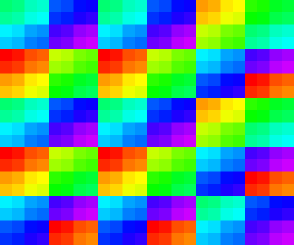
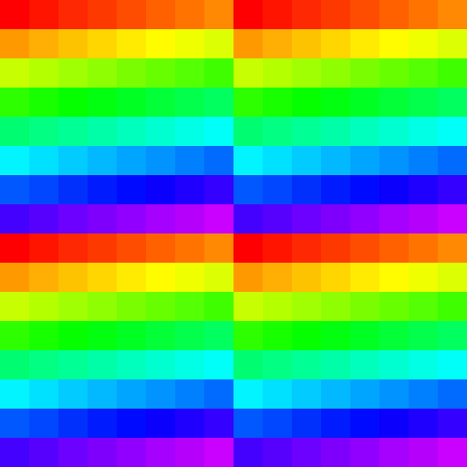
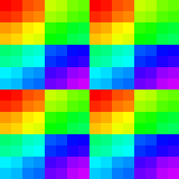
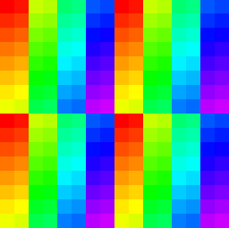
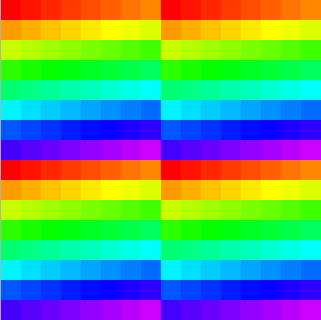
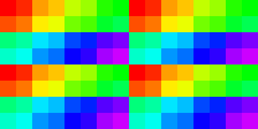
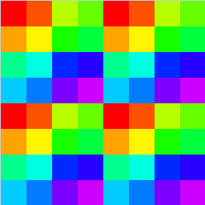
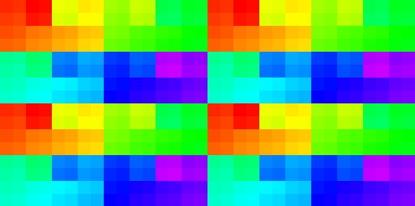

GPUs:
* [Adreno 660](bench-gpu/Adreno_660.md)
* [Adreno 505](bench-gpu/Adreno_505.md)
* [AMD RX 570 (GCN4)](bench-gpu/AMD_RX570.md)
* [AMD Radeon 780M (RDNA3)](bench-gpu/AMD_780M.md)
* [Apple M1](bench-gpu/Apple_M1.md)
* [Intel UHD 620 (gen9.5)](bench-gpu/Intel_UHD620.md)
* [Intel N150 (Twin Lake, Xe Graphics)](bench-gpu/Intel_N150.md)
* [Intel Arc 140T](bench-gpu/Intel_Arc140T.md)
* [Mali G57 (Valhall gen1)](bench-gpu/ARM_Mali_G57.md)
* [Mali G610 (Valhall gen3)](bench-gpu/ARM_Mali_G610.md)
* [Mali T830](bench-gpu/ARM_Mali_T830.md)
* [NVidia RTX 2080 (Turing)](bench-gpu/NVidia_RTX2080.md)
* [NVidia RTX 5070 Ti (Blackwell)](bench-gpu/NVidia_RTX5070Ti.md)
* [PowerVR BXM-8-256](bench-gpu/PowerVR_BXM.md)

Other:
* [Comparison of Results](#Comparison-of-Results)
	- [Subgroups](#Subgroups)
	- [Shader instructions](#Shader-instructions)
	- [Subgroup threads order](#Subgroup-threads-order)
	- [NaN](#NaN)
	- [Memory](#Memory)
	- [Render target compression](#Render-target-compression)
* [Test Sources](#Test-Sources)
	- [1. fp16 instruction performance](#1-fp16-instruction-performance)
	- [2. fp32 instruction performance](#2-fp32-instruction-performance)
	- [3. Render target compression](#3-Render-target-compression)
	- [4. Shader instruction benchmark](#4-Shader-instruction-benchmark)
	- [5. Texture lookup performance](#5-Texture-lookup-performance)
	- [6. Subgroups](#6-Subgroups)
	- [7. Buffer/image storage access](#7-BufferImage-storage-access)
	- [9. Cache size](#9-Texture-cache)
	- [10. Shared memory](#10-Shared-memory)
	- [11. NaN](#11-NaN)
	- [12. Branching in shader](#12-Branching)
	- [13. Circle geometry](#13-Circle-geometry)
	- [14. Nonuniform](#14-Nonuniform)
	- [15. Ray tracing performance](#15-ray-tracing-performance)
	- [16. Tensor performance](#16-tensor-performance)
	- [17. Tile size](#17-tile-size)

# Comparison of Results

## Subgroups

* Some GPU has early termination for helper invocation if derivatives are not used.
* TBDR architectures can fill multiple triangles and instances with a single subgroup.
* TBR/TBDR architectures can fill triangles with a single subgroup only inside tile region, except AMD and Intel.
* On mobile GPUs tile size depends on sum of render targets bytes per pixels, on NV tile size depends on register count. Intel has 4x4 tile but on low occupancy subgroup can fill pixels from another tiles like on AMD.
* Desktop GPUs (NV, AMD, Intel) merge instances only on low occupancy.

| GPU | subgroup size | tile size | tile size depends on | helper invocation early termination | merge triangles | merge between instances in FS | merge between instances in VS | always full subgroup in FS |
|---|---|---|---|---|---|---|---|---|
| Adreno 5xx            | ?      | as large as possible | RT bpp         |  -      |         | -         | ?       | -       |
| Adreno 6xx            | 64/128 | as large as possible | RT bpp         | **yes** |         | **yes**   | ?       | no      |
| AMD GCN4              | 64     | -                    | ?              | no      | **yes** | no        | ?       | ?       |
| AMD RDNA3             | 64     | -                    | ?              | ?       | **yes** | **yes**   | **yes** | ?       |
| Apple M1              | 32     | 16x16                | RT bpp         | no      | **yes** | no        | ?       | no      |
| ARM Mali Midgard gen4 | (4)    | 16x16                | RT bpp         | ?       | ?       | ?         | ?       | ?       |
| ARM Mali Valhall gen1 | 16     | 16x16                | RT bpp         | **yes** | **yes** | **yes**   | ?       | no      |
| ARM Mali Valhall gen3 | 16     | 32x32?               | RT bpp         | ?       | ?       | ?         | ?       | no      |
| Intel UHD 6xx 9.5gen  | 16     | -                    | ?              | no      | no      | no        | ?       | ?       |
| Intel UHD 730         | 16     |
| Intel Arc 140T        | 8/16   | (4x4)                | -              | no      | **yes** | **yes**   | **yes** | no      |
| NV RTX 20xx           | 32     | 16x16                | register count | no      | **yes** | no?       | ?       | no      |
| NV RTX 50xx           | 32     | 16x16                | register count | no ?    | **yes** | **yes**   | ?       | no      |
| PowerVR B‑Series      | 128    | 32x32?               | RT bpp?        | no      | **yes** | no        | ?       | **yes** |

## Shader instructions

* FMA and MAD has 2 operations (Mul, Add) but can execute at 1 cycle, some old GPUs has fast MAD and slow FMA.
* Some GPUs supports 1 cycle HFMA2 - FMA for half2 with 2x performance (2 instructions for 2 half types - 4 flops/cycle).
* Some GPUs supports FAdd with 2x performance.
* FMA can be implemented only for fp32 type, fp16 will lost performance when used this F32FMA, so MAD should be used instead.
* GPU has parallel datapath for fp32 and i32, scheduler can execute i32 instruction in parallel with fp32 without performance lost.
	- NV Turing has 1:1 fp32:i32 config.
	- NV Ampere has 1 full fp32 and 1 fp32:i32, so it can **not** execute i32 in parallel without fp32 performance lost.

| GPU | fp32 FMA/MAD | fp16x2 FMA/MAD | fp16 FMA/MAD | FAdd rate | parallel fp32 & i32 (confirmed in specs) | parallel fp16 & i16 (confirmed in specs) |
|----------|---|---|---|---|---|---|
| Adreno 5xx              | fma/mad | mad     | -       | 1     | no  | no  |
| Adreno 6xx              | fma/mad | mad     | -       | 1     | 2:1 | 2:1 |
| AMD GCN4                | fma/mad | -       | -       | 1     | no  | no  |
| AMD RDNA3               | ?       | ?       | ?       | ?     | ?   | ?   |
| Apple M1                | fma/mad | no      | fma/mad | 1     | 2:1 | 2:1 |
| ARM Mali Midgard gen4   | **mad** | no      | mad     | 1     | no  | no  |
| ARM Mali Valhall gen1   | fma/mad | mad     | -       | 1     | 2:1 | 2:1 |
| Intel UHD 6xx 9.5gen    | fma/mad | **fma** | -       | **2** | 2:1 | no  |
| Intel UHD 730           |
| Intel Arc 140T          | fma/mad | **fma** | -       | **2** | 2:1 | 2:1 |
| NV RTX 20xx (Turing)    | fma/mad | **fma** | -       | **2** | 1:1 **(specs)** | 2:1 |
| NV RTX 50xx (Blackwell) | fma/mad | **fma** | -       | **2** | no  | no  |
| PowerVR B‑Series        | fma/mad | no      | mad     | 1     | 1:1 | no  |

## Shader instructions performance groups

| GPU | |
|----------|---|
| Adreno 5xx            |
| Adreno 6xx            |
| AMD GCN4              |
| Apple M1              |
| ARM Mali Midgard gen4 |
| ARM Mali Valhall gen1 |
| Intel UHD 6xx 9.5gen  |
| Intel UHD 730         |
| Intel Arc 140T        |
| NV RTX 20xx (Turing)  |
| NV RTX 50xx           |
| PowerVR B‑Series      |

## Branching

How match Mul and Matrix variants are slower than uniform Branch. [[12](#12-Branching)]
* Uniform branching is faster on most GPUs and used as reference.
* GPU with vector architecture has faster `Matrix uniform` version.
* If `Branch non-uniform < 2` it indicates that GPU can not optimize short branches.
* If `Branch non-uniform` is much greater than `Mul non-uniform` it indicates that non-uniform branches has additional cost.

| GPU | Mul uniform | Matrix uniform |   Mul non-uniform | Branch non-uniform | Matrix non-uniform |   Mul avg | Branch avg | Matrix avg |
|----------|---|---|---|---|---|---|---|---|
| Adreno 5xx            | 1.6 | 0.88 |   **1.9** | 2.1 | 2.7 |   1.72 | **1.54** | 1.78 |
| Adreno 6xx            | 1.6 | 1.0  |   2.3 | **1.8** | 3.0 |   1.95 | **1.4**  | 2.0  |
| AMD GCN4              | 1.7 | 0.94 |   2.3 | **1.6** | 2.6 |   2.0  | **1.3**  | 1.8  |
| AMD RDNA3             | ?   | ?    | ?     | ?       | ?   |   ?    | ?        | ?    |
| Apple M1              | 1.1 | 0.8  |   1.4 | **1.1** | 1.8 |   1.24 | **1.03** | 1.26 |
| ARM Mali Midgard gen4 | 1.5 | 0.7  |   1.8 | **1.3** | 2.4 |   1.64 | **1.1**  | 1.57 |
| ARM Mali Valhall gen1 | 2.1 | 1.4  |   2.3 | **2.1** | 3.5 |   2.18 | **1.56** | 2.45 |
| ARM Mali Valhall gen3 | 1.7 | 1.2  |   2.1 | **1.6** | 3.0 |   1.9  | **1.3**  | 2.1  |
| Intel UHD 6xx 9.5gen  | 1.3 | 0.87 |   1.9 | **1.2** | 2.6 |   1.59 | **1.07** | 1.71 |
| Intel UHD 730         |
| Intel Arc 140T        |
| NV RTX 20xx (Turing)  | 2.1 | 1.5  |   **2.4** | 3.1 | 3.0 |   2.1  | 2.1      | 2.1  |
| NV RTX 50xx           |
| PowerVR B‑Series      | 2.3 | 1.5  |   **2.6** | 3.5 | 3.1 |   2.46 | **2.25** | 2.33 |

## Subgroup threads order

| GPU | graphics (quads) | graphics (image) | compute wg:8x8 (threads) | compute (image) |
|----------|---|---|---|---|
| Adreno 5xx             | ? |
| Adreno 6xx             | grid of 4 large quads (4x4 threads) with 4 quads, row major |    | row major 8x8    |  |
| AMD GCN4               | grid of 4 large quads (4x4 threads) with 4 quads, row major |      | column major 8x4, 2 threads in row per column |  |
| AMD RDNA3              | grid of 4 large quads (4x4 threads) with 4 quads, row major |      | row major 8x8    |  |
| Apple M1               | row major 4x2 quads                                         |        | row major 8x4    |  |
| ARM Mali Valhall gen1  | random                                                      |     | row major 8x2    |  |
| ARM Mali Valhall gen3  |
| Intel 9.5gen -  Arc140T | 2x2 quads with Z-shape (simd16)  or 2x1 quads (simd8) | simd16 mode on low register count   simd8 mode on high register count   | column major 4x4 |  |
| NV RTX 20xx -  RTX 50xx | column major 2x4 quads                                 |     | row major 8x4    |  |
| PowerVR B‑Series       | [_]-curve, row major 4x2 quads (Hilbert curve?)         |   | row major 16x8   |  |

## NaN

### FP32

| op \ type | nan1 | nan2 | nan3 | nan4 | inf | -inf | max | -max |
|---|---|---|---|---|---|---|---|---|
| x | nan | nan | nan | nan | inf | -inf | max | -max |
| Min(x,0) | 0 | 0 | 0 | 0 | 0 | -inf | 0 | -max |
| Min(0,x) | 0 | 0 | 0 | 0 | 0 | -inf | 0 | -max |
| Max(x,0) | 0 | 0 | 0 | 0 | inf | 0 | max | 0 |
| Max(0,x) | 0 | 0 | 0 | 0 | inf | 0 | max | 0 |
| Clamp(x,0,1) | 0 | 0 | 0 | 0 | 1 | 0 | 1 | 0 |
| Clamp(x,-1,1) | -1 | -1 | -1 | -1 | 1 | -1 | 1 | -1 |
| IsNaN | 1 | 1 | 1 | 1 | 0 | 0 | 0 | 0 |
| IsInfinity | 0 | 0 | 0 | 0 | 1 | 1 | 0 | 0 |
| x != x |  |  |  |  | 0 | 0 | 0 | 0 |
| Step(0,x) |  |  |  |  | 1 | 0 | 1 | 0 |
| Step(x,0) |  |  |  |  | 0 | 1 | 0 | 1 |
| Step(0,-x) |  |  |  |  | 0 | 1 | 0 | 1 |
| Step(-x,0) |  |  |  |  | 1 | 0 | 1 | 0 |
| SignOrZero(x) |  |  |  |  | 1 | -1 | 1 | -1 |
| SignOrZero(‑x) |  |  |  |  | -1 | 1 | -1 | 1 |
| SmoothStep(x,0,1) | 0 | 0 | 0 | 0 | 1 | 0 | 1 | 0 |
| Normalize(x) | nan | nan | nan | nan |  |  |  |  |

differences

* FP32 on **NV Turing - Blackwell**, **Adreno 5xx/6xx**

	| op \ type | nan1 | nan2 | nan3 | nan4 | inf | -inf | max | -max |
	|---|---|---|---|---|---|---|---|---|
	| x != x | 1 | 1 | 1 | 1 |  |  |  |  |
	| Step(0,x) | 1 | 1 | 1 | 1 |  |  |  |  |
	| Step(x,0) | 1 | 1 | 1 | 1 |  |  |  |  |
	| Step(0,-x) | 1 | 1 | 1 | 1 |  |  |  |  |
	| Step(-x,0) | 1 | 1 | 1 | 1 |  |  |  |  |
	| SignOrZero(x) | 0 | 0 | 0 | 0 |  |  |  |  |
	| SignOrZero(‑x) | 0 | 0 | 0 | 0 |  |  |  |  |
	| Normalize(x) |  |  |  |  | nan | nan | 0 | -0 |

* FP32 on **Intel gen 9** and **Xe-LP+**

	| op \ type | nan1 | nan2 | nan3 | nan4 | inf | -inf | max | -max |
	|---|---|---|---|---|---|---|---|---|
	| x != x | 1 | 1 | 1 | 1 |  |  |  |  |
	| Step(0,x) | 1 | 1 | 1 | 1 |  |  |  |  |
	| Step(x,0) | 1 | 1 | 1 | 1 |  |  |  |  |
	| Step(0,-x) | 1 | 1 | 1 | 1 |  |  |  |  |
	| Step(-x,0) | 1 | 1 | 1 | 1 |  |  |  |  |
	| SignOrZero(x) | -1 | -1 | -1 | -1 |  |  |  |  |
	| SignOrZero(‑x) | -1 | -1 | -1 | -1 |  |  |  | |
	| Normalize(x) |  |  |  |  | nan | nan | 0 | -0 |

* FP32 on **Mali Valhall gen1**

	| op \ type | nan1 | nan2 | nan3 | nan4 | inf | -inf | max | -max |
	|---|---|---|---|---|---|---|---|---|
	| x != x | 1 | 1 | 1 | 1 |  |  |  |  |
	| Step(0,x) | 0 | 0 | 0 | 0 |  |  |  |  |
	| Step(x,0) | 0 | 0 | 0 | 0 |  |  |  |  |
	| Step(0,-x) | 0 | 0 | 0 | 0 |  |  |  |  |
	| Step(-x,0) | 0 | 0 | 0 | 0 |  |  |  |  |
	| SignOrZero(x) | 0 | 0 | 0 | 0 |  |  |  |  |
	| SignOrZero(‑x) | 0 | 0 | 0 | 0 |  |  |  |  |
	| Normalize(x) |  |  |  |  | 0 | -0 | 0 | -0 |

* FP32 on **Mali Midgard gen4**

	| op \ type | nan1 | nan2 | nan3 | nan4 | inf | -inf | max | -max |
	|---|---|---|---|---|---|---|---|---|
	| x != x | 1 | 1 | 1 | 1 |  |  |  |  |
	| Step(0,x) | 1 | 1 | 1 | 1 |  |  |  |  |
	| Step(x,0) | 1 | 1 | 1 | 1 |  |  |  |  |
	| Step(0,-x) | 1 | 1 | 1 | 1 |  |  |  |  |
	| Step(-x,0) | 1 | 1 | 1 | 1 |  |  |  |  |
	| SignOrZero(x) | 0 | 0 | 0 | 0 |  |  |  |  |
	| SignOrZero(‑x) | 0 | 0 | 0 | 0 |  |  |  |  |
	| SmoothStep(x,0,1) | 0 | 0 | 0 | 0 |  |  |  |  |
	| Normalize(x) |  |  |  |  | 0 | -0 | 0 | -0 |

* FP32 on **PowerVR B-Series**

	| op \ type | nan1 | nan2 | nan3 | nan4 | inf | -inf | max | -max |
	|---|---|---|---|---|---|---|---|---|
	| x != x | 0 | 0 | 0 | 0 |  |  |  |  |
	| Step(0,x) | 1 | 1 | 1 | 1 |  |  |  |  |
	| Step(x,0) | 1 | 1 | 1 | 1 |  |  |  |  |
	| Step(0,-x) | 1 | 1 | 1 | 1 |  |  |  |  |
	| Step(-x,0) | 1 | 1 | 1 | 1 |  |  |  |  |
	| SignOrZero(x) | nan | nan | nan | nan |  |  |  |  |
	| SignOrZero(‑x) | nan | nan | nan | nan |  |  |  |  |
	| Normalize(x) |  |  |  |  | nan | nan | 18446742974197923840 | -18446742974197923840 |

* FP32 on **AMD GCN4**

	| op \ type | nan1 | nan2 | nan3 | nan4 | inf | -inf | max | -max |
	|---|---|---|---|---|---|---|---|---|
	| x != x | 1 | 1 | 1 | 1 |  |  |  |  |
	| Step(0,x) | 1 | 1 | 1 | 1 |  |  |  |  |
	| Step(x,0) | 1 | 1 | 1 | 1 |  |  |  |  |
	| Step(0,-x) | 1 | 1 | 1 | 1 |  |  |  |  |
	| Step(-x,0) | 1 | 1 | 1 | 1 |  |  |  |  |
	| SignOrZero(x) | 1 | 1 | 1 | 1 |  |  |  |  |
	| SignOrZero(‑x) | 1 | 1 | 1 | 1 |  |  |  |  |
	| Normalize(x) |  |  |  |  | 0 | 0 | 0 | 0 |

* FP32 on **Apple M1**

	| op \ type | nan1 | nan2 | nan3 | nan4 | inf | -inf | max | -max |
	|---|---|---|---|---|---|---|---|---|
	| x != x | 0 | 0 | 0 | 0 |  |  |  |  |
	| Step(0,x) | 0 | 0 | 0 | 0 |  |  |  |  |
	| Step(x,0) | 0 | 0 | 0 | 0 |  |  |  |  |
	| Step(0,-x) | 0 | 0 | 0 | 0 |  |  |  |  |
	| Step(-x,0) | 0 | 0 | 0 | 0 |  |  |  |  |
	| SignOrZero(x) | 0 | 0 | 0 | 0 |  |  |  |  |
	| SignOrZero(‑x) | 0 | 0 | 0 | 0 |  |  |  |  |
	| Normalize(x) |  |  |  |  | nan | nan | 0 | -0 |

### FP16

| op \ type | nan1 | nan2 | nan3 | nan4 | inf | -inf | max | -max |
|---|---|---|---|---|---|---|---|---|
| x | nan | nan | nan | nan | inf | -inf | max | -max |
| Min(x,0) | 0 | 0 | 0 | 0 | 0 | -inf | 0 | -max |
| Min(0,x) | 0 | 0 | 0 | 0 | 0 | -inf | 0 | -max |
| Max(x,0) | 0 | 0 | 0 | 0 | inf | 0 | max | 0 |
| Max(0,x) | 0 | 0 | 0 | 0 | inf | 0 | max | 0 |
| Clamp(x,0,1) | 0 | 0 | 0 | 0 | 1 | 0 | 1 | 0 |
| Clamp(x,-1,1) | -1 | -1 | -1 | -1 | 1 | -1 | 1 | -1 |
| IsNaN | 1 | 1 | 1 | 1 | 0 | 0 | 0 | 0 |
| IsInfinity | 0 | 0 | 0 | 0 | 1 | 1 | 0 | 0 |
| x != x |  |  |  |  | 0 | 0 | 0 | 0 |
| Step(0,x) |  |  |  |  | 1 | 0 | 1 | 0 |
| Step(x,0) |  |  |  |  | 0 | 1 | 0 | 1 |
| Step(0,-x) |  |  |  |  | 0 | 1 | 0 | 1 |
| Step(-x,0) |  |  |  |  | 1 | 0 | 1 | 0 |
| SignOrZero(x) |  |  |  |  | 1 | -1 | 1 | -1 |
| SignOrZero(‑x) |  |  |  |  | -1 | 1 | -1 | 1 |
| SmoothStep(x,0,1) | 0 | 0 | 0 | 0 | 1 | 0 | 1 | 0 |
| Normalize(x) |  |  |  |  | |  | 0 | -0 |

differences

* FP16 is not supported on **Adreno 5xx**, **Mali Midgard gen4**, **AMD GCN4**

* FP16 on **NV Turing - Blackwell**, **Adreno 6xx**

	| op \ type | nan1 | nan2 | nan3 | nan4 | inf | -inf | max | -max |
	|---|---|---|---|---|---|---|---|---|
	| x != x | 1 | 1 | 1 | 1 |  |  |  |  |
	| Step(0,x) | 1 | 1 | 1 | 1 |  |  |  |  |
	| Step(x,0) | 1 | 1 | 1 | 1 |  |  |  |  |
	| Step(0,-x) | 1 | 1 | 1 | 1 |  |  |  |  |
	| Step(-x,0) | 1 | 1 | 1 | 1 |  |  |  |  |
	| SignOrZero(x) | 0 | 0 | 0 | 0 |  |  |  |  |
	| SignOrZero(‑x) | 0 | 0 | 0 | 0 |  |  |  |  |
	| Normalize(x) | nan | nan | nan | nan | nan | nan |  |  |

* FP16 on **Intel gen 9** and **Xe-LP+**

	| op \ type | nan1 | nan2 | nan3 | nan4 | inf | -inf | max | -max |
	|---|---|---|---|---|---|---|---|---|
	| x != x | 1 | 1 | 1 | 1 |  |  |  |  |
	| Step(0,x) | 1 | 1 | 1 | 1 |  |  |  |  |
	| Step(x,0) | 1 | 1 | 1 | 1 |  |  |  |  |
	| Step(0,-x) | 1 | 1 | 1 | 1 |  |  |  |  |
	| Step(-x,0) | 1 | 1 | 1 | 1 |  |  |  |  |
	| SignOrZero(x) | -1 | -1 | -1 | -1 |  |  |  |  |
	| SignOrZero(‑x) | -1 | -1 | -1 | -1 |  |  |  |  |
	| Normalize(x) | nan | nan | nan | nan | nan | nan |  |  |

* FP16 on **Mali Valhall gen1**

	| op \ type | nan1 | nan2 | nan3 | nan4 | inf | -inf | max | -max |
	|---|---|---|---|---|---|---|---|---|
	| x != x | 1 | 1 | 1 | 1 |  |  |  |  |
	| Step(0,x) | 0 | 0 | 0 | 0 |  |  |  |  |
	| Step(x,0) | 0 | 0 | 0 | 0 |  |  |  |  |
	| Step(0,-x) | 0 | 0 | 0 | 0 |  |  |  |  |
	| Step(-x,0) | 0 | 0 | 0 | 0 |  |  |  |  |
	| SignOrZero(x) | 0 | 0 | 0 | 0 |  |  |  |  |
	| SignOrZero(‑x) | 0 | 0 | 0 | 0 |  |  |  |  |
	| Normalize(x) | -1 | -1 | -1 | -1 | 1 | -1 |  |  |

* FP16 on **PowerVR B-Series**

	| op \ type | nan1 | nan2 | nan3 | nan4 | inf | -inf | max | -max |
	|---|---|---|---|---|---|---|---|---|
	| x != x | 0 | 0 | 0 | 0 |  |  |  |  |
	| Step(0,x) | 1 | 1 | 1 | 1 |  |  |  |  |
	| Step(x,0) | 1 | 1 | 1 | 1 |  |  |  |  |
	| Step(0,-x) | 1 | 1 | 1 | 1 |  |  |  |  |
	| Step(-x,0) | 1 | 1 | 1 | 1 |  |  |  |  |
	| SignOrZero(x) | nan | nan | nan | nan |  |  |  |  |
	| SignOrZero(‑x) | nan | nan | nan | nan |  |  |  |  |
	| Normalize(x) | nan | nan | nan | nan | nan | nan |  |  |

* FP16 on **Apple M1**

	| op \ type | nan1 | nan2 | nan3 | nan4 | inf | -inf | max | -max |
	|---|---|---|---|---|---|---|---|---|
	| x != x | 0 | 0 | 0 | 0 |  |  |  |  |
	| Step(0,x) | 0 | 0 | 0 | 0 |  |  |  |  |
	| Step(x,0) | 0 | 0 | 0 | 0 |  |  |  |  |
	| Step(0,-x) | 0 | 0 | 0 | 0 |  |  |  |  |
	| Step(-x,0) | 0 | 0 | 0 | 0 |  |  |  |  |
	| SignOrZero(x) | 0 | 0 | 0 | 0 |  |  |  |  |
	| SignOrZero(‑x) | 0 | 0 | 0 | 0 |  |  |  |  |
	| Normalize(x) | nan | nan | nan | nan | nan | nan | 0 | -0 |

### FP Mediump

| op \ type | nan1 | nan2 | nan3 | nan4 | inf | -inf | max | -max |
|---|---|---|---|---|---|---|---|---|
| x | nan | nan | nan | nan | inf | -inf |  |  |
| Min(x,0) | 0 | 0 | 0 | 0 | 0 | -inf | 0 |  |
| Min(0,x) | 0 | 0 | 0 | 0 | 0 | -inf | 0 |  |
| Max(x,0) | 0 | 0 | 0 | 0 | inf | 0 |  | 0 |
| Max(0,x) | 0 | 0 | 0 | 0 | inf | 0 |  | 0 |
| Clamp(x,0,1) | 0 | 0 | 0 | 0 | 1 | 0 | 1 | 0 |
| Clamp(x,-1,1) | -1 | -1 | -1 | -1 | 1 | -1 | 1 | -1 |
| IsNaN | 1 | 1 | 1 | 1 | 0 | 0 | 0 | 0 |
| IsInfinity | 0 | 0 | 0 | 0 | 1 | 1 | 0 | 0 |
| x != x |  |  |  |  | 0 | 0 | 0 | 0 |
| Step(0,x) |  |  |  |  | 1 | 0 | 1 | 0 |
| Step(x,0) |  |  |  |  | 0 | 1 | 0 | 1 |
| Step(0,-x) |  |  |  |  | 0 | 1 | 0 | 1 |
| Step(-x,0) |  |  |  |  | 1 | 0 | 1 | 0 |
| SignOrZero(x) |  |  |  |  | 1 | -1 | 1 | -1 |
| SignOrZero(‑x) |  |  |  |  | -1 | 1 | -1 | 1 |
| SmoothStep(x,0,1) | 0 | 0 | 0 | 0 | 1 | 0 | 1 | 0 |
| Normalize(x) |  |  |  |  |  |  |  |  |

differences

* FP Mediump on **NV Turing**

	| op \ type | nan1 | nan2 | nan3 | nan4 | inf | -inf | max | -max |
	|---|---|---|---|---|---|---|---|---|
	| x |  |  |  |  |  |  | max | -max |
	| Min(x,0) |  |  |  |  |  |  |  | -max |
	| Min(0,x) |  |  |  |  |  |  |  | -max |
	| Max(x,0) |  |  |  |  |  |  | max |  |
	| Max(0,x) |  |  |  |  |  |  | max |  |
	| x != x | 1 | 1 | 1 | 1 |  |  |  |  |
	| Step(0,x) | 1 | 1 | 1 | 1 |  |  |  |  |
	| Step(x,0) | 1 | 1 | 1 | 1 |  |  |  |  |
	| Step(0,-x) | 1 | 1 | 1 | 1 |  |  |  |  |
	| Step(-x,0) | 1 | 1 | 1 | 1 |  |  |  |  |
	| SignOrZero(x) | 0 | 0 | 0 | 0 |  |  |  |  |
	| SignOrZero(‑x) | 0 | 0 | 0 | 0 |  |  |  |  |
	| Normalize(x) | nan | nan | nan | nan | nan | nan | 0 | -0 |

* FP Mediump on **Adreno 5xx/6xx**

	| op \ type | nan1 | nan2 | nan3 | nan4 | inf | -inf | max | -max |
	|---|---|---|---|---|---|---|---|---|
	| x |  |  |  |  |  |  | 65504 | -65504 |
	| Min(x,0) |  |  |  |  |  |  |  | -65504 |
	| Min(0,x) |  |  |  |  |  |  |  | -65504 |
	| Max(x,0) |  |  |  |  |  |  | 65504 |  |
	| Max(0,x) |  |  |  |  |  |  | 65504 |  |
	| x != x | 1 | 1 | 1 | 1 |  |  |  |  |
	| Step(0,x) | 1 | 1 | 1 | 1 |  |  |  |  |
	| Step(x,0) | 1 | 1 | 1 | 1 |  |  |  |  |
	| Step(0,-x) | 1 | 1 | 1 | 1 |  |  |  |  |
	| Step(-x,0) | 1 | 1 | 1 | 1 |  |  |  |  |
	| SignOrZero(x) | 0 | 0 | 0 | 0 |  |  |  |  |
	| SignOrZero(‑x) | 0 | 0 | 0 | 0 |  |  |  |  |
	| Normalize(x) | nan | nan | nan | nan | nan | nan | 255 | -255 |

* FP Mediump on **Intel gen9**

	| op \ type | nan1 | nan2 | nan3 | nan4 | inf | -inf | max | -max |
	|---|---|---|---|---|---|---|---|---|
	| x |  |  |  |  |  |  | max | -max |
	| Min(x,0) |  |  |  |  |  |  |  | -max |
	| Min(0,x) |  |  |  |  |  |  |  | -max |
	| Max(x,0) |  |  |  |  |  |  | max |  |
	| Max(0,x) |  |  |  |  |  |  | max |  |
	| x != x | 1 | 1 | 1 | 1 |  |  |  |  |
	| Step(0,x) | 1 | 1 | 1 | 1 |  |  |  |  |
	| Step(x,0) | 1 | 1 | 1 | 1 |  |  |  |  |
	| Step(0,-x) | 1 | 1 | 1 | 1 |  |  |  |  |
	| Step(-x,0) | 1 | 1 | 1 | 1 |  |  |  |  |
	| SignOrZero(x) | -1 | -1 | -1 | -1 |  |  |  |  |
	| SignOrZero(‑x) | -1 | -1 | -1 | -1 |  |  |  |  |
	| Normalize(x) | nan | nan | nan | nan | nan | nan | nan | nan |

* FP Mediump on **Mali Valhall gen1**

	| op \ type | nan1 | nan2 | nan3 | nan4 | inf | -inf | max | -max |
	|---|---|---|---|---|---|---|---|---|
	| x |  |  |  |  |  |  | max | -max |
	| Min(x,0) |  |  |  |  |  |  |  | -max |
	| Min(0,x) |  |  |  |  |  |  |  | -max |
	| Max(x,0) |  |  |  |  |  |  | max |  |
	| Max(0,x) |  |  |  |  |  |  | max |  |
	| x != x | 1 | 1 | 1 | 1 |  |  |  |  |
	| Step(0,x) | 0 | 0 | 0 | 0 |  |  |  |  |
	| Step(x,0) | 0 | 0 | 0 | 0 |  |  |  |  |
	| Step(0,-x) | 0 | 0 | 0 | 0 |  |  |  |  |
	| Step(-x,0) | 0 | 0 | 0 | 0 |  |  |  |  |
	| SignOrZero(x) | 0 | 0 | 0 | 0 |  |  |  |  |
	| SignOrZero(‑x) | 0 | 0 | 0 | 0 |  |  |  |  |
	| Normalize(x) | -1 | -1 | -1 | -1 | 1 | -1 | 1 | -1 |

* FP Mediump on **Mali Midgard gen4**

	| op \ type | nan1 | nan2 | nan3 | nan4 | inf | -inf | max | -max |
	|---|---|---|---|---|---|---|---|---|
	| x |  |  |  |  |  |  | max | -max |
	| Min(x,0) |  |  |  |  |  |  |  | -max |
	| Min(0,x) |  |  |  |  |  |  |  | -max |
	| Max(x,0) |  |  |  |  |  |  | max |  |
	| Max(0,x) |  |  |  |  |  |  | max |  |
	| x != x | 1 | 1 | 1 | 1 |  |  |  |  |
	| Step(0,x) | 1 | 1 | 1 | 1 |  |  |  |  |
	| Step(x,0) | 1 | 1 | 1 | 1 |  |  |  |  |
	| Step(0,-x) | 1 | 1 | 1 | 1 |  |  |  |  |
	| Step(-x,0) | 1 | 1 | 1 | 1 |  |  |  |  |
	| SignOrZero(x) | 0 | 0 | 0 | 0 |  |  |  |  |
	| SignOrZero(‑x) | 0 | 0 | 0 | 0 |  |  |  |  |
	| SmoothStep(x,0,1) | 0 | 0 | 0 | 0 |  |  |  |  |
	| Normalize(x) | nan | nan | nan | nan | 0 | -0 | 0 | -0 |

* FP Mediump on **PowerVR B-Series**

	| op \ type | nan1 | nan2 | nan3 | nan4 | inf | -inf | max | -max |
	|---|---|---|---|---|---|---|---|---|
	| x |  |  |  |  |  |  | max | -max |
	| Min(x,0) |  |  |  |  |  |  |  | -max |
	| Min(0,x) |  |  |  |  |  |  |  | -max |
	| Max(x,0) |  |  |  |  |  |  | max |  |
	| Max(0,x) |  |  |  |  |  |  | max |  |
	| x != x | 0 | 0 | 0 | 0 |  |  |  |  |
	| Step(0,x) | 1 | 1 | 1 | 1 |  |  |  |  |
	| Step(x,0) | 1 | 1 | 1 | 1 |  |  |  |  |
	| Step(0,-x) | 1 | 1 | 1 | 1 |  |  |  |  |
	| Step(-x,0) | 1 | 1 | 1 | 1 |  |  |  |  |
	| SignOrZero(x) | nan | nan | nan | nan |  |  |  |  |
	| SignOrZero(‑x) | nan | nan | nan | nan |  |  |  |  |
	| Normalize(x) | nan | nan | nan | nan | nan | nan | 18446742974197923840 | -18446742974197923840 |

* FP Mediump on **AMD GCN4**

	| op \ type | nan1 | nan2 | nan3 | nan4 | inf | -inf | max | -max |
	|---|---|---|---|---|---|---|---|---|
	| x |  |  |  |  |  |  | max | -max |
	| Min(x,0) |  |  |  |  |  |  |  | -max |
	| Min(0,x) |  |  |  |  |  |  |  | -max |
	| Max(x,0) |  |  |  |  |  |  | max |  |
	| Max(0,x) |  |  |  |  |  |  | max |  |
	| x != x | 1 | 1 | 1 | 1 |  |  |  |  |
	| Step(0,x) | 1 | 1 | 1 | 1 |  |  |  |  |
	| Step(x,0) | 1 | 1 | 1 | 1 |  |  |  |  |
	| Step(0,-x) | 1 | 1 | 1 | 1 |  |  |  |  |
	| Step(-x,0) | 1 | 1 | 1 | 1 |  |  |  |  |
	| SignOrZero(x) | 1 | 1 | 1 | 1 |  |  |  |  |
	| SignOrZero(‑x) | 1 | 1 | 1 | 1 |  |  |  |  |
	| Normalize(x) | nan | nan | nan | nan | 0 | 0 | 0 | 0 |

* FP Mediump on **Apple M1**

	| op \ type | nan1 | nan2 | nan3 | nan4 | inf | -inf | max | -max |
	|---|---|---|---|---|---|---|---|---|
	| x |  |  |  |  |  |  | max | -max |
	| Min(x,0) |  |  |  |  |  |  |  | -max |
	| Min(0,x) |  |  |  |  |  |  |  | -max |
	| Max(x,0) |  |  |  |  |  |  | max |  |
	| Max(0,x) |  |  |  |  |  |  | max |  |
	| x != x | 0 | 0 | 0 | 0 |  |  |  |  |
	| Step(0,x) | 0 | 0 | 0 | 0 |  |  |  |  |
	| Step(x,0) | 0 | 0 | 0 | 0 |  |  |  |  |
	| Step(0,-x) | 0 | 0 | 0 | 0 |  |  |  |  |
	| Step(-x,0) | 0 | 0 | 0 | 0 |  |  |  |  |
	| SignOrZero(x) | 0 | 0 | 0 | 0 |  |  |  |  |
	| SignOrZero(‑x) | 0 | 0 | 0 | 0 |  |  |  |  |
	| Normalize(x) | nan | nan | nan | nan | nan | nan | 0 | -0 |

## Memory

### RAM, VRAM

| GPU | VRAM bandwidth from specs (GB/s) | VRAM bandwidth measured (GB/s) | RAM to VRAM bandwidth from specs (GB/s) | RAM to VRAM bandwidth measured (GB/s) | VRAM to RAM bandwidth measured (GB/s) | RAM to RAM bandwidth measured (GB/s) |
|---|---|---|---|---|---|---|
| Adreno 505                   | 6.4   | 5    | | | | |
| Adreno 660                   | 51.2  | 34   | | | | |
| AMD RX570 (GCN4)             | 224.0 | 86   | | | | |
| AMD 780M (RDNA3)             |
| Apple M1                     | 68.25 |      | | | | |
| ARM Mali T830 (Midgard gen4) | 14.9  | 4    | | | | |
| ARM Mali G57 (Valhall gen1)  | 17.07 | 14.2 | | | | |
| ARM Mali G610 (Valhall gen3) |
| Intel UHD 620 (9.5gen)       | 29.8  | 23   | | | | |
| Intel UHD 730                |
| Intel Arc 140T               |
| NV RTX 2080 (Turing)         | 448.0 | 403  | | | | |
| NV RTX 5070 Ti               |
| PowerVR BXM‑8‑256            | 51.2  | 14.2 | | | | |

### Cache

* GMem - part of L2 cache which is used to store attachments for TBDR.
	- Adreno has dedicated memory.
	- Mali use L2 and some times attachment can be evicted from L2 to RAM.

| GPU | GMem (KB) | L2 cache per SM (KB) | L2 bandwidth (GB/s) | L2 cache line (bytes) | L1 cache per SM (KB) | Texture cache - part of L1 (KB) | L1 bandwidth (GB/s) |
|---|---|---|---|---|---|---|---|
| Adreno 505                   | 128  |      |     |    |      |     |      |
| Adreno 660                   | 1536 | 128  | ?   |    | 4?   | 2?  | ?    |
| AMD RX570 (GCN4)             | -    |      |     |    |      |     |      |
| AMD 780M (RDNA3)             |
| Apple M1                     | ?    |      |     |    |      |     |      |
| ARM Mali T830 (Midgard gen4) | 4    |      |     | 64 |      |     |      |
| ARM Mali G57 (Valhall gen1)  | 8    | 512  | 49  | 64 | 32?  | 32  | ?    |
| ARM Mali G610 (Valhall gen3) |
| Intel UHD 620 (9.5gen)       | -    | 128  | 48? |    | 8?   | 8?  | 112? |
| Intel UHD 730                |
| Intel Arc 140T (Xe-LP+)      | -    | 8K shared | 160 | - | 256 | - | 520 |
| NV RTX 2080 (Turing)         | -    | 4K   | ?   |    | 64   | 32  | ?    |
| NV RTX 5070 Ti               | -    |
| PowerVR BXM‑8‑256            | ?    | 1K   | ?   | ?  | 256? | 256 | ?    |

## Render target compression

**block** - compare compression between 1x1 noise and block size (4x4 or 8x8) noise, higher is better. 
**max** - compare compression between 1x1 noise and solid color. 
**exec time** - measured shader execution time, shader is memory bound, but may have overhead of warp scheduler, texture unit, request queue limits, etc. 
**mem traffic** - measured memory traffic in bytes from performance counters, it much accurate to calculate compression rate, but high compressed block is better fit caches. 
Note: DCC is lossless, so 1x1 noise with or without DCC has near to same performance, may be +5-10% for DCC.

| GPU | block size | block RGBA8_UNorm | max RGBA8_UNorm | block RGBA16_UNorm | max RGBA16_UNorm | method | comments |
|---|---|---|---|---|---|---|---|
| Adreno 5xx            | 4x4   | 2.5 | 2.7 | ?   | ?    | exec time       |
| Adreno 6xx            | 16x16 | 1.9 | 6.9 | ?   | 3.3  | exec time       |
| AMD GCN4              | 4x4   | 2.3 | 3   | 2.3 | 3    | exec time       |
| AMD RDNA3             |
| Apple M1              | 8x8   | 3.4 | 3.4 | 6.8 | 6.8  | exec time       |
| Intel UHD 6xx 9.5gen  | 8x8   | 1.6 | 1.8 | 1.8 | 1.85 | exec time       |
| Intel UHD 730         |
| Intel Arc 140T        |
| NV RTX 20xx           | 4x4   | 3   | 3.2 | 4.1 | 4.1  | exec time       |
| NV RTX 50xx           |
| ARM Mali Valhall gen1 | 4x4   | 1.9 | 3.9 | 1.9 | 3.7  | exec time       | only 32bit formats, **V2** |
| ARM Mali Valhall gen1 | 4x4   | 5.9 | 19  | 5.7 | 20   | **mem traffic** | used performance counters |
| ARM Mali Valhall gen3 |
| PowerVR B‑Series      | 8x8   | 23  | 134 | 24  | 134  | **mem traffic** | used performance counters |

## Draw Indirect

* Direct draw calls, like `vkDrawIndexed()`, may have CPU overhead depends on driver implementation.
* Validation layers have high overhead and must be disabled for this test.
* Performance compared between multiple calls of `vkDrawIndexed()` and same number of `vkDrawIndexedIndirect()`.
* Some GPUs has `maxDrawIndirectCount = 1`, so used second test with single `vkDrawIndexedIndirect()` call with multiple instances.

| GPU | multi draw direct vs  multi draw indirect | multi draw direct vs  instanced indirect |
|---|---|---|
| Adreno 5xx            | direct is faster (20ms vs 41ms)   |
| Adreno 6xx            | same                              |
| AMD GCN4              |                                   |
| AMD RDNA3             |                                   |
| Apple M1              |                                   |
| Intel UHD 6xx 9.5gen  |                                   |
| Intel UHD 730         | same                              | same                                |
| Intel Arc 140T        |
| NV RTX 20xx           | same                              |
| NV RTX 50xx           |
| ARM Mali Midgard gen4 | not supported                     | instancing is faster (120ms vs 130ms) |
| ARM Mali Valhall gen1 | not supported                     | instancing is faster (12ms vs 15ms)   |
| ARM Mali Valhall gen3 | indirect is faster (25ms vs 31ms) |
| PowerVR B‑Series      | same                              |

# Test Sources

### 1. fp16 instruction performance
Has much accurate results than **Shader instruction benchmark**. 
[code](https://github.com/azhirnov/as-en/blob/dev/AE/samples/res_editor/_data/scripts/perf/Inst-fp16.as)

### 2. fp32 instruction performance
Has much accurate results than **Shader instruction benchmark**. 
[code](https://github.com/azhirnov/as-en/blob/dev/AE/samples/res_editor/_data/scripts/perf/Inst-fp32.as)

### 3. Render target compression
[code](https://github.com/azhirnov/as-en/blob/dev/AE/samples/res_editor/_data/scripts/perf/RTCompression.as)

### 4. Shader instruction benchmark
[code](https://github.com/azhirnov/as-en/blob/dev/AE/engine/performance/graphics/Resources/pipeline/InstructionBenchmark.as)

### 5. Texture lookup performance

* sequential access - UV coordinates multiplied by scale and added bias.
	- scale < 1 has better texture cache usage.
	- scale > 1 has high cache misses.
	- scale > 1 in practice used for noise texture in procedural generation.
* 'noise NxN' - screen divided into blocks with NxN size, each block has unique offset for texture lookup, each pixel in block has 1px offset from nearest pixels.
	- offset with 1px used to find case where nearest warp can not use cached texel.
	- in practice this method is used for packed 2D sprites and textures for meshes.

[code](https://github.com/azhirnov/as-en/blob/dev/AE/samples/res_editor/_data/scripts/perf/TexLookup.as)

### 6. Subgroups

* [Subgroups in fullscreen triangle](https://github.com/azhirnov/as-en/blob/dev/AE/samples/res_editor/_data/scripts/perf/Subgroups-1.as)
* [Subgroups with multiple triangles](https://github.com/azhirnov/as-en/blob/dev/AE/samples/res_editor/_data/scripts/perf/Subgroups-2.as)
* [Pack triangles into single subgroup](https://github.com/azhirnov/as-en/blob/dev/AE/samples/res_editor/_data/scripts/perf/TrisPerSubgroup.as)

### 7. Buffer/Image storage access

* [Image/Buffer common cases](https://github.com/azhirnov/as-en/blob/dev/AE/samples/res_editor/_data/scripts/perf/Storage.as)
* [Buffer with variable data size](https://github.com/azhirnov/as-en/blob/dev/AE/samples/res_editor/_data/scripts/perf/BufferStorage.as)
* [Image with thread/group reorder](https://github.com/azhirnov/as-en/blob/dev/AE/samples/res_editor/_data/scripts/perf/ImageStorage-Reorder.as)
* [Image with RT compression, 4xRGBA8](https://github.com/azhirnov/as-en/blob/dev/AE/samples/res_editor/_data/scripts/perf/ImageStorage-1.as)
* [Image with RT compression, 2xRGBA16](https://github.com/azhirnov/as-en/blob/dev/AE/samples/res_editor/_data/scripts/perf/ImageStorage-2.as)
* [Image with RT compression, 1xR32](https://github.com/azhirnov/as-en/blob/dev/AE/samples/res_editor/_data/scripts/perf/ImageStorage-3.as)

### 9. Texture cache

Find texture size where performance has near to 2x degradation this indicates a lot of cache misses and bottleneck in high level cache or external memory (RAM/VRAM). 
Expected hierarchy:
* texture cache (L1)
* L2 cache
* RAM / VRAM

[code](https://github.com/azhirnov/as-en/blob/dev/AE/samples/res_editor/_data/scripts/perf/TexCache.as)

### 10. Shared memory
[code](TODO)

### 11. NaN

[code](https://github.com/azhirnov/as-en/blob/dev/AE/samples/res_editor/_data/scripts/tests/NaN.as)

### 12. Branching

Transform 2D vector into 3D cube face. Uniform version has same cube face per warp. Non-uniform version has unique cube face per thread. 
Used 6 branches.

[code](https://github.com/azhirnov/as-en/blob/dev/AE/samples/res_editor/_data/scripts/perf/Branching-1.as)

### 13. Circle geometry

[Small circles](https://github.com/azhirnov/as-en/blob/dev/AE/samples/res_editor/_data/scripts/perf/CircleQuadOverdraw-1.as) 
[Large circles blending](https://github.com/azhirnov/as-en/blob/dev/AE/samples/res_editor/_data/scripts/perf/CircleQuadOverdraw-2.as)

### 14. Nonuniform

1. [Stress test](https://github.com/azhirnov/as-en/blob/dev/AE/samples/res_editor/_data/scripts/nonuniform/NonUniform-Stress.as)
2. [Depth pre-pass](https://github.com/azhirnov/as-en/blob/dev/AE/samples/res_editor/_data/scripts/nonuniform/NonUniform-DPP.as)
3. [Visibility buffer](https://github.com/azhirnov/as-en/blob/dev/AE/samples/res_editor/_data/scripts/nonuniform/NonUniform-VB.as)

### 15. Ray tracing performance

Test intersection with low poly spheres.
1. [Ray query](https://github.com/azhirnov/as-en/blob/dev/AE/samples/res_editor/_data/scripts/ray-trace/perf-RayQuery.as)

### 16. Tensor performance

1. [Cooperative matrix fp16](https://github.com/azhirnov/as-en/blob/dev/AE/samples/res_editor/_data/scripts/neural-shader/perf-CoopMatrix-fp16.as)
2. [Cooperative matrix int8](https://github.com/azhirnov/as-en/blob/dev/AE/samples/res_editor/_data/scripts/neural-shader/perf-CoopMatrix-i8.as)
3. [Cooperative vector](https://github.com/azhirnov/as-en/blob/dev/AE/samples/res_editor/_data/scripts/neural-shader/perf-CoopVec.as)

### 17. Tile size

1. [TBR - change register count](https://github.com/azhirnov/as-en/blob/dev/AE/samples/res_editor/_data/scripts/perf/TileSize-TBR.as)
2. [TBDR - change attachment size](https://github.com/azhirnov/as-en/blob/dev/AE/samples/res_editor/_data/scripts/perf/TileSize-TBDR.as)

