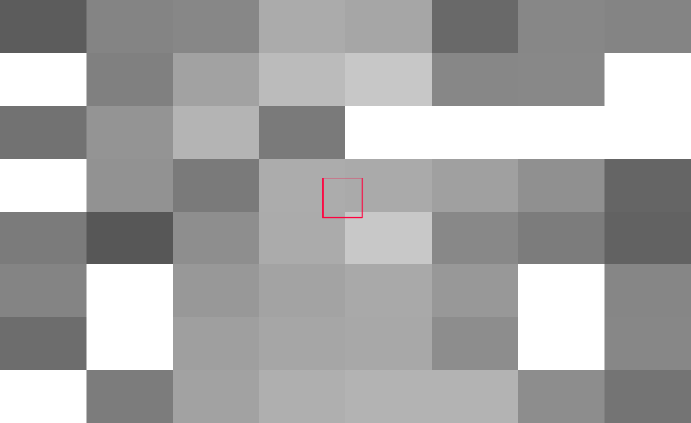

Содержание:
* [Техники отсечения невидимой геометрии](#Техники-отсечения-невидимой-геометрии)
* [Тесты производительности](#Тесты-производительности)
* [Итоги тестов](#Итоги-тестов)
* [Исходники](#Исходники)

**Какие возникают проблемы при увеличении количества геометриии**:
* Overdraw - когда для одного пикселя множество раз выполняется тяжелый фрагментный шейдер.
* Quad overdraw - фрагментные шейдеры выполняются квадратами 2x2, часть из них могут быть вспомогательными и не закрашивают пиксель. Для однопиксельных треугольников 3 из 4х потоков лишние, что сильно снижает производительность.
* Растет нагрузка на растеризатор. Сейчас карты на 4TFLOPS+ способны залить 4К экран однопиксельными треугольниками на 60+ кадров в секунду, но все упирается в фрагментный шейдер.
* Увеличивается нагрузка на вершинный шейдер. Для однопиксельных треугольников значение приближается к одному VS на пиксель, что уже много. Для отдельных треугольников, например листьев, уже 3 вызова VS на пиксель.
* Нагружается память и кэш. На TBDR чтение из глобальной памяти происходит несколько раз.

# Техники отсечения невидимой геометрии

## Depth Pre-Pass (DPP)

Первый проход заполняет буфер глубины, на второй происходит наложение материалов.

* Первый проход упирается в растеризацию (fill rate) и вершинный шейдер.
* Второй проход точно также нагружает растеризацию, тут ускорения нет.
* После растеризации большинство пикселей отбрасывается на ZS тесте.
* Наложение материала происходит один раз на пиксель, но из-за вспомогательных потоков по краям треугольника может вызываться несколько FS на пиксель, хотя записывает результат только один.
* В итоге вдвое увеличивается нагрузка на вершиный шейдер и растеризатор.

## Depth reprojection

Буфер глубины с предыдущего кадра проецируется на новый.

* Заменяет первый проход depth pre-pass, что меньше нагружает растеризатор.
* Применим только для статичной геометрии.
* При репроекции снижается точность значений, нужно компенсировать это смещением.
* Часть пикселей теряется и в этом месте резко увеличивается нагрузка на растеризатор.
	- Требуется дополнительное отсечение.
	- Другой вариант - взять наибольшее значение от соседних пикселей и добавить смещение.

Также используется для ускорения рисования теней: [Camera Depth Reprojection for ShadowCulling (слайд 26)](https://games-1312234642.cos.ap-guangzhou.myqcloud.com/course/GAMES104/GAMES104_Lecture22.pdf)

## Deferred Texturing

Первый проход пишет глубину, индекс материала, нормали и деривативы для текстурных координат.
Второй проход (или сабпасс) уже применяет материал.
Дальше эволюция привела к Visibility Buffer с еще более компактным G-буфером.

* Растеризация происходит один раз.
* Тяжелый фрагментный шейдер вызывается один раз.
* Требует хранить в G-буфере:
	- нормали (упакованые: 2х 16бит)
	- ID материала (16бит)
	- UV (2х 16бит)
	- UV деривативы или LOD (4х 16бит)
	- касательные (tangent, bitangent) для рельефного текстурирования
* Больше данных попадает в G-буфер, что не так страшно для TBDR архитектур.
	- Чем больше атрибутов у вершины, тем больше G-буфер.
	
**Ссылки**
* [Nathan Reed: Deferred Texturing](https://www.reedbeta.com/blog/deferred-texturing/)
* [The Danger Zone: Bindless Texturing for Deferred Rendering and Decals](https://therealmjp.github.io/posts/bindless-texturing-for-deferred-rendering-and-decals/)

## Visibility Buffer (VisBuf)

Первый проход пишет глубину, индекс материала и индекс треугольника. 
Второй проход по индексу треугольника получает вершины, считает барицентрики. Далее интерполируются атрибуты, расчитываются деривативы и накладывается материал.

* Растеризация происходит один раз.
* Тяжелый фрагментный шейдер вызывается один раз.
* Легкий G-буфер (32 бита на глубину и 32 на материал + треугольник).
* Требует разбиение геометрии на кластеры, чтобы уплотнить индексы треугольников и материалов, иначе потребуется больше места.
* Расчет позиции вершин треугольника выполняется для каждого пикселя, это аналогично трем вызовам вершинного шейдера, что большой оверхэд для легкого фрагментного шейдера и слабых ГП.
* Для анимации используется промежуточный буфер с трансформированными вершинами, как в [Horizon Forbidden West](https://www.gdcvault.com/play/1027553/Adventures-with-Deferred-Texturing-in). Иначе тяжелый VS вызывается 3 раза для каждого пикселя.
* Чтобы полностью избавиться от quad overdraw нужна софтварная растеризация как в Nanite, Horizon.
* Для разных шейдеров требуется произвести классификацию пикселей - выбрать пиксели с одним материалом, сгруппировать их и вызвать шейдер.
* На TBDR архитектуре создание VisBuf в 2 раза медленее чем depth pre-pass из-за хранения PrimitiveID и материала.
* Трансформация трех вершин, интерполяция аттрибутов и расчет дериватив на каждый фрагмент очень затратно для слабых мобилок.

**Этап классификации**
* Material Depth Buffer ([Dawn Engine (страница 16)](https://gitea.yiem.net/QianMo/Real-Time-Rendering-4th-Bibliography-Collection/raw/branch/main/Chapter%201-24/%5B0363%5D%20%5BGPU%20Zen%202017%5D%20Deferred+-%20Next-Gen%20Culling%20and%20Rendering%20for%20the%20Dawn%20Engine.pdf) и [Nanite (слайды 100-105)](https://advances.realtimerendering.com/s2021/Karis_Nanite_SIGGRAPH_Advances_2021_final.pdf), есть [тест производительности](https://github.com/azhirnov/as-en/blob/dev/AE/samples/res_editor/_data/scripts/perf/MaterialDepthBuffer.as)). 
  Идея в том, что после прохождения буфера глубины пиксели (на самом деле квадраты 2х2) группируются чтобы максимально заполнить варп, но не могут собирать пиксели за пределами тайла (на TBR и TBDR), поэтому эффективность снижается.
  А размер тайла может зависить от количества регистров в фрагментном шейдере, то есть для тяжелого шейдера эффективность падает сильнее.
* Классификация в компьют шейдере как в [Horizon Forbidden West](https://www.gdcvault.com/play/1027553/Adventures-with-Deferred-Texturing-in). 
  Размер тайла задается вручную, что позволяет лучше сгруппировать пиксели, также в компьют шейдере нет quad overdraw.

[Discover Metal enhancements for A14 Bionic: Visibility buffer with barycentric coordinates and primitiveID (6:24 - 14:40)](https://developer.apple.com/videos/play/tech-talks/10858/?time=384) 
Альтернативный вариант G-буфера куда дополнительно записываются барицентрические координаты треугольника.
* Это позволяет избавиться от расчета позиции всех вершин треугольника на пиксель.
* Деривативы в пределах одного треугольника расчитываются верно, а как их исправить на границе между треугольниками не объясняется.
* Для не-TBDR архитектур платим за вдвое большее чтение из G-буфера.

**Ссылки**
* [The Visibility Buffer: A Cache-Friendly Approach to Deferred Shading (2013)](https://jcgt.org/published/0002/02/04/paper.pdf)
* [Visibility Buffer (2016)](https://ubm-twvideo01.s3.amazonaws.com/o1/vault/gdceurope2016/presentations/Engel_Wolfgang_Visibility_Buffer.pdf)
* [Visibility Buffer Rendering with Material Graphs](http://filmicworlds.com/blog/visibility-buffer-rendering-with-material-graphs/)

## Hierarchy Z-Buffer (HZB, HiZ)

Иерархический буфер глубины. 
Берется буфер глубины с предыдущего кадра, генерируются мип-уровни. Перед рисованием проверяется виден ли объект - Z меньше чем в буфере глубины. 
Двухпроходный вариант - первой проверкой видимости создается 2 списка: видимые объекты и возможно видимые. Рисуется первый список, дальше строится HZB для текущего кадра и проверяется 2й список.

* Уменьшает нагрузку на вершинный шейдер и на растеризатор.
* Не решает проблему нескольких вызовов фрагментного шейдера на пиксель, поэтому требует комбинации с другими техниками.
* Требуется скопировать буфер глубины до рисования динамических объектов, иначе будут ложные срабатывания.
* Требуется нарезать геометрию на более мелкие части (мешлеты), чтобы улучшить точность, тогда берутся более высокие мип-уровни.
* Альтернативный вариант - рисовать упрощенную геометрию в низком разрешении, строить пирамиду и проверять видимость.
* Тестирование видимости выполняется в компьют шейдере, который параллелится с другими проходами, например тенями.
* Построение пирамиды глубины занимает намного больше времени, чем тест видимости. С увеличением разрешения нагрузка сильно увеличивается.
* На медленной памяти плохо справляется с 4К при построении пирамиды, для оптимизации можно не сохранять верхние мип-уровни, так как они редко используются.
* Так как используется max фильтр, то тонкая геометрия и меши с альфа-тестом часто не дают вклада в пирамиду глубины.
  Это снижает точность проверки видимости. Для тонкой геометрии лучше Raster Occlusion, а для альфа-теста - Visibility Buffer.

<b>Детали реализации</b>

Рассчет HZB должен происходить для текстуры степени 2, так как `3/2=1`, то при фильтрации надо читать 2 или 3 текселя, чтобы не потерять данные.
Также происходит смещение координат и тест видимости дает неверный результат.

> Например цепочка мипов 27, 13, 6, 2, 1 дает смещение координат:
> тексель 26 при уменьшении это 13, но он за пределами мипа и либо теряется, либо идет в 12.
> То же самое со вторым мипом: 12 при уменьшении это 6 что за пределами третьего мипа.

Здесь один мип-уровень сравнивается с более высоким. Красным обозначены места, где сместились координаты и максимальные значения не совпадают.

Есть 2 варианта решения проблемы:
* Сначала уменьшить до степени 2, затем расчитывать мип-уровни. [Пример](https://github.com/azhirnov/as-en/blob/dev/AE/samples/res_editor/_data/scripts/perf/GenHiZ-1.as).
	- Для степени 2 мип-уровни расчитываются быстрее.
	- Искажаются пропорции, квадраты становятся прямоугольниками и точность проверки видимости немного снижается.
* Для каждого мип уровня выбирать какие пиксели из верхнего уровня влияют на него. [Пример](https://github.com/azhirnov/as-en/blob/dev/AE/samples/res_editor/_data/scripts/perf/GenHiZ-1.as).

[Пример HiZ с визуализацией для отладки](https://github.com/azhirnov/as-en/blob/dev/AE/samples/res_editor/_data/scripts/tests/HiZ-DebugVis.as) 

**Ссылки**
* [Hierarchical Z-Buffer Occlusion Culling (2010)](https://www.nickdarnell.com/hierarchical-z-buffer-occlusion-culling/)
* [GPU-based Scene Management for Rendering Large Crowds (2008)](https://drivers.amd.com/misc/siggraph_asia_08/GPUBasedSceneManagementLargeCrowds_SLIDES.pdf)
* [Hierarchical-Z map based occlusion culling](https://www.rastergrid.com/blog/2010/10/hierarchical-z-map-based-occlusion-culling/)
* [Hierarchical Depth Buffers (2020)](https://miketuritzin.com/post/hierarchical-depth-buffers/), [[перевод](https://habr.com/ru/articles/494376/)]

## Raster Occlusion

Реализовано в [gl_occlusion_culling](https://github.com/nvpro-samples/gl_occlusion_culling), где ссылаются на доклад [OpenGL Scene-Rendering Techniques (Siggraph 2014)](https://web.archive.org/web/20160314160241/http://on-demand.gputechconf.com/siggraph/2014/presentation/SG4117-OpenGL-Scene-Rendering-Techniques.pdf).
Заполняем буфер глубины через depth pre-pass или репроекцией.
Рисуем bbox с выключеной записью глубины, в фрагментном шейдере помечаем объект как видимый.

* Лучше точность чем у HiZ.
* Нагружает растеризатор, но не так сильно как полноценная геометрия.
* Нагружает память из-за случайной записи и растет с увеличением разрешения.
* Для оптимизации можено понизить разрешение как для HiZ.
* Для лучшей точности требуется нарезать геометрию на мелкие части (мешлеты).
* Хорошо подходит для тонкой геометрии: растительность, столбы, провода.

[Пример Raster Occlusion визуализацией для отладки](https://github.com/azhirnov/as-en/blob/dev/AE/samples/res_editor/_data/scripts/tests/RasterCull-DebugVis.as)

## Cone/Cluster Culling

Для части геометрии (мешлета) рассчитывается конус видимости, проверка идет после frustum culling.

* Дает небольшое ускорение, за счет уменьшения вызовов рисования и вершинных шейдеров.
* Заменяет back face culling, который происходит перед растеризацией треугольника, на TBDR это происходит до записи в глобальную память, так что экономятся только вызовы VS.

Cluster Culling описан в [Optimizing the Graphics Pipeline with Compute](https://ubm-twvideo01.s3.amazonaws.com/o1/vault/gdc2016/Presentations/Wihlidal_Graham_OptimizingTheGraphics.pdf) (слайды 28-30).

## Per Triangle Culling

Описан в [Optimizing the Graphics Pipeline with Compute](https://ubm-twvideo01.s3.amazonaws.com/o1/vault/gdc2016/Presentations/Wihlidal_Graham_OptimizingTheGraphics.pdf) (слайды 41-63).

Кластер на 256 треугольников после Cluster Culling отправляется на Per Triangle Culling.
Один поток проверяет видимость одного треугольника, затем с помощью prefix sum видимые треугольники сдвигаются влево.

* Хорошо сочетается с предварительной трансформацией вершин, иначе делается двойная работа.
* В 3 раза увеличивается нагрузка на память: нужно прочитать вершины, трансформировать их и записать обратно, затем снова прочитать в VS.
  Но нагрузка снижается при отсечении невидимых и при сжатии вершн, как это сделано на TBDR архитектурах.
  Также полезно для visibility buffer, где трансформация вершин повторяется попиксельно.
* Невидимые треугольники и так отсекаются в железе, софтварный вариант отличается только использованием HiZ от предыдущего кадра.

## Potentially Visible Set (PVS)

Список статичных объектов, которые могут быть видимы из определенного положения.

* Требуется предрасчет.
* Для больших локаций занимает много места.
* Может не содержать данных для всех возможных положений камеры. Например, если обычное поведение - камера на земле и все предрасчитано, то в режиме полета уже не получится все расчитать. 

## Специфичные оптимизации

Для кубического мира можно сгруппировать все грани с одинаковой нормалью и отсекать их целыми группами, что аналогично PVS, но строится бесплатно.
Видео с описанием техники: [I Optimised My Game Engine Up To 12000 FPS](https://youtu.be/40JzyaOYJeY).

## Реализация в железе

Во всех случаях приходится платить за вызов отрисовки и вершинный шейдер, а дальше влияет только эффективность реализации в железе.

### Early ZS, Hierarchy Z-Buffer

* После растеризации идет тест глубины и только для квадратов (2х2 пикселя), которые прошли тест, будет запущен фрагментный шейдер.
* На этом этапе применяется встроенный иерархический буфер глубины (HiZ), который отсекает целые тайлы без необходимости тестировать каждый квадрат.
* Квадраты, которые прошли тест, далее группируются в пределах тайла, чтобы занять все свободные потоки варпа.
* Discard в шейдере и прозрачность не меняют глубину, поэтому также может отсекаться. Более эффективное отсечение на TBDR архитектуре.

**Ссылки**
* [To Early-Z, or Not To Early-Z](https://therealmjp.github.io/posts/to-earlyz-or-not-to-earlyz/)
* [A trip through the Graphics Pipeline 2011, part 7](https://fgiesen.wordpress.com/2011/07/08/a-trip-through-the-graphics-pipeline-2011-part-7/)

### Facing test, XY plane test, Z plane test, Sample test

* Происходит на этапе нарезки на тайлы. Здесь платим только за вызов части вершинного шейдера, который отвечает за позицию.
* При отсечении задних граней выкидывает треугольники, которые не прошли тест. Это около половины треугольников для моделей, но ноль для 2D.
* Проверяется что треугольник виден на экране (XY plane test, Z plane test), если нет - он отбрасывается.
* Треугольник должен занимать хотя бы один пиксель, иначе отбрасывается (Sample test).
* На TBDR это снижает нагрузку на память при выгрузке и загрузке нарезаной на тайлы геометрии.

**Ссылки**
* [Valhall Performance Counters Reference Guide](https://developer.arm.com/documentation/107775/0106)
* [A trip through the Graphics Pipeline 2011, part 5](https://fgiesen.wordpress.com/2011/07/05/a-trip-through-the-graphics-pipeline-2011-part-5/)

### AMD Vega Deferred pixel processing

Что-то похожее на Mali FPK. Упоминается только в Vega (GCN5) архитектуре.

* Фрагментный шейдер не сразу запускается для растеризованных треугольников.
* Сначала пиксели накапливаются в небольшом буфере, а потом рисуется только один.

Ссылки: [Vega Whitepaper](https://en.wikichip.org/w/images/a/a1/vega-whitepaper.pdf)

### Adreno Low Resolution Z-Pass (LRZ)

* На этапе нарезки на тайлы заполняется LRZ. Часть примитивов может быть отброшена уже на этом этапе.
* На этапе рисования сначала тестируется LRZ и только потом полноразмерный Z-буфер. Это ускоряет ZS тест и уменьшает чтение из L2, где хранится тайл.

**Ссылки**
* [Low Resolution Z Buffer support on Turnip (2021)](https://blogs.igalia.com/siglesias/2021/04/19/low-resolution-z-buffer-support-on-turnip/)
* [Low-resolution-Z on Adreno GPUs](https://blogs.igalia.com/dpiliaiev/adreno-lrz/)

### Mali Forward Pixel Kill (FPK)

* Фрагментный шейдер начинает выполняться, тем временем следующий треугольник растеризуется и перекрывает текущий, тогда фрагментный шейдер прерывется и начинается новый.
* Не работает для микротреугольников с простыми шейдерами, тогда шейдеры завершаются быстрее чем растеризуются новые треугольники.
* Когда фрагментный шейдер запускается, он может обратиться к памяти, а после прерывания этот запрос не отменяется и создает излишнюю нагрузку на память.

**Ссылки**
* [Forward Pixel Kill](https://community.arm.com/arm-community-blogs/b/graphics-gaming-and-vr-blog/posts/killing-pixels---a-new-optimization-for-shading-on-arm-mali-gpus), [[webarchive](https://web.archive.org/web/20240922023725/https://community.arm.com/arm-community-blogs/b/graphics-gaming-and-vr-blog/posts/killing-pixels---a-new-optimization-for-shading-on-arm-mali-gpus)]

### Mali Fragment Prepass (FPP)

* Появился в новой архитектуре 5th gen.
* Для каждого пикселя перебирает примитивы и выбирает единственный для отрисовки.
* Для невидимых пикселей фрагментный шейдер не вызывается совсем.

**Ссылки**
* [Hidden Surface Removal in Immortalis-G925: The Fragment Prepass](https://community.arm.com/arm-community-blogs/b/graphics-gaming-and-vr-blog/posts/immortalis-g925-the-fragment-prepass), [[webarchive](https://web.archive.org/web/20241202033355/https://community.arm.com/arm-community-blogs/b/graphics-gaming-and-vr-blog/posts/immortalis-g925-the-fragment-prepass)]

### Mali Deferred Vertex Shading (DVS)

* Появился в новой архитектуре 5th gen.
* На этапе нарезания на тайлы вызывается часть вершинного шейдера, отвечающая за позицию, если треугольник маленький, то он помечается для использования DVS и не выгружается в глобальную память.
* На этапе растеризации для DVS треугольников заново вызывается вершинный шейдер и затем фрагментный. Получается расчет позиции для DVS треугольников происходит дважды, что может быть затратно если есть вершинная анимация.

**Ссылки**
* [Hidden Surface Removal in Immortalis-G925: The Fragment Prepass](https://community.arm.com/arm-community-blogs/b/graphics-gaming-and-vr-blog/posts/immortalis-g925-the-fragment-prepass), [[webarchive](https://web.archive.org/web/20241202033355/https://community.arm.com/arm-community-blogs/b/graphics-gaming-and-vr-blog/posts/immortalis-g925-the-fragment-prepass)]

### PowerVR Hierarchical Scheduling Technology (HST)

* Обещают полное удаление невидиых фрагментов, как и при depth pre-pass.
* Как и LRZ происходит на этапе нарезки на тайлы.
* На этапе растеризации уже известен примитив, который закрывает все остальные в заданом пикселе.

**Ссылки**
* [Introduction to PowerVR for Developers (2021)](https://imagination-technologies-cloudfront-assets.s3.eu-west-1.amazonaws.com/website-files/documents/Introduction_to_PowerVR_for_Developers.pdf?dlm-dp-dl-force=1&dlm-dp-dl-nonce=5021498b5e)

# Тесты производительности

**Тест нагрузки на VS и растеризатор** 
Фрагментный шейдер расчитывает попиксельную нормаль и финальный цвет.
Основная нагрузка идет на вершинный шейдер, растеризатор или ZS-тест, в зависимости от возможностей железа. 
[Исходники](https://github.com/azhirnov/as-en/blob/dev/AE/samples/res_editor/_data/scripts/perf/GeometryCulling-1.as).

**Тест нагрузки на FS** 
В фрагментном шейдере сделан случайный доступ к текстурам, что дает большую нагрузку на VRAM и не нагружает кэши.
Второй вариант - нагрузка ALU генерацией шума. 
[Исходники](https://github.com/azhirnov/as-en/blob/dev/AE/samples/res_editor/_data/scripts/perf/GeometryCulling-2.as).

**Тест генерации пирамиды глубины (HZB)** 
Используется R32F или R16_UNorm формат в зависимости от формата буфера глубины.
Сравнивается генерация в компьют шейдере (cs) и в фрагментном шейдер, что включает компрессию и снижает нагрузку на память (gfx). Уровень компрессии зависит от содержимого текстуры, чем больше градиентов и меньше шумов, тем лучше компрессия и быстрее генерация пирамиды.
Дополнительная оптимизация - sampler min reduction, позволяет заменить линейную фильтрацию на min функцию, получается один запрос к текстуре вместо 4х. 
Разрешение не степени 2 уменьшается до: 
2К: 1024x512 
4K: 2048x1024 
8K: 4096x2048 
Исходники: [GenHiZ-1](https://github.com/azhirnov/as-en/blob/dev/AE/samples/res_editor/_data/scripts/perf/GenHiZ-1.as), [GenHiZ-2](https://github.com/azhirnov/as-en/blob/dev/AE/samples/res_editor/_data/scripts/perf/GenHiZ-2.as).

**Используются техники:**
1. without ZS - не использует тест глубины, должен показать максимальную нагрузку на растеризатор или FS.
2. LateZS - аналогично первому, но использование буфера глубины может дать дополнительную нагрузку.
3. EarlyZS - ранний тест глубины и сортировка от камеры должны дать наилучший результат без дополнительных оптимизаций.
4. EarlyZS + discard - глубина не меняется, поэтому разница с EarlyZS должна быть минимальной.
5. Depth pre-pass - двойная растеризация, но примерно один FS на пиксель.
6. Visibility buffer - во втором проходе убирает вспомогательные потоки для треугольников (quad overdraw), для которых также вызывается FS. Две версии: с компактным G-буфером и с записью барицентриков.
7. HiZ - убирает невидимые объекты. Для упрощения не используется репроекция. Из-за использования атомика меняется порядок рисования и время кадра становится нестабильным.
8. Raster culling - убирает невидимые объекты. Для упрощения не используется репроекция или depth pre-pass. Как и у HiZ есть нестабильность из-за разного порядка рисования обьектов.
9. HiZ + DPP - убирает невидимые объекты, вызывается примерно один FS на пиксель. Показывает насколько DPP полезен при меньшей нагрузке на растеризатор.

HiZ и RasterCulling показывают насколько отсечение в софте лучше отсечения в фиксированном конвеере, при условии что производительность не упирается в VS.
Остальные техники показывают насколько аппаратная часть может приблизиться к одному FS на пиксель.
В итоговом рендере нужно выбрать между HiZ и RasterCulling, затем между сортировкой, depth pre-pass, visibility buffer и другими техниками.

**Результаты** представлены в таблицах. Время кадра разных техник сравнивается с EarlyZS как наилучший из простых реализаций, чем меньше значение, тем лучше.
* [AMD RX570](#AMD-RX570)
* [AMD Radeon 780M, RADV](#AMD-Radeon-780M-RADV)
* [AMD Radeon 780M, PRO](#AMD-Radeon-780M-PRO)
* [Adreno 505](#Adreno-505)
* [Adreno 660](#Adreno-660)
* [Apple M1](#Apple-M1)
* [Intel UHD 620](#Intel-UHD-620)
* [Intel N150](#Intel-N150)
* [Lavapipe](#Lavapipe)
* [Mali T830](#ARM-Mali-T830)
* [Mali G57](#ARM-Mali-G57)
* [Mali G610](#ARM-Mali-G610)
* [Nvidia RTX 2080](#Nvidia-RTX-2080)
* [PowerVR BXM-8-256](#PowerVR-BXM-8-256)

**Резрешение:** 
1K - 960x540, 0.5 MPix 
2K - 1920x1080, 2.07MPix 
2K+ - 2400x1080, 2.6MPix - типичное разрешение на 6" смартфонах 
4K - 3840×2160, 8.3 MPix 

## Nvidia RTX 2080

Количество объектов: 11K 
Всего треугольников: 33M 
Осталось объектов после HiZ: 2.9K 
Осталось объектов после Raster culling: 1.2K 

### VS/Raster/ZS bound

RasterCulling дает наилучшее отсечение и нагрузка на растеризатор снижается, пропускная способность памяти в 440GB/s справляется с нагрузкой даже в 4К.

| technique | 1K | 2K | 4K |
|---|---|---|---|
| without ZS                | 1.0    | 1.27   | 2.9    |
| late ZS, front to back    | 1.0    | 1.29   | 2.6    |
| early ZS, back to front   | 1.0    | 1.01   | 1.27   |
| early ZS, discard         | 1.0    | 1.0    | 1.0    |
|**early ZS, front to back**| 1.0    | 1.0    | 1.0    |
| depth pre-pass            | 1.99   | 1.98   | 1.93   |
| vis buf                   | 1.2    | 1.33   | 1.31   |
| raster culling            |**0.36**|**0.18**|**0.34**|
| HiZ + pyramid             | 0.29   | 0.33   | 0.50   |
| HiZ + dpp + pyramid       | 0.55   | 0.59   | 0.77   |

### ALU bound

VisBuf дает наилучший результат, так как убирает quad overdraw, следовательно вызывается меньше FS, в 4К это позволяет рисовать без дополнительного отсечения.

| technique | 1K | 2K | 4K |
|---|---|---|---|
| without ZS                | 9.4    | 12.1   | 12.5   |
| late ZS, front to back    | 9.4    | 12.1   | 12.5   |
| early ZS, back to front   | 3.2    | 3.9    | 4.2    |
|**early ZS, front to back**| 1.0    | 1.0    | 1.0    |
| depth pre-pass            | 1.30   | 0.83   | 0.62   |
| vis buf                   | 0.80   | 0.53   |**0.42**|
| vis buf (bary)            | 0.80   | 0.52   |**0.42**|
| raster culling            | 0.81   | 0.78   | 0.82   |
| HiZ + pyramid             | 0.83   | 1.05   | 1.15   |
| HiZ + dpp + pyramid       |**0.52**|**0.49**| 0.50   |

### Memory bound

Здесь разница между DPP и VisBuf меньше, возможно влияет большее количество уникальных ресурсов в варпе, тогда как в DPP варп содержит больше FS с одинаковым материалом.

| technique | 1K  mem util  (%) | 2K  mem util  (%) | 4K  mem util  (%) | 1K | 2K | 4K |
|---|---|---|---|---|---|---|
| without ZS                | 59 | 59 | 59 | 4.8    | 9.3    | 11.3   |
| late ZS, front to back    | 60 | 60 | 60 | 4.8    | 9.3    | 11.3   |
| early ZS, back to front   | 40 | 57 | 59 | 1.7    | 3.1    | 3.8    |
|**early ZS, front to back**| 11 | 39 | 55 | 1.0    | 1.0    | 1.0    |
| depth pre-pass            |  6 | 20 | 39 | 1.8    | 1.08   | 0.70   |
| vis buf                   |  6 | 19 | 43 | 1.17   | 0.86   | 0.61   |
| vis buf (bary)            |  6 | 21 | 44 | 1.17   | 0.86   | 0.63   |
| raster culling            | 10 | 35 | 57 | 0.56   | 0.76   | 0.84   |
| HiZ + pyramid             | 13 | 44 | 58 |**0.53**| 1.38   | 1.13   |
| HiZ + dpp + pyramid       |  7 | 21 | 52 | 0.58   |**0.54**|**0.53**|

### Генерация HZB

Рендер в текстуру быстрее за счет компресии.
Min sampler дает небольшое ускорение.

| technique                                    |  2K (ms)  |  4K (ms)  |  8K (ms)  |
|----------------------------------------------|-----------|-----------|-----------|
| non power of 2, cs                           | 0.14      | 0.37      | 1.29      |
| non power of 2, gfx                          | 0.11      | 0.27      | 0.89      |
| to power of 2, cs                            | 0.12      | 0.28      | 0.91      |
| to power of 2, gfx                           | 0.096     | 0.23      | 0.77      |
| to power of 2, reduction, cs                 | 0.12      | 0.27      | 0.86      |
| to power of 2, reduction, gfx                | 0.096     | 0.23      | 0.77      |
| to power of 2, skip high mip, reduction, gfx |**0.094**  |**0.21**   |**0.62**   |

<b>Подробные результаты</b>

**VS/Raster/ZS bound**

| technique | 1K time (ms) | 2K time (ms) | 4K time (ms) |
|---|---|---|---|
| without ZS                | 3.82               | 4.44               | 11.9             |
| late ZS, front to back    | 3.83               | 4.51               | 10.8             |
| early ZS, back to front   | 3.8                | 3.55               | 5.3              |
| early ZS discard          | 3.8                | 3.51               | 4.14             |
|**early ZS, front to back**| 3.8                | 3.5                | 4.17             |
| depth pre-pass            | 3.75 + 3.8         | 3.4 + 3.5          | 4.0 + 4.06       |
| vis buf                   | 4.5 + 0.065        | 4.5 + 0.14         | 5.0 + 0.45       |
| raster culling            | 0.98 + 0.4         | 0.2 + 0.42         | 0.49 + 0.93      |
| HiZ + pyramid             | 1.04 + 0.07        | 1.0 + 0.14         | 1.66 + 0.42      |
| HiZ + dpp + pyramid       | 1.02 + 1.02 + 0.07 | 0.96 + 0.97 + 0.14 | 1.5 + 1.3 + 0.42 |

**ALU bound** 
PERF_LEVEL = 1

| technique | 1K time (ms) | 2K time (ms) | 4K time (ms) |
|---|---|---|---|
| without ZS                | 60.1               | 160                | 450                |
| late ZS, front to back    | 60.0               | 160                | 450                |
| early ZS, back to front   | 20.7               | 52.0               | 150                |
|**early ZS, front to back**| 6.4                | 13.2               | 36.0               |
| depth pre-pass            | 3.75 + 4.8         | 3.4 + 7.5          | 4.0 + 18.2         |
| vis buf                   | 4.51 + 0.64        | 4.51 + 2.51        | 5.2 + 9.9          |
| vis buf (bary)            | 4.51 + 0.62        | 4.51 + 2.44        | 5.4 + 9.7          |
| raster culling            | 0.98 + 4.2         | 0.2 + 10.1         | 0.49 + 28.9        |
| HiZ + pyramid             | 5.31 + 0.07        | 13.9 + 0.14        | 41.4 + 0.42        |
| HiZ + dpp + pyramid       | 1.02 + 2.33 + 0.07 | 0.96 + 5.6 + 0.14  | 1.5 + 16.5 + 0.42 |

**Memory bound** 
PERF_LEVEL = 1 (old)

| technique | 1K time (ms) | 2K time (ms) | 4K time (ms) |
|---|---|---|---|
| without ZS                | 21.4               | 79                 | 300               |
| late ZS, front to back    | 21.4               | 79                 | 300               |
| early ZS, back to front   | 7.7                | 26.4               | 100               |
|**early ZS, front to back**| 4.47               | 8.5                | 26.5              |
| depth pre-pass            | 3.75 + 4.13        | 3.4 + 5.8          | 4.0 + 14.7        |
| vis buf                   | 4.5 + 0.72         | 4.5 + 2.8          | 5.0 + 11.2        |
| vis buf (bary)            | 4.5 + 0.72         | 4.5 + 2.8          | 5.4 + 11.2        |
| raster culling            | 0.98 + 1.52        | 0.2 + 6.31         | 0.49 + 21.9       |
| HiZ + pyramid             | 2.3 + 0.07         | 7.1 + 0.14         | 29.6 + 0.42       |
| HiZ + dpp + pyramid       | 1.02 + 1.52 + 0.07 | 0.96 + 3.55 + 0.14 | 1.5 + 12.2 + 0.42 |

## ARM Mali T830

Количество объектов: 2K 
Всего треугольников: 880K 
Осталось объектов после HiZ: 356 
Осталось объектов после Raster culling: 150 

### VS/Raster/ZS bound

| technique | 1K |
|---|---|
| without ZS                | 1.09   |
| late ZS, front to back    | 1.74   |
| early ZS, back to front   | 1.02   |
| early ZS, discard         | 1.04   |
|**early ZS, front to back**| 1.0    |
| depth pre-pass            | 1.99   |
| raster culling            | 5.5    |
| HiZ + pyramid             |**0.19**| 
| HiZ + dpp + pyramid       | 0.32   |

Слишком низкая производительность для более сложного теста.

<b>Подробные результаты</b>

**VS/Raster/ZS bound**

| technique | 1K (ms) | 2K (ms) |
|---|---|---|
| without ZS                | 100           | 140            |
| late ZS, front to back    | 160           | 530            |
| early ZS, back to front   | 94            | 120            |
| early ZS, discard         | 96            | 150            |
|**early ZS, front to back**| 92            | 120            |
| depth pre-pass            | 89 + 94       | 110 + 120      |
| raster culling            | 500 + 6.5     | 1900 + 18      |
| HiZ + pyramid             | 11.8 + 5.7    | 20.8 + 22.3    |
| HiZ + dpp + pyramid       | 10.5+12.8+5.7 | 14.8+28.5+22.3 |

**ALU bound** 
PERF_LEVEL = 

| technique | 1K (ms) | 2K (ms) | 4K (ms) |
|---|---|---|---|
| without ZS                | 
| late ZS, front to back    | 
| early ZS, back to front   | 
|**early ZS, front to back**| 
| depth pre-pass            | 
| vis buf                   | 
| vis buf (bary)            | 
| raster culling            | 
| HiZ + pyramid             | 
| HiZ + dpp + pyramid       | 

**Memory bound** 
PERF_LEVEL = 

| technique | 1K (ms) | 2K (ms) | 4K (ms) |
|---|---|---|---|
| without ZS                | 
| late ZS, front to back    | 
| early ZS, back to front   | 
|**early ZS, front to back**| 
| depth pre-pass            | 
| vis buf                   | 
| vis buf (bary)            | 
| raster culling            | 
| HiZ + pyramid             | 
| HiZ + dpp + pyramid       | 

## ARM Mali G57

Количество объектов: 11K 
Всего треугольников: 4.7M 
Осталось объектов после HiZ: 2.6K / 1.12M tris 
Осталось объектов после Raster culling: 1.2K / 660K tris 

### VS/Raster/ZS bound

Интересный результат показал вариант без теста глубины, похоже FPK хорошо работает и производительность проседает всего на 20%, схожий результат и на других тестах.
RasterCulling уже на 2К упирается в FS. HiZ третит на построение пирамиды в 2К - 3мс, в 4к - 12.5мс, и это время не зависит от количества треугольников.

| technique | 1K | 2K | 4K |
|---|---|---|---|
| without ZS                | 1.4    | 1.3    | 1.2   |
| late ZS, front to back    | 3.7    | 6.5    | 11    |
| early ZS, back to front   | 1.13   | 1.15   | 1.04  |
| early ZS, discard         | 1.04   | 1.37   | 1.68  |
|**early ZS, front to back**| 1.0    | 1.0    | 1.0   |
| depth pre-pass            | 1.97   | 2.0    | 2.0   |
| raster culling            |**0.27**| 0.6    | 1.2   |
| HiZ + pyramid             | 0.28   |**0.39**|**0.5**|
| HiZ + dpp + pyramid       | 0.5    | 0.66   | 0.8   |

### ALU bound

RasterCulling и HiZ хорошо снижают нагрузку с растеризатора, а другие техники не дают видимого ускорения, связано это с тем, что аппаратная часть уже хорошо оптимизирована, а геометрия отсортирована.
В 4К FPK хорошо справляется с неотсортированной геометрией.

| technique | 1K | 2K | 4K |
|---|---|---|---|
| without ZS                | 5.2    | 3.2    | 1.17   |
| late ZS, front to back    | 13.6   | 25     | 38     | 
| early ZS, back to front   | 2.1    | 1.96   | 1.15   |
|**early ZS, front to back**| 1.0    | 1.0    | 1.0    |
| depth pre-pass            | 1.76   | 1.7    | 1.64   |
| vis buf                   | 0.94   | 0.99   | 1.18   |
| raster culling            |**0.43**| 0.77   | 1.47   |
| HiZ + pyramid             | 0.44   |**0.63**|**0.94**|
| HiZ + dpp + pyramid       | 0.49   | 0.7    | 1.08   |

### Memory bound

В отличие от нагрузки на ALU, здесь VisBuf быстрее на 20% так как стартует меньше FS, которые отправляют запрос к памяти, а после того как FPK прерывает шейдер, эти запросы продолжают выполняться и излишне нагружают память.

| technique | 1K | 2K | 4K |
|---|---|---|---|
| without ZS                | 6.1    | 4.2    | 1.3    |
| late ZS, front to back    | 6.8    | 13     | 24     |
| early ZS, back to front   | 2.4    | 2.1    | 1.2    |
|**early ZS, front to back**| 1.0    | 1.0    | 1.0    |
| depth pre-pass            | 1.4    | 1.14   | 1.34   |
| vis buf                   | 0.81   | 0.81   | 1.0    |
| raster culling            |**0.48**| 0.72   | 1.22   |
| HiZ + pyramid             | 0.54   | 0.67   |**0.88**|
| HiZ + dpp + pyramid       | 0.49   |**0.66**| 0.92   |

<b>Подробные результаты</b>

**VS/Raster/ZS bound**

DPP с repeat=1 выдает 56ms + 18ms, а с repeat>1 когда добавляется глобальный барьер, то 37мс + 37мс, что одинаково, разница в том, что второй проход накладывается на первый и время первого прохода увеличивается.
DPP subpass по какой-то причине работает медленее: 77мс против 74мс.
Для DPP сортировка не нужна.
HiZ cull: 80мкс.
HiZ pyramid - переход к степени 2 занимает больше всего времени, дальше очень быстро (0.12мс), возможно неправильно замеряется время?

| technique | 1K (ms) | 2K (ms) | 4K (ms) |
|---|---|---|---|
| without ZS                   | 52.5         | 56.2        | 71.2           |
| late ZS, front to back       | 140          | 280         | 670            |
| early ZS, back to front      | 42.2         | 49          | 62             |
| early ZS, discard            | 39           | 51.5        | 100            |
| **early ZS, front to back**  | 37.5         | 42.8        | 59.7           |
| depth pre-pass               | 37 + 37      | 42 + 42.8   | 58 + 64        |
| depth pre-pass, subpass      | 77           | 87.5        | 130            |
| raster culling               | 5.2 + 4.8    | 16 + 6.4    | 61 + 11.5      |
| HiZ + pyramid                | 9.5 + 0.84   | 11.4 + 3.1  | 17.4 + 12.5    |
| HiZ + dpp + pyramid          | 8.9+9.0+0.84 | 10.5+11+3.1 | 15.7+19.6+12.5 |
| HiZ + dpp + pyramid, subpass | 18 + 0.84    | 22.1 + 3.1  | 34.7 + 12.5    |

**ALU bound** 
PERF_LEVEL = 3

EarlyZS в 1К упирается в растеризатор, так как нагрузка на шейдер 84%, но в 2К шейдер уже нагружен на 100%.
DPP упирается в растеризатор и шейдер нагружен только на 70% при любом разрешении.
VisBuf на 1К и 2К упирается в растеризатор, но это решается за счет HiZ.

| technique | 1K (ms) | 2K (ms) | 4K (ms) |
|---|---|---|---|
| without ZS                | 220           | 160           | 99           |
| late ZS, front to back    | 580           | 1260          | 3200         |
| early ZS, back to front   | 89            | 99            | 97           |
|**early ZS, front to back**| 42.6          | 50.6          | 84.4         |
| depth pre-pass            | 37 + 38       | 41.9 + 44     | 58.2 + 80    |
| depth pre-pass, subpass   | 77.3          | 87.2          | 120          |
| vis buf                   | 39.2 + 4.5    | 48.7 + 17.4   | 75.1 + 69.2  |
| vis buf, subpass          | 40            | 50            | 100          |
| raster culling            | 5.2 + 13.3    | 16 + 23       | 61 + 63      |
| HiZ + pyramid             | 18 + 0.84     | 29 + 3.1      | 67 + 12.5    |
| HiZ + dpp + pyramid       | 8.8+11.2+0.84 | 10.6+21.8+3.1 | 15.7+63+12.5 |

**Memory bound** 
PERF_LEVEL = 4

Если нагрузка на память больше 12GB/s значит все упирается в чтение текстур, это не страшно, когда время кадра наименьшее, иначе это показывает, что выполняется много FS результат которых потом отбрасывается.
В 4К EarlyZS и VisBuf выполняются за одинаковое время, но нагрузка на память разная, так как в EarlyZS больше FS и каждый запрашивает память, а потом прерывается, на общее время выполнения это слабо влияет пока не упрется в скорость памяти.
Для DPP сортировка не важна.

| technique | 1K (ms) | 1K (GB/s) | 2K (ms) | 2K (GB/s) | 4K (ms) | 4K (GB/s) |
|---|---|---|---|---|---|---|
| without ZS                | 360           | 12.9 | 380           | 12.9 | 180           |  9.5 |
| late ZS, front to back    | 400           | 12.9 | 1190          | 12.9 | 3380          | 13.4 |
| early ZS, back to front   | 140           | 10   | 190           | 12.5 | 170           | 11   |
|**early ZS, front to back**| 59            |  9.2 | 90            | 11.4 | 140           | 12.6 |
| depth pre-pass            | 37 + 46       |  5.3 | 41.8 + 61.2   |  7.4 | 58 + 130      |  8.0 |
| depth pre-pass, subpass   | 87.1          |  5.8 | 110           |  7.8 | 180           | 10.0 |
| vis buf                   | 39.3 + 6.7    |      | 46.4 + 19.7   |      | 70.7 + 52.6   |      |
| vis buf, subpass          | 48            |  7.4 | 72.6          | 10.0 | 140           | 11.9 |
| raster culling            | 5.2 + 23.3    | 12.0 | 16 + 49.2     | 12.4 | 61 + 110      | 11.6 |
| HiZ + pyramid             | 30.8 + 0.84   | 11.9 | 57 + 3.1      | 12.7 | 110 + 12.5    | 13.3 |
| HiZ + dpp + pyramid       | 8.8+19.0+0.84 |  8.4 | 10.6+45.6+3.1 | 10.7 | 15.7+100+12.5 | 12.0 |

## ARM Mali G610

Количество объектов: 11K 
Всего треугольников: 4.7M 
Осталось объектов после HiZ: 3K / 1.3M tris 
Осталось объектов после Raster culling: 1.2K / 660K tris 

### VS/Raster/ZS bound

| technique | 1K | 2K | 4K |
|---|---|---|---|
| without ZS                | 1.17   | 1.19   | 1.64   |
| late ZS, front to back    | 1.78   | 2.68   | 5.1    |
| early ZS, back to front   | 1.03   | 1.03   | 1.15   |
| early ZS, discard         | 1.06   | 0.98   | 1.34   |
|**early ZS, front to back**| 1.0    | 1.0    | 1.0    |
| depth pre-pass            | 2.16   | 1.92   | 2.3    |
| raster culling            |**0.19**|**0.27**| 0.71   |
| HiZ + pyramid             | 0.3    | 0.31   |**0.48**|
| HiZ + dpp + pyramid       | 0.58   | 0.57   | 0.74   |

### ALU bound

В отличие от G57 здесь FPK не успевает прерывать фрагментный шейдер и без сортировки получается в 2.5 раза медленее.

| technique | 1K | 2K | 4K |
|---|---|---|---|
| without ZS                | 5.6    | 7.2    | 6.5   |
| late ZS, front to back    | 13.4   | 23     | 23    |
| early ZS, back to front   | 2.24   | 2.6    | 2.4   |
|**early ZS, front to back**| 1.0    | 1.0    | 1.0   |
| depth pre-pass            | 1.57   | 1.23   | 0.92  |
| vis buf                   | 0.79   | 0.85   | 0.82  |
| raster culling            |**0.44**| 0.68   | 0.84  |
| HiZ + pyramid             | 0.57   | 0.79   | 0.92  |
| HiZ + dpp + pyramid       | 0.53   |**0.64**|**0.7**|

### Memory bound

Нагрузка на память сильно больше нагрузки на растеризатор, поэтому VisBuf оказался быстрее за счет наименьшего количества FS.

| technique | 1K | 2K | 4K |
|---|---|---|---|
| without ZS                | 6      | 7.7    | 7.2   |
| late ZS, front to back    | 6.3    | 12     | 19    |
| early ZS, back to front   | 2.4    | 2.8    | 2.6   |
|**early ZS, front to back**| 1.0    | 1.0    | 1.0   |
| depth pre-pass            | 1.42   | 0.92   | 0.79  |
| vis buf                   | 0.8    | 0.61   |**0.6**|
| raster culling            |**0.49**| 0.7    | 0.87  |
| HiZ + pyramid             | 0.7    | 0.86   | 0.95  |
| HiZ + dpp + pyramid       | 0.56   |**0.57**| 0.63  |

<b>Подробные результаты</b>

Замер времени генерации пирамиды глубины неточный, так как время нестабильно и может зависить от общей нагрузки на память.

**VS/Raster/ZS bound**

| technique | 1K (ms) | 2K (ms) | 4K (ms) |
|---|---|---|---|
| without ZS                   | 23.2                | 27.9                | 38.8                 |
| late ZS, front to back       | 35.5                | 63.1                | 120                  |
| early ZS, back to front      | 20.5                | 24.2                | 27.2                 |
| early ZS, discard            | 21.1                | 23.0                | 31.6                 |
|**early ZS, front to back**   | 19.9                | 23.5                | 23.6                 |
| depth pre-pass               | 20.8 + 22.2         | 21 + 24.1           | 26.9 + 31.9          |
| depth pre-pass, subpass      | 42.9                | 47.2                | 54.5                 |
| raster culling               | 1.5 + 2.2 (270MHz)  | 3.6 + 2.7 (320MHz)  | 12.7 + 4.0 (530 MHz) |
| HiZ + pyramid                | 5.6 + 0.35 (660MHz) | 6.3 + 1.01 (720MHz) | 8.6 + 2.8            |
| HiZ + dpp + pyramid          | 5.6 + 6.2 + 0.35    | 6.2 + 6.9 + 1.01    | 7.4 + 9.4 + 2.8      |
| HiZ + dpp + pyramid, subpass | 11.2 + 0.35         | 12.4 + 1.01         | 14.6 + 2.8           |

**ALU bound** 
PERF_LEVEL = 2

| technique | 1K (ms) | 2K (ms) | 4K (ms) |
|---|---|---|---|
| without ZS                | 160          | 280           | 540          |
| late ZS, front to back    | 380          | 910           | 1910         |
| early ZS, back to front   | 63.7         | 99.4          | 200          |
|**early ZS, front to back**| 28.4         | 38.9          | 82.7         |
| depth pre-pass            | 21.5 + 23    | 22.9 + 29.0   | 23.3 + 58.3  |
| depth pre-pass, subpass   | 45.5         | 48.1          | 76.2         |
| vis buf                   | 20 + 2.5     | 23.3 + 9.9    | 25.7 + 39.4  |
| vis buf, subpass          | 23.5         | 33.2          | 67.6         |
| raster culling            | 1.4 + 11.2   | 3.8 + 22.8    | 12.2 + 57.5  |
| HiZ + pyramid             | 15.7 + 0.35  | 29.8 + 1.01   | 72.9 + 2.8   |
| HiZ + dpp + pyramid       | 5.6+9.0+0.35 | 6.7+17.3+1.01 | 7.5+47.7+2.8 |

**Memory bound** 
PERF_LEVEL = 2

| technique | 1K (ms) | 2K (ms) | 4K (ms) |
|---|---|---|---|
| without ZS                | 180           | 460         | 1010         |
| late ZS, front to back    | 190           | 700         | 2720         |
| early ZS, back to front   | 71.5          | 170         |  370         |
|**early ZS, front to back**| 30            | 59.7        |  140         |
| depth pre-pass            | 19.9 + 23.3   | 21 + 38     | 23.2 + 89.6  |
| depth pre-pass, subpass   | 42.5          | 55.0        | 110          |
| vis buf                   | 21.3 + 7.3    | 21.5 + 24   | 23.7 + 79.2  |
| vis buf, subpass          | 24.1          | 36.5        | 83.5         |
| raster culling            | 1.4 + 13.2    | 3.6 + 38.2  | 12.2 + 110   |
| HiZ + pyramid             | 20.7 + 0.35   | 50.2 + 1.01 | 130 + 2.8    |
| HiZ + dpp + pyramid       | 5.6+10.8+0.35 | 6.2+27+1.01 | 7.4+78.2+2.8 |

## Adreno 505

### VS/Raster/ZS bound

Количество объектов: 2K 
Всего треугольников: 880K 
Осталось объектов после HiZ: 640 
Осталось объектов после Raster culling: 330 

Чтение индексов в вершинном шейдере сильно замедляет рисование, поэтому отсечение на стороне ГП работает медленно.

| technique | 1K | 2K |
|---|---|---|
| without ZS                | 5.5  | 7.9  |
| late ZS, front to back    | 38   | 50   |
| early ZS, back to front   | 1.17 | 1.14 |
| early ZS, discard         | 5    | 6.8  |
|**early ZS, front to back**| 1.0  | 1.0  |
| DPP, front to back        | 1.76 | 1.67 |
| DPP, back to front        | 2.4  | 2.6  |
| raster culling            | 4.9  | 5.8  |
| HiZ + pyramid             | 2.5  | 3.8  |
| HiZ + dpp + pyramid       | 2.6  | 5.2  |

### ALU bound

Количество объектов: 860 
Всего треугольников: 370K 
Осталось объектов после HiZ: 780 
Осталось объектов после Raster culling: 380 

VisBuf работает некорректно, это не должно влиять на производительность ALU, но и не позволяет применять такую технику.
По какой-то причине даже EarlyZS оказался слишком медленным, Raster culling быстрее за счет уменьшения количества FS.

| technique | 1K | 2K |
|---|---|---|
| without ZS                |
| late ZS, front to back    |
| early ZS, back to front   |
|**early ZS, front to back**| 1.0    | 1.0    |
| depth pre-pass            | 1.04   | 1.03   |
| vis buf                   | (0.17) | (0.19) |
| raster culling            | 0.55   | 0.55   |
| HiZ + pyramid             | 1.01   | 0.99   |
| HiZ + dpp + pyramid       | 1.05   |

<b>Подробные результаты</b>

**VS/Raster/ZS bound**

| technique | 1K (ms) | 2K (ms) | 4K (ms) |
|---|---|---|---|
| without ZS                   | 47.7        | 140          | 480        |
| late ZS, front to back       | 330         | 890          | too slow   |
| early ZS, back to front      | 10.1        | 20.2         | 68.6       |
| early ZS, discard            | 42.7        | 120          | 420        |
|**early ZS, front to back**   | 8.6         | 17.7         | 65.7       |
| depth pre-pass               | 6.7 + 30.3  | 13.3 + 74.6  | 37.2 + 230 |
| depth pre-pass, subpass      | 15.1        | 29.6         | 97.4       |
| DPP, subpass, back to front  | 20.5        | 45.5         | 150        |
| raster culling               | 32.1 + 10.1 | 71 + 30.8    | 270 + 110  |
| HiZ + pyramid                | 17.9 + 3.6  | 53.5 + 14.6  | 190 + 59   |
| HiZ + dpp + pyramid          | 8.4+10+3.6  | 22.8+54+14.6 | 71+190+59  |
| HiZ + dpp + pyramid, subpass | 26.6 + 3.6  | 77.5 + 14.6  | 260 + 59   |

**ALU bound** 
PERF_LEVEL = 4

VisBuf работает некорректно.

| technique | 1K (ms) | 2K (ms) |
|---|---|---|
| without ZS                | 
| late ZS, front to back    | 
| early ZS, back to front   | 
|**early ZS, front to back**| 260         | 830        | 
| depth pre-pass            | 10.3 + 260  | 27 + 830   |
| depth pre-pass, subpass   | 270         | 860        |
| vis buf                   | 12.7 + 32.2 | 31 + 130   | 
| vis buf, subpass          | 45.6        | 160        |
| raster culling            | 13.5 + 130  | 31 + 430   |
| HiZ + pyramid             | 260 + 3.6   | 810 + 14.6 |
| HiZ + dpp + pyramid       | 9.9+260+3.6 | 

**Memory bound** 
PERF_LEVEL = 4

Слишком медленно для тестирования.

| technique | 1K (ms) | 2K (ms) | 4K (ms) |
|---|---|---|---|
| without ZS                | 
| late ZS, front to back    | 
| early ZS, back to front   | 
|**early ZS, front to back**| 
| depth pre-pass            | 
| vis buf                   | 
| vis buf (bary)            | 
| raster culling            | 
| HiZ + pyramid             | 
| HiZ + dpp + pyramid       | 

## Adreno 660

Количество объектов: 11K 
Всего треугольников: 4.7M 
Осталось объектов после HiZ: 2.8K 
Осталось объектов после Raster culling: 1.2K 

### VS/Raster/ZS bound

| technique | 1K | 2K | 4K |
|---|---|---|---|
| without ZS                | 1.61   | 2.4    | 3.9    |
| late ZS, front to back    | 1.82   | 2.8    | 4.7    |
| early ZS, back to front   | 1.17   | 1.16   | 1.18   |
| early ZS, discard         | 1.53   | 1.65   | 1.74   |
|**early ZS, front to back**| 1.0    | 1.0    | 1.0    |
| depth pre-pass            | 2.1    | 2.4    | 2.5    |
| raster culling            |**0.31**| 0.55   | 1.0    |
| HiZ + pyramid             | 0.33   |**0.47**|**0.77**|
| HiZ + dpp + pyramid       | 0.68   | 0.84   | 1.17   |

### ALU bound

VisBuf быстрее за счет уменьшения quad overdraw, по этой причине его эффективность падает на 4К, где больше вызовов FS и меньше микротреугольников.

| technique | 1K | 2K | 4K |
|---|---|---|---|
| without ZS                | 11.8   | 16.6   | 20.8   |
| late ZS, front to back    | 12.3   | 17     | 21     |
| early ZS, back to front   | 1.15   | 1.08   | 1.05   |
|**early ZS, front to back**| 1.0    | 1.0    | 1.0    |
| depth pre-pass            | 1.65   | 1.54   | 1.31   |
| vis buf                   | 0.82   | 0.82   |**0.91**|
| raster culling            |**0.56**| 0.8    | 0.99   |
| HiZ + pyramid             | 0.6    |**0.79**| 0.94   |
| HiZ + dpp + pyramid       | 0.76   | 0.9    | 1.01   |

### Memory bound

Здесь также быстрее VisBuf.

| technique | 1K | 2K | 4K |
|---|---|---|---|
| without ZS                | 11.9   | 19     | too slow |
| late ZS, front to back    | 11.9   | 19     | too slow |
| early ZS, back to front   | 1.15   | 1.08   | 1.04   |
|**early ZS, front to back**| 1.0    | 1.0    | 1.0    |
| depth pre-pass            | 1.54   | 1.34   | 1.15   |
| vis buf                   | 0.87   |**0.82**|**0.84**|
| raster culling            |**0.61**| 0.86   | 1.0    |
| HiZ + pyramid             | 0.64   | 0.85   | 0.97   |
| HiZ + dpp + pyramid       | 0.75   | 0.88   | 0.94   |

<b>Подробные результаты</b>

**VS/Raster/ZS bound**

| technique | 1K (ms) | 2K (ms) | 4K (ms) |
|---|---|---|---|
| without ZS                | 17.4         | 26.9         | 62.5        |
| late ZS, front to back    | 19.7         | 31.3         | 75.2        |
| early ZS, back to front   | 12.6         | 13.0         | 18.8        |
| early ZS, discard         | 16.5         | 18.5         | 27.8        |
|**early ZS, front to back**| 10.8         | 11.2         | 16          |
| depth pre-pass            | 11 + 11.6    | 13.2 + 14.2  | 19.8 + 20.4 |
| depth pre-pass, subpass   | 22.9         | 27.8         | 40.2        |
| raster culling            | 1.2 + 2.1    | 3.3 + 2.9    | 11.1 + 4.9  |
| HiZ + pyramid             | 3.2 + 0.39   | 3.7 + 1.52   | 6.6 + 5.7   |
| HiZ + dpp + pyramid       | 3.8+3.2+0.39 | 3.7+4.2+1.52 | 6.4+6.6+5.7 |

**ALU bound** 
PERF_LEVEL = 2

| technique | 1K (ms) | 2K (ms) | 4K (ms) |
|---|---|---|---|
| without ZS                | 200          | 470           | 1460         |
| late ZS, front to back    | 210          | 480           | 1470         |
| early ZS, back to front   | 19.6         | 30.6          | 73.2         |
|**early ZS, front to back**| 17.0         | 28.3          | 70.0         |
| DPP, front to back        | 11 + 17      | 13.2 + 30.5   | 19.8 + 71.8  |
| DPP, back to front        | 11 + 16.2    | 13.3 + 28.9   | 23 + 68.3    |
| vis buf, front to back    | 12.7 + 2.9   | 12.8 + 11.7   | 14.8 + 46.8  |
| vis buf, back to front    | 14.7 + 2.9   | 14.8 + 11.7   | 17.9 + 46.8  |
| vis buf, subpass          | 13.9         | 23.2          | 64           |
| raster culling            | 1.2 + 8.3    | 3.3 + 19.4    | 11.1 + 57.9  |
| HiZ + pyramid             | 9.8 + 0.39   | 20.8 + 1.52   | 59.8 + 5.7   |
| HiZ + dpp + pyramid       | 3.8+8.7+0.39 | 3.7+20.3+1.52 | 6.4+58.5+5.7 |

**Memory bound** 
PERF_LEVEL = 2

| technique | 1K (ms) | 2K (ms) | 4K (ms) |
|---|---|---|---|
| without ZS                | 230           | 810           | too slow    |
| late ZS, front to back    | 230           | 810           | too slow    |
| early ZS, back to front   | 22.3          | 45.7          | 135         |
|**early ZS, front to back**| 19.4          | 42.5          | 130         |
| DPP, front to back        | 11 + 18.8     | 13.3 + 43.5   | 19.7 + 130  |
| DPP, back to front        | 11 + 18.8     | 13.5 + 42.7   | 23.2 + 125  |
| vis buf, front to back    | 12.7 + 5.9    | 12.7 + 23.6   | 14.7 + 94.4 |
| vis buf, back to front    | 14.7 + 5.9    | 14.9 + 23.6   | 17.9 + 94.4 |
| vis buf, subpass          | 16.9          | 35.1          | 110         |
| raster culling            | 1.2 + 10.6    | 3.3 + 33.4    | 10.6 + 120  |
| HiZ + pyramid             | 12.1 + 0.39   | 34.7 + 1.52   | 120 + 5.7   |
| HiZ + dpp + pyramid       | 3.8+10.3+0.39 | 3.7+32.2+1.52 | 6.4+110+5.7 |

## Apple M1

Количество объектов: 11K 
Всего треугольников: 4.7M 
Осталось объектов после HiZ: 2.9K 
Осталось объектов после Raster culling: 1.2K 

### VS/Raster/ZS bound

| technique | 1K | 2K | 4K |
|---|---|---|---|
| without ZS                | 1.06   | 1.0    | 1.0    |
| late ZS, front to back    | 1.72   | 2.14   | 3.3    |
| early ZS, back to front   | 1.0    | 1.0    | 1.0    |
| early ZS, discard         | 1.0    | 1.0    | 1.06   |
|**early ZS, front to back**| 1.0    | 1.0    | 1.0    |
| depth pre-pass            | 1.97   | 1.97   | 1.96   |
| vis buf                   | 1.19   | 1.28   | 1.41   |
| raster culling            |**0.22**|**0.31**|**0.63**|
| HiZ + pyramid             | 
| HiZ + dpp + pyramid       |

### ALU bound

| technique | 1K | 2K | 4K |
|---|---|---|---|
| without ZS                | 5.6   | 4.4    | 2.3    |
| late ZS, front to back    | 12.7  | 22.4   | 26     |
| early ZS, back to front   | 2.1   | 1.8    | 1.17   |
|**early ZS, front to back**| 1.0   | 1.0    | 1.0    |
| depth pre-pass            | 1.65  | 1.59   | 1.3    |
| vis buf                   | 1.13  | 1.29   | 1.18   |
| vis buf (bary)            | 1.13  | 1.29   | 1.19   |
| raster culling            |**0.5**|**0.79**| 1.02   |
| HiZ + pyramid             | 0.64  | 0.84   |**0.97**|
| HiZ + dpp + pyramid       | 0.74  | 1.02   | 1.07   |

### Memory bound

| technique | 1K | 2K | 4K |
|---|---|---|---|
| without ZS                | 3.8    | 3.6    | 2.2    |
| late ZS, front to back    | 6.7    | 15.6   | 23     |
| early ZS, back to front   | 1.63   | 1.65   | 1.22   |
|**early ZS, front to back**| 1.0    | 1.0    | 1.0    |
| depth pre-pass            | 1.8    | 1.61   | 1.41   |
| vis buf                   | 1.22   | 1.25   | 1.17   |
| vis buf (bary)            | 1.22   | 1.26   | 1.18   |
| raster culling            |**0.42**|**0.69**| 1.01   |
| HiZ + pyramid             | 0.54   | 0.74   |**0.96**|
| HiZ + dpp + pyramid       | 0.71   | 0.94   | 1.08   |

### Генерация HZB

R32F формат.
В 4К нагрузка на память выростает и компрессия при рендере в текстуру дает преимущество.
В 2К больше потерь на запуск рендера из-за чего компьют шейдер оказался быстрее.

| technique           |  2K (ms)  |  4K (ms)  |  8K (ms)  |
|---------------------|-----------|-----------|-----------|
| non power of 2, cs  | 0.95      | 2.15      | 7.5       |
| non power of 2, gfx | 1.15      | 1.85      | 5.0       |
| to power of 2, cs   | 1.1       | 2.15      | 7.0       |
| to power of 2, gfx  | 1.5       | 2.35      | 5.5       |

<b>Подробные результаты</b>

**VS/Raster/ZS bound**
 
| technique | 1K (ms) | 2K (ms) | 4K (ms) |
|---|---|---|---|
| without ZS                | 3.4        | 3.6       | 4.9       |
| late ZS, front to back    | 5.5        | 7.7       | 16.3      |
| early ZS, back to front   | 3.2        | 3.6       | 4.9       |
| early ZS, discard         | 3.2        | 3.6       | 5.2       |
|**early ZS, front to back**| 3.2        | 3.6       | 4.9       |
| depth pre-pass            | 3.1 + 3.2  | 3.5 + 3.6 | 4.6 + 5   |
| DPP, subpass              | 6.3        | 6.9       | 9.8       |
| vis buf                   | 3.7 + 0.12 | 4.2 + 0.4 | 5.2 + 1.7 |
| vis buf, subpass          | 3.85       | 4.7       | 7.1       |
| raster culling            | 0.3 + 0.4  | 0.6 + 0.5 | 2.2 + 0.9 |
| HiZ + pyramid             | 
| HiZ + dpp + pyramid       | 

**ALU bound** 
PERF_LEVEL = 2

| technique | 1K (ms) | 2K (ms) | 4K (ms) |
|---|---|---|---|
| without ZS                | 22.2         | 25.7      | 35.2         |
| late ZS, front to back    | 51           | 130       | 410          |
| early ZS, back to front   | 8.3          | 10.7      | 18.2         |
|**early ZS, front to back**| 4.0          | 5.8       | 15.5         |
| depth pre-pass            | 3.1 + 3.5    | 3.4 + 5.8 | 4.7 + 15.5   |
| DPP, subpass              | 6.6          | 9.2       | 20.2         |
| vis buf                   | 3.7 + 0.8    | 4.2 + 3.3 | 5.2 + 13.1   |
| vis buf, subpass          | 4.5          | 7.5       | 18.5         |
| vis buf (bary)            | 4.5          | 7.2       | 17.2         |
| raster culling            | 0.3 + 1.7    | 0.6 + 4   | 2.6 + 13.2   |
| HiZ + pyramid             | 2.3 + 0.26   | 4.3 + 0.6 | 13.7 + 1.4   |
| HiZ + dpp + pyramid       | 0.9+1.8+0.26 | 1+4.3+0.6 | 1.5+13.7+1.4 |

**Memory bound** 
PERF_LEVEL = 2

| technique | 1K (ms) | 2K (ms) | 4K (ms) |
|---|---|---|---|
| without ZS                | 13.7         | 19.7       | 29           |
| late ZS, front to back    | 24.1         | 84         | 310          |
| early ZS, back to front   | 5.9          | 8.9        | 16.1         |
|**early ZS, front to back**| 3.6          | 5.4        | 13.2         |
| depth pre-pass            | 3.1 + 3.4    | 3.4 + 5.3  | 4.7 + 13.9   |
| DPP, subpass              | 6.5          | 8.8        | 18.6         |
| vis buf                   | 3.8 + 0.6    | 4.15 + 2.6 | 5.2 + 10.3   |
| vis buf, subpass          | 4.5          | 6.8        | 15.5         |
| vis buf (bary)            | 4.5          | 6.8        | 15.6         |
| raster culling            | 0.3 + 1.2    | 0.6 + 3.1  | 2.6 + 10.7   |
| HiZ + pyramid             | 1.7 + 0.26   | 3.4 + 0.6  | 11.3 + 1.4   |
| HiZ + dpp + pyramid       | 0.9+1.4+0.26 | 1+3.5+0.6  | 1.5+11.3+1.4 |

## AMD RX570

Количество объектов: 11K 
Всего треугольников: 4.7M 
Осталось объектов после HiZ: 3K 
Осталось объектов после Raster culling: 1.2K 

### VS/Raster/ZS bound

DPP должен был показать вдвое меньшую производительность из-за нагрузки на растеризатор, но встроенный HiZ отбрасывает невидимые треугольники до растеризации.

| technique | 1K | 2K | 4K |
|---|---|---|---|
| without ZS                | 1.14   | 3.2   | 6.7    |
| late ZS, front to back    | 1.28   | 2.8   | 4.3    |
| early ZS, back to front   | 1.02   | 2.0   | 3.0    |
| early ZS, discard         | 1.0    | 0.97  | 1.0    |
|**early ZS, front to back**| 1.0    | 1.0   | 1.0    |
| depth pre-pass            | 1.99   | 1.67  | 1.33   |
| raster culling            |**0.38**| 0.83  | 1.22   |
| HiZ + pyramid             | 0.52   |**0.8**| 1.05   |
| HiZ + dpp + pyramid       | 0.95   | 0.95  |**0.89**|

### ALU bound

| technique | 1K | 2K | 4K |
|---|---|---|---|
| without ZS                | 7.2    | 10.2   | 11.8  |
| late ZS, front to back    | 7.2    | 10.2   | 11.8  |
| early ZS, back to front   | 2.6    | 3.5    | 3.9   |
|**early ZS, front to back**| 1.0    | 1.0    | 1.0   |
| depth pre-pass            | 1.25   | 0.88   | 0.7   |
| vis buf                   | 1.16   | 0.84   | 0.66  |
| vis buf (bary)            | 1.14   | 0.83   | 0.71  |
| raster culling            |**0.58**| 0.82   | 1.01  |
| HiZ + pyramid             | 0.82   | 1.11   | 1.23  |
| HiZ + dpp + pyramid       | 0.73   |**0.65**|**0.6**|

### Memory bound

DPP оказался быстрее VisBuf, так как quad overdraw слабо влияет на производительность.

| technique | 1K | 2K | 4K |
|---|---|---|---|
| without ZS                | 10.4   | 12.3   | 13     |
| late ZS, front to back    | 10.4   | 12.3   | 13     |
| early ZS, back to front   | 3.3    | 4.1    | 4.3    |
|**early ZS, front to back**| 1.0    | 1.0    | 1.0    |
| depth pre-pass            | 1.23   | 0.75   | 0.62   |
| vis buf                   | 1.3    | 0.83   | 0.66   |
| vis buf (bary)            | 1.32   | 0.89   | 0.83   |
| raster culling            | 0.75   | 0.89   | 0.98   |
| HiZ + pyramid             | 1.01   | 1.22   | 1.25   |
| HiZ + dpp + pyramid       |**0.73**|**0.61**|**0.55**|

### Генерация HZB

Формат R32F. Производительность падает при рендере в нижние мип-уровни, возможно замер времени неточный или влияет на производительность, возможно переключение фреймбуфера занимает много времени.

| technique                                    |  2K (ms)  |  4K (ms)  |
|----------------------------------------------|-----------|-----------|
| non power of 2, cs                           | 0.99      | 3.17      |
| non power of 2, gfx                          | 1.07      | 3.1       |
| to power of 2, cs                            | 0.93      | 2.72      |
| to power of 2, gfx                           | 0.97      | 2.7       |
| to power of 2, reduction, cs                 |**0.87**   |**2.55**   |
| to power of 2, reduction, gfx                | 0.93      | 2.6       |
| to power of 2, skip high mip, reduction, gfx | 1.04      | 3.36      |

<b>Подробные результаты</b>

**VS/Raster/ZS bound**

| technique | 1K (ms) | 2K (ms) | 4K (ms) |
|---|---|---|---|
| without ZS                | 6.2          | 21.7         | 100          |
| late ZS, front to back    | 6.92         | 19           | 64.7         |
| early ZS, back to front   | 5.55         | 13.7         | 45.2         |
| early ZS, discard         | 5.42         | 6.55         | 15           |
|**early ZS, front to back**| 5.42         | 6.75         | 15           |
| depth pre-pass            | 5.4 + 5.4    | 5.5 + 5.8    | 9.2 + 10.7   |
| raster culling            | 1 + 1.08     | 2.7 + 2.9    | 9.1 + 9.2    |
| HiZ + pyramid             | 2.46 + 0.37  | 4.6 + 0.82   | 13.3 + 2.51  |
| HiZ + dpp + pyramid       | 2.4+2.4+0.37 | 2.7+2.9+0.82 | 4.8+6.1+2.51 |

**ALU bound** 
PERF_LEVEL = 2

| technique | 1K (ms) | 2K (ms) | 4K (ms) |
|---|---|---|---|
| without ZS                | 76.6          | 210             | 690              |
| late ZS, front to back    | 76.6          | 210             | 690              |
| early ZS, back to front   | 27.7          | 72.8            | 230              |
|**early ZS, front to back**| 10.6          | 20.6            | 58.3             |
| depth pre-pass            | 5.4 + 7.9     | 5.5 + 12.7      | 9.2 + 31.5       |
| vis buf                   | 10.7 + 1.63   | 11 + 6.3        | 13.8 + 24.9      |
| vis buf (bary)            | 12.1          | 17              | 41.6             |
| raster culling            | 1 + 5.2       | 2.7 + 14.2      | 9.1 + 49.8       |
| HiZ + pyramid             | 8.3 + 0.37    | 22 + 0.82       | 69.1 + 2.51      |
| HiZ + dpp + pyramid       | 2.4 + 5 +0.37 | 2.7 + 9.8 +0.82 | 4.8 + 27.6 +2.51 |

**Memory bound** 
PERF_LEVEL = 2

| technique | 1K (ms) | 2K (ms) | 4K (ms) |
|---|---|---|---|
| without ZS                | 110         | 330           | 1070          |
| late ZS, front to back    | 110         | 330           | 1070          |
| early ZS, back to front   | 35.1        | 110           | 350           |
|**early ZS, front to back**| 10.6        | 26.9          | 81.4          |
| depth pre-pass            | 5.4 + 7.65  | 5.5 + 14.8    | 9.2 + 41.6    |
| vis buf                   | 10.7 + 3.14 | 11 + 11.2     | 13.8 + 39.8   |
| vis buf (bary)            | 14          | 24            | 67.8          |
| raster culling            | 1 + 7       | 2.7 + 21.2    | 9.1 + 70.5    |
| HiZ + pyramid             | 10.3 + 0.37 | 32.1 + 0.82   | 99 + 2.51     |
| HiZ + dpp + pyramid       | 2.4+5+0.37  | 2.7+12.8+0.82 | 4.8+37.5+2.51 |

## AMD Radeon 780M, RADV

Количество объектов: 11K 
Всего треугольников: 33M 
Осталось объектов после HiZ: 2.9K 
Осталось объектов после Raster culling: 1.18K 

### VS/Raster/ZS bound

Проход RasterCulling работает в 2 раза медленее построения HZB, но выигрывает за счет вдвое меньшего количества треугольников после теста видимости.

| technique | 1K | 2K | 4K |
|---|---|---|---|
| without ZS                | 0.99   | 0.95   | 1.63   |
| late ZS, front to back    | 0.99   | 1.0    | 1.85   |
| early ZS, back to front   | 1.12   | 1.17   | 1.62   |
| early ZS, discard         | 0.95   | 0.89   | 0.85   |
|**early ZS, front to back**| 1.0    | 1.0    | 1.0    |
| depth pre-pass            | 1.98   | 1.86   | 1.65   |
| raster culling            |**0.18**|**0.23**|**0.48**|
| HiZ + pyramid             | 0.34   | 0.39   | 0.63   |
| HiZ + dpp + pyramid       | 0.6    | 0.61   | 0.74   |

### ALU bound

VisBuf дает ускорение за счет уменьшения FS.
RasterCulling оказался сильно быстрее HiZ, особенно в 4К.
В итоге сочетание RasterCulling с VisBuf должно дать максимальную производительность в 4К, как это показал HiZ с DPP.

| technique | 1K | 2K | 4K |
|---|---|---|---|
| without ZS                | 3.3    | 6.1    | 9.2    |
| late ZS, front to back    | 3.2    | 6.1    | 9.2    |
| early ZS, back to front   | 1.47   | 2.23   | 3.18   |
|**early ZS, front to back**| 1.0    | 1.0    | 1.0    |
| depth pre-pass            | 1.85   | 1.57   | 1.17   |
| vis buf                   | 1.26   | 1.04   | 0.83   |
| vis buf (bary)            | 1.25   | 1.06   | 0.87   |
| raster culling            |**0.27**|**0.46**| 0.71   |
| HiZ + pyramid             | 0.44   | 0.67   | 0.98   |
| HiZ + dpp + pyramid       | 0.59   | 0.61   |**0.66**|

Больше вычислений и больше регистров.

| technique | 1K | 2K | 4K |
|---|---|---|---|
| without ZS                | 7.5   | 10.8  | -      |
| late ZS, front to back    | 7.5   | 11    | -      |
| early ZS, back to front   | 2.7   | 3.5   | 4      |
|**early ZS, front to back**| 1.0   | 1.0   | 1.0    |
| depth pre-pass            | 1.22  | 0.89  | 0.66   |
| vis buf                   | 1.32  | 0.87  | 0.57   |
| vis buf (bary)            | 1.34  | 0.89  | 0.59   |
| raster culling            | 0.51  | 0.69  | 0.88   |
| HiZ + pyramid             | 0.7   | 0.95  | 1.14   |
| HiZ + dpp + pyramid       |**0.5**|**0.5**|**0.51**|

### Memory bound

| technique | 1K | 2K | 4K |
|---|---|---|---|
| without ZS                | 5.6    | 8.9   | 9.3   |
| late ZS, front to back    | 5.8    | 8.9   | 9.0   |
| early ZS, back to front   | 2.3    | 3.2   | 3.7   |
|**early ZS, front to back**| 1.0    | 1.0   | 1.0   |
| depth pre-pass            | 1.33   | 0.91  | 0.74  |
| vis buf                   | 0.97   | 0.76  | 0.73  |
| vis buf (bary)            | 0.97   | 0.77  | 0.78  |
| raster culling            |**0.45**| 0.63  | 0.72  |
| HiZ + pyramid             | 0.72   | 0.9   | 1.04  |
| HiZ + dpp + pyramid       | 0.53   |**0.5**|**0.5**|

<b>Подробные результаты</b>

**VS/Raster/ZS bound**

| technique | 1K (ms) | 2K (ms) | 4K (ms) |
|---|---|---|---|
| without ZS                | 8.1           | 8.9          | 20.0        |
| late ZS, front to back    | 8.1           | 9.4          | 22.8        |
| early ZS, back to front   | 9.2           | 11           | 20.0        |
| early ZS, discard         | 7.8           | 8.4          | 10.5        |
|**early ZS, front to back**| 8.2           | 9.4          | 12.3        |
| depth pre-pass            | 8.1 + 8.1     | 9 + 8.5      | 10.9 + 9.4  | 
| raster culling            | 0.26 + 1.2    | 0.7 + 1.5    | 2.3 + 3.6   | 
| HiZ + pyramid             | 2.7 + 0.09    | 3.3 + 0.33   | 6.4 + 1.3   |
| HiZ + dpp + pyramid       | 2.4+2.45+0.09 | 2.8+2.6+0.33 | 4.3+3.5+1.3 | 

**ALU bound** 
PERF_LEVEL = 2

| technique | 1K (ms) | 2K (ms) | 4K (ms) |
|---|---|---|---|
| without ZS                | 29.2         | 72.6         | 200         |
| late ZS, front to back    | 28.9         | 72.6         | 200         |
| early ZS, back to front   | 13.1         | 26.5         | 69          |
|**early ZS, front to back**| 8.9          | 11.9         | 21.7        |
| depth pre-pass            | 8.1 + 8.4    | 9 + 9.7      | 10.9 + 14.5 |
| vis buf                   | 10.9 + 0.27  | 11.3 + 1.1   | 13 + 5.1    |
| vis buf (bary)            | 10.9 + 0.24  | 11.6 + 1.0   | 14.8 + 4    |
| raster culling            | 0.26 + 2.1   | 0.7 + 4.8    | 2.3 + 13    |
| HiZ + pyramid             | 3.8 + 0.09   | 7.6 + 0.33   | 20 + 1.3    |
| HiZ + dpp + pyramid       | 2.4+2.8+0.09 | 2.8+4.1+0.33 | 4.3+8.8+1.3 |

PERF_LEVEL = 1 (Новая версия, результаты могут отличаться от других таблиц)

| technique | 1K (ms) | 2K (ms) | 4K (ms) |
|---|---|---|---|
| without ZS                | 140          | 370         | too slow     |
| late ZS, front to back    | 140          | 380         | too slow     |
| early ZS, back to front   | 49.7         | 120         | 340          |
|**early ZS, front to back**| 18.6         | 34.2        | 84.2         |
| depth pre-pass            | 8.1 + 14.6   | 9 + 21.6    | 10.9 + 44.8  |
| vis buf                   | 23.4 + 1.2   | 24.5 + 5.3  | 25.8 + 22.6  |
| vis buf (bary)            | 25.0         | 30.5        | 49.6         |
| raster culling            | 0.3 + 9.2    | 0.8 + 23    | 2.5 + 72     |
| HiZ + pyramid             | 13 + 0.09    | 32 + 0.33   | 95 + 1.3     |
| HiZ + dpp + pyramid       | 2.4+6.9+0.09 | 2.8+14+0.33 | 4.4+37.5+1.3 |

**Memory bound** 
PERF_LEVEL = 2

| technique | 1K (ms) | 2K (ms) | 4K (ms) |
|---|---|---|---|
| without ZS                | 81           | 250         | 550        |
| late ZS, front to back    | 84           | 250         | 530        |
| early ZS, back to front   | 33.2         | 91          | 220        |
|**early ZS, front to back**| 14.4         | 28.2        | 59         |
| depth pre-pass            | 8.1 + 11     | 9 + 16.8    | 10.9 + 33  |
| vis buf                   | 10.9 + 3     | 11.3 + 10   | 13 + 30    |
| vis buf (bary)            | 10.9 + 3     | 11.6 + 10   | 14.8 + 31  |
| raster culling            | 0.26 + 6.2   | 0.7 + 17    | 2.3 + 40   |
| HiZ + pyramid             | 10.3 + 0.09  | 25 + 0.33   | 60 + 1.3   |
| HiZ + dpp + pyramid       | 2.4+5.2+0.09 | 2.8+11+0.33 | 4.3+24+1.3 |

## AMD Radeon 780M, PRO

Количество объектов: 11K 
Всего треугольников: 33M 
Осталось объектов после HiZ: 2.9K 
Осталось объектов после Raster culling: 1.17K 

### VS/Raster/ZS bound

| technique | 1K | 2K | 4K |
|---|---|---|---|
| without ZS                | 1.02   | 0.99   | 1.79   |
| late ZS, front to back    | 1.02   | 1.02   | 1.72   |
| early ZS, back to front   | 1.12   | 1.19   | 1.56   |
| early ZS, discard         | 0.96   | 0.92   | 0.91   |
|**early ZS, front to back**| 1.0    | 1.0    | 1.0    |
| depth pre-pass            | 1.94   | 1.82   | 1.59   |
| raster culling            |**0.17**|**0.24**|**0.51**|
| HiZ + pyramid             | 0.34   | 0.4    | 0.6    |
| HiZ + dpp + pyramid       | 0.59   | 0.62   | 0.73   |

### ALU bound

| technique | 1K | 2K | 4K |
|---|---|---|---|
| without ZS                | 2.9    | 5.3    | 8.5    |
| late ZS, front to back    | 3      | 5.3    | 8.5    |
| early ZS, back to front   | 1.52   | 2.06   | 2.9    |
|**early ZS, front to back**| 1.0    | 1.0    | 1.0    |
| depth pre-pass            | 1.77   | 1.48   | 1.21   |
| vis buf                   | 1.12   | 0.95   | 0.83   |
| vis buf (bary)            | 1.14   | 0.98   | 0.88   |
| raster culling            |**0.24**|**0.42**| 0.69   |
| HiZ + pyramid             | 0.44   | 0.57   | 0.86   |
| HiZ + dpp + pyramid       | 0.57   | 0.58   |**0.63**|

### Memory bound

| technique | 1K | 2K | 4K |
|---|---|---|---|
| without ZS                | 2.1    | 5.3    | 6.5    |
| late ZS, front to back    | 2.2    | 5.4    | 6.5    |
| early ZS, back to front   | 1.48   | 2.15   | 3      |
|**early ZS, front to back**| 1.0    | 1.0    | 1.0    |
| depth pre-pass            | 1.71   | 1.32   | 0.94   |
| vis buf                   | 1.11   | 0.86   | 0.61   |
| vis buf (bary)            | 1.12   | 0.86   | 0.68   |
| raster culling            |**0.27**|**0.46**| 0.66   |
| HiZ + pyramid             | 0.45   | 0.63   | 0.81   |
| HiZ + dpp + pyramid       | 0.56   | 0.54   |**0.56**|

<b>Подробные результаты</b>

Новая версия, результаты нельзя сравнивать с RADV версией.

**VS/Raster/ZS bound**

| technique | 1K (ms) | 2K (ms) | 4K (ms) |
|---|---|---|---|
| without ZS                | 8.5           | 9.6          | 25           |
| late ZS, front to back    | 8.5           | 9.9          | 24.1         |
| early ZS, back to front   | 9.4           | 11.5         | 21.9         |
| early ZS, discard         | 8.0           | 8.9          | 12.8         |
|**early ZS, front to back**| 8.37          | 9.7          | 14.0         |
| depth pre-pass            | 8.13 + 8.11   | 9 + 8.7      | 11 + 11.2    |
| raster culling            | 0.19 + 1.27   | 0.54 + 1.76  | 2.2 + 4.9    |
| HiZ + pyramid             | 2.75 + 0.078  | 3.6 + 0.31   | 7.2 + 1.23   |
| HiZ + dpp + pyramid       | 2.4+2.5+0.078 | 2.9+2.8+0.31 | 4.3+4.7+1.23 |

**ALU bound** 
PERF_LEVEL = 2

| technique | 1K (ms) | 2K (ms) | 4K (ms) |
|---|---|---|---|
| without ZS                | 28.3          | 69.2         | 200          |
| late ZS, front to back    | 28.8          | 70           | 200          |
| early ZS, back to front   | 14.6          | 27           | 67.2         |
|**early ZS, front to back**| 9.6           | 13.1         | 23.5         |
| depth pre-pass            | 8.1 + 8.9     | 9.0 + 10.4   | 12.7 + 15.7  |
| vis buf                   | 10.5 + 0.29   | 11.2 + 1.3   | 14.2 + 5.2   |
| vis buf (bary)            | 10.9          | 12.8         | 20.7         |
| raster culling            | 0.19 + 2.1    | 0.56 + 4.9   | 2.6 + 13.7   |
| HiZ + pyramid             | 4.1 + 0.078   | 7.2 + 0.31   | 19 + 1.23    |
| HiZ + dpp + pyramid       | 2.4+3.0+0.078 | 2.9+4.4+0.31 | 4.4+9.2+1.23 |

**Memory bound** 
PERF_LEVEL = 2

| technique | 1K (ms) | 2K (ms) | 4K (ms) |
|---|---|---|---|
| without ZS                | 21.1        | 81           | 200           | 
| late ZS, front to back    | 21.3        | 82.2         | 200           |
| early ZS, back to front   | 14.5        | 32.4         | 92            |
|**early ZS, front to back**| 9.8         | 15.1         | 31            |
| depth pre-pass            | 8.1 + 8.7   | 9 + 11       | 11 + 18       |
| vis buf                   | 10.5 + 0.4  | 11.2 + 1.2   | 14.2 + 4.8    |
| vis buf (bary)            | 11          | 13           | 21.2          |
| raster culling            | 0.19 + 2.5  | 0.5 + 6.4    | 2.6 + 18      |
| HiZ + pyramid             | 4.3 + 0.078 | 9.2 + 0.31   | 24 + 1.23     |
| HiZ + dpp + pyramid       | 2.4+3+0.078 | 2.8+5.1+0.31 | 4.8+11.2+1.23 |

## PowerVR BXM-8-256

Количество объектов: 11K 
Всего треугольников: 4.7M 
Осталось объектов после HiZ: 2.9K 
Осталось объектов после Raster culling: 840 (некорректно) 

### VS/Raster/ZS bound

В PowerVR есть встроенный рендер граф, который может отбрасывать некоторые проходы, так случилось с DPP и только вариант с сабпассами сделал двойную растеризацию.

| technique | 1K | 2K | 4K |
|---|---|---|---|
| without ZS                | 1.5    | 1.34   | 1.0    |
| late ZS, front to back    | 2.0    | 2.85   | 2.7    |
| early ZS, back to front   | 1.0    | 1.29   | 1.01   |
| early ZS, discard         | 1.04   | 1.17   | 1.31   |
|**early ZS, front to back**| 1.0    | 1.0    | 1.0    |
| depth pre-pass            | 1.0    | 1.0    | 1.0    |
| depth pre-pass as subpass | 1.89   | 1.95   | 1.91   |
| HiZ + pyramid             |**0.31**|**0.41**|**0.59**|
| HiZ + dpp + pyramid       | 0.57   | 0.70   | 0.91   |

### ALU bound

VisBuf дает небольшое ускорение, но только за счет уменьшения quad overdraw, что уменьшает количество FS и заодно улучшает заполненность варпов.
При этом нарезание на тайлы для VisBuf строит дороже из-за использования PrimitiveID.
HiZ дает выигрыш только при большой плотности треугольников, а на 4К расходы на построение пирамиды глубины становятся существенными.
Хуже чем Mali и Adreno справляется с неотсортированной геометрией.

| technique | 1K | 2K | 4K |
|---|---|---|---|
| without ZS                | 23.6   | 6.7    | 3.0    |
| late ZS, front to back    | 16     | 25.1   | too slow |
| early ZS, back to front   | 2.9    | 2.2    | 1.23   |
|**early ZS, front to back**| 1.0    | 1.0    | 1.0    |
| depth pre-pass            | 1.19   | 1.37   | 1.24   |
| vis buf                   | 0.89   | 1.11   | 1.14   |
| vis buf, subpass          | 0.71   |**0.87**|**0.95**|
| HiZ + pyramid             |**0.64**| 0.92   | 1.03   |
| HiZ + dpp + pyramid       | 0.69   | 1.02   | 1.11   |

### Memory bound

Нагрузка на растеризатор оказалась больше нагрузки на память, поэтому лучше всего HiZ.

| technique | 1K | 2K | 4K |
|---|---|---|---|
| without ZS                | 6.2    | 5.2    | 3      |
| late ZS, front to back    | 9.7    | 19     | 26     |
| early ZS, back to front   | 2.1    | 1.9    | 1.19   | 
|**early ZS, front to back**| 1.0    | 1.0    | 1.0    |
| depth pre-pass            | 1.5    | 1.6    | 1.53   |
| vis buf                   | 1.19   | 1.36   | 1.52   |
| vis buf, subpass          | 1.08   | 1.14   | 1.14   |
| HiZ + pyramid             |**0.51**|**0.77**|**0.96**|
| HiZ + dpp + pyramid       | 0.62   | 0.94   | 1.15   |

Если увеличить нагрузку на память, то VisBuf уже дает небольшое преимущество, а совместно с HiZ должен быть еще быстрее.
В отличие от нагрузки на ALU здесь quad overdraw слабо влияет на производительность, так как соседние тексели попадают в кэш.

| technique | 1K | 2K | 4K |
|---|---|---|---|
|**early ZS, front to back**| 1.0    | 1.0    | 1.0    |
| depth pre-pass, subpass   | 1.04   | 1.17   | 1.13   |
| vis buf, subpass          | 0.8    | 0.98   | 0.99   |
| HiZ + pyramid             |**0.66**|**0.86**|**0.97**|

<b>Подробные результаты</b>

Время делится на биннинг (деление на тайлы) и растеризацию с FS.

**VS/Raster/ZS bound**

DPP с отдельным проходом распознается аппаратной частью и отбрасывается, поэтому совпадает с EarlyZS.
DPP в виде первого сабпасса не отбрасывается.

| technique | 1K (ms) | 2K (ms) | 4K (ms) |
|---|---|---|---|
| without ZS                | 13.2 + 25.5             | 13.2 + 21.5                 | 13.2 + 40.1                   |
| late ZS, front to back    | 13.2 + 38.6             | 13.2 + 60.7                 | 13.2 + 130                    |
| early ZS, back to front   | 13.2 + 12.8             | 13.2 + 20.2                 | 13.2 + 40.7                   |
| early ZS, discard         | 13.2 + 13.8             | 13.2 + 24.5                 | 13.2 + 56.7                   |
|**early ZS, front to back**| 13.2 + 12.7 (25.9)      | 13.2 + 19.1 (32.3)          | 13.2 + 40.1 (53.3)            |
| depth pre-pass            | 13.2 + 12.7             | 13.2 + 19.1                 | 13.2 + 40.1                   |
| depth pre-pass, subpass   | 11.7+12 + 13.2+12       | 11.7+19 + 13.2+19.2         | 11.7+40 + 13.2+44             |
| raster culling            | -                       | -                           | -                             |
| HiZ + pyramid             | 3.5+3.5 + 0.9           | 3.5+6.1 + 1.5+2.1           | 3.5+13.5 + 6.3+8.3            |
| HiZ + dpp + pyramid       | 3.5+3.5 + 3.5+3.5 + 0.9 | 3.5+6.0 + 3.5+6.1 + 1.5+2.1 | 3.5+13.4 + 3.5+13.5 + 6.3+8.3 |

**ALU bound** 
PERF_LEVEL = 2

DPP не влияет на количество FS.
Раздельный DPP немного быстрее чем сабпассы.
VisBuf использует PrimitiveID что замедляет нарезание на тайлы (нагрузка на память?).

| technique | 1K (ms) | 2K (ms) | 4K (ms) |
|---|---|---|---|
| without ZS                | 14.3 + 500             | 14.3 + 520               | 14.3 + 620                 |
| late ZS, front to back    | 14.3 + 850             | 14.3 + 2000              | -                          |
| early ZS, back to front   | 14.3 + 140             | 14.3 + 160               | 14.3 + 250                 |
|**early ZS, front to back**| 14.3 + 39.5 (53.8)     | 14.3 + 65.9 (80.2)       | 14.3 + 200 (214.3)         |
| depth pre-pass            | 11.7+11.9 + 14.3+26    | 11.7+19 + 14.3+65        | 11.7+40 + 14.3+200         |
| vis buf                   | 24.2+12 + 11.6         | 24.2+19 + 45.7           | 24.2+40 + 180              |
| vis buf, subpass          | 24.2+13.9              | 24.2+45.6                | 24.2+180                   |
| raster culling            | -                      | -                        | -                          |
| HiZ + pyramid             | 3.8 + 30 + 0.9         | 5.1+65.2 + 1.5+2.1       | 6.7+200 + 6.3+8.3          |
| HiZ + dpp + pyramid       | 3+3.4 + 3.8+25.9 + 0.9 | 3.3+6 + 4+65.1 + 1.5+2.1 | 3.4+13 + 6.8+200 + 6.3+8.3 |

**Memory bound** 
PERF_LEVEL = 4

| technique | 1K (ms) | 1K (GB/s) | 2K (ms) | 2K (GB/s) | 4K (ms) | 4K (GB/s) |
|---|---|---|---|---|---|---|
| without ZS                | 14.5+230              | 12.5 | 14.5+270                 | 12.4 | 14.5+275                    | 12.5 |
| late ZS, front to back    | 14.5+370              | 12.8 | 14.5+1030                | 12.9 | 14.5+2530                   |  6.8 |
| early ZS, back to front   | 14.5+69.3             | 11.3 | 14.5+90.4                | 11.7 | 14.5+100                    | 11.8 |
|**early ZS, front to back**| 14.5+25.1 (39.6)      |  8.9 | 14.5+40.7 (55.2)         | 10.5 | 14.5+82.1 (96.6)            | 11.5 |
| depth pre-pass            | 11.7+12.2 + 14.5+20.3 |  5.6 | 11.7+19 + 14.5+40.5      |  7.6 | 11.7+40 + 14.5+82           |  8.2 |
| depth pre-pass, subpass   | 26.2+32.7             |  6.0 | 26.2+57.3                |  8.7 | 26.2+110                    | 10.0 |
| vis buf                   | 24.2+12.3 + 10.7      |  3.9 | 24.2+19 + 31.6           |  6.2 | 24.2+40.2 + 82              |  6.7 |
| vis buf, subpass          | 24.2+18.7             |  5.1 | 24.2+38.6                |  8.4 | 24.2+86                     |  9.7 |
| raster culling            | -                     | -    | -                        | -    | -                           | -    |
| HiZ + pyramid             | 3.8+15.5 + 0.9        | 11.1 | 4+34.8 + 1.5+2.1         | 12.1 | 4+74.5 + 6.3+8.3            | 11.9 |
| HiZ + dpp + pyramid       | 3+3.5 + 3.8+13.2 + 0.9|  5.7 | 3.2+6 + 4+35.3 + 1.5+2.1 |  9.6 | 3.3+13.4 + 4+75.4 + 6.3+8.3 | 10.2 |

PERF_LEVEL = 3

| technique | 1K (ms) | 1K (GB/s) | 2K (ms) | 2K (GB/s) | 4K (ms) | 4K (GB/s) |
|---|---|---|---|---|---|---|
|**early ZS, front to back**| 14.5 + 60 (74.5)| 11.2 | 14.5 + 110 (124.5)| 12   | 14.5 + 230 (244.5)| 12.4 |
| depth pre-pass, subpass   | 26.2 + 51.6     |  9.0 | 26.2 + 120        | 11.6 | 26.2 + 250        | 12.1 |
| vis buf, subpass          | 24.2 + 35.6     |  8.3 | 24.2 + 98.2       | 11.0 | 24.2 + 220        | 11.7 |
| HiZ + pyramid             | 3.8+44.2 + 0.9  | 12.3 | 4+100 + 1.5+2.1   | 12.7 | 4+220 + 6.3+8.3   | 12.2 |

## Intel UHD 620

Количество объектов: 6.9K 
Всего треугольников: 3M 
Осталось объектов после HiZ: 3K 
Осталось объектов после Raster culling: 1.2K 

### VS/Raster/ZS bound

HiZ вдвое уменьшает количество треугольников, что вдвое ускоряет растеризацию, но построение пирамиды глубины занимает 13.5мс в 4К и 3.3мс в 2К, что сильно снижает производительность.
Построение HZB и проход RasterCulling сильно нагружают память поэтому неэффективны.
DPP уменьшает количество FS, из-за чего второй проход оказывается немного быстрее чем EarlyZS.

| technique | 1K | 2K | 4K |
|---|---|---|---|
| without ZS                | 1.53   | 1.97   | 2.1   |
| late ZS, front to back    | 1.72   | 2.4    | 2.6   |
| early ZS, back to front   | 1.02   | 1.2    | 1.35  |
| early ZS, discard         | 1.13   | 1.38   | 1.75  |
|**early ZS, front to back**| 1.0    | 1.0    |**1.0**|
| depth pre-pass            | 1.74   | 1.78   | 1.52  |
| raster culling            | 0.72   | 1.87   | 2.7   |
| HiZ + pyramid             |**0.59**|**0.95**| 1.3   |
| HiZ + dpp + pyramid       | 0.99   | 1.34   | 1.53  |

### ALU bound

VisBuf выигрывает за счет наименьшего количества FS, DPP не сильно хуже.
Уменьшение количества треугольников не дает заметного ускорения.

| technique | 1K | 2K | 4K |
|---|---|---|---|
| without ZS                | 7.1    | 7.9    | 7.9    |
| late ZS, front to back    | 7.1    | 7.9    | 7.9    |
| early ZS, back to front   | 2.9    | 3.2    | 3.2    |
|**early ZS, front to back**| 1.0    | 1.0    | 1.0    |
| depth pre-pass            | 0.77   | 0.72   | 0.68   |
| vis buf                   |**0.42**|**0.51**|**0.57**|
| raster culling            | 0.79   | 0.96   | 1.13   |
| HiZ + pyramid             | 0.91   | 1.02   | 1.1    |
| HiZ + dpp + pyramid       | 0.65   | 0.65   | 0.67   |

### Memory bound

| technique | 1K | 2K | 4K |
|---|---|---|---|
| without ZS                | 6.7    | 7.5    | 7.4    |
| late ZS, front to back    | 6.7    | 7.5    | 7.4    |
| early ZS, back to front   | 3.0    | 3.2    | 3.1    |
|**early ZS, front to back**| 1.0    | 1.0    | 1.0    |
| depth pre-pass            | 0.81   | 0.64   | 0.58   |
| vis buf                   | 0.67   |**0.57**|**0.54**|
| raster culling            | 1.02   | 1.02   | 1.0    |
| HiZ + pyramid             | 1.03   | 1.09   | 1.02   |
| HiZ + dpp + pyramid       |**0.63**| 0.63   | 0.61   |

### Генерация HZB

Цикл в шейдере оказался медленее, чем рисование в промежуточный мип, поэтому пропускать верхний мип не имеет смысла, либо нужна ручная оптимизация.

| technique                                    |  2K (ms)  |  4K (ms)  |
|----------------------------------------------|-----------|-----------|
| non power of 2, cs                           | 4.3       | 17.9      |
| non power of 2, gfx                          | 1.6       | 5.2       |
| to power of 2, cs                            | 1.99      | 8         | 
| to power of 2, gfx                           | 1.1       | 4.5       |
| to power of 2, reduction, cs                 | 1.98      | 7.8       | 
| to power of 2, reduction, gfx                |**1.1**    |**4.4**    |
| to power of 2, skip high mip, reduction, gfx | 1.2       | 4.6       |

<b>Подробные результаты</b>

**VS/Raster/ZS bound**

| technique | 1K (ms) | 2K (ms) | 4K (ms) |
|---|---|---|---|
| without ZS                | 7.2          | 15.6        | 47           |
| late ZS, front to back    | 8.1          | 18.7        | 57.2         |
| early ZS, back to front   | 4.8          | 9.5         | 30           |
| early ZS, discard         | 5.3          | 10.9        | 39           |
|**early ZS, front to back**| 4.7          | 7.9         | 22.3         |
| depth pre-pass            | 4 + 4.2      | 7 + 7.1     | 16.8 + 17.1  |
| vis buf                   | 3.9 + 0.63   | 7.2 + 2.4   | 18.7 + 9.8   |
| raster culling            | 2.5 + 0.9    | 12.5 + 2.3  | 50 + 9.8     |
| HiZ + pyramid             | 1.9 + 0.85   | 4.2 + 3.3   | 15.5 + 13.5  |
| HiZ + dpp + pyramid       | 1.9+1.9+0.85 | 3.5+3.8+3.3 | 10+10.6+13.5 |

**ALU bound** 
PERF_LEVEL = 2

| technique | 1K (ms) | 2K (ms) | 4K (ms) |
|---|---|---|---|
| without ZS                | 140          | 370          | 1110         |
| late ZS, front to back    | 140          | 370          | 1110         |
| early ZS, back to front   | 57           | 150          |  450         |
|**early ZS, front to back**| 19.6         |  47          |  140         |
| depth pre-pass            | 4 + 11       | 7 + 26.9     | 16.8 + 76.5  |
| vis buf                   | 4.2 + 4      | 7.3 + 16.6   | 19.5 + 60.3  |
| raster culling            | 2.5 + 13     | 12.5 + 33.7  | 50 + 110     |
| HiZ + pyramid             | 17 + 0.85    | 44.8 + 3.3   | 140 + 13.5   |
| HiZ + dpp + pyramid       | 1.9+9.5+0.85 | 3.5+22.7+3.3 | 10+70.2+13.5 |

**Memory bound** 
PERF_LEVEL = 3

| technique | 1K (ms) | 2K (ms) | 4K (ms) |
|---|---|---|---|
| without ZS                | 140           | 510          | 1620        |
| late ZS, front to back    | 140           | 510          | 1620        | 
| early ZS, back to front   |  62           | 220          |  690        |
|**early ZS, front to back**|  21           |  68          |  220        |
| depth pre-pass            | 4 + 12.7      | 7 + 36.4     | 16.8 + 110  |
| vis buf                   | 4.2 + 9.8     | 7.3 + 31.5   | 19.5 + 99   |
| raster culling            | 2.5 + 18.8    | 12.5 + 57    | 50 + 170    |
| HiZ + pyramid             | 20.7 + 0.85   | 70.8 + 3.3   | 210 + 13.5  |
| HiZ + dpp + pyramid       | 1.9+10.5+0.85 | 3.5+35.9+3.3 | 10+110+13.5 |

## Intel N150

Количество объектов: 11K 
Всего треугольников: 4.7M 
Осталось объектов после HiZ: 3K 
Осталось объектов после Raster culling: 1.2K 

### VS/Raster/ZS bound

За счет меньших задержек по памяти вариант с RasterCulling оказался быстрее. 
Построение HZB упирается в пропускную способность памяти и не отличается от UHD620 с DDR3/LPDDR3. 
Сортировка по расстоянию от камеры сильнее влияет на производительность чем у UHD620.

| technique | 1K | 2K | 4K |
|---|---|---|---|
| without ZS                | 2.6    | 4.4    | 4.2   |
| late ZS, front to back    | 3.0    | 5.7    | 6.2   | 
| early ZS, back to front   | 1.23   | 1.7    | 1.66  |
| early ZS, discard         | 1.03   | 1.1    | 1.03  |
|**early ZS, front to back**| 1.0    | 1.0    | 1.0   |
| depth pre-pass            | 1.78   | 1.77   | 1.38  |
| raster culling            |**0.29**|**0.58**|**0.9**|
| HiZ + pyramid             | 0.47   | 0.9    | 1.36  |
| HiZ + dpp + pyramid       | 0.65   | 1.07   | 1.36  |

### ALU bound

| technique | 1K | 2K | 4K |
|---|---|---|---|
| without ZS                | 10.8   | 11.9   | 12     |
| late ZS, front to back    | 10.8   | 12.1   | 12     |
| early ZS, back to front   | 3.6    | 3.9    | 3.9    |
|**early ZS, front to back**| 1.0    | 1.0    | 1.0    |
| depth pre-pass            | 0.82   | 0.64   | 0.57   |
| vis buf                   |**0.47**|**0.49**|**0.54**|
| raster culling            | 0.66   | 0.78   | 0.80   |
| HiZ + pyramid             | 0.84   | 0.96   | 1.02   |
| HiZ + dpp + pyramid       | 0.51   | 0.54   | 0.57   |

### Memory bound

| technique | 1K | 2K | 4K |
|---|---|---|---|
| without ZS                | 4.5    | 8.3    | 10.3   |
| late ZS, front to back    | 4.5    | 8.7    | 10.3   |
| early ZS, back to front   | 1.9    | 3.0    | 3.4    |
|**early ZS, front to back**| 1.0    | 1.0    | 1.0    |
| depth pre-pass            | 1.38   | 1.1    | 0.86   |
| vis buf                   | 0.93   | 0.85   |**0.78**|
| raster culling            |**0.42**|**0.72**| 0.85   |
| HiZ + pyramid             | 0.6    | 0.95   | 1.11   |
| HiZ + dpp + pyramid       | 0.62   | 0.77   | 0.85   |

<b>Подробные результаты</b>

**VS/Raster/ZS bound**

| technique | 1K (ms) | 2K (ms) | 4K (ms) |
|---|---|---|---|
| without ZS                | 15.3         | 31.2        | 74.2         |
| late ZS, front to back    | 18.0         | 40.7        | 110          |
| early ZS, back to front   | 7.4          | 12.0        | 29.4         |
| early ZS, discard         | 6.2          | 7.8         | 18.3         |
|**early ZS, front to back**| 6.0          | 7.1         | 17.7         | 
| depth pre-pass            | 4.9 + 5.8    | 6.1 + 6.5   | 11.9 + 12.5  |
| vis buf                   | 5.9 + 0.82   | 7.2 + 3.1   | 15 + 12.3    |
| raster culling            | 0.72 + 1.03  | 2.1 + 2.0   | 7.9 + 8.1    |
| HiZ + pyramid             | 2.0 + 0.82   | 3.2 + 3.2   | 10.9 + 13.2  |
| HiZ + dpp + pyramid       | 1.4+1.7+0.82 | 2.1+2.3+3.2 | 5.2+5.6+13.2 |

**ALU bound** 
PERF_LEVEL = 2

| technique | 1K (ms) | 2K (ms) | 4K (ms) |
|---|---|---|---|
| without ZS                | 240         | 620        | 1920          |
| late ZS, front to back    | 240         | 630        | 1930          |
| early ZS, back to front   | 79.2        | 200        | 630           |
|**early ZS, front to back**| 22.2        | 51.9       | 160           |
| depth pre-pass            | 4.9 + 13.3  | 6.2 + 27.2 | 12.1 + 78.8   |
| vis buf                   | 6 + 4.5     | 7.3 + 18   | 15.2 + 71.7   |
| raster culling            | 0.72 + 14   | 2.1 + 38.2 | 7.9 + 120     |
| HiZ + pyramid             | 17.8 + 0.82 | 46.8 + 3.2 | 150 + 13.2    |
| HiZ + dpp + pyramid       | 1.4+9+0.82  | 2+23+3.2   | 5.3+72.5+13.2 |

**Memory bound** 
PERF_LEVEL = 3

По сравнению с UHD 620 тут более быстрая память, поэтому производительность значительно отличается и нагрузка на FS сильно меньше чем в ALU bound версии.

| technique | 1K (ms) | 2K (ms) | 4K (ms) |
|---|---|---|---|
| without ZS                | 35.7         | 125         | 480           |
| late ZS, front to back    | 35.9         | 130         | 480           |
| early ZS, back to front   | 15.2         | 44.9        | 160           |
|**early ZS, front to back**| 8.0          | 15.0        | 46.6          |
| depth pre-pass            | 4.9 + 6.1    | 6.2 + 10.3  | 12 + 28       |
| vis buf                   | 5.9 + 1.5    | 7.2 + 5.5   | 15.1 + 21.2   |
| raster culling            | 0.72 + 2.6   | 2.1 + 8.7   | 7.9 + 31.5    |
| HiZ + pyramid             | 4.0 + 0.82   | 11 + 3.2    | 38.5 + 13.2   |
| HiZ + dpp + pyramid       | 1.4+2.7+0.82 | 2.0+6.3+3.2 | 5.2+21.1+13.2 |

PERF_LEVEL = 2

| technique | 1K (ms) | 2K (ms) | 4K (ms) |
|---|---|---|---|
| without ZS                | 
| late ZS, front to back    | 
| early ZS, back to front   | 
|**early ZS, front to back**| 
| depth pre-pass            | 
| vis buf                   |
| raster culling            | 
| HiZ + pyramid             | 
| HiZ + dpp + pyramid       | 

## Lavapipe

Тест глубины не дает ускорения, то есть все треугольники растеризуются, вызывается фрагментный шейдер и только потом проводится тест глубины и отбрасывание.

# Итоги тестов

## Растеризация

При одинаковой детализации геометрии растеризация в 1К и 2К занимает схожее время, а на некоторых ГП 1К разрешение даже медленее за счет большего количества треугольников на пиксель.
Получается, что техники понижения разрешения при пременном снижении производительности хуже работают без понижения детализации геометрии.

Переход от 2К к 4К дает всего вдвое большее время растеризации, хотя пикселей закрашивается в 4 раза больше.

## Сортировка по расстоянию от камеры

Производительность без нагрузки на FS важна для Depth pre-pass и Visibility buffer. При минимальных потерях можно избавиться от этапа точной сортировки.
Хороший результат показали AMD RDNA, NV RTX, Mali, Adreno, Intel gen9, PowerVR.
А AMD RX570 замедляется в 2-3 раза, Intel N150 медленее на 70%.

С тяжелым FS ситуация меняется и только Adreno 600 за счет LRZ не теряет производительность. Остальные замедляются в 2-4 раза.

## Оптимизация в железе

Mali FPK не работает на мелких треугольниках, поэтому в тестах он показывает нестабильный результат. Так на G57 в 4К неотсортированная геометрия дает всего 15% замедление, но аналогичный тест на G610 всегда в 2-2.5 раза медленее.

Очень хорошо показал себя Adreno LRZ, потери не более 10%.

У PowerVR схожее поведение с Mali FPK, только в 4К потери уменьшаются с 2х до 20%.

У Apple похоже используется аналог FPK. 

Mali FPK, PowerVR HST и Apple хорошо оптимизирует вариант без теста глубины, в 2К Mali всего в 3-4 раза медленее, PowerVR в 5-6 раз, тогда как остальные замедляются в 10-20 раз.
В 4К разница увеличивается, так PowerVR в 3 раза медленее, Mali G57 теряет всего 30%, Mali G610 в 4К не дает ускорения видимо из-за большего количества ядер.
На других ГП в 4К нагрузка растет, как и ожидалось.

## Depth pre-pass vs Visibility buffer

VisBuf как и ожидалось уменьшает quad overdraw, что особенно важно при нагрузке на ALU.
При чтении текстур quad overdraw менее заметен, так как соседние тексели попадают в кэш.

DPP сильнее зависит от предварительного отсечения, так как растеризация происходит два раза.

У AMD RX570 построение VisBuf занимает почти в 2 раза большее времи чем DPP.
На остальных (NV RTX2080, AMD 780M, Intel UHD620, Intel N150) отличие всего в 20-30%.

В целом VisBuf намного эффективнее DPP за счет одного прохода с растеризацией при легком FS, либо за счет отсутствия quad overdraw при тяжелом FS.

Для TBDR архитектур VisBuf увеличивает нагрузку на память при сохранении вершин в глобальную память, так как дополнительно хранится PrimitiveID.
Трансформация трех вершин на пиксель очень затратна для слабых мобилок.

## HiZ vs Raster occlusion

Строить пирамиду глубины для HiZ становится дороже с увеличением разрешения, это особенно важно для мобилок и встроеных ГП, где используется медленная LPDDR или DDR.
Исключение только Apple M-серия в варианте Max/Ultra, где увеличенно количество каналов к памяти и пропускная способность не уступает GDDR памяти.
Можно расчитать нагрузку на память без учета компрессии как 4/3 от количества пикселей. Для 4К получаем 44МБ или 2.6ГБ/с при 60фпс.
Компрессия и min sampler снижают нагрузку в 2-3 раза.

Raster occlusion также нагружает память, но больше за счет случайной записи и меньше зависит от пропускной способности.
Так многие ГП рассчитаны на запись по 16 байт и использование всего 4 байт снижает пропускную способность в 4 раза.
Можно расчитать нагрузку на память как количество пикселей плюс примерно 20% на наложение AABB. Для 4К получаем 40МБ/к или 2.4ГБ/с при 60фпс.
По тестам Raster occlusion в 2К/4К работает в 2-4 раза медленее.

Raster occlusion выигрывает, когда форма геометрии плохо описывается квадратами и сферами, также выигрывает когда тест глубины проходит немного пикселей, что не нагружает память в отличие от HiZ, который строится для всего размера экрана.

## Discard

Предполагалось, что discard в шейдере не включит режим LateZS с большой потерей производительности.
На большинстве ГП так и произошло, исключение Adreno 500.
На Adreno 600 и Intel gen9 производительность падает на 50-70% с легким FS, на Mali G57 на 40-70%, на PowerVR на 20-30%.
Нет изменений в производительности у Intel N150, AMD 780M, AMD RX570, NV RTX, Mali G610 (в 2К), Apple.

## Intel N150 vs UHD620 vs AMD RX570
Похожее по производительности железо, но разное поколение. 
Большое отличие показал Raster occlusion: 2.1мс на N150 и 12.5мс на UHD620, а причина в больших задержках у DDR3/LPDDR3.

AMD RX570 имеет схожую производительность растеризатора, но вдвое быстрее в ALU и в 4 раза лучшую пропускную способность памяти.

## AMD vs NV

AMD 780M и NV RTX2080 отличаются в 2 раза по TFLOPS и в 6 раз по пропускной способности памяти. В тестах растеризация отличается в 2.5 раза.

Обе ГП одинаково реагируют на разную нагрузку и не требуют специфичных оптимизаций.

## Мобилки

Старые ГП типа Adreno 505 и Mali T830 долго строят пирамиду глубины (10-20мс). (Проверить D16 и генерацию в FS ?)
Adreno 505 плохо справляется со случайным чтением из буфера, что плохо влияет на отсечение на стороне ГП.

Более свежие мобилки уже имеют встроенную оптимизацию, поэтому depth pre-pass и visibility buffer слабо влияют на производительность.
Больший эффект имеет HiZ, Raster occlusion и сортировка по расстоянию от камеры.

# Исходники

* [GeometryCulling-1](https://github.com/azhirnov/as-en/blob/dev/AE/samples/res_editor/_data/scripts/perf/GeometryCulling-1.as) - тест производительности, нагрузка на VS и растеризатор.
  Тут [VS и FS шейдеры](https://github.com/azhirnov/as-en/blob/dev/AE/samples/res_editor/_data/pipeline_inc/GeometryCulling-1-shared.as).
* [GeometryCulling-2](https://github.com/azhirnov/as-en/blob/dev/AE/samples/res_editor/_data/scripts/perf/GeometryCulling-2.as) - тест производительности, нагрузка на FS.
  Тут [VS и FS шейдеры](https://github.com/azhirnov/as-en/blob/dev/AE/samples/res_editor/_data/pipeline_inc/GeometryCulling-2-shared.as).
* [GenHiZ-1](https://github.com/azhirnov/as-en/blob/dev/AE/samples/res_editor/_data/scripts/perf/GenHiZ-1.as) - расчет мип-уровней HiZ, вариант со степенью 2.
* [GenHiZ-2](https://github.com/azhirnov/as-en/blob/dev/AE/samples/res_editor/_data/scripts/perf/GenHiZ-2.as) - расчет мип-уровней HiZ, вариант с сохранением пропорций.
* [DepthPyramidCulling](https://github.com/azhirnov/as-en/blob/dev/AE/samples/res_editor/_data/scripts/tests/DepthPyramidCulling.as) - визуализация проверки видимости прямоугольника на пирамиде глубины, используется в HiZ.
* [ProjectSphere test](https://github.com/azhirnov/as-en/blob/dev/AE/samples/res_editor/_data/scripts/tests/ProjectSphere.as) - отладочная визуализация быстрой проекции сферы, используется для HiZ.
  Тут [шейдер с проекцией](https://github.com/azhirnov/as-en/blob/dev/AE/samples/res_editor/_data/pipelines/tests/ProjectSphere.as).
* [HiZ-DebugVis](https://github.com/azhirnov/as-en/blob/dev/AE/samples/res_editor/_data/scripts/tests/HiZ-DebugVis.as) - отладочная визуализаций HiZ теста.
* [RasterCull-DebugVis](https://github.com/azhirnov/as-en/blob/dev/AE/samples/res_editor/_data/scripts/tests/RasterCull-DebugVis.as) - отладочная визуализаций Raster Occlusion теста.
* [MaterialDepthBuffer](https://github.com/azhirnov/as-en/blob/dev/AE/samples/res_editor/_data/scripts/perf/MaterialDepthBuffer.as) - тест производительности этапа классификации для visibility buffer.
* [VisibilityBuffer](https://github.com/azhirnov/as-en/blob/dev/AE/samples/res_editor/_data/scripts/samples-3d/VisibilityBuffer.as) - реализация visibility buffer. В редакторе шейдеров нет подготовки геометрии для VisBuf, поэтому используется RTX, где все подготовленно под bindless.
* [DeferredTexturing](https://github.com/azhirnov/as-en/blob/dev/AE/samples/res_editor/_data/scripts/samples-3d/DeferredTexturing.as) - реализация отложенного текстурирования.
