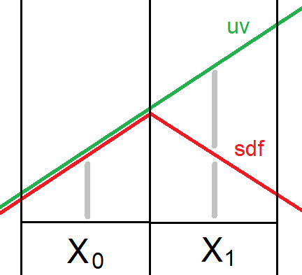

## Деривативы

`dFdxFine` возвращает одинаковое значение для двух пикселей квадрата, то есть на квадрат получается 2 уникальных значения.<br/>
`dFdxCoarse` возвращает одно значение для всего квадрата.

`subgroupQuadBroadcast` возвращает точное значение из каждого потока внутри квадрата.
В фрагментном шейдере `subgroupQuadBroadcast` соответствует реальному квадрату, а в остальных - нет и по координатам из `gl_GlobalInvocationID` "квадрат" оказывается линией.

Эмуляция дериватив через `subgroupQuadBroadcast` для использования в компьют шейдере.
```cpp
#define dFdxFine( x )  (subgroupQuadBroadcast( (x), (gl_SubgroupInvocationID&2)|1 ) - subgroupQuadBroadcast( (x), gl_SubgroupInvocationID&2 ))
#define dFdyFine( x )  (subgroupQuadBroadcast( (x), (gl_SubgroupInvocationID&1)|2 ) - subgroupQuadBroadcast( (x), gl_SubgroupInvocationID&1 ))

#define dFdxCoarse( x )  (subgroupQuadBroadcast( (x), 1 ) - subgroupQuadBroadcast( (x), 0 ))
#define dFdyCoarse( x )  (subgroupQuadBroadcast( (x), 2 ) - subgroupQuadBroadcast( (x), 0 ))
```

Существует расширение `GLSL_NV_compute_shader_derivatives` которое позволяет использовать деривативы в компьют шейдере, а также явно задать расположение пикселей в квадрате.

[Пример](https://github.com/azhirnov/as-en/blob/dev/AE/samples/res_editor/_data/scripts/tests/Derivatives.as).


### SDF и тонкие линии

Для процедурного SDF в 2D деривативы не нужны, если прирост координат идет одинаково по осям и равномерно, например `uv + (1,0)`, `uv + (0,1)`.<br/>
Деривативы нужны:
* для 3D пространства
* для неравномерного 2D
* для SDF текстур.

**Тонкие линии**<br/>

<details><summary>Тонкая линия между пикселями</summary>


</details>

Деривативы нужны чтобы узнать изменение пространства между соседними пикселями. Они не требуются только в 2D пространстве без искажений, тогда деривативы всегда будут возвращать одинаковую разницу.<br/>
На картинке зеленая линия `uv` - координаты в пространстве, они изменяются равномерно, без перегибов. Красная линия `sdf` - дистанция до линии или любой другой формы, заданной SDF функцией, дистанция измеряется в том же пространстве, что и `uv`.
Часто sdf идет с перегибами, здесь пик оказался между пикселями и потерялся, поэтому минимальное значение sdf смещается на расстояние между пикселями `md`.<br/>
В 3D на расстоянии или под большим углом шаг становится слишком большим и теряются детали в sdf, тогда сглаживание перестает работать и приходится делать затухание.<br/>
[Пример](https://github.com/azhirnov/as-en/blob/dev/AE/samples/res_editor/_data/scripts/samples-2d/AA-Grid.as).

**Шрифты**<br/>
SDF шрифты позволяют их увеличивать и уменьшать не теряя сглаживание. Также как с линиями, при уменьшении шаг градиента увеличивается, чтобы заполнить хотя бы 1 пиксель.<br/>
Константное смещение для градиента (`smoothstep`) используется для изменения стиля шрифта (жирный, контурный).<br/>
[Пример](https://github.com/azhirnov/as-en/blob/dev/AE/samples/res_editor/_data/scripts/samples-2d/SdfFont.as).


### Расчет нормалей и TBN

Tangent и Bitangent вектора должны быть направлены в ту же сторону что и текстурные координаты UV.
Зная как меняется `worldPos` и `uv` можно рассчитать нормаль как векторное произведение и касательные (TB) как 3D вектор для `uv`.

```cpp
float3x3  ComputeTBNinFS (float2 uv, float3 worldPos)
{
    float3  wp_dx = dFdx( worldPos );
    float3  wp_dy = dFdy( worldPos );
    float2  uv_dx = dFdx( uv );
    float2  uv_dy = dFdy( uv );

    float3  t = normalize(  wp_dx * uv_dy.t - wp_dy * uv_dx.t );
    float3  b = normalize( -wp_dx * uv_dy.s + wp_dy * uv_dx.s );
    float3  n = normalize( cross( wp_dy, wp_dx ));

    return float3x3( t, b, n );
}
```

* В большинстве случаев нет разницы между dFdxFine и dFdxCoarse.
* Хорошо работает для плоских поверхностей и небольших изгибов.
* Хорошо работает для карты высот, но только когда высоты в формате float32, для float16 точность теряется и результат хуже.
* Можно использовать как альтернативный способ расчета нормалей для проверки корректности трансформаций у предрасчитаных нормалей.
* Сглаженные нормали через сабгруппы?


## Текстуры

### Фильтрация

* Фильтрация R16F текстуры с включенным `mediump float` работает по-разному на NVidia и других ГП. На NV появляются артефакты фильтрации.


## Разное

### Полноэкранный квадрат

Если рисовать через 2 треугольника, то будет задействовано больше потоков, чем при использовании одного треугольника растянутого на [2, 2].

На Adreno выключается TBDR для полноэкранного прохода.

### Multiview vs Viewport array

**Multiview** - позволяет рисовать в массив 2д текстур с разными проекциями на view. Задается через `gl_ViewIndex`.
Используется в VR для рисования в оба глаза за один проход.

**Viewport array** - позволяет рисовать в 2д текстуру с разными проекциями на виюпорт. Задается через `gl_ViewportIndex`.
Требует геометрический шейдер чтобы дублировать геометрию.
Расширение `VK_EXT_shader_viewport_index_layer` позволяет выбирать виюпорт в вершинном шейдере, дублирование геометрии делается через инстансинг.
Используется для ???

**Layered rendering** - позволяет рисовать в массив 2д текстур. Задается через `gl_Layer`.
Расширение `VK_EXT_shader_viewport_index_layer` позволяет выбирать слой в вершинном шейдере, дублирование геометрии делается через инстансинг.
Используется для рисования кубических карт за один проход.


## Растеризация

* Растеризация, тест глубины и выполнение фрагментного шейдера идет блоками по 2х2 пикселя (quads).
* В тайловой архитектуре (TBR) область в 16х16 пикселя привязана к одному SM, в TBDR архитектуре размер тайла начинается с 16х16, в ARM Mali Valhall архитектуре fragment task заполняет область в 32х32 пикселей, в 5thGen увеличили до 64х64. Поэтому на всех архитектурах рендеринг в текстуру должен быть в область кратную 16, чтобы максимально нагрузить ГП.

## Размер воркгруппы

* На старых мобилках максимальный размер 64, поддерживается и 128, но с вдвое меньшим количеством регистров.
* На NV Turing нужно минимум 128 потоков чтобы максимально загрузить SM.


## Ветвление в шейдерах

## Микрооптимизация шейдеров

* Компилятор заменяет повторяющиеся деления на одно переворачивание (1/x) и умножения.
* Реализация `Sign` через `Step`, который возвращает -1 или 1, намного быстрее чем `SignOrZero` (`sign` из GLSL), `copysign` из MSL - быстрый.
* `FMA` на мобильных работает через `fp32 FMA`, а на NV использует `fp16 FMA x2` что в 2 раза быстрее fp32 для half2, half4.
* `[[unroll]]` сильно замедляет компиляцию пайплайна, вплоть до повисания (PowerVR), на производительность влияет слабо.
* На NV mediump может работать медленнее чем highp, на мобильных аналогично fp16.
* Для uint `FindMSB` в 2 раза быстрее `FindLSB`, для int `FindLSB` может быть быстрее.

**SFU** pipe (special function unit) - на нем выполняются более редкие операции типа переворачивания (1/x), sqrt, sin, cos, exp, log, fract, ceil, round, sign и тд.
Чаще всего на 4 потока варпа приходится 1-2 SFU, поэтому все перечисленные операции относительно медленные, но некоторые выполняются за одну инструкцию, а другие эмулируются и занимают еще больше времени.
Обычно заточен только под fp32 тип и не имеет оптимизаций под mediump и fp16.<br/>
В зависимости от производителя стоимость операций может сильно отличаться, иногда Round в 10 раз дольше Fract, а Length в 2 раза быстрее InvSqrt и Sqrt, на одних деление в 2 раза быстрее Sqrt, на других одинаково.
Normalize часто сделан через 1/Length, а Distance через Length(a - b), поэтому работают чуть медленнее чем Length. Где-то Pow сделан через умножение, поэтому время выполнения растет от степени, а где-то Pow работает за константное время.<br/>
В среднем 4x fma: div, InvSqrt, Sqrt, Fract, SignOrZero, Length, SmoothStep.<br/>
В среднем 8x fma: mod, Pow, Exp, Log, Round, Sin, Cos, SinH, CosH.<br/>
От 12x fma: ASin, ACos, Tan, ATan.<br/>

**Операции сравнения** чаще всего выполняются за 1x fma.<br/>
Это equal, lessThan, Min, Max, Clamp(x,0,1), Step.<br/>
Clamp(x,-1,1) работает в 2 раза медленнее, а без констант еще медленнее.

**Конвертация типов**<br/>
BitCast типа uintBitsToFloat работает быстрее всего.<br/>
В среднем 4x fma занимает конвертация между int и float.<br/>

**Integer типы**<br/>
Битовые операции и сложение работает за 1x fma. На некоторых архитектурах может работать параллельно с float, на других - часть float блоков отключается и теряется производительность.<br/>
Около 4x fma: mul, FindMSB(uint), BitCount.<br/>
От 8x fma: FindLSB, FindMSB(int), uaddCarry, usubBorrow.<br/>
От 16x fma: div, mod, umulExtended.<br/>
