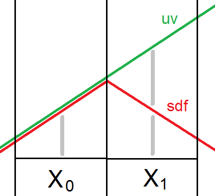

## Деривативы

`dFdxFine` возвращает одинаковое значение для двух пикселей квадрата, то есть на квадрат получается 2 уникальных значения.<br/>
`dFdxCoarse` возвращает одно значение для всего квадрата.

`subgroupQuadBroadcast` возвращает точное значение из каждого потока внутри квадрата.
В фрагментном шейдере `subgroupQuadBroadcast` соответствует реальному квадрату, а в остальных - нет и по координатам из `gl_GlobalInvocationID` "квадрат" оказывается линией.

Эмуляция дериватив через `subgroupQuadBroadcast` для использования в компьют шейдере.
```cpp
#define dFdxFine( x )  (subgroupQuadBroadcast( (x), (gl_SubgroupInvocationID&2)|1 ) - subgroupQuadBroadcast( (x), gl_SubgroupInvocationID&2 ))
#define dFdyFine( x )  (subgroupQuadBroadcast( (x), (gl_SubgroupInvocationID&1)|2 ) - subgroupQuadBroadcast( (x), gl_SubgroupInvocationID&1 ))

#define dFdxCoarse( x )  (subgroupQuadBroadcast( (x), 1 ) - subgroupQuadBroadcast( (x), 0 ))
#define dFdyCoarse( x )  (subgroupQuadBroadcast( (x), 2 ) - subgroupQuadBroadcast( (x), 0 ))
```

Существует расширение `GLSL_NV_compute_shader_derivatives` которое позволяет использовать деривативы в компьют шейдере, а также явно задать расположение пикселей в квадрате.

[Пример](https://github.com/azhirnov/as-en/blob/dev/AE/samples/res_editor/_data/scripts/tests/Derivatives.as).


### SDF и тонкие линии

Для процедурного SDF в 2D деривативы не нужны, если прирост координат идет одинаково по осям и равномерно, например `uv + (1,0)`, `uv + (0,1)`.<br/>
Деривативы нужны:
* для 3D пространства
* для неравномерного 2D
* для SDF текстур.

**Тонкие линии**<br/>

<details><summary>Тонкая линия между пикселями</summary>


</details>

Деривативы нужны чтобы узнать изменение пространства между соседними пикселями. Они не требуются только в 2D пространстве без искажений, тогда деривативы всегда будут возвращать одинаковую разницу.<br/>
На картинке зеленая линия `uv` - координаты в пространстве, они изменяются равномерно, без перегибов. Красная линия `sdf` - дистанция до линии или любой другой формы, заданной SDF функцией, дистанция измеряется в том же пространстве, что и `uv`.
Часто sdf идет с перегибами, здесь пик оказался между пикселями и потерялся, поэтому минимальное значение sdf смещается на расстояние между пикселями `md`.<br/>
В 3D на расстоянии или под большим углом шаг становится слишком большим и теряются детали в sdf, тогда сглаживание перестает работать и приходится делать затухание.<br/>
[Пример](https://github.com/azhirnov/as-en/blob/dev/AE/samples/res_editor/_data/scripts/samples-2d/AA-Grid.as).

**Шрифты**<br/>
SDF шрифты позволяют их увеличивать и уменьшать не теряя сглаживание. Также как с линиями, при уменьшении шаг градиента увеличивается, чтобы заполнить хотя бы 1 пиксель.<br/>
Константное смещение для градиента (`smoothstep`) используется для изменения стиля шрифта (жирный, контурный).<br/>
[Пример в 2D](https://github.com/azhirnov/as-en/blob/dev/AE/samples/res_editor/_data/scripts/samples-2d/SdfFont.as) и [пример в 3D](https://github.com/azhirnov/as-en/blob/dev/AE/samples/res_editor/_data/scripts/samples-3d/SdfFont.as).

Для тестирования сглаживания лучше всего включить анимацию, так при перемещении линии или глифа между пикселями не должно быть мелькания или изменения яркости.


### Расчет нормалей и TBN

Tangent и Bitangent вектора должны быть направлены в ту же сторону что и текстурные координаты UV.
Зная как меняется `worldPos` и `uv` можно рассчитать нормаль как векторное произведение и касательные (TB) как 3D вектор для `uv`.

```cpp
float3x3  ComputeTBNinFS (float2 uv, float3 worldPos)
{
    float3  wp_dx = dFdx( worldPos );
    float3  wp_dy = dFdy( worldPos );
    float2  uv_dx = dFdx( uv );
    float2  uv_dy = dFdy( uv );

    float3  t = normalize(  wp_dx * uv_dy.t - wp_dy * uv_dx.t );
    float3  b = normalize( -wp_dx * uv_dy.s + wp_dy * uv_dx.s );
    float3  n = normalize( cross( wp_dy, wp_dx ));

    return float3x3( t, b, n );
}
```

* В большинстве случаев нет разницы между dFdxFine и dFdxCoarse.
* Хорошо работает для плоских поверхностей и небольших изгибов.
* Хорошо работает для карты высот, но только когда высоты в формате float32, для float16 точность теряется и результат хуже.
* Можно использовать как альтернативный способ расчета нормалей для проверки корректности трансформаций у предрасчитаных нормалей.

[Пример](https://github.com/azhirnov/as-en/blob/dev/AE/samples/res_editor/_data/scripts/samples-3d/Parallax-Cube.as).


## Текстуры

### Фильтрация

* Фильтрация R16F текстуры с включенным `mediump float` работает по-разному на NVidia и других ГП. На NV появляются артефакты фильтрации.
* На мобилках требуется `highp sampler2D` для 16-битных форматов иначе теряется точность даже без фильтрации (texelFetch).

* Фильтрация текстур происходит с 8-битной точностью. [[ссылка](https://iquilezles.org/articles/hwinterpolation/)]
	- Актуально для всех форматов.
	- Проявляется при расчете попиксельных нормалей для карты высот через деривативы.

* Исправить проблему с 8-битной фильтрацией можно через `textureGather()`, но есть разница между `fract()` в шейдере и определением текселя. [[ссылка](https://www.reedbeta.com/blog/texture-gathers-and-coordinate-precision/)]
	- Решается добавлением смещения `fract(... + 1/512)` для 8-битной субпиксельной точности.
	- На разном железе субпиксельное смещение может отличаться. [[ссылка](https://vulkan.gpuinfo.org/displaydevicelimit.php?name=subTexelPrecisionBits)]
	- MoltenVk всегда возвращает точность в 4 бита, как минимум по спецификации, хотя реальная точность может быть больше.

* Min/max фильтр может работать только для 2-3 текселей из блока 2х2. Если при интерполяции у текселей вес 0, то они не учитываются для min/max фильтра.<br/>
  Из-за этой особенности фильтрация текстур не степени 2 приводит к потере данных.<br/>
  Проявляется в [DepthPyramidCulling](https://github.com/azhirnov/as-en/blob/dev/AE/samples/res_editor/_data/scripts/tests/DepthPyramidCulling.as), [GenMipmaps](https://github.com/azhirnov/as-en/blob/dev/AE/samples/res_editor/_data/scripts/tests/GenMipmaps.as).


## Эффекты

### Bloom

Эффект рассеивания света на линзе. Чем больше яркость, тем больше рассеивается. Результат прибавляется к цвету сцены.

### SSR

Трассировка отражений в экранном пространстве.<br/>
Недостатки:
* При использовании тумана, частиц и тд они попадают в отражения, что некорректно.
* Спекулярные освещение отражается некорректно, так как зависит от направления луча.
* Плохо подходит для TBDR архитектур.
* Трассировка может прерываться, что дает зашумление. Это создает ложное движение и привлекает внимание.

Альтернатива - кубические карты и репроекция.


## Multiview vs Viewport array

**Multiview** - позволяет рисовать в массив 2D текстур с разными проекциями на view. В вершинном шейдере можно выбрать трансформацию по `gl_ViewIndex`, задать view нельзя, вершины дублируются во все view.
Вершинный шейдер (а также TES, GS) вызывается один раз, а растеризуется в разные view с разной проекцией, для этого в NV сначала выполняется общая часть VS, а затем для каждого вию выполняется код, зависящий от `gl_ViewIndex`.
На TBDR архитектуре multiview позволяет один раз выбрать тайл в который будет рисоваться треугольник. Также улучшаяется использование текстурного кэша, когда известно, что одна и та же геометрия рисуется в разные области, так тайлы в разные view могут идти последовательно.
Чем больше общей геометрии в каждом view, тем лучше производительность. Для рисования разной геометрии в разные view стоит использовать другой способ.
NV Turing поддерживает 4 view в железе, и 32 через API, .<br/>
[Используется в VR для рисования в оба глаза за один проход](https://developer.nvidia.com/blog/turing-multi-view-rendering-vrworks/). Используется для cascaded shadow map.
[Multiview в ARM Mali](https://community.arm.com/arm-community-blogs/b/mobile-graphics-and-gaming-blog/posts/optimizing-virtual-reality-understanding-multiview).

**Layered rendering** - позволяет рисовать в массив 2D текстур. Задается через `gl_Layer` в геометричеком шейдере.
Расширение `VK_EXT_shader_viewport_index_layer` позволяет выбирать слой в вершинном шейдере, дублирование геометрии делается через инстансинг.
Viewport и scissor задаются сразу для всех слоев.<br/>
Используется для рисования кубических карт за один рендер пасс.

**Viewport array** - позволяет рисовать в 2D текстуру с разными проекциями на виюпорт. Задается через `gl_ViewportIndex` в геометричеком шейдере.
Расширение `VK_EXT_shader_viewport_index_layer` позволяет выбирать виюпорт в вершинном шейдере, дублирование геометрии делается через инстансинг.<br/>
Используется как layered rendering, только позволяет задавать размер области и не требует массив 2D текстур. Позволяет задавать отдельный scissor для каждого виюпорта.
До появления VRS использовалось для [multi-res shading](https://developer.nvidia.com/vrworks/graphics/multiresshading) - экран делится на 9 частей, края рендерятся в меньшем разрешении.
Может использоваться как Layered rendering, но с фильтрацией на границе слоев, так как это одна 2D текстура.


## Разное

### Полноэкранный квадрат

Если рисовать через 2 треугольника, то будет задействовано больше потоков, чем при использовании одного треугольника растянутого на [2, 2].

На Adreno выключается TBDR для полноэкранного прохода.

### Растеризация

* Растеризация, тест глубины и выполнение фрагментного шейдера идет блоками по 2х2 пикселя (quads).
* В тайловой архитектуре (TBR) область в 16х16 пикселя привязана к одному SM, в TBDR архитектуре размер тайла начинается с 16х16, в ARM Mali Valhall архитектуре fragment task заполняет область в 32х32 пикселей, в 5thGen увеличили до 64х64. Поэтому на всех архитектурах рендеринг в текстуру должен быть в область кратную 16, чтобы максимально нагрузить ГП.<br/>
Размер тайла может быть меньше, при большом G-буфере или использовании большого количества регистров.

### Размер воркгруппы

* На старых мобилках максимальный размер 64 (8х8), поддерживается и 128, но с вдвое меньшим количеством регистров.
* На NV Turing нужно минимум 128 (32х4) потоков чтобы максимально загрузить SM. Но SM может выполнять несколько воркгрупп, по тестам минимальный размер воркгруппы 32х2, меньше уже теряется производительность.

### Общая память воркгруппы

* На дискретных картах общая память использует часть L1 кэша и работает быстро.
* На мобильных ГП это либо выделенная память рядом с L2 как на Adreno, либо часть L2, которая может вытесняться в глобальную память, как на Mali. Скорость доступа получается меньше чем L1.

### Блендинг

* float32 форматы в несколько раз медленее (до 7х на NV).
* Использование dst в формуле блендинга в несколько раз медленее на некоторых ГП, так как требует чтение из фреймбуфера.
* Старые мобилки оптимизированны только под популярные формулы смешивания, остальные будут в разы медленее.


## Микрооптимизация шейдеров

* Компилятор заменяет повторяющиеся деления на одно переворачивание (1/x) и умножения.
* Реализация `FastSign` через `Step`, который возвращает -1 или 1, намного быстрее чем `SignOrZero` (`sign` из GLSL), а `copysign` из MSL - быстрее `Step`.
* `FMA` на мобильных работает через `fp32 FMA`, а на NV и Intel использует `fp16 FMA x2` что в 2 раза быстрее fp32 для half2, half4.
* `[[unroll]]` сильно замедляет компиляцию пайплайна, в редких случаях дает 2х ускорение, но часто слабо влияет.
* На NV mediump может работать медленнее чем highp, на мобильных аналогично fp16.
* Для uint `FindMSB` в 2 раза быстрее `FindLSB`, для int `FindLSB` может быть быстрее.
* На NV/Intel FP32ADD выполняется в 2 раза быстрее чем FP32FMA, FP32MUL и соответствует максимальной производительности по спецификации.
* На мобилках FP32ADD, FP32MUL, FP32FMA выполняется за один цикл.
* В спецификациях GPU считают FMA за 2 инструкции и указывают в 2 раза большую производительность в FLOPS, чем количество потоков умноженное на частоту.
* У AMD есть dual-issue, у Adreno - wave128 режимы, которые дают в 2 раза большую производительность, но требуют особых условий.
* nan, inf, denorm по тестам не влияют на производительность.

**SFU** pipe (special function unit) - на нем выполняются более редкие операции типа переворачивания (1/x), sqrt, sin, cos, exp, log, fract, ceil, round, sign и тд.
Чаще всего на 4 потока варпа приходится 1-2 SFU, поэтому все перечисленные операции относительно медленные, но некоторые выполняются за одну инструкцию, а другие эмулируются и занимают еще больше времени.<br/>
Обычно SFU заточен только под fp32 тип и не имеет оптимизаций под mediump и fp16, но на Adreno fp16 показывает большую производительность.<br/>
В зависимости от производителя стоимость операций может сильно отличаться, иногда Round в 10 раз дольше Fract, на одних деление в 2 раза быстрее Sqrt, на других одинаково.
Length сделан через InvSqrt, Normalize сделан через 1/Length, а Distance через Length(a - b), поэтому работают чуть медленнее чем Length.
Где-то Pow сделан через умножение, поэтому время выполнения растет от степени, а где-то Pow работает за константное время.<br/>
На более свежих архитектурах SFU инструкции могут выполняться параллельно с FMA.<br/>
В среднем 4 цикла: div, InvSqrt, Sqrt, Fract, SignOrZero, Length, SmoothStep.<br/>
В среднем 8 циклов: mod, Pow, Exp, Log, Round, Sin, Cos, SinH, CosH.<br/>
От 12 циклов: ASin, ACos, Tan, ATan.<br/>

**Операции сравнения** чаще всего выполняются за 1 цикл.<br/>
Это equal, lessThan, Min, Max, Step.

**Приведение к диапазону** (clamp) выполняются за 1-4 цикла.<br/>
Отдельный случай: `clamp(x,0,1)` может быть одной инструкцией типа `add_sat`.<br/>
У некоторых производителей `clamp(x,-1,1)` работает как и `clamp(x,0,1)` за один цикл.<br/>
Clamp без констант работает за 3-4 цикла.


**Конвертация типов**<br/>
Битовый каст типа `uintBitsToFloat работает` быстрее всего.<br/>
В среднем 4 цикла занимает конвертация между int и float.<br/>

**Integer типы**<br/>
Битовые операции и сложение работает за 1 цикл. На мобильных архитектурах может быть медленее и доходить до 2-4 циклов. На некоторых архитектурах может работать параллельно с float, на других - часть float блоков отключается и теряется производительность.<br/>
Около 4 циклов: mul, FindMSB(uint), BitCount.<br/>
От 8 циклов: FindLSB, FindMSB(int), uaddCarry, usubBorrow.<br/>
От 16 циклов: div, mod, umulExtended.<br/>

Подробные результаты микробенчмарков: [GPU_Benchmarks](GPU_Benchmarks.md)


### Ветвление в шейдерах

Сильно зависит от однородности потока выполнения внутри варпа (uniform control flow).<br/>
Если все потоки идут по одинаковому пути, то ветвление быстрее умножения, если по разным, то умножение будет быстрее на некоторых GPU.<br/>
Тут [тест производительности](https://github.com/azhirnov/as-en/blob/dev/AE/samples/res_editor/_data/scripts/perf/Branching-1.as).

Можно сделать два варианта кода - один для однородного потока выполнения, другой для неоднородного.
С помощью функций `subgroupAll` или `subgroupAllEqual` узнаем, что все потоки варпа имеют одинаковые данные и пойдут по одному пути, тогда выбираем вариант с ветвлением, иначе - умножение.

У ветвления есть недостаток - увеличение нагрузки на регистры, так как при старте варпа аллоцируются регистры под наихудший случай.
Чем больше регистров, тем меньше варпов может обрабатывать CU/SM, а значит будет уменьшаться размер тайла (для TBR и TBDR архитектур) для графики.
Поэтому ветвление будет бесплатным, если поток выполнения однородный и количество регистров в каждой ветке примерно одинаково, иначе лучше разбить на 2 шейдера.

В RDNA4 архитектуре сделали динамическую аллокацию регистров, что устраняет эту проблему, но дает другую - небольшой шанс, что нехватит регистров под все необходимые аллокации.


## Профилирование на мобилках

Чаще всего доступны счетчики производительности, часть из них в количестве (циклы, байты, транзакции и тд), часть в процентах. Для количественных значений нужно запускать микробенчмарки чтобы найти максимальное значение за кадр или за секунду, например GB/s для памяти. Значения из спецификаций не всегда совпадают с измеряемыми, и сами спецификации на смартфоны содержат ошибки.
Например кроме скорости самой памяти есть еще пропускная способность шины (AXI bus) по которой соеднены ГП с памятью.

Главный показатель это частота ГП. Если на ГП нет нагрузки, то для экономии энергии частота понижается. Многие счетчики в процентах могут при этом показывать до 100% нагрузки, но пока частота низкая это не имеет особого значения.
Когда нет доступа к счетчикам, проверить достиг ли ГП максимальной частоты можно двумя способами:
* Увеличить нагрузку в 2 раза, тогда время работы должно увеличиться в те же 2 раза. Если это не так, значит производительность упирается во что-то другое.
* Посмотреть историю времени выполнения каждого кадра. Если частота ГП плавает, то время будет нестабильным. Нужно повышать нагрузку пока время кадров не станет одинаковым.

Второй показатель это нагрузка на внешнюю память (RAM, external memory). Если нагрузка приближается к максимальной, значит кэши не используются.
Чем больше используются кэши, тем больше памяти обрабатывает ГП.

В идеале нагрузка на кэши должна соответствовать их близости к процессору, то есть например L1 на 100%, L2 - 70%, L3 - 50%, VRAM - 25%.
На мобилках доступ к RAM стоит дорого, это и время доступа и большое выделение тепла.

Следом идет L2 кэш.<br/>
На Mali кэш L2 используется также для хранения тайла и общей памяти компьют шейдера, поэтоу чем больше G-буфер или размер общей памяти, тем больше шансов, что данные вытеснятся из кэша и скорость доступа к ним сильно замедлится.


## Энергосбережение и профилирование

Большинство современных GPU меняют свои частоты в зависимости от нагрузки чтобы снизить энергопотребление.
При включенном vsync (на некоторых платформах его нельзя выключить), время кадра будет непостоянным пока не упирается в vsync.
Для правильного измерения производительности нужно включить фиксированные частоты GPU, если такого функционала нет, то увеличить разрешение или повторить проход много раз, пока не появится линейная зависимость между увеличением нагрузки и временем выполнения.

