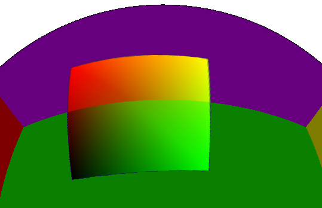
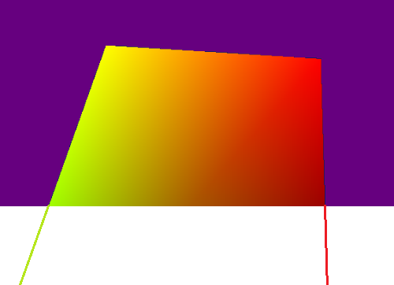
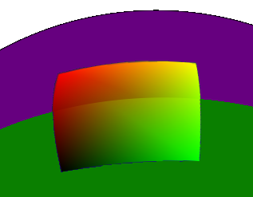

**Сферический куб**

## Где используется

* Рисование планет.
* Вывод кубических текстур (skybox) и видео 360/VR.

## Виды проекций

В статье [Cube-to-sphere Projections for Procedural Texturing and Beyond](https://www.jcgt.org/published/0007/02/01/paper.pdf) исследованы различные виды проекций:

На картинке цветом обозначена площадь треугольника, одинаковый цвет характеризует равномерную площадь треугольников на сфере. 
[Код](https://github.com/azhirnov/as-en/blob/dev/AE/samples/res_editor/_data/scripts/sphere/SphericalCube-1.as).

## Производительность и точность

Наилучшая точность у методов: Tangential, Everitt, Arvo. 
В тесте берется развертка сферы и применяются обратная и прямая проекции, сравниваются вектора и выводится погрешность. 
[Код](https://github.com/azhirnov/as-en/blob/dev/AE/samples/res_editor/_data/scripts/tests/CubeMapTest-1.as)

Наилучшая производительность у Everitt, там используется один Sqrt, что быстро работает на ГП.
Затем идет 5thPoly, где используется только FMA. 
На 30% медленее работает Tangential и Arvo, оба используют ATan и другую тригонометрию, что очень медленно на ГП. 
Чуть медленее работает COBE, но метод не зависит от тригонометрии, значит может быть быстрее на некоторых ГП.

В итоге лучше по точности и производительности оказался метод Everitt.

## Проекция текстуры

Правильное сочетание: Tangential проекция для вершин и Identity проекция для текстурных координат. Тогда вершины распределяются равномерно по сфере, а текстура накладывается с наименьшими искажениями и, следовательно, с наилучшей детализацией.

[Код](https://github.com/azhirnov/as-en/blob/dev/AE/samples/res_editor/_data/scripts/sphere/SphericalCube-2.as).

## Топология

Обычная сетка после проецирования дает сильно искаженные треугольники, поэтому сетка должна быть симметричной относительно центра грани. 
На картинке видна неправильная стыковка треугольников на стыке граней куба, что ведет к увеличению площади некоторых треугольников. Вытянутые тругольники увеличивают количество потоков фрагментного шейдера (quad overdraw).

## Проекция из 3D

### Искажения

Пример проекции круга на сферический куб, ближе к грани куба начинаются небольшие искажения, для круга это не критично. 
Проекция квадрата на сферический куб не имеет искажений только в центре грани, а на краях начинаются искажения, но радиус вписанной окружности не меняется. Ниже будет способ для коррекции искажений. 
[Код](https://github.com/azhirnov/as-en/blob/dev/AE/samples/res_editor/_data/scripts/sphere/SphericalCube-3.as)

### Погрешность интерполяции

Тест показывает погрешность, когда проекция применяется для вершин, а между ними происходит линейная интерполяция. За счет расхождения между проекцией и интерполяцией появляется ошибка. На картинке размер ошибки показан белым цветом, красный - когда ошибка более 1 после масштабирования.

Улучшить точность можно повторив линейную интерполяцию между контрольными точками. На картинке это вариант справа.

Код: 
[коррекция в вычислительном шейдере](https://github.com/azhirnov/as-en/blob/dev/AE/samples/res_editor/_data/scripts/sphere/SphericalCube-4.as). 
[коррекция во фрагментном шейдере](https://github.com/azhirnov/as-en/blob/dev/AE/samples/res_editor/_data/scripts/sphere/SphericalCube-5.as).

## Проекция из 2D

Существует 2 варианта записи данных в кубическую карту:
1. Использовать UV координаты для каждой из граней и отдельно обрабатывать грани куба.
2. Сделать рендеринг в текстуру, где проецируется геометрия с текстурой или с UV для процедурной генерации в фрагментном шейдере.

### Рендеринг в текстуру

Проекция квадрата на границу между гранями кубической карты дает некорректные UV.

В текстуру квадрат рисуется с искажениями, чтобы после проекции в 3D сохранить пропорции, но из-за этого интерполяция UV работает некорректно - вершины за пределами области рисования еще сильнее расходятся друг от друга. 
Так выглядит одна грань кубической карты.

Тангенциальная проекция значительно улучшает интерполяцию UV, но граница все еще заметна.

Проблема решается несколькими способами:
* На границе между гранями поставить дополнительные точки.
* Рассчитать UV во фрагментном шейдере через tangent, bitangent вектора и 3D координаты центра.

[Код](https://github.com/azhirnov/as-en/blob/dev/AE/samples/res_editor/_data/scripts/sphere/UVSphere-2.as)

## Сфера без геометрии

Когда стоит использовать геометрию:
* При высокой детализации и с картой смещений (displacement map).
* Рядом расположена другая геометрия. Например постройки на планете.
* При значительных деформациях геометрии. Например столкновение сфер.

В остальных случаях оптимальнее использовать процедурную сферу без геометрии.
Из геометрии только квадрат или шестиугольник, во фрагментном шейдере по UV расчитывается нормаль сферы в заданной точке. С дополнительными расчетами можно получить и глубину и записать в `gl_FragDepth`.
Далее идет попиксельная проекция (коррекция) текстурных координат.
Для перспективной проекции нормаль сферы нужно спроецировать, ведь в зависимости от расстояния между камерой и сферой видны разные части сферы.

Преимущества:
* Экономия памяти на геометрии.
* Геометрия при низкой детализации дает заметные углы по краям, а процедурная сфера всегда идеально круглая и со сглаживанием по краям.
* Геометрия при высокой детализации использует намного больше потоков фрагментного шейдера, так как на ребрах треугольников вызываются вспомогательные потоки (quad overdraw). А процедурная сфера с геометрией в виде шестиугольника расходует намного меньше потоков.
* За счет этого производительность в 2 раза выше даже на мобилках.

[Код](https://github.com/azhirnov/as-en/blob/dev/AE/samples/res_editor/_data/scripts/sphere/UVSphere-1.as)

## Процедурная генерация планет

Поверхность планеты формируется за счет:
* Падений метеоритов оставляет кратеры.
* Вулканическая активность дает одиночные вулканы, цепочки вулканов (горные хребты), вулканические кратеры, лавовые пещеры с провалами.
* Подвижность плит создает провалы и горные хребты.
* Водная эрозия разрушает горы, протачивает каньены, создает камни и песок.

### Кратеры

В примере [Space egg](https://www.shadertoy.com/view/Mtj3DV) используются диаграммы Воронного для кубической карты, это дает 9 вычислений расстояния и рассчет коррекции, это не много, но есть куда оптимизировать.

**1й вариант** 
Раскидать точки на сфере и используя рендер в текстуру отрисовать квадраты, чтобы заполнить только выбранные области. Для сложения кратеров используется блендинг. 
Минус этого подхода - проблема с проекцией геометрии на кубическую карту.

[Пример](https://github.com/azhirnov/as-en/blob/dev/AE/samples/res_editor/_data/scripts/sphere/UVSphere-2.as)

**2й вариант** 
Можно модифицировать [один из примеров](https://github.com/azhirnov/as-en/blob/dev/AE/samples/res_editor/_data/scripts/sphere/UVSphere-1.as), диаграмма Воронного не требуется, нужно случайно распределить круги без наложения в пределах одного слоя. Слоев будет несколько, они имитируют падение метеоритов в старый кратер. 
Алгоритм получается простой - в компьют шейдере:
1. Точка в 2D проецируется в 3D нормаль и вращается.
2. Нормаль проецируется обратно в 2D и ищется центр ближайшей ячейки на сетке.
3. Центр ячейки проецируется в 3D и рассчитывается расстояние до нормали.
4. Для центра ячейки рассчитываются касательные (tangent, bitangent), по ним считается uv для текстуры кратера.
5. UV координаты корректируются на основе расстояние между центром ячейки и точки в 3D. Пример коррекции на картинке. 
	

[Код](https://github.com/azhirnov/as-en/blob/dev/AE/samples/res_editor/_data/scripts/sphere/UVSphere-3.as)
