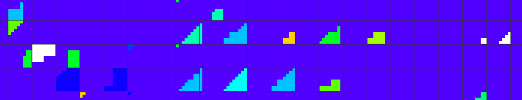

# AMD Radeon 780M (RDNA3)

## Specs

* CU: 12
* Warp width (SIMD): 32 (2x per CU)
* Clock base: 800 MHz, boost: 2700 MHz.
* APU: Ryzen 7 8745HS
* Driver:

### Memory

* Memory: 16GB DDR5 5600 DC, 69GB/s
* L0: 64KB per WGP


### Float point performance

* Total ALUs: 768  - number of simultaneously executing threads
* FP16: **16.6** TFLOPS (5 from tests)
* FP32: **8.3** TFLOPS  (3.6 from tests)
* FP64: **518** GFLOPS

Theoretical performance:
```
FLOPS = clock * TotalALUs * 2 (dual issue)
FLOPS = clock * CU * warp_width * 2 (dual issue)

2700M * 768 = 2.07T FMA ops = 4.15 TFLOPS (without dual issue), 8.3 TFLOPS (dual issue)
```

## Shader

### Instruction cost

* FP32 instruction performance: [[2](../GPU_Benchmarks.md#2-fp32-instruction-performance)]
	- RADV driver:
		* Benchmarking in fragment shader is faster (43ms vs 47ms, wave64 ?).
		* subgroupSize=64 in compute shader has no effect on performance.
		* Clock: 2.3-2.4 GHz (1.8TOps)

		| TOp/s | ops | max TFLOPS |
		|---|---|---|
		| 2.9  | Add    | 2.9 |
		| 2.9  | Mul    | 2.9 |
		| 1.7  | FMA    | 3.4 |
		| 1.8  | MulAdd | **3.6** |

	- AMDVLK driver:
		* Clock: 2.2 GHz

		| TOp/s | ops | max TFLOPS |
		|---|---|---|
		| 2.45 | Add, Mul | 2.45 |
		| 1.71 | MulAdd   | **3.42** |
		| 1.67 | FMA      | 3.34 |

	- AMDPRO driver:
		* Clock: 2.2 GHz

		| TOp/s | ops | max TFLOPS |
		|---|---|---|
		| 2.44 | Add, Mul | 2.44 |
		| 1.71 | MulAdd   | **3.42** |
		| 1.69 | FMA      | 3.38 |

* FP16 instruction performance:
	- RADV driver:
		* Clock: 2.3-2.4 GHz

		| TOp/s | ops | max TFLOPS |
		|---|---|---|
		| 3.9 | Add, Mul    | 3.9   |
		| 2.5 | FMA, MulAdd | **5** |


### Wavefront scheduler

In test [[17](../GPU_Benchmarks.md#17-tile-size)]:
* grid size: 8x8 pix.
* blue color - max occupancy (full subgroups)
* red color - low occupancy
* white color - selected subgroup, max measured distance between quads: 142 pix.

Results:
* GPU can merge multiple triangles into single subgroup.
* GPU can merge instances into single VS subgroup.
* GPU can merge instances into single FS subgroup, but in very rare cases when occupancy is low.
* subgroup scheduling is not limited by tile size (like on NV and mobile).

Possible implementation in HW:
* After rasterization triangles divided on subgroups. Algorithm prefer to create full subgroups.
* If subgroup in not full it delayed.
* New rasterized triangles doesn't fill delayed subgroups until they can be divided on full subgroups.
* Non-full subgroups merged and added to subgroup scheduler.



Merged instances. Dark blue - single instance; light blue - single instance in FS, multiple in VS; orange - multiple instances in FS and VS.


### Ray tracing

* Ray query performance: [[15](../GPU_Benchmarks.md#15-ray-tracing-performance)]
	- 3.8 GigaRays/s

### Tensor

* Cooperative matrix: [[16](../GPU_Benchmarks.md#16-tensor-performance)]
	- fp16: 144 TOPS (optimized to no-op)
	- i8: 155 TOPS (optimized to no-op)
