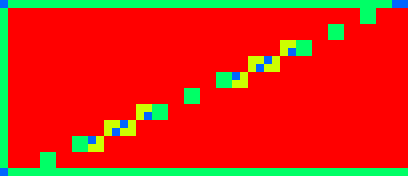
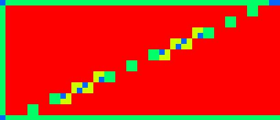
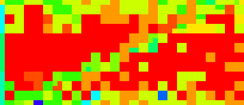
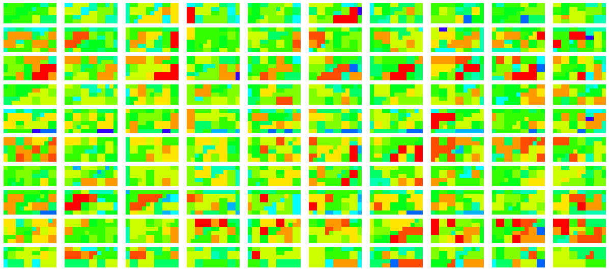
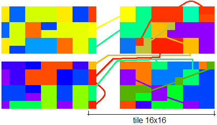
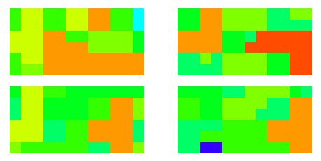
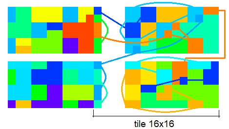
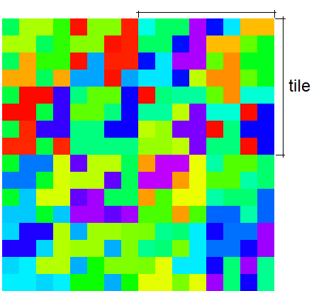

# ARM Mali G57 MC2 (Valhall gen1)

## Specs

* Cores: 2   *(from name MC2)*
* ALU (SIMD/warps): 2  *(from specs)*
* Warp width: 16
* Clock: 950 MHz
* Max work registers (32b): 64
* Device: Realme 8I (Android 13, Driver 32.1.0)

### Memory

* Memory: 4GB, LPDDR4X, DC 16bit, 2133 MHz, **17.07** GB/s (14.2 GB/s from tests)
* L2 cache: 512 Kb (31.2GB/s from tests)
* LS cache: 16 Kb
* Texture cache: 32 Kb
* Tile bits/pixel: 256 *(32 bytes/pixel, 2xRGBA32)*

### Float point performance

* Total ALUs: 64  - number of simultaneously executing threads
* FP16 GFLOPS: **242** (242 GFLOPS on MulAdd from tests)
* FP32 GFLOPS: **121** (121 GFLOPS on FMA from tests)

Theoretical performance:
```
FLOPS = clock * warp_width * ALUs * Cores
Total ALUs = warp_width * ALUs * Cores

950M * 16 * 2 * 2 = 60.8G FMA ops per second = 121.6 GFLOPS
```

## Shader

### Quads

* Quads on edge between 2 triangles are not merged, so 2 near pixels may execute up to 6 helper invocations.

* Test `subgroupQuadBroadcast( gl_HelperInvocation )` without texturing - helper invocations are **not** executed. [[6](../GPU_Benchmarks.md#6-Subgroups)]

* Test `subgroupQuadBroadcast( constant )` without texturing - helper invocations are **not** executed. [[6](../GPU_Benchmarks.md#6-Subgroups)]<br/>
Red - full quad, blue - only 1 thread per quad.<br/>


* Tests `subgroupQuadBroadcast( gl_HelperInvocation )` and `subgroupQuadBroadcast( constant )` with texturing: [[6](../GPU_Benchmarks.md#6-Subgroups)]
	- `textureGrad()`, `texelFetch()` - helper invocations are **not** executed.
	- `textureLod()` - helper invocations are **not** executed.
	- `texture()` - helper invocations are executed, even if `Nearest` immutable sampler is used.
	- helper invocations are executed if used any derivative.<br/>
	Red - no helper invocations, blue - 3 helper invocations per quad.<br/>
	


### Subgroups

* Helper invocation can be early terminated, but threads are allocated and number of warps with helper invocations and without are same (from performance counters). [[6](../GPU_Benchmarks.md#6-Subgroups)]

* Subgroup occupancy for single triangle with texturing. Helper invocations are executed and included as active thread. Red color - full subgroup. [[6](../GPU_Benchmarks.md#6-Subgroups)]<br/>


* Subgroup occupancy for single triangle without texturing. Helper invocations are not executed but threads are reserved, so occupancy is low. Red color - full subgroup. [[6](../GPU_Benchmarks.md#6-Subgroups)]<br/>


* Subgroup occupancy for too small triangles. Red color - full subgroup. [[6](../GPU_Benchmarks.md#6-Subgroups)]<br/>


* Result of `Rainbow( Hash( subgroupAdd( gl_FragCoord.xy )))` for 4 quads without instancing. [[6](../GPU_Benchmarks.md#6-Subgroups)]<br/>
<br/>
Subgroup occupancy, red - full subgroup (16 threads), green: ~8 threads per subgroup.<br/>


* Result of `Rainbow( Hash( subgroupAdd( gl_FragCoord.xy )))` for 4 quads with instancing, first instance - first triangle in quad, second instance - second triangle. [[6](../GPU_Benchmarks.md#6-Subgroups)]<br/>
Triangles with different `gl_InstanceIndex` can be merged into a single subgroup but this is a rare case.<br/>



### Subgroup threads order

Result of `Rainbow( gl_SubgroupInvocationID / gl_SubgroupSize )` in fragment shader, gl_SubgroupSize: 16, image size: 16x16. [[6](../GPU_Benchmarks.md#6-Subgroups)]


Unique subgroups, image size: 32x32, gl_SubgroupSize: 16. Each subgroup in tile scheduled by quads (2x2 pixels), each quad may have any position inside 32x32 pixel tile, but often they are placed inside 8x8 region. [[6](../GPU_Benchmarks.md#6-Subgroups)]



Result of `Rainbow( gl_SubgroupInvocationID / gl_SubgroupSize )` in compute shader, gl_SubgroupSize: 16, workgroup size: 8x8. [[6](../GPU_Benchmarks.md#6-Subgroups)]


### Instruction cost

* Shader instruction benchmark results: [[4](../GPU_Benchmarks.md#4-Shader-instruction-benchmark)]
	- Fp32 and i32 datapaths can execute in parallel in 2:1 rate
	- Fp16 and i16 datapaths can execute in parallel in 2:1 rate
	- fp16x2 FMA is used, scalar FMA doesn't have x2 performance

	- base rate: 60 GOp/s

	- **float point**

	| op \ type | fp16 | fp32 |
	|---|---|---|
	| Add           | 0.5 | 1   |
	| Mul           | 0.5 | 1   |
	| FMA           | 1   | 1   |
	| MulAdd        | 0.5 | 1   |
	| Lerp          | 0.5 | 1   |
	| Length        | 1.5 | 1.5 |
	| Normalize     | 1.5 | 1.5 |
	| Distance      | 2   | 2.5 |
	| Dot           | 1.5 | 2.5 |
	| Cross         | 1.5 | 2   |
	| Min/Max       | 0.5 | 1   |
	| Clamp(x,0,1)  | 0.5 | 1   |
	| Clamp(x,-1,1) | 0.5 | 1   |
	| Clamp         | 0.7 | 1.5 |
	| Step          | 0.5 | 1   |
	| SmoothStep    | 1   | 2   |
	| Abs           | 0.5 | 1   |
	| SignOrZero    | 0.7 | 1   |
	| BitCast       | 1.5 | 3   |
	| FloatToInt    | 0.5 | 1   |
	| IntToFloat    | 0.5 | 1   |
	| Ceil, Floor, Trunc, Round, RoundEven | 0.5 | 1 |
	| Fract         | 0.7 | 1.5 |
	| Exp, Exp2     | 4   | 3   |
	| Log, Log2     | 4-5 | 4-5 |
	| InvSqrt       | 4   | 3   |
	| Sqrt          | 4   | 3.5 |
	| Sin, Cos      | 10  | 10  |
	| Div           | 4   | 3   |
	| Mod           | 4   | 4   |
	| Pow           | 1-2 | 2-4 |
	| Tan           | 14  | 14  |
	| ASin, ACos    | 26  | 26  |
	| ATan          | 20  | 20  |

	- **float point fast math**

	| op \ type | fp16 | fp32 |
	|---|---|---|---|
	| fast Sign     | 1.5 | 2.5 |
	| Cbrt (pow)    | 8   | 8   |
	| Cbrt (exp)    | 9   | 9   |
	| sRGB          | 10  | 12  |
	| fast sRGB     | 6   | 9.5 |
	| fast Cos      |
	| fast Sin      |
	| fast Tan      |
	| fast ASin     | 7   | 11  |
	| fast ACos     | 6   | 11  |
	| fast ATan     | 10  | 20  |
	| fast ASin v2  |
	| fast ACos v2  |
	| fast ATan v2  |

	- **integer**

	| op \ type | i32 | u32 | i16 | u16 | u8 |
	|---|---|---|---|---|---|
	| Add         | 1  | 1  | 0.5 | 0.5 |
	| Mul         | 3  | 3  | 1   | 1   | 1 |
	| MulAdd      | 4  | 4  | 2   | 2   |
	| Div         | 24 | 20 | 6   | 6   |
	| Mod         | 28 | 22 | 9   | 8   |
	| Min/Max     | 1  | 1  | 0.5 | 0.5 |
	| Clamp const | 2  | 1  | 1   | 0.5 |
	| Clamp       | 1  | 1  | 0.5 | 0.5 |
	| Abs         | 1  | -  | 0.5 | -   |
	| SignOrZero  |
	| Shift const | 2  | 2  | 1   | 0.5 |
	| Shift       | 4  | 4  | 2   | 2   |
	| And         | 3  | 3  | 1.5 | 1.5 |
	| Or          | 3  | 3  | 1.5 | 1.5 |
	| Xor         | 3  | 3  | 1.5 | 1.5 |
	| BitCount    | 4  | 4  | -   | -   |
	| FindLSB     | 8  | 8  | 4   | 4   | 3 |
	| FindMSB     | 8  | 4  | -   | -   |
	| AddCarry    | -  | 3  | -   | -   |
	| SubBorrow   | -  | 3  | -   | -   |
	| MulExtended | 27 | 16 | -   | -   |


* FP32 instruction performance: [[2](../GPU_Benchmarks.md#2-fp32-instruction-performance)]
	- Loop unrolling doesn't change performance.
	- Manual loop unrolling doesn't change performance too.
	- Loop index with `int` is faster than `float`.
	- Graphics and compute has same performance.
	- Compute dispatch on 128 - 2K grid is faster.
	- Compiler can optimize only addition, so test combine Add and Sub.

	| Gop/s | op | GFLOPS |
	|---|---|---|
	| 60.7 | Add, Mul    | 60.7 |
	| 60.7 | MulAdd, FMA | **121** |

* FP16 instruction performance: [[1](../GPU_Benchmarks.md#1-fp16-instruction-performance)]
	- Measured at 950 MHz

	| Gop/s | op | GFLOPS | comments |
	|---|---|---|---|
	| 60  | FMA      | 120 | equal to F32FMA |
	| 121 | Add, Mul | 121 |
	| 121 | MulAdd   | **240** |


### NaN / Inf

* FP32. [[11](../GPU_Benchmarks.md#11-NaN)]

	| op \ type | nan1 | nan2 | nan3 | nan4 | inf | -inf | max | -max |
	|---|---|---|---|---|---|---|---|---|
	| x | nan | nan | nan | nan | inf | -inf | max | -max |
	| Min(x,0) | 0 | 0 | 0 | 0 | 0 | -inf | 0 | -max |
	| Min(0,x) | 0 | 0 | 0 | 0 | 0 | -inf | 0 | -max |
	| Max(x,0) | 0 | 0 | 0 | 0 | inf | 0 | max | 0 |
	| Max(0,x) | 0 | 0 | 0 | 0 | inf | 0 | max | 0 |
	| Clamp(x,0,1) | 0 | 0 | 0 | 0 | 1 | 0 | 1 | 0 |
	| Clamp(x,-1,1) | -1 | -1 | -1 | -1 | 1 | -1 | 1 | -1 |
	| IsNaN | 1 | 1 | 1 | 1 | 0 | 0 | 0 | 0 |
	| IsInfinity | 0 | 0 | 0 | 0 | 1 | 1 | 0 | 0 |
	| bool(x) | 1 | 1 | 1 | 1 | 1 | 1 | 1 | 1 |
	| x != x | 1 | 1 | 1 | 1 | 0 | 0 | 0 | 0 |
	| Step(0,x) | 0 | 0 | 0 | 0 | 1 | 0 | 1 | 0 |
	| Step(x,0) | 0 | 0 | 0 | 0 | 0 | 1 | 0 | 1 |
	| Step(0,-x) | 0 | 0 | 0 | 0 | 0 | 1 | 0 | 1 |
	| Step(-x,0) | 0 | 0 | 0 | 0 | 1 | 0 | 1 | 0 |
	| SignOrZero(x) | 0 | 0 | 0 | 0 | 1 | -1 | 1 | -1 |
	| SignOrZero(-x) | 0 | 0 | 0 | 0 | -1 | 1 | -1 | 1 |
	| SmoothStep(x,0,1) | 0 | 0 | 0 | 0 | 1 | 0 | 1 | 0 |
	| Normalize(x) | nan | nan | nan | nan | 0 | -0 | 0 | -0 |


* FP32 Mediump diff:

	| op \ type | nan1 | nan2 | nan3 | nan4 | inf | -inf | max | -max |
	|---|---|---|---|---|---|---|---|---|
	| Normalize(x) | -1 | -1 | -1 | -1 | 1 | -1 | 1 | -1 |


### Shared memory

* [[10](../GPU_Benchmarks.md#10-Shared-memory)]
	- External traffic is too low - **L2 cache is used**.
	- Load/Store Unit traffic to L2 cache read: 13.6GB/s, write: 17.6 GB/s, total: 31.2GB/s


### Noise performance

| name | thread count | exec time (ms) | ALU (%) | per thread (ns) |
|---|---|---|---|---|
| ValueNoise                    | 1.05M | 2.4  | 89 | 2.3  |
| PerlinNoise                   | 1.05M | 3.6  | 93 | 3.4  |
| Voronoi, 2D                   | 1.05M | 3.6  | 91 | 3.4  |
| SimplexNoise                  | 1.05M | 3.7  | 93 | 3.5  |
| GradientNoise                 | 1.05M | 3.9  | 93 | 3.7  |
| WaveletNoise                  | 1.05M | 3.9  | 91 | 3.7  |
| ValueNoiseFBM, octaves=4      | 1.05M | 9.6  | 94 | 9.1  |
| Voronoi, 3D                   | 1.05M | 10.9 | 94 | 10.4 |
| WarleyNoise                   | 1.05M | 10.9 | 94 | 10.4 |
| VoronoiCircles                | 1.05M | 12.5 | 95 | 11.9 |
| SimplexNoiseFBM, octaves=4    | 1.05M | 14.8 | 96 | 14.1 |
| PerlinNoiseFBM, octaves=4     | 1.05M | 15.1 | 95 | 14.4 |
| GradientNoiseFBM, octaves=4   | 1.05M | 16.5 | 96 | 15.7 |
| VoronoiContourR, 2D           | 1.05M | 21.2 | 94 | 20.2 |
| VoronoiContourSparse, 2D      | 262K  | 5.4  | 92 | 20.6 |
| WarleyNoiseFBM, octaves=4     | 262K  | 12.1 | 95 | 46.2 |
| IQNoise                       | 262K  | 18   | 95 | 68.7 |
| VoronoiContourR, 3D           | 262K  | 28.5 | 95 | 109  |
| VoronoiContourSparse, 3D      | 65K   | 17.5 | **40** | 269 |
| IQNoiseFBM, octaves=4         | 65K   | 20.5 | 95 | 315  |
| VoronoiContourFBM, octaves=4  | 65K   | 29.3 | 94 | 451  |
| VoronoiContour3FBM, octaves=4 | 16K   | 21.5 | **34** | 1344 |

### Relief mapping performance
TODO

### Circle performance

* small circles. [[13](../GPU_Benchmarks.md#13-Circle-geometry)]
	- 8K objects
	- 10.4 MPix

	| shape | exec time (ms) | diff (%) | part quad (%) | mem traffic (MB) |
	|---|---|---|---|---|
	| quad     | **4.49** | -   | **20** | **297** |
	| fan      | 4.73 | 5.3 | 50 | 430 |
	| strip    | 4.65 | 3.5 | 50 | 412 |
	| max area | 4.62 | 2.9 | 46 | 412 |

* 4x4 circles with blending. [[13](../GPU_Benchmarks.md#13-Circle-geometry)]
	- 64 layers
	- ? MPix

	| shape | exec time (ms) | diff (%) | comments |
	|---|---|---|---|
	| quad     | 49.7 | -  | large area, high overdraw |
	| fan      | 40.9 | 21 |
	| strip    | **40.0** | **24** |
	| max area | 40.7 | 22 |


### Branching

* Mul vs Branch vs Matrix [[12](../GPU_Benchmarks.md#12-Branching)]
	- 262 KPix, 128 iter, 6 mul/branch ops.

	| op | exec time (ms) | diff |
	|---|---|---|
	| Mul uniform        | 15.1 | 2.1 |
	| Branch uniform     | **7.3** | - |
	| Matrix uniform     | 10.3 | 1.4 |
	| - |
	| Mul non-uniform    | 16.7 | 2.3 |
	| Branch non-uniform | 15.5 | 2.1 |
	| Matrix non-uniform | 25.5 | 3.5 |
	| - |
	| Mul avg            | 15.9 | 2.18 |
	| Branch avg         | 11.4 | 1.56 |
	| Matrix avg         | 17.9 | 2.45 |


## Blending

* Blend vs Discard in FS: TODO: use new test
	- 1x   opaque: 2.3ms
	- 3.2x discard: 7.3ms
	- 3.7x blend `src + dst * (1 - src.a)`: 8.5ms
	- 6.5x blend `src * (1 - dst.a) + dst * (1 - src.a)`: 15ms - accessing `dst` is slow!


## Resource access

* Buffer/Image storage RGBA32F 4.19MPix 2x67.1MB [[7](../GPU_Benchmarks.md#7-BufferImage-storage-access)]
	- 1.07MPix lost 2x of performance (350MHz, 5GB/s).

	| diff (%) | exec time (ms) | L2 read miss (%) | L2 write miss (%) | name | comments |
	|---|---|---|---|---|-----------|------|
	|  - | 9.0  | 50 |     | Image fetch/sample in FS with double buffering | used texture cache |
	|  1 | 9.1  | 15 |     | Image read/write attachment RGBA32F            | low L2 read miss because of prefetch (?), used 128bits/pixel in tile |
	|  3 | 9.3  | 15 |     | Image read/write attachment 2xRGBA16           |
	|  3 | 9.3  | 25 | 100 | Buffer load/store, 16 byte, wg:64              | 16 byte cache line (?) |
	|  7 | 9.6  | 23 |     | Buffer load/store, 16 byte, wg:8x8             |
	|  8 | 9.7  | 50 |     | Image load/store different order               | image access should be reordered to match Z-curve (?) |
	| 11 | 10   | 50 |     | Image load/store                               |
	| 18 | 10.6 | 23 | 68  | Buffer load/store, 32 byte, wg:64              |
	| 18 | 10.6 |    |     | Buffer load/store, 16 byte, wg:16x16           |
	| 21 | 10.9 |    |     | Buffer load/store, 32 byte, wg:8x8             |
	| 23 | 11.1 | 40 |     | Buffer load/store, 16 byte                     | less than 64 byte cache line |
	| 26 | 11.3 |    |     | Buffer load/store, 32 byte, wg:16x16           |
	| 35 | 12.2 | 34 |     | Buffer load/store in FS, 16 byte               |
	| 82 | 16.4 | 90 |     | Image read/write attachment 4xRGBA8            | RT compression is not supported |
	| 214| 19.3 | 11 | 26  | Buffer load/store, 64 byte, wg:64              |
	| 214| 19.3 | 11 |     | Buffer load/store, 128 byte, wg:64             |


## Render target compression

* RGBA8 67.1MPix downsample 1/2, compressed/uncompressed access rate: [[3](../GPU_Benchmarks.md#3-Render-target-compression)]
	- related specs: AFBC v1.3 with 4x4 block size; 16x16 tile size.
	- linear: 18.3ms, fetch: 33ms, nearest: 33ms. Linear filter minimize L2 cache misses on high compression rate.
	- graphics to compute r/w: 268MB / 66MB. Compression disabled when used storage usage flag.

	| diff (read) | diff (time) | read (MB) | exec time (ms) | name | comments |
	|---|---|---|---|---|---|
	| -   | -   | 268 | -    | expected      | |
	| 1   | -   | 268 |      | image storage | |
	| 0.9 | 1   | 284 | 19.8 | 1x1 noise     | 16MB of metadata included, 64B per tile (?) |
	| 0.9 | 1   | 284 | 19.8 | 2x2 noise     | |
	| 5.6 | 1.9 | 48  | 10.2 | 4x4 noise     | **same as block size** |
	| 7.4 | 2.0 | 36  | 9.8  | gradient      | |
	| 8.4 | 1.9 | 32  | 10.2 | 8x8 noise     | |
	| 19  | 3.9 | 14  | 5.10 | 16x16 noise   | same as tile size |
	| 19  | 3.9 | 14  | 5.10 | solid color   | |


* RG16F 67.1MPix downsample 1/2, compressed/uncompressed access rate: [[3](../GPU_Benchmarks.md#3-Render-target-compression)]

	| diff (read) | diff (time) | read (MB) | exec time (ms) | name | comments |
	|---|---|---|---|---|---|
	| -    | -   | 268 | -    | expected      | |
	| 1    | 1   | 268 | 73.5 | image storage | |
	| 1    | 1   | 268 | 19.1 | 1x1 noise     | |
	| 1.25 | 1.2 | 215 | 16.0 | 2x2 noise     | |
	| 3.4  | 1.8 | 78  | 10.6 | gradient      | |
	| 5.7  | 1.9 | 47  | 10.2 | 4x4 noise     | **same as block size** |
	| 8.4  | 1.9 | 32  | 10.2 | 8x8 noise     | |
	| 20   | 3.7 | 14  | 5.10 | 16x16 noise   | same as tile size |
	| 20   | 3.7 | 14  | 5.10 | solid color   | traffic equal to 16x16 noise |

* B10G11R11_UFLOAT_PACK32 - compression enabled.


## Texture cache

* RGBA8_UNorm texture with random access [[9](../GPU_Benchmarks.md#9-Texture-cache)]
	- Measured cache size: 32 KB, 512 KB.
	- From specs: 32 KB, 512 KB.

	| size (KB) | dimension (px) | L2 bandwidth (GB/s) | external bandwidth (GB/s) | comment |
	|---|---|---|---|---|
	| 16      |  64x64  | 0.009 | 0.004 | **used only texture cache** |
	| **32**  | 128x64  | 0.38  | 0.004 | |
	| 64      | 128x128 | 45    | 0.004 | **used L2 cache** |
	| 128     | 256x128 | 45    | 0.004 | |
	| 256     | 256x256 | 49    | 4     | |
	| **512** | 512x256 | 49    | 7.6   | **L2 cache with 15% miss** |
	| 1024    | 512x512 | 24    | 12.5  | **30% L2 miss, bottleneck on external memory** |


## Tile Size

| G-Buffer size (bytes) | tile size (px) |
|---|---|
| 16 | 16x16        |
| 32 | 16x16        |
| 48 | 16x8 or 8x16 |
| 64 | 16x8 or 8x16 |
| 80 | 8x8          |
| 96 | 8x8          |


## Blur

| tech | dimension & format| time (ms) | traffic (GB/s) | cache miss R/W (%) | FMA (%) |
|---|---|---|
| 5x5x4 texel fetch | 1024x1024, RGBA16F    |  75 |
| x9, 2 pass        | 5120x5120, RGBA16F    | 120 | 11.0 | 41 / 42 | 45 |
| Dual filter       | 5120x5120, RGBA16F    | 150 | 8.1  | 34 / 51 | 40 |
| Kawase            | 5120x5120, RGBA16F    | 140 | 8.4  | 44 / 52 | 42 |
| Dual filter       | 7168x7168, R11G11B10F |  90 | 0.06 | 44 / 23 | 25 |
| x9, 2 pass        | 7168x7168, R11G11B10F | 130 | 0.06 | 36 / 30 | 33 |


## Vertex Cache

Display: 2.6 MPix

| vertices | triangles | position threads | varying threads | comments |
|---|---|---|---|---|
| 64 800     | 85 050     | 64 800     | 64 870     |
| 4 500 000  | 5 906 250  | 4 500 000  | 3 245 000  | attribute interpolation optimized when triangle is 1px size |
| 14 753 312 | 19 363 722 | 14 750 000 | 6 630 000  |
| 44 481 312 | 58 381 722 | 44 480 000 | 10 970 000 |


## Vertex Buffer vs Storage

Performance is same.

**Vertex limit**<br/>
~11 Mega vertices<br/>
will lost data if exceed the limit

**Vertex packing**<br/>
vertices: 1 714 368 x5<br/>
buffer size: 13 MB x5 = 65 MB<br/>
tile write: 72 MB - float3/float4 packed to ~9 bytes per vertex


## Nonuniform

* __depth pre-pass__ [[14.2](../GPU_Benchmarks.md#14-Nonuniform)]<br/>
	dpp = 8.1ms,
	Scale=1, Dim=4K, ObjCount=4K

	| nonuniform              | per object (ms) | per warp (ms) | per quad (ms) | per pixel (ms) |
	|-------------------------|-----------------|---------------|---------------|----------------|
	| texture layer           | 8.8             | 16            | 17.6          | 30.8           |
	| texture index           | 9.1             | 15            | 23.8          | 82.4           |
	| texture & sampler index | 9.1             | 14.7          | 24.4          | 80             |

* __visibility buffer__ [[14.3](../GPU_Benchmarks.md#14-Nonuniform)]<br/>
	Visibility buffer resolve takes 90% of time.
