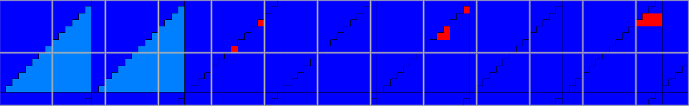

# Intel Arc 140T (32GB)

Xe-LPG+ architecture

## Specs

* Clock: 2250 MHz
* Xe cores: 16
* Warp size: 8 - 32 [vk]
* HW warp size: 16
* TDP: 35W

* Pixel Rate:  75.20 GPixel/s
* Texture Rate:  150.4 GTexel/s
* FP16 TFLOPS:  9.626
* FP32 TFLOPS:  4.813
* TMUs: 64
* ROPs: 32

### Memory

* RAM: 36 GB, DDR5-5600, 89GB/s
* L2 cache: 8MB shared
* L1 cache: 128KB per cluster
* LDS: 32KB (per workgroup)

### Float point performance

* Parallel FP32 FMA and I32 IADD datapath.

### Ray tracing performance

* RT Cores: 8

### Tensor performance

* 8 XMX for Xe core
* XMX engines: 128
* XMX FP16: 128 ops/cy ?
* XMX FP16 TFLOPS: 36.9 (30 TOPS from test)
* `8x16 * 16x8 + 8x8` - 2048 ops
* XMX int8: 256 ops/cy ?
* XMX int8 TOPS: 73.7 (20 TOPS from test)
* `16x32 * 32x16 + 16x16` - 16 384 ops

## Shader

### Quads

* Test `subgroupQuadBroadcast( gl_HelperInvocation )` with/without texturing - helper invocations are executed. [[6](../GPU_Benchmarks.md#6-Subgroups)]
* Test `subgroupQuadBroadcast( constant )` with/without texturing - helper invocations are executed. [[6](../GPU_Benchmarks.md#6-Subgroups)]

### Tile size

* Subgroup scheduler prefer to put subgroup in tile 4x4 pix (in simd16 and simd8 mode).
  If subgroup is not full then it merged with other non-full subgroups.
  [[17](../GPU_Benchmarks.md#17-tile-size)] 
  
* Max measured distance between pixels in same subgroup is 48 pix.
* On high register count used simd8 mode, otherwise used simd16 mode. 
  

### Merged instances

* Instances in VS are merged (in rare cases). [[17](../GPU_Benchmarks.md#17-tile-size)]
* Instances in FS are merged (in rare cases).
* Triangles with same instance are merged in FS.

Dark blue - single instance; light blue - single instance in FS, multiple in VS; red - multiple instances in FS.

### Ray tracing

* Ray query performance: [[15](../GPU_Benchmarks.md#15-ray-tracing-performance)]
	- 10 GigaRays/s

### Tensor

* Cooperative matrix: [[16](../GPU_Benchmarks.md#16-tensor-performance)]
	- fp16: 30 TOPS
	- i8: 20 TOPS *(expected 2x 30 TOPS)*

### NaN / Inf

* FP32, Mediump, FP16. [[11](../GPU_Benchmarks.md#11-NaN)]

	| op \ type | nan1 | nan2 | nan3 | nan4 | inf | -inf | max | -max |
	|---|---|---|---|---|---|---|---|---|
	| x | nan | nan | nan | nan | inf | -inf | max | -max |
	| Min(x,0) | 0 | 0 | 0 | 0 | 0 | -inf | 0 | -max |
	| Min(0,x) | 0 | 0 | 0 | 0 | 0 | -inf | 0 | -max |
	| Max(x,0) | 0 | 0 | 0 | 0 | inf | 0 | max | 0 |
	| Max(0,x) | 0 | 0 | 0 | 0 | inf | 0 | max | 0 |
	| Clamp(x,0,1) | 0 | 0 | 0 | 0 | 1 | 0 | 1 | 0 |
	| Clamp(x,-1,1) | -1 | -1 | -1 | -1 | 1 | -1 | 1 | -1 |
	| IsNaN | 1 | 1 | 1 | 1 | 0 | 0 | 0 | 0 |
	| IsInfinity | 0 | 0 | 0 | 0 | 1 | 1 | 0 | 0 |
	| bool(x) | 1 | 1 | 1 | 1 | 1 | 1 | 1 | 1 |
	| x != x | 1 | 1 | 1 | 1 | 0 | 0 | 0 | 0 |
	| Step(0,x) | 1 | 1 | 1 | 1 | 1 | 0 | 1 | 0 |
	| Step(x,0) | 1 | 1 | 1 | 1 | 0 | 1 | 0 | 1 |
	| Step(0,-x) | 1 | 1 | 1 | 1 | 0 | 1 | 0 | 1 |
	| Step(-x,0) | 1 | 1 | 1 | 1 | 1 | 0 | 1 | 0 |
	| SignOrZero(x) | -1 | -1 | -1 | -1 | 1 | -1 | 1 | -1 |
	| SignOrZero(-x) | -1 | -1 | -1 | -1 | -1 | 1 | -1 | 1 |
	| SmoothStep(x,0,1) | 0 | 0 | 0 | 0 | 1 | 0 | 1 | 0 |
	| Normalize(x) | nan | nan | nan | nan | nan | nan | 0 | -0 |

* FP32 Mediump diff:

	| op \ type | nan1 | nan2 | nan3 | nan4 | inf | -inf | max | -max |
	|---|---|---|---|---|---|---|---|---|
	| x | nan | nan | nan | nan | inf | -inf | max | -max |
	| Min(x,0) |   |   |   |   |   |      |   | -inf |
	| Min(0,x) |   |   |   |   |   |      |   | -inf |
	| Max(x,0) |   |   |   |   |     |   | inf |   |
	| Max(0,x) |   |   |   |   |     |   | inf |   |
	| IsInfinity |   |   |   |   |   |   | 1 | 1 |
	| Normalize(x) |  |  |  |  |  |  | nan | nan |

## Texture cache

* RGBA8_UNorm texture with random access [[9](../GPU_Benchmarks.md#9-Texture-cache)]
	- Measured cache size: 128KB, 8MB
	- RT dim: 7689x4720
	- 8 texels per pixel, 4 texels for linear filter, 36.25MPix, 4.64 GB read per frame.

	| size (B) | dimension (px) | approx bandwidth (GB/s) | comments |
	|---|---|---|---|
	|   1K |  16x16  | 656 |
	|   2K |  32x16  | 580 |
	|   4K |  32x32  | 552 |
	|   8K |  64x32  | 536 |
	|  16K |  64x64  | 532 |
	|  32K | 128x64  | 520 |
	|  64K | 128x128 | 516 |
	| 128K | 256x128 | 256 | L1 from specs |
	| 256K | 256x256 | 195 |
	| 512K | 512x256 | 175 |
	|   1M | 512x512 | 164 |
	|   2M |  1Kx512 | 163 |
	|   4M |  1Kx1K  | 162 |
	|   8M |  2Kx1K  | 108 | L2 from specs |
	|  16M |  2Kx2K  |  18 |
	
