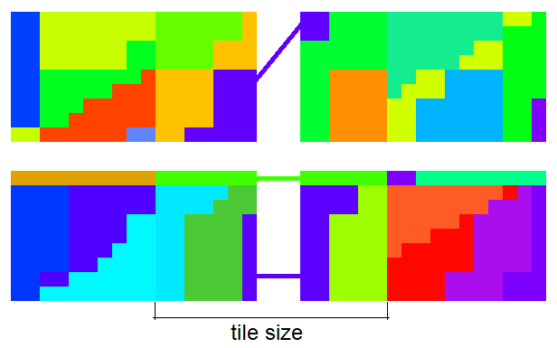
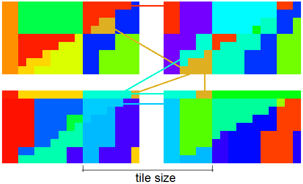
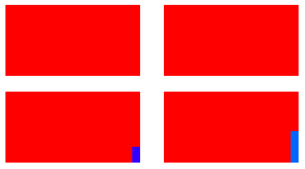
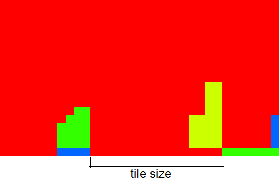
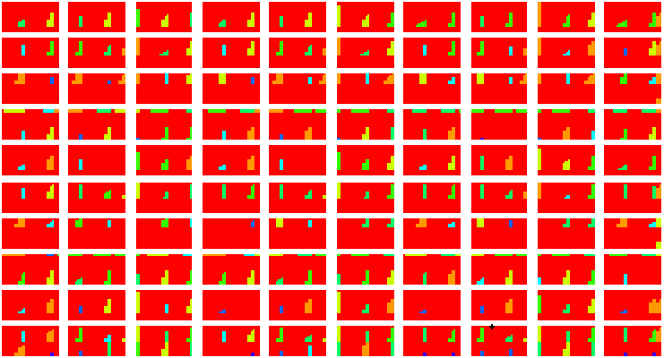
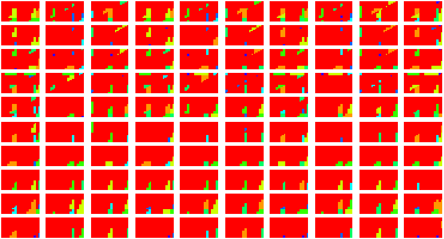
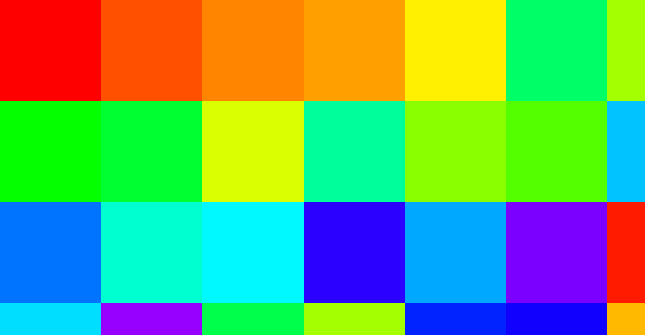
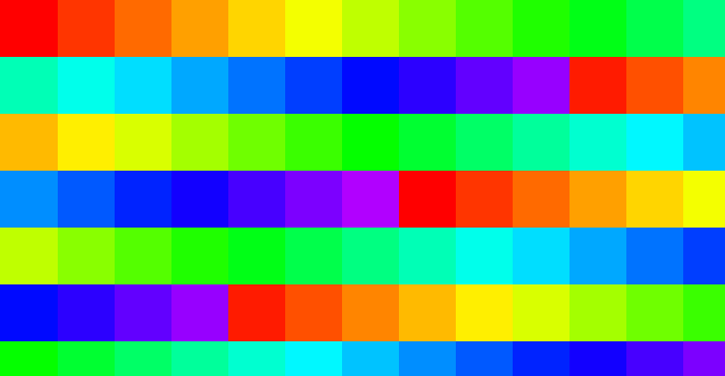
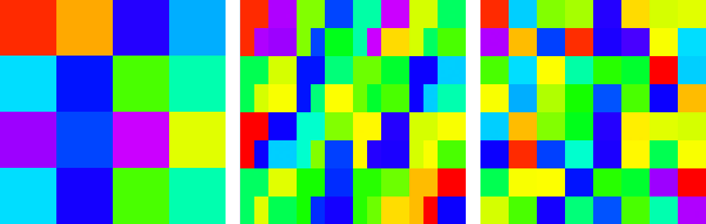
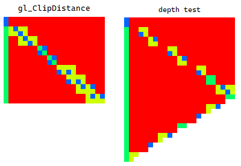

# NVidia RTX 2080 (Turing)

## Specs

* Pixel Rate: **109.4** GPixel/s
* Texture Rate: **314.6** GTexel/s
* Clock stable: **1515** MHz, boost from specs: 1710 MHz, boost measured: 1900+ MHz
* shaderSMCount: **46** [vk/specs]
* shaderWarpsPerSM: **32** [vk] - this is register capacity, not a thread count
* Warp size: **32** [vk]

### Memory

* Memory: 8GB, GDDR6, 256 bit, 1750 MHz, **448.0** GB/s (403 GB/s from tests (at 1515 MHz ?))
* Memory max power consumption: 25W (7.5 pJ/bit, 0.06 J/GB)  [calc]
* L2 cache: 4MB
* L1 Cache: 64 KB (per SM)

### Float point performance

* FP16: **20.14** TFLOPS at 1710 MHz
* FP32: **10.07** TFLOPS at 1710 MHz
* FP64: **314.6** GFLOPS at 1710 MHz
* ops per clock per SM: **64** fp32 FMA [compute capability 7.5]
* ops per clock per SM: **128** fp16 FMA [compute capability 7.5]
* FP32 FMA perf: **4.46** TOp/s at 1515 MHz (4.4 TOp/S from tests)
* FP16 FMA perf: **8.9** TOp/s at 1515 MHz (8.9 TOp/S from tests)
* Total ALUs: 2 944 [calc] - number of simultaneously executing threads

Theoretical performance:
```
FLOPS v1 = clock * ops_per_clock_per_SM * SMCount
FLOPS v2 = clock * SMCount * WarpSize * 4 (warp-scheduler units) / 2 (perform cycles)
specs:
	- Each Turing SM includes 4 warp-scheduler units.
	- Instructions are performed over two cycles.

v1: 1515M * 64 * 46 = 4.46T FMA ops per second = 8.9 TFLOPS
v2: 1515M * 46 * 32 * 4 / 2 = 4.46T FMA ops per second = 8.9 TFLOPS
```

### Tensor Core performance

* Tensor Cores: 368  *(46 SM * 8 perSM)*
* FP16 FLOPS/cy per Core: 128  *(64 FMA from specs)*
* INT8 IPS/cy per Core: 256
* INT4 IPS/cy per Core: 512
* FP16 TFLOPS: **71** at 1515 MHz (69.5 from tests)
* INT8 TIPS: **142** at 1515 MHz
* INT4 TIPS: **285** at 1515 MHz

### Ray tracing performance

* RT Cores: 46  *(46 SM * 1 perSM)*
* Giga Rays/s: **69.7** at 1515 MHz


## Shader

### Quads

* Test `subgroupQuadBroadcast( gl_HelperInvocation )` with/without texturing - helper invocations are executed. [[6](../GPU_Benchmarks.md#6-Subgroups)]
* Test `subgroupQuadBroadcast( constant )` with/without texturing - helper invocations are executed. [[6](../GPU_Benchmarks.md#6-Subgroups)]


### Subgroups

* Result of `Rainbow( Hash( subgroupAdd( gl_FragCoord.xy )))` for 4 quads without instancing. [[6](../GPU_Benchmarks.md#6-Subgroups)]<br/>
SM can fill multiple triangles with single subgroup inside tile (16x16 pix)<br/>
<br/>
Subgroup occupancy, red - full subgroup.<br/>


* Result of `Rainbow( Hash( subgroupAdd( gl_FragCoord.xy )))` for 4 quads with instancing. [[6](../GPU_Benchmarks.md#6-Subgroups)]<br/>
SM can fill multiple triangles with the same `gl_InstanceIndex` with single subgroup inside tile (16x16 pix)<br/>
<br/>
Subgroup occupancy, red - full subgroup, blue - very low number of threads per subgroup<br/>


* Subgroup occupancy for single triangle with texturing. Helper invocations are executed and included as active thread. Red color - full subgroup. [[6](../GPU_Benchmarks.md#6-Subgroups)]<br/>


* Subgroup occupancy for too small triangles. Red color - full subgroup. [[6](../GPU_Benchmarks.md#6-Subgroups)]<br/>


* Subgroup occupancy for too small triangles with instancing. Red color - full subgroup. [[6](../GPU_Benchmarks.md#6-Subgroups)]<br/>



### Subgroups and independent thread scheduling

In [UniqueIDs sample](https://github.com/azhirnov/as-en/blob/dev/AE/samples/res_editor/_data/scripts/samples-compute/UniqueIDs-1.as) only on NV `subgroupElect()` may executes multiple times per subgroup.
Possible explanation is: each branch create independent set of threads so `subgroupElect()` affects only this threads instead of whole subgroup.


### Subgroup threads order

Result of `Rainbow( gl_SubgroupInvocationID / gl_SubgroupSize )` in fragment shader, gl_SubgroupSize: 32. [[6](../GPU_Benchmarks.md#6-Subgroups)]


Result of `Rainbow( gl_SubgroupInvocationID / gl_SubgroupSize )` in compute shader, gl_SubgroupSize: 32, workgroup size: 8x8. [[6](../GPU_Benchmarks.md#6-Subgroups)]


### SM order

Result of `Rainbow( gl_SMIDNV / gl_SMCountNV )` in fragment shader.<br/>
Tile size: 16x16, image size: 102x53, gl_SMCountNV: 46, gl_SMIDNV: 0 and 1 are bound to the first tile and changed every frame, same for other tiles. [[6](../GPU_Benchmarks.md#6-Subgroups)]



Result of `Rainbow( gl_SMIDNV / gl_SMCountNV )` in compute shader.<br/>
Workgroup size: 8x8, image size: 102x53, gl_SMCountNV: 46. First set (from red to violet) has gl_SMIDNV = 0,2,4..., next set has gl_SMIDNV = 1,3,5... and next - again 0,2,4... [[6](../GPU_Benchmarks.md#6-Subgroups)]




### SM tile size depends on register count

* SM supports limited number of registers, but must run multiple warps to hide memory latency.
* SM will decrease tile size to execute minimal required number of warps which has a large number of registers.
* Maximal tile size is 16x16 pix (left side in image).




### Instruction cost


* Shader instruction benchmark results: [[4](../GPU_Benchmarks.md#4-Shader-instruction-benchmark)]
	- fp32 & i32 datapaths can execute in parallel in 1:1 rate.
	- fp16x2 FMA is used, scalar FMA doesn't have x2 performance

	- base rate: 8.9 TOp/s at 1515 MHz

	- **float point**

	| op \ type | fp16 | fp32 | fp64 |
	|---|---|---|---|
	| Add           | 0.5 | 1   | 40  |
	| Mul           | 1   | 2   | 80  |
	| FMA           | 1   | 2   | 80  |
	| MulAdd        | 2   | 2   | 80  |
	| Lerp          | 1   | 2   | 80  |
	| Length        | 2   | 3   | 480 |
	| Normalize     | 2   | 3   | 280 |
	| Distance      | 3   | 5   | 480 |
	| Dot           | 3   | 4   | 160 |
	| Cross         | 4   | 4   | 160 |
	| Min/Max       | 1.5 | 1   | 120 |
	| Clamp(x,0,1)  | 0.5 | 1   | 200 |
	| Clamp(x,-1,1) | 3   | 3   | 200 |
	| Clamp         | 3   | 3   | 200 |
	| Step          | 2.4 | 1.1 | 120 |
	| SmoothStep    | 3   | 5   | 440 |
	| Abs           | 0.5 | 1   | 40  |
	| SignOrZero    | 8   | 8   | 280 |
	| BitCast       | 4   | 1   | 40  |
	| FloatToInt    | 6   | 6   | 80  |
	| IntToFloat    | 6   | 6   | 80  |
	| Ceil, Floor, Trunc, Round, RoundEven | 7   | 7 | 120 |
	| Fract         | 7   | 7   | 200 |
	| Div           | 7   | 7   | 800 |
	| Mod           | 15  | 15  | 1000 |
	| Exp, Exp2     | 7   | 7   | -   |
	| InvSqrt       | 7   | 7   | 800 |
	| Sqrt          | 7   | 7   | 1680 |
	| Log, Log2     | 7   | 7   |  -  |
	| Sin, Cos      | 7   | 7   | -   |
	| Pow           | 16  | 16  | -   |
	| Tan           | 22  | 22  | -   |
	| ASin, ACos    | 24  | 24  | -   |
	| ATan          | 56  | 56  | -   |

	- **float point fast math**

	| op \ type | fp16 | fp32 | fp64 |
	|---|---|---|---|
	| fast Sign     | 4   | 1.2 | 280 |
	| Cbrt          | 16  | 16  |
	| sRGB          | 16  | 17  |
	| fast sRGB     | 9   | 19  |
	| fast Cos      | 10  | 18  |
	| fast Sin      | 12  | 20  |
	| fast Tan      | 10  | 18  |
	| fast ASin     | 9   | 16  |
	| fast ACos     | 10  | 17  |
	| fast ASin v2  | 10  | 24  |
	| fast ACos v2  | 16  | 26  |
	| fast ATan v2  | 18  | 36  |
	| fast ATan     | 34  | 44  |

	- **integer**

	| op \ type | i32 | u32 | i64 | u64 | i16 | u16 | i8 | u8 |
	|---|---|---|---|---|---|---|---|---|
	| Add         | 1   | 0.9 | 2.5 | 2   | 1  | 0.9 | 0.1 ? | 0.1 ? |
	| Mul         | 2   | 2   | 8   | 8   | 2  | 3   | 2     | 3     |
	| MulAdd      | 2   | 2   | 8   | 8   | 2  | 3   | 0.2 ? | 0.2 ? |
	| Div         | 54  | 48  | 180 | 140 | 52 | 52  | 0.1 ? | 0.1 ? |
	| Mod         | 48  | 54  | 180 | 140 | 52 | 52  | 0.1 ? | 0.1 ? |
	| Min/Max     | 1   | 1   | 8   | 8   | 3  | 4   | 4     | 4     |
	| Clamp const | 3   | 1   | 16  | 8   | 8  | 4   | 8     | 4     |
	| Clamp       | 1   | 1   | 8   | 8   | 3  | 4   | 4     | 4     |
	| Abs         | 1.5 | -   | 8   | -   | 5  | -   | 0.1 ? | -     |
	| SignOrZero  |
	| Shift const | 1   | 1   | 2   | 2   | 1  | 1   | 0.1 ? | 0.1 ? |
	| Shift       | 2   | 2   | 4   | 4   | 4  | 4   | 0.1 ? | 0.1 ? |
	| And         | 1   | 1   | 4   | 4   | 1  | 1   | 0.1 ? | 0.1 ? |
	| Or          | 1   | 1   | 4   | 4   | 1  | 1   | 0.1 ? | 0.1 ? |
	| Xor         | 1   | 1   | 4   | 4   | 1  | 1   | 0.1 ? | 0.1 ? |
	| BitCount    | 8   | 8   | -   | -   | -  | -   | -     | -     |
	| FindLSB     | 16  | 16  | 16  | 16  | 16 | 16  | 16    | 16    |
	| FindMSB     | 8   | 8   | -   | -   | -  | -   | -     | -     |
	| AddCarry, SubBorrow | -   | 6   | - | - | - | - | - | - |
	| MulExtended | -   | 7   | - | - | - | - | - | - |


* FP32 instruction performance: [[2](../GPU_Benchmarks.md#2-fp32-instruction-performance)]
	- Loop unrolling can double performance.
	- Loop unrolling works for less than 1536 count, on 2048 it lose 2.5x of performance.
	- Loop unrolling is too slow at pipeline creation stage.
	- Benchmarking in compute shader is only 1% faster.
	- Minimal dispatch size: 256x276 (1.5 of total thread count), lower size will lost performance.
	- Measured with fixed clock at 1515 MHz.
	- minimal workgroup size 32x2, because FMA perform over 2 cycles (like a SIMD16 with dual issue).

	| TOp/s | ops | max TFLOPS |
	|---|---|---|
	| 8.8 | Add         | **8.8** |
	| 4.4 | MulAdd, FMA | **8.8** |
	| 4.4 | Mul         | 4.4     |

* FP16 instruction performance: [[1](../GPU_Benchmarks.md#1-fp16-instruction-performance)]
	- Measured with fixed clock at 1515 MHz.

	| TOp/s | ops | max TFLOPS |
	|---|---|---|
	| 17.8 | Add                | **17.8** | |
	| 8.9  | Mul, Add with deps | 8.9      | |
	| 8.9  | MulAdd, FMA        | **17.8** | |
	| 4.4  | MulAdd with deps   | 8.8      | 2x slow than F16x2FMA (TODO: check) |

### NaN / Inf

* FP32, Mediump, FP16, FP64. [[11](../GPU_Benchmarks.md#11-NaN)]

	| op \ type | nan1 | nan2 | nan3 | nan4 | inf | -inf | max | -max |
	|---|---|---|---|---|---|---|---|---|
	| x | nan | nan | nan | nan | inf | -inf | max | -max |
	| Min(x,0) | 0 | 0 | 0 | 0 | 0 | -inf | 0 | -max |
	| Min(0,x) | 0 | 0 | 0 | 0 | 0 | -inf | 0 | -max |
	| Max(x,0) | 0 | 0 | 0 | 0 | inf | 0 | max | 0 |
	| Max(0,x) | 0 | 0 | 0 | 0 | inf | 0 | max | 0 |
	| Clamp(x,0,1) | 0 | 0 | 0 | 0 | 1 | 0 | 1 | 0 |
	| Clamp(x,-1,1) | -1 | -1 | -1 | -1 | 1 | -1 | 1 | -1 |
	| IsNaN | 1 | 1 | 1 | 1 | 0 | 0 | 0 | 0 |
	| IsInfinity | 0 | 0 | 0 | 0 | 1 | 1 | 0 | 0 |
	| bool(x) | 1 | 1 | 1 | 1 | 1 | 1 | 1 | 1 |
	| x != x | 1 | 1 | 1 | 1 | 0 | 0 | 0 | 0 |
	| Step(0,x) | 1 | 1 | 1 | 1 | 1 | 0 | 1 | 0 |
	| Step(x,0) | 1 | 1 | 1 | 1 | 0 | 1 | 0 | 1 |
	| Step(0,-x) | 1 | 1 | 1 | 1 | 0 | 1 | 0 | 1 |
	| Step(-x,0) | 1 | 1 | 1 | 1 | 1 | 0 | 1 | 0 |
	| SignOrZero(x) | 0 | 0 | 0 | 0 | 1 | -1 | 1 | -1 |
	| SignOrZero(-x) | 0 | 0 | 0 | 0 | -1 | 1 | -1 | 1 |
	| SmoothStep(x,0,1) | 0 | 0 | 0 | 0 | 1 | 0 | 1 | 0 |
	| Normalize(x) | nan | nan | nan | nan | nan | nan | 0 | -0 |


### Shared memory
TODO

### Noise performance
TODO

### Circle performance

* small circles. [[13](../GPU_Benchmarks.md#13-Circle-geometry)]
	- 65K objects
	- 23 MPix

	| shape | exec time (ms) | diff (%) |
	|---|---|---|
	| quad     | **0.52** | - |
	| fan      | 0.67 | 29 |
	| strip    | 0.68 | 31 |
	| max area | 0.59 | 13 |

* 4x4 circles with blending. [[13](../GPU_Benchmarks.md#13-Circle-geometry)]
	- 3200x1800
	- 128 layers

	| shape | exec time (ms) | diff (%) |
	|---|---|---|
	| quad     | **5.03** | - |
	| fan      | 5.27 | 4.8 |
	| strip    | 5.20 | 3.4 |
	| max area | 5.25 | 4.4 |

### Branching

* Mul vs Branch vs Matrix [[12](../GPU_Benchmarks.md#12-Branching)]
	- 16.7MPix, 128 iter, 6 mul/branch ops.

	| op | exec time (ms) | diff |
	|---|---|---|
	| Mul uniform        | 3.06 | 2.1 |
	| Branch uniform     | **1.48** | - |
	| Matrix uniform     | 2.19 | 1.5 |
	| - |
	| Mul non-uniform    | 3.57 | 2.4 |
	| Branch non-uniform | 4.58 | 3.1 |
	| Matrix non-uniform | 4.37 | 3.0 |
	| - |
	| Mul avg            | 3.3  | 2.1 |
	| Branch avg         | 3.3  | 2.1 |
	| Matrix avg         | 3.3  | 2.1 |


## Blending
TODO

## Resource access

* Texture access 105MPix: [[5](../GPU_Benchmarks.md#5-Texture-lookup-performance)]
	- expected read: 419MB per frame.
	- UV bias has no effect.

	| diff | exec time (ms) | approx traffic (GB/s) | name | comments |
	|---|---|---|-------|------|
	| 0.43 | 0.55  | 761 | sequential access, scale x0.5     | used texture cache |
	| 1    | 1.28  | 327 | sequential access, scale x1       | near to VRAM bandwidth |
	| 1.15 | 1.47  | 285 | random access, noise 16x16        | |
	| 1.19 | 1.52  | 276 | random access, noise 16x16, off 1 | 1px offset has effect only for 16x16 block size |
	| 1.52 | 1.94  | 216 | random access, noise 8x8          | |
	| 2.1  | 2.64  | 159 | sequential access, scale x1.5     | |
	| 2.2  | 2.83  | 148 | random access, noise 4x4          | |
	| 3.5  | 4.44  |  94 | sequential access, scale x2       | |
	| 5    | 6.4   |  65 | random access, noise 2x2          | |
	| 12.5 | 16    |  26 | random access, noise 1x1          | |


* Buffer/Image storage 16bpp 67.1MPix 2x1.073GB [[7](../GPU_Benchmarks.md#7-BufferImage-storage-access)]
	- image with 1GB size doesn't have RT compression. *Because metadata is too large?*
	- image input attachment is preferred because you don't need to reorder threads and RT compression is used to minimize bandwidth.

	| diff (%) | exec time (ms) | approx traffic (GB/s) | name | comments |
	|---|---|---|------|----|
	| 26  | 6.7  | 320 | Buffer load/store in FS, 16 bytes                           | cache misses because of non-sequential read/write (?) |
	| 19  | 6.3  | 340 | Buffer load/store, 128 bytes                                | |
	| 7.5 | 5.7  | 376 | Image load/store, workgroup 8x8, row major                  | |
	| 7   | 5.66 | 379 | Image load/store, workgroup 8x8, column major               | |
	| 3   | 5.45 | 394 | Buffer load/store, 16 bytes                                 | |
	| 3   | 5.45 | 394 | Image load/store, workgroup 16x16, column major             | |
	| 2   | 5.4  | 397 | Image load/store, workgroup 16x16, row major                | |
	| 2   | 5.4  | 397 | Image read/write input attachment RGBA32F, 1x1 noise        | RT compression is not enabled because of > 1GB size |
	| 2   | 2.7  | 397 | Image read/write input attachment 2xRGBA8, 1x1 noise        | has RT compression, but performance is low because of 8bpp |
	| 1   | 5.35 | 401 | Image load/store, workgroup 16x16, group reorder, row major | |
	| 1   | 5.35 | 401 | Buffer load/store, 32 bytes                                 | |
	|**0**| 5.3  | 405 | Buffer load/store, 64 bytes                                 | 64 byte L2 cache line, stable for any workgroup size and group order |
	| -10 | 4.8  | 447 | Image read/write input attachment 2xRG32F, 1x1 noise        | |
	| -23 | 4.3  | 499 | Image read/write input attachment 4xRGBA8, 1x1 noise        | better compression for RGBA8 ? |
	| -72 | 2.35 | 699 | Image read/write input attachment RGBA32F, 2x2 noise, 7K    | speedup on RT compression |
	| -77 | 3.0  | 715 | Image read/write input attachment 2xRG32F, 2x2 noise        | speedup on RT compression |
	| -77 | 3.0  | 715 | Image read/write input attachment 4xRGBA8, 2x2 noise        | speedup on RT compression |


## Render target compression

* RGBA8 205MPix downsample 1/2, compressed/uncompressed access rate: [[3](../GPU_Benchmarks.md#3-Render-target-compression)]
	- read: 822MB, write: 205MB, total: 1027MB per frame.
	- linear: 6.5ms, fetch: 6.6ms, nearest: 7.3ms.
	- image storage: load: 8ms, linear/fetch: 7.2ms. **Texture sampling is a bit faster because of texture cache.**
	- **Compression disabled when used storage usage flag.**

	| diff | exec time (ms) | approx traffic (GB/s) | name | comments |
	|---|---|---|------|----|
	| 0.97 | 2.79 |  368 | image storage 1x1 noise     |
	| 1    | 2.72 |  377 | image storage (other modes) |
	| 1.07 | 2.53 |  405 | 1x1 noise   |
	| 1.78 | 1.53 |  671 | 2x2 noise   |
	| 3.2  | 0.84 | 1223 | 4x4 noise   | **same as block size** |
	| 3.3  | 0.81 | 1268 | gradient    |
	| 3.4  | 0.79 | 1300 | 8x8 noise   | better compression for output (4x4 block) |
	| 3.4  | 0.79 | 1300 | 16x16 noise |
	| 3.4  | 0.79 | 1300 | solid color |

* RGBA16_UNorm 104.8MPix downsample 1/2, compressed/uncompressed access rate: [[3](../GPU_Benchmarks.md#3-Render-target-compression)]
	- read: 838MB, write: 209MB, total: 1048MB per frame.

	| diff | exec time (ms) | approx traffic (GB/s) | name | comments |
	|---|---|---|------|----|
	| 0.97 | 2.71 |  387 | image storage 1x1 noise, gradient    | ??? |
	| 1    | 2.63 |  398 | image storage 8x8 noise, solid color | ??? |
	| 1.02 | 2.57 |  408 | 1x1 noise   |
	| 1.79 | 1.47 |  713 | 2x2 noise   |
	| 2.0  | 1.30 |  806 | gradient    | less compression rate than in RGBA16F because of higher precision |
	| 4.2  | 0.62 | 1690 | 4x4 noise   | **same as block size** |
	| 4.2  | 0.62 | 1690 | 8x8 noise   |
	| 4.2  | 0.62 | 1690 | 16x16 noise |
	| 4.2  | 0.62 | 1690 | solid color |

* RGBA16F 104.8MPix downsample 1/2, compressed/uncompressed access rate: [[3](../GPU_Benchmarks.md#3-Render-target-compression)]
	- read: 838MB, write: 209MB, total: 1048MB per frame.

	| diff | exec time (ms) | approx traffic (GB/s) | name | comments |
	|---|---|---|------|----|
	| 0.95 | 2.75 |  381 | image storage 1x1 noise | ??? |
	| 1    | 2.63 |  398 | image storage 4x4 noise, gradient, solid color | ??? |
	| 1.03 | 2.55 |  411 | 1x1 noise   |
	| 1.8  | 1.46 |  718 | 2x2 noise   |
	| 3.4  | 0.77 | 1361 | gradient    |
	| 4.2  | 0.62 | 1690 | 4x4 noise   | **same as block size** |
	| 4.2  | 0.62 | 1690 | 8x8 noise   |
	| 4.2  | 0.62 | 1690 | 16x16 noise |
	| 4.2  | 0.62 | 1690 | solid color |

* RGBA32F 37.7MPix downsample 1/2, compressed/uncompressed access rate: [[3](../GPU_Benchmarks.md#3-Render-target-compression)]
	- read: 604MB, write: 151MB, total: 755MB per frame.

	| diff | exec time (ms) | approx traffic (GB/s) | name | comments |
	|---|---|---|------|----|
	| 1    | 1.89 |  399 | image storage 1x1 noise |
	| 1.03 | 1.84 |  410 | gradient    | low compression rate because of high precision |
	| 1.03 | 1.84 |  410 | 1x1 noise   |
	| 2.4  | 0.79 |  956 | 2x2 noise   |
	| 3.7  | 0.51 | 1480 | 4x4 noise   | **same as block size** |
	| 3.7  | 0.51 | 1480 | 8x8 noise   |
	| 3.7  | 0.51 | 1480 | 16x16 noise |
	| 3.7  | 0.51 | 1480 | solid color |


## Texture cache

* RGBA8_UNorm texture with random access [[9](../GPU_Benchmarks.md#9-Texture-cache)]
	- Measured cache size: 32 KB, 1 MB, 4MB.
	- 8 texels per pixel, 5.76MPix, 737MB.
	- from specs: only 32KB of L1 cache is reserved for texture cache.
	- textureGather() has same performance as texture() with linear sampling.

	| size (B) | dimension (px) | exec time (ms) | diff | approx bandwidth (GB/s) | VRAM utilization (%) | comments |
	|---|---|---|---|---|---|---|
	| **128** | 4x8       | 0.18 | -       | 4096 | 17 | L1 cache line? |
	| 256     | 8x8       | 0.28 | **1.6** | 2630 | 12 |
	| 512     | 8x16      | 0.33 | 1.18    | 2233 | 11 |
	| 1K      | 16x16     | 0.42 | 1.27    | 1755 | 9  |
	| 2K      | 16x32     | 0.48 | 1.14    | 1535 | 8  |
	| 4K      | 32x32     | 0.50 | 1.04    | 1474 | 7  |
	| 8K      | 32x64     | 0.52 | 1.04    | 1417 | 7  |
	| 16K     | 64x64     | 0.53 | 1.02    | 1390 | 7  |
	| **32K** | 64x128    | 0.60 | 1.13    | 1228 | 5  | L1 cache size |
	| 64K     | 128x128   | 1.5  | **2.5** | 491  | 3  | L1 cache size from specs, not enough space to store unique 64 KB or not whole cache line are used |
	| **1M**  | 512x512   | 1.9  |  -      | 387  | 3  |
	| **4M**  | 1024x1024 | 4.07 | **2.1** | 181  | 8  | L2 cache |
	| 8M      | 2048x1024 | 10   | **2.5** |  74  | **73** |


## Vertex Cache

| vertices | triangles | VS invocations | overhead (invocations, %) | repeat vertIDs | comment |
|---|---|---|---|---|
| 20 |  24 |  20 |  0 | - |
| 24 |  30 |  24 |  0 | - |
| 28 |  36 |  32 |  4, 14%   | 21-23, 25 |
| 32 |  42 |  37 |  5, 15.6% | 21-25 |
| 36 |  48 |  41 |  5, 13.8% | 21-25 |
| 40 |  54 |  45 |  5, 12.5% | 21-25 |
| 44 |  60 |  49 |  5, **11.3%** | 21-25 |
| 48 |  66 |  56 |  7, 14.5% | 21-25, 42-43 |
| 52 |  72 |  62 | 10, 19.2% | 21-25, 42-46 |
| 64 |  90 |  74 | 10, 15.6% |
| 64 |  72 |  72 |  8, 12.5% |  | 4 instances |
| 17600 | 24000 | 20800 | 18.2% | ... | 400 instances |
| 24000 | 33600 | 28600 | 19.2% | ... | 400 instances |
| 27200 | 38400 | 31200 | 14.7% | ... | 400 instances |


## Triangle Clipping

When part of a single triangle clipped by depth test or `gl_ClipDistance` the resulting rectangle rasterized as 2 triangles with helper invocations in diagonal.<br/>
Possible explanation: triangle is clipped, but hardware can not rasterize rectangle, so it divide rectangle on 2 new triangles. It is needed to avoid rasterization of hidden parts of triangle.




## Nonuniform

* __stress test__ [[14.1](../GPU_Benchmarks.md#14-Nonuniform)]<br/>
	Scale=0.9, Dim=8K, ObjCount=4K, TexBias=4

	| nonuniform              | per object (ms) | per warp (ms) | per quad (ms) | per pixel (ms) |
	|-------------------------|-----------------|---------------|---------------|----------------|
	| texture layer           | 2.25            | 2.27          | 2.27          | 2.31           |
	| texture index           | 2.25            | 2.27          | 2.30          | 4.0            |
	| texture & sampler index | 2.25            | 2.27          | 2.30          | 3.95           |

* __depth pre-pass__ [[14.2](../GPU_Benchmarks.md#14-Nonuniform)]<br/>
	dpp = 0.5ms, 
	Scale=0.2, Dim=8K, ObjCount=32K

	| nonuniform              | per object (ms) | per warp (ms) | per quad (ms) | per pixel (ms) |
	|-------------------------|-----------------|---------------|---------------|----------------|
	| texture layer           | 2.17            | 2.2           | 2.24          | 4.34           |
	| texture index           | 2.17            | 2.23          | 2.52          | 8.64           |
	| texture & sampler index | 2.17            | 2.24          | 2.48          | 8.56           |

* __visibility buffer__ [[14.3](../GPU_Benchmarks.md#14-Nonuniform)]<br/>
	visibility buffer build = 1.2ms<br/>
	visibility buffer FS overhead = 1.26ms<br/>
	Scale=0.2, Dim=8K, ObjCount=32K

	| nonuniform              | per object (ms) | per warp (ms) | per quad (ms) | per pixel (ms) |
	|-------------------------|-----------------|---------------|---------------|----------------|
	| texture layer           | 1.38            | 1.40          | 1.42          | 1.55           |
	| texture index           | 1.39            | 1.41          | 1.45          | 2.22           |
	| texture & sampler index | 1.39            | 1.41          | 1.46          | 2.18           |

