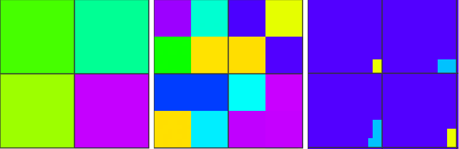
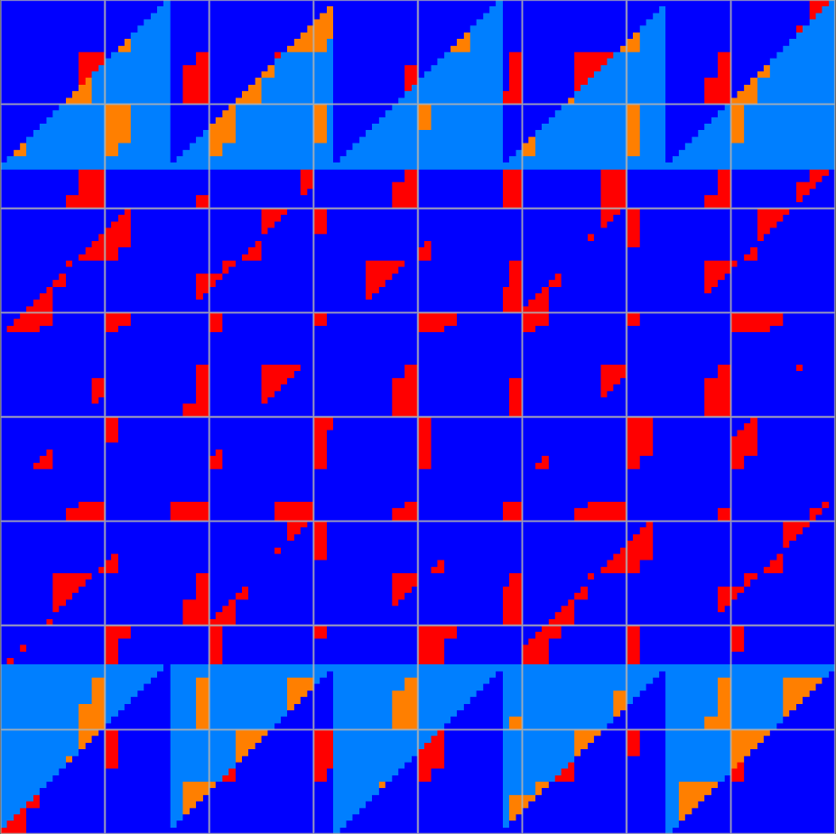

# NVIDIA RTX 5070 Ti (Blackwell)

## Specs

* clock stable: 2287 MHz
* clock boost: 2850 MHz

* SM Count: 70
* TMUs: 280
* ROPs: 96

* Pixel Rate: 235.4 GPixel/s
* Texture Rate: 686.6 GTexel/s

### Memory

* VRAM: 16 GB, 256bit, 896 GB/s
* L1 Cache: 128 KB (per SM)
* L2 Cache: 48 MB

### Float point performance

* FP32 TFLOPS: 43.9
* FP16 TFLOPS: 43.9

### Ray tracing performance

* RT Cores: 70

### Tensor

* Tensor Cores: 280
* Tensor core ops/clock per SM (dense):
	- fp8 with fp16 accum: 2048
	- fp8 with fp32 accum: 1024
	- fp16, bf16: 1024
	- fp16, bf16 with fp32 accum: 512
* FP16 TOPS (stable/boost): 164 / 204
* FP8 TOPS with fp16 accum (stable/boost): 327 / 408

## Shader

### Quads

### Subgroups

### Subgroup threads order

Result of `Rainbow( gl_SubgroupInvocationID / gl_SubgroupSize )` in fragment shader, gl_SubgroupSize: 32. [[6](../GPU_Benchmarks.md#6-Subgroups)]

Result of `Rainbow( gl_SubgroupInvocationID / gl_SubgroupSize )` in compute shader, gl_SubgroupSize: 32, workgroup size: 8x8. [[6](../GPU_Benchmarks.md#6-Subgroups)]

### Register count

* SM supports limited number of registers, but must run multiple warps to hide memory latency.
* Left image - on low register count only one SM used per tile, it increase concurrency - 70 SM will fill 16x16 pixels (17.9K pixels).
* Middle image - on high register count 4 SMs used per tile, so it 4 times decrease concurrency.
* Right image - warp occupancy is same for any register count, so tile size is not changed.

test source: [[17](../GPU_Benchmarks.md#17-tile-size)]

### Merged instances

Instances are merged in VS and FS. [[17](../GPU_Benchmarks.md#17-tile-size)] 
Dark blue - single instance; light blue - single instance in FS, multiple in VS; red - multiple instances in FS; orange - multiple instances in FS and VS.

### Ray tracing

* Ray query performance: [[15](../GPU_Benchmarks.md#15-ray-tracing-performance)]
	- 160 GigaRays/s

### Tensor

* Cooperative matrix: [[16](../GPU_Benchmarks.md#16-tensor-performance)]
	- fp16: 170 TOPS (2850 MHz)
	- fp16: 148 TOPS (2287 MHz)
	- i8: 290 TOPS (2850 MHz)

* Cooperative vector: [[16](../GPU_Benchmarks.md#16-tensor-performance)]
	- fp16: 69 TOPS (2287 MHz)
	- fp8: 129 TOPS (2287 MHz)

### NaN / Inf

* FP32, FP16, FP64. [[11](../GPU_Benchmarks.md#11-NaN)]

	| op \ type | nan1 | nan2 | nan3 | nan4 | inf | -inf | max | -max |
	|---|---|---|---|---|---|---|---|---|
	| x | nan | nan | nan | nan | inf | -inf | max | -max |
	| Min(x,0) | 0 | 0 | 0 | 0 | 0 | -inf | 0 | -max |
	| Min(0,x) | 0 | 0 | 0 | 0 | 0 | -inf | 0 | -max |
	| Max(x,0) | 0 | 0 | 0 | 0 | inf | 0 | max | 0 |
	| Max(0,x) | 0 | 0 | 0 | 0 | inf | 0 | max | 0 |
	| Clamp(x,0,1) | 0 | 0 | 0 | 0 | 1 | 0 | 1 | 0 |
	| Clamp(x,-1,1) | -1 | -1 | -1 | -1 | 1 | -1 | 1 | -1 |
	| IsNaN | 1 | 1 | 1 | 1 | 0 | 0 | 0 | 0 |
	| IsInfinity | 0 | 0 | 0 | 0 | 1 | 1 | 0 | 0 |
	| bool(x) | 1 | 1 | 1 | 1 | 1 | 1 | 1 | 1 |
	| x != x | 1 | 1 | 1 | 1 | 0 | 0 | 0 | 0 |
	| Step(0,x) | 1 | 1 | 1 | 1 | 1 | 0 | 1 | 0 |
	| Step(x,0) | 1 | 1 | 1 | 1 | 0 | 1 | 0 | 1 |
	| Step(0,-x) | 1 | 1 | 1 | 1 | 0 | 1 | 0 | 1 |
	| Step(-x,0) | 1 | 1 | 1 | 1 | 1 | 0 | 1 | 0 |
	| SignOrZero(x) | 0 | 0 | 0 | 0 | 1 | -1 | 1 | -1 |
	| SignOrZero(-x) | 0 | 0 | 0 | 0 | -1 | 1 | -1 | 1 |
	| SmoothStep(x,0,1) | 0 | 0 | 0 | 0 | 1 | 0 | 1 | 0 |
	| Normalize(x) | nan | nan | nan | nan | nan | nan | 0 | -0 |

* FP32 Mediump diff:

	| op \ type | nan1 | nan2 | nan3 | nan4 | inf | -inf | max | -max |
	|---|---|---|---|---|---|---|---|---|
	| x | nan | nan | nan | nan | inf | -inf | max | -max |
	| Min(x,0) |  |  |  |  |  |  |  | -inf |
	| Min(0,x) |  |  |  |  |  |  |  | -inf |
	| Max(x,0) |  |  |  |  |  |  | inf |  |
	| Max(0,x) |  |  |  |  |  |  | inf |  |
	| Normalize(x) |  |  |  |  |  |  | nan | nan |
