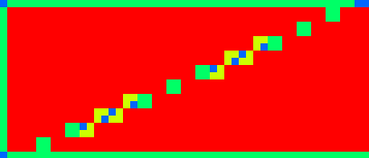
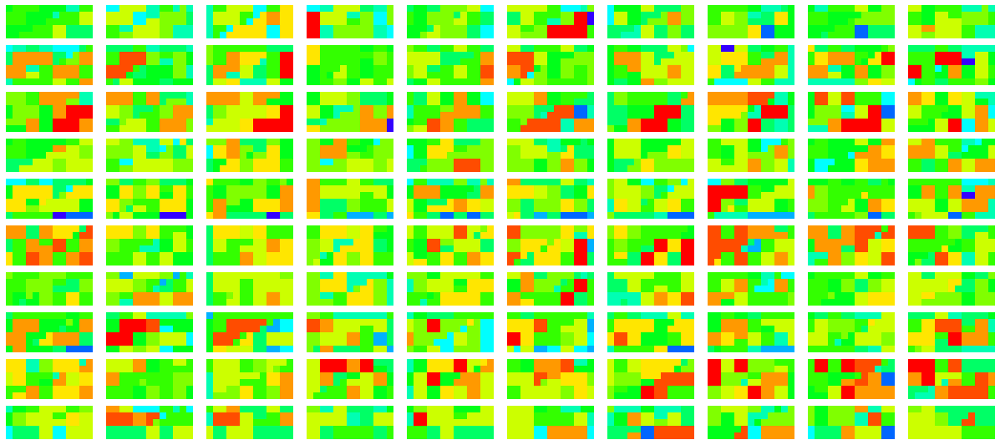

# ARM Mali G57 MC2 (Valhall gen1)

## Specs

* Cores: 2
* ALU: 2
* L2 cache: 512 Kb
* Tile bits/pixel: 256 *(32 bytes/pixel, 2xRGBA32)*
* Texture cache: 32 Kb
* Warp width: 16
* FP16 GFLOPS: **242** (121 GOp/s on MulAdd from tests)
* FP32 GFLOPS: **121** (60.7 GOp/s on FMA from tests)
* Clock: 950 MHz
* Texture cache: 32 Kb
* Max work registers (32b): 64
* Memory: 4GB, LPDDR4X, DC 16bit, 2133 MHz, **17.07** GB/s (14.2 GB/s from tests)
* Device: Realme 8I (Android 13, Driver 32.1.0)

## Shader

### Quads

* Quads on edge between 2 triangles are not merged, so 2 near pixels may execute up to 6 helper invocations.

* Test `subgroupQuadBroadcast( gl_HelperInvocation )` without texturing - helper invocations are **not** executed. [[6](../GPU_Benchmarks.md#6-Subgroups)]

* Test `subgroupQuadBroadcast( constant )` without texturing - helper invocations are **not** executed. [[6](../GPU_Benchmarks.md#6-Subgroups)] 
Red - full quad, blue - only 1 thread per quad. 

* Tests `subgroupQuadBroadcast( gl_HelperInvocation )` and `subgroupQuadBroadcast( constant )` with texturing: [[6](../GPU_Benchmarks.md#6-Subgroups)]
	- `textureGrad()`, `texelFetch()` - helper invocations are **not** executed.
	- `textureLod()` - helper invocations are **not** executed.
	- `texture()` - helper invocations are executed, even if `Nearest` immutable sampler is used.
	- helper invocations are executed if used any derivative. 
	Red - no helper invocations, blue - 3 helper invocations per quad. 
	

### Subgroups

* Subgroups in fragment shader reserve threads for helper invocations, even if they are not executed. [[6](../GPU_Benchmarks.md#6-Subgroups)]

* Subgroup occupancy for single triangle with texturing. Helper invocations are executed and included as active thread. Red color - full subgroup. [[6](../GPU_Benchmarks.md#6-Subgroups)] 

* Subgroup occupancy for single triangle without texturing. Helper invocations are not executed but threads are reserved, so occupancy is low. Red color - full subgroup. [[6](../GPU_Benchmarks.md#6-Subgroups)] 

* Subgroup occupancy for too small triangles. Red color - full subgroup. [[6](../GPU_Benchmarks.md#6-Subgroups)] 

* Result of `Rainbow( Hash( subgroupAdd( gl_FragCoord.xy )))` for 4 quads without instancing. [[6](../GPU_Benchmarks.md#6-Subgroups)] 
 
Subgroup occupancy, red - full subgroup (16 threads), green: ~8 threads per subgroup. 

	
* Result of `Rainbow( Hash( subgroupAdd( gl_FragCoord.xy )))` for 4 quads with instancing, first instance - first triangle in quad, second instance - second triangle. [[6](../GPU_Benchmarks.md#6-Subgroups)] 
Triangles with different `gl_InstanceIndex` can be merged into a single subgroup but this is a rare case. 

* Helper invocation can be early terminated, but threads are allocated and number of warps with helper invocations and without are same (from performance counters).

### Subgroup threads order

Result of `Rainbow( gl_SubgroupInvocationID / gl_SubgroupSize )` in fragment shader, gl_SubgroupSize: 16, image size: 16x16. [[6](../GPU_Benchmarks.md#6-Subgroups)]

Unique subgroups, image size: 32x32, gl_SubgroupSize: 16. Each subgroup in tile scheduled by quads (2x2 pixels), each quad may have any position inside 32x32 pixel tile, but often they are placed inside 8x8 region. [[6](../GPU_Benchmarks.md#6-Subgroups)]

Result of `Rainbow( gl_SubgroupInvocationID / gl_SubgroupSize )` in compute shader, gl_SubgroupSize: 16, workgroup size: 8x8. [[6](../GPU_Benchmarks.md#6-Subgroups)]

### Instruction cost

* [[4](../GPU_Benchmarks.md#4-Shader-instruction-benchmark)]:
	- Only fp32 FMA - *(fp16 and mediump use same fp32 FMA)*.
	- Fp32 FMA is preferred than FMul or FMulAdd.
	- Fp16 and mediump is 2x faster than fp32 in FMull, FAdd.
	- Length is a bit faster than Distance and Normalize.
	- ClampUNorm and ClampSNorm are fast.

* Fp32 performance: [[2](../GPU_Benchmarks.md#2-fp32-instruction-performance)]:
	- Loop unrolling doesn't change performance.
	- Manual loop unrolling doesn't change performance too.
	- Loop index with `int` is faster than `float`.
	- Graphics and compute has same performance.
	- Compute dispatch on 128 - 2K grid is faster.
	- Compiler can optimize only addition, so test combine Add and Sub.
	- **60.7** GOp/s at 950 MHz on Add, Mul, MulAdd, FMA.
	- Equal to **120** GFLOPS on MulAdd and FMA.

* Fp16 (half float) performance: [[1](../GPU_Benchmarks.md#1-fp16-instruction-performance)]:
	-  **60** GOp/s at 950 MHz on FMA - equal to F32FMA.
	- **121** GOp/s at 950 MHz on Add, Mul, MulAdd.
	- Equal to **240** GFLOPS on MulAdd.

### NaN / Inf

* FP32

	| op \ type | nan1 | nan2 | nan3 | nan4 | inf | -inf | max | -max |
	|---|---|---|---|---|---|---|---|---|
	| x | nan | nan | nan | nan | inf | -inf | max | -max |
	| Min(x,0) | 0 | 0 | 0 | 0 | 0 | -inf | 0 | -max |
	| Min(0,x) | 0 | 0 | 0 | 0 | 0 | -inf | 0 | -max |
	| Max(x,0) | 0 | 0 | 0 | 0 | inf | 0 | max | 0 |
	| Max(0,x) | 0 | 0 | 0 | 0 | inf | 0 | max | 0 |
	| Clamp(x,0,1) | 0 | 0 | 0 | 0 | 1 | 0 | 1 | 0 |
	| Clamp(x,-1,1) | -1 | -1 | -1 | -1 | 1 | -1 | 1 | -1 |
	| IsNaN | 1 | 1 | 1 | 1 | 0 | 0 | 0 | 0 |
	| IsInfinity | 0 | 0 | 0 | 0 | 1 | 1 | 0 | 0 |
	| bool(x) | 1 | 1 | 1 | 1 | 1 | 1 | 1 | 1 |
	| x != x | 1 | 1 | 1 | 1 | 0 | 0 | 0 | 0 |
	| Step(0,x) | 0 | 0 | 0 | 0 | 1 | 0 | 1 | 0 |
	| Step(x,0) | 0 | 0 | 0 | 0 | 0 | 1 | 0 | 1 |
	| Step(0,-x) | 0 | 0 | 0 | 0 | 0 | 1 | 0 | 1 |
	| Step(-x,0) | 0 | 0 | 0 | 0 | 1 | 0 | 1 | 0 |
	| SignOrZero(x) | 0 | 0 | 0 | 0 | 1 | -1 | 1 | -1 |
	| SignOrZero(-x) | 0 | 0 | 0 | 0 | -1 | 1 | -1 | 1 |
	| SmoothStep(x,0,1) | 0 | 0 | 0 | 0 | 1 | 0 | 1 | 0 |
	| Normalize(x) | nan | nan | nan | nan | 0 | -0 | 0 | -0 |

* FP32 Mediump diff:

	| op \ type | nan1 | nan2 | nan3 | nan4 | inf | -inf | max | -max |
	|---|---|---|---|---|---|---|---|---|
	| Normalize(x) | -1 | -1 | -1 | -1 | 1 | -1 | 1 | -1 |
### Noise performance

| name | thread count | exec time (ms) | ALU (%) | per thread (ns) |
|---|---|---|---|---|
| ValueNoise                    | 1.05M | 2.4  | 89 | 2.3  |
| PerlinNoise                   | 1.05M | 3.6  | 93 | 3.4  |
| Voronoi, 2D                   | 1.05M | 3.6  | 91 | 3.4  |
| SimplexNoise                  | 1.05M | 3.7  | 93 | 3.5  |
| GradientNoise                 | 1.05M | 3.9  | 93 | 3.7  |
| WaveletNoise                  | 1.05M | 3.9  | 91 | 3.7  |
| ValueNoiseFBM, octaves=4      | 1.05M | 9.6  | 94 | 9.1  |
| Voronoi, 3D                   | 1.05M | 10.9 | 94 | 10.4 |
| WarleyNoise                   | 1.05M | 10.9 | 94 | 10.4 |
| VoronoiCircles                | 1.05M | 12.5 | 95 | 11.9 |
| SimplexNoiseFBM, octaves=4    | 1.05M | 14.8 | 96 | 14.1 |
| PerlinNoiseFBM, octaves=4     | 1.05M | 15.1 | 95 | 14.4 |
| GradientNoiseFBM, octaves=4   | 1.05M | 16.5 | 96 | 15.7 |
| VoronoiContour2, 2D           | 1.05M | 21.2 | 94 | 20.2 |
| VoronoiContour3, 2D           | 262K  | 5.4  | 92 | 20.6 |
| WarleyNoiseFBM, octaves=4     | 262K  | 12.1 | 95 | 46.2 |
| IQNoise                       | 262K  | 18   | 95 | 68.7 |
| VoronoiContour2, 3D           | 262K  | 28.5 | 95 | 109  |
| VoronoiContour3, 3D           | 65K   | 17.5 | **40** | 269 |
| IQNoiseFBM, octaves=4         | 65K   | 20.5 | 95 | 315  |
| VoronoiContourFBM, octaves=4  | 65K   | 29.3 | 94 | 451  |
| VoronoiContour3FBM, octaves=4 | 16K   | 21.5 | **34** | 1344 |

## Resource access

* Buffer/Image storage RGBA32F 4.19MPix 2x67.1MB [[7](../GPU_Benchmarks.md#7-BufferImage-storage-access)]
	- 1.07MPix lost 2x of performance (350MHz, 5GB/s).

	| diff | exec time (ms) | traffic (GB/s) | L2 read miss (%) | name | comments |
	|---|---|---|---|-----------|------|
	| 1    | 9.0  | 13.2 | 50 | Image fetch/sample in FS with double buffering |
	| 1.01 | 9.1  | 13.0 | 15 | Image read/write attachment RGBA32F            | low L2 read miss because of prefetch (?), used 128bits/pixel in tile |
	| 1.03 | 9.3  | 13.7 | 15 | Image read/write attachment 2xRGBA16           |
	| 1.08 | 9.7  | 13.6 | 50 | Image load/store different order               | image access should be reordered to match Z-curve (?) |
	| 1.11 | 10   | 12.7 | 50 | Image load/store                               |
	| 1.23 | 11.1 | 11.9 | 40 | Buffer load/store                              | 16byte per load/store, which is less than cache line (32/64?) |
	| 1.35 | 12.2 | 10.7 | 34 | Buffer load/store in FS                        |
	| 1.82 | 16.4 |  3.5 | **90** | Image read/write attachment 4xRGBA8        | RT compression doesn't increase performance, because of 4 attachments (?) |

## Render target compression

* RGBA8 67.1MPix downsample 1/2, compressed/uncompressed access rate: [[3](../GPU_Benchmarks.md#3-Render-target-compression)]
	- related specs: AFBC v1.3 with 4x4 block size; 16x16 tile size.
	- linear: 18.3ms, fetch: 33ms, nearest: 33ms. Linear filter minimize L2 cache misses on high compression rate.
	- graphics to compute r/w: 268MB / 66MB. Compression disabled when used storage usage flag.

	| diff (read) | read (MB) | write (MB) | name | comments |
	|---|---|---|------|----|
	| -    | 268 | 67  | expected      | |
	| 1    | 270 | 70  | image storage | |
	| 1.04 | 258 | 59  | 1x1 noise     | |
	| 1.2  | 220 | 65  | 2x2 noise     | |
	| 6.9  |  39 | 55  | 4x4 noise     | **same as block size** |
	| 10   |  26 | 9.5 | gradient      | |
	| 12.2 |  22 | 10  | 8x8 noise     | |
	| 56   | 4.8 | 6   | 16x16 noise   | |
	| 60   | 4.5 | 1.2 | solid color   | |

* RGBA16F 16.8MPix downsample 1/2, compressed/uncompressed access rate: [[3](../GPU_Benchmarks.md#3-Render-target-compression)]
	- expected read: 134.2MB, write: 33.5MB, total: 167.7MB per frame.
	- solid color (r/w: 135MB / 35MB)
	- **no compression**

## Texture cache

* RGBA8_UNorm texture with random access [[9](../GPU_Benchmarks.md#9-Texture-cache)]
	- Measured cache size: 16 KB, 256 KB, 1 MB.

	| size (KB) | dimension (px) | L2 bandwidth (GB/s) | external bandwidth (GB/s) | comment |
	|---|---|---|---|
	| 16   |  64x64  | 0.009 | 0.004 | **used only texture cache** |
	| 32   | 128x64  | 0.38  | 0.004 | |
	| 64   | 128x128 | 45    | 0.004 | **used L2 cache** |
	| 128  | 256x128 | 45    | 0.004 | |
	| 256  | 256x256 | 49    | 4     | |
	| 512  | 512x256 | 49    | 7.6   | **L2 cache with 15% miss** |
	| 1024 | 512x512 | 24    | 12.5  | **30% L2 miss, bottleneck on external memory** |
