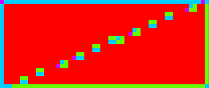
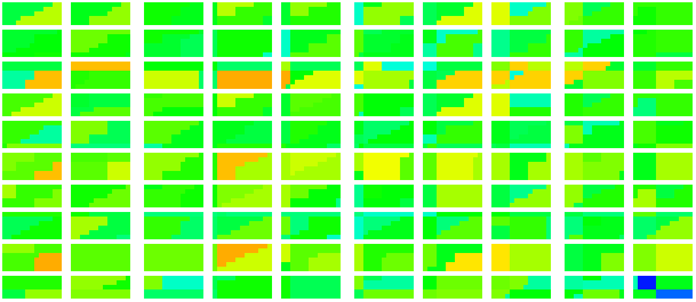
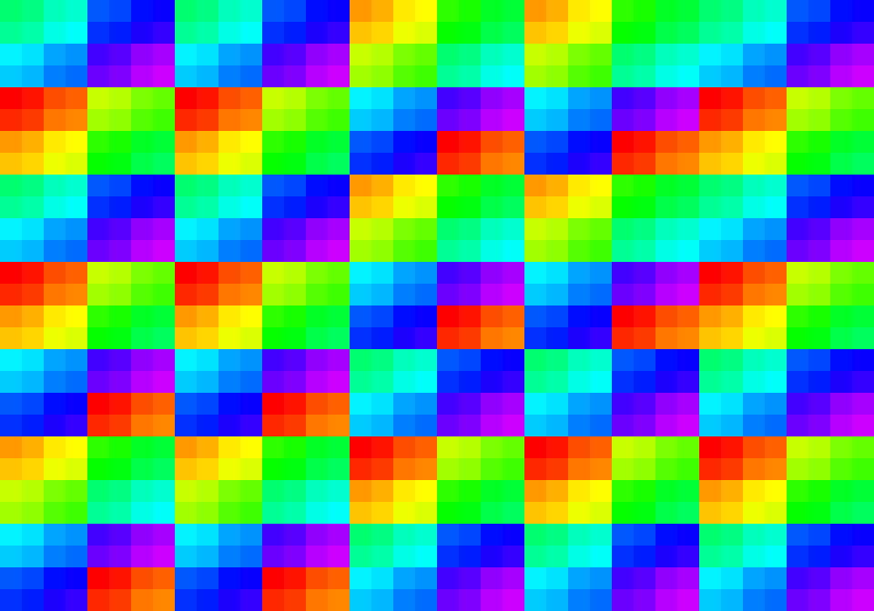
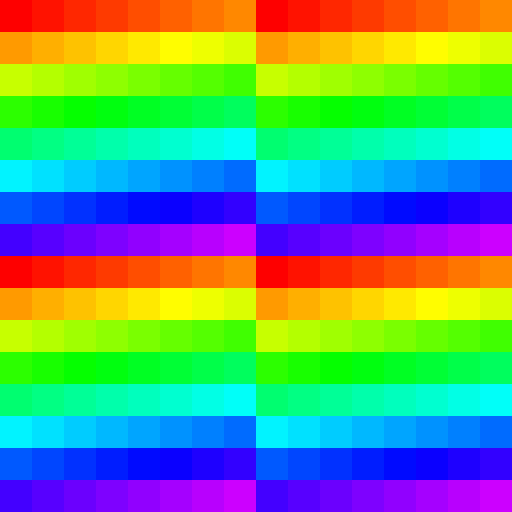

# Qualcomm Adreno 660

## Specs

* Clock: 840 MHz (790?)
* F16 GFLOPS: **3244** (1414 on MulAdd from tests)
* F32 GFLOPS: **1622** (728 on FMA from tests)
* F64 GFLOPS: **405**
* GMem size: 1.5 Mb (bandwidth?)
* L2: ? (bandwidth?)
* ALUs: 1024
* Memory: 8 GB, LPDDR5-6400, QC 16bit, 3200MHz, **51.2** GB/s (35 GB/s from tests)
* Device: Asus ROG Phone 5 (Android 13, Driver 512.530.0)

## Shader

### Quads

* Test `subgroupQuadBroadcast( gl_HelperInvocation )` without texturing - helper invocations are **not** executed (or not detected). [[6](../GPU_Benchmarks.md#6-Subgroups)]
* Test `subgroupQuadBroadcast( gl_HelperInvocation )` with texturing - helper invocations are executed, even if `Nearest` immutable sampler is used. [[6](../GPU_Benchmarks.md#6-Subgroups)] 
Red - no helper invocations, violet - 3 helper invocations per quad. 

* Test `subgroupQuadBroadcast( constant )` with/without texturing - helper invocations are executed. [[6](../GPU_Benchmarks.md#6-Subgroups)]

### Subgroups

* Subgroups in fragment shader can fill multiple triangles, even if they have different `gl_InstanceIndex`. [[6](../GPU_Benchmarks.md#6-Subgroups)]
* Subgroups in fragment shader reserve threads for helper invocations, even if they are not executed. [[6](../GPU_Benchmarks.md#6-Subgroups)]

* Subgroup occupancy for single triangle with texturing. Helper invocations are executed and included as active thread. Red color - full subgroup. [[6](../GPU_Benchmarks.md#6-Subgroups)] 

* Subgroup occupancy for single triangle without texturing. Helper invocations are not executed but threads are reserved, so occupancy is low. Red color - full subgroup. [[6](../GPU_Benchmarks.md#6-Subgroups)] 

* Subgroup occupancy for too small triangles. Red color - full subgroup. [[6](../GPU_Benchmarks.md#6-Subgroups)] 

### Subgroup threads order

Result of `Rainbow( gl_SubgroupInvocationID / gl_SubgroupSize )` in fragment shader, gl_SubgroupSize: 64. [[6](../GPU_Benchmarks.md#6-Subgroups)]

Result of `Rainbow( gl_SubgroupInvocationID / gl_SubgroupSize )` in compute shader, gl_SubgroupSize: 64, workgroup size: 8x8. [[6](../GPU_Benchmarks.md#6-Subgroups)]

### Instruction cost

* Shader instruction benchmark notes: [[4](../GPU_Benchmarks.md#4-Shader-instruction-benchmark)]
	- fp32 FMA is preferred than single FMul or separate FMulAdd
	- fp32 & i32 datapaths can execute in parallel in 2:1 rate.
	- i8 has same performance as i16, except i8 Mod which is 2x slower.
	- u8 has same performance as u16.
	- int/uint mediump/lowp has same performance as i16/u16.
	- mediump BitCount is 5x faster than i32.
	
* Shader instruction benchmark results: [[4](../GPU_Benchmarks.md#4-Shader-instruction-benchmark)]
	- base rate: 420 GOp/s

	- **float point**
	
	| op \ type | fp16 | fp32 |
	|---|---|---|
	| Add           | 0.5 | 1     |
	| Mul           | 0.5 | 1     |
	| FMA           | 3   | 1-1.5 |
	| MulAdd        | 0.5 | 1-1.5 |
	| Lerp          | 1.5 | 3     |
	| Length        | 1.5 | 1     |
	| Normalize     | 1   | 1.5   |
	| Distance      | 1.5 | 2     |
	| Dot           | 1   | 2     |
	| Cross         | 1.5 | 2     |
	| Min/Max       | 0.5 | 1     |
	| Clamp(x,0,1)  | 1   | 2     |
	| Clamp(x,-1,1) | 1   | 2     |
	| Clamp         | 1   | 2     |
	| Step          | 1.5 | 2     |
	| SmoothStep    | 1   | 3     |
	| Abs           | 0.5 |       |
	| FastSign      | 3   | 4     |
	| SignOrZero    | 0.5 | 1     |
	| BitCast       | 0.5 | 1     |
	| FloatToInt    | 1   | 1     |
	| IntToFloat    | 0.5 | 1     |
	| Ceil, Floor, Trunc, Round, RoundEven | 1 | 1 |
	| Fract         | 1   | 1.5   |
	| Exp, Exp2     | 3   | 6     |
	| Log, Log2     | 3   | 6     |
	| InvSqrt       | 3   | 6     |
	| Sqrt          | 6   | 6     |
	| Sin, Cos      | 6   | 6     |
	| Div           | 6   | 6     |
	| Mod           | 6   | 6     |
	| Pow           | 1-6 | 1.5-14 |
	| Tan           | 15  | 24    |
	| ASin, ACos    | 150 | 160   |
	| ATan          | 100 | 120   |
	
	- **integer**
	
	| op \ type | i32 | u32 | i16 | u16 |
	|---|---|---|---|---|
	| Add         | 1  | 1  | 0.5 | 0.5 | 
	| Mul         | 4  | 4  | 0.5 | 0.5 | 
	| MulAdd      | 5  | 5  | 1.5 | 1   | 
	| Div         | 42 | 24 | 14  | 7   | 
	| Mod         | 64 | 28 | 16  | 9   | 
	| Min/Max     | 1  | 1  | 0.5 | 0.5 |
	| Clamp const | 2  | 1  | 1   | 0.5 |
	| Clamp       | 1  | 1  | 0.5 | 0.5 |
	| Abs         | 1  | -  | 0.5 | -   |
	| SignOrZero  |
	| Shift const | 1  | 1  | 0.5 | 0.5 |
	| Shift       | 1  | 1  | 1   | 1   |
	| And         | 1  | 1  | 0.5 | 0.5 |
	| Or          | 1  | 1  | 0.5 | 0.5 |
	| Xor         | 1  | 1  | 0.5 | 0.5 |
	| BitCount    | 6  | 6  | -   | -   |
	| FindLSB     | 2  | 2  | 1.5 | 1.5 |
	| FindMSB     | 4  | 3  | -   | -   |
	| AddCarry    | -  | 4  | -   | -   |
	| SubBorrow   | -  | 4  | -   | -   |
	| MulExtended | 20 | 20 | -   | -   |

* FP32 instruction performance: [[2](../GPU_Benchmarks.md#2-fp32-instruction-performance)]
	- Loop unrolling is fast during pipeline creation if loop < 256.
	- Loop unrolling is 1x - 1.4x faster, 2x slower on 1024, 1.1x slower on 256.
	- Loop index with `int` and `float` has same performance.
	- Compute dispatch on 2Kx2K grid is faster, 256x256 grid is a bit slower.
	- Graphics render area 2Kx2K is faster.
	- 128 subgroup size (wave128) has no effect on performance.

	| GOp/s | exec time (ms) | ops | max GFLOPS |
	|---|---|---|---|
	| 420 | 10.2 | Add, Mul    | 420 |
	| 364 | 11.8 | FMA, MulAdd | **728** |
	
* FP16 instruction performance: [[1](../GPU_Benchmarks.md#1-fp16-instruction-performance)]

	| GOp/s | exec time (ms) | ops | max GFLOPS |
	|---|---|---|---|
	| 830 | 5.16 | Add, Mul | 830 |
	| 707 | 6.06 | MulAdd   | **1414** |
	| 117 | 36.5 | FMA      | 234 |

### NaN / Inf

* FP32, FP16. [[11](../GPU_Benchmarks.md#11-NaN)]

	| op \ type | nan1 | nan2 | nan3 | nan4 | inf | -inf | max | -max |
	|---|---|---|---|---|---|---|---|---|
	| x | nan | nan | nan | nan | inf | -inf | max | -max |
	| Min(x,0) | 0 | 0 | 0 | 0 | 0 | -inf | 0 | -max |
	| Min(0,x) | 0 | 0 | 0 | 0 | 0 | -inf | 0 | -max |
	| Max(x,0) | 0 | 0 | 0 | 0 | inf | 0 | max | 0 |
	| Max(0,x) | 0 | 0 | 0 | 0 | inf | 0 | max | 0 |
	| Clamp(x,0,1) | 0 | 0 | 0 | 0 | 1 | 0 | 1 | 0 |
	| Clamp(x,-1,1) | -1 | -1 | -1 | -1 | 1 | -1 | 1 | -1 |
	| IsNaN | 1 | 1 | 1 | 1 | 0 | 0 | 0 | 0 |
	| IsInfinity | 0 | 0 | 0 | 0 | 1 | 1 | 0 | 0 |
	| bool(x) | 1 | 1 | 1 | 1 | 1 | 1 | 1 | 1 |
	| x != x | 1 | 1 | 1 | 1 | 0 | 0 | 0 | 0 |
	| Step(0,x) | 1 | 1 | 1 | 1 | 1 | 0 | 1 | 0 |
	| Step(x,0) | 1 | 1 | 1 | 1 | 0 | 1 | 0 | 1 |
	| Step(0,-x) | 1 | 1 | 1 | 1 | 0 | 1 | 0 | 1 |
	| Step(-x,0) | 1 | 1 | 1 | 1 | 1 | 0 | 1 | 0 |
	| SignOrZero(x) | 0 | 0 | 0 | 0 | 1 | -1 | 1 | -1 |
	| SignOrZero(-x) | 0 | 0 | 0 | 0 | -1 | 1 | -1 | 1 |
	| SmoothStep(x,0,1) | 0 | 0 | 0 | 0 | 1 | 0 | 1 | 0 |
	| Normalize(x) | nan | nan | nan | nan | nan | nan | 0 | -0 |
	
* FP Mediump diff:

	| op \ type | nan1 | nan2 | nan3 | nan4 | inf | -inf | max | -max |
	|---|---|---|---|---|---|---|---|---|
	| x | nan | nan | nan | nan | inf | -inf | 65504 | -65504 |
	| Min(x,0) | 0 | 0 | 0 | 0 | 0 | -inf | 0 | -65504 |
	| Min(0,x) | 0 | 0 | 0 | 0 | 0 | -inf | 0 | -65504 |
	| Max(x,0) | 0 | 0 | 0 | 0 | inf | 0 | 65504 | 0 |
	| Max(0,x) | 0 | 0 | 0 | 0 | inf | 0 | 65504 | 0 |

### Circle performance

* small circles. [[13](../GPU_Benchmarks.md#13-Circle-geometry)]
	- 8K objects
	- 10.5MPix

	| shape | exec time (ms) | diff (%) |
	|---|---|---|
	| quad     | **2.7** | - | 
	| fan      | 3.4 | 26 |
	| strip    | 3.3 | 22 |
	| max area | 3.3 | 22 |

* 4x4 circles with blending. [[13](../GPU_Benchmarks.md#13-Circle-geometry)]
	- 10.5MPix
	- 64 layers

	| shape | exec time (ms) | diff (%) |
	|---|---|---|
	| quad     | 69.5 | -  |
	| fan      | 40.6 | 71 |
	| strip    | 40.4 | 72 |
	| max area | 40.5 | 71 |

### Branching

* Mul vs Branch vs Matrix [[12](../GPU_Benchmarks.md#12-Branching)]
	- 4.2 MPix, 128 iter, 6 mul/branch ops.
	
	| op | exec time (ms) | diff |
	|---|---|---|
	| Mul uniform        | 49.0 | 1.6 |
	| Branch uniform     | **30.7** | - |
	| Matrix uniform     | 30.8 | 1.0 |
	| - |
	| Mul non-uniform    | 70.8 | 2.3 |
	| Branch non-uniform | 56.6 | 1.8 |
	| Matrix non-uniform | 92.1 | 3.0 |
	| - |
	| Mul avg            | 60.0 | 1.95 |
	| Branch avg         | 43.7 | 1.4  |
	| Matrix avg         | 61.4 | 2.0  |

## Resource access

* Texture access 67.1MPix: [[5](../GPU_Benchmarks.md#5-Texture-lookup-performance)]
	- expected read: 268MB per frame.
	- UV bias has no effect.

	| diff | exec time (ms) | approx traffic (GB/s) | name | comments |
	|---|---|---|-------|------|
	| 0.5  | 5    | 53   | sequential access, scale x0.5   | too high calculated bandwidth because of texture cache |
	| 1    | 9.6  | 28   | sequential access, scale x1     | near to external memory bandwidth |
	| 1.3  | 12.6 | 21   | random access, noise 16x16      | |
	| 2    | 19   | 14   | sequential access, scale x1.5   | |
	| 2.1  | 20.5 | 13   | random access, noise 8x8        | |
	| 3.2  | 31   | 8.6  | sequential access, scale x2     | |
	| 5.4  | 52.5 | 5.1  | random access, noise 4x4        | |
	| 5.6  | 53.7 |  5   | random access, noise 4x4, off 1 | |
	| 15.6 | 150  | 1.78 | random access, noise 2x2        | |
	| 15.8 | 152  | 1.76 | random access, noise 2x2, off 1 | |
	| 60   | 580  | 0.46 | random access, noise 1x1        | |
	| 60   | 578  | 0.46 | random access, noise 1x1, off 1 | |
	
* Buffer/Image storage 16bpp 16.7MPix 2x267MB [[7](../GPU_Benchmarks.md#7-BufferImage-storage-access)]

	| diff (%) | exec time (ms) | approx traffic (GB/s) | name | comments |
	|---|---|---|------|----|
	| 0   | **15.2** | 35 | Buffer load/store, 16 byte, wg:64  |
	| 27  | 19.3 | 28 | Buffer load/store, 32 byte, wg:64       |
	| 15  | 17.5 | 31 | Buffer load/store, 64 byte, wg:64       |
	| 18  | 18.0 | 30 | Buffer load/store, 128 byte, wg:64      |
	| 20  | 18.3 | 29 | Buffer load/store, 16 byte, wg:8x8      |
	| 91  | 29.0 | 18 | Buffer load/store, 32 byte, wg:8x8      |
	| 55  | 23.5 | 23 | Buffer load/store, 64 byte, wg:8x8      |
	| 33  | 20.2 | 26 | Buffer load/store, 128 byte, wg:8x8     |
	| 53  | 23.3 | 23 | Buffer load/store, 16 byte, wg:16x16    |
	| 61  | 24.4 | 22 | Buffer load/store, 32 byte, wg:16x16    |
	| 26  | 19.2 | 28 | Buffer load/store, 64 byte, wg:16x16    |
	| 25  | 19.0 | 28 | Buffer load/store, 128 byte, wg:16x16   |
	| 53  | 23.3 | 23 | Buffer load/store in FS                                 |
	| 2   | **15.5** | 34 | Image load/store, wg 16x16, row major               | |
	| 15  | 17.5 | 31 | Image load/store, wg 8x8, row major                     | |
	| 15  | 17.5 | 31 | Image load/store, wg 8x8, group reorder, row major      | group reorder has no effect |
	| 55  | 23.5 | 23 | Image read/write input attachment RGBA32F               | RT compression is not supported, same performance as buffer in FS |
	| 49  | 22.6 | 24 | Image fetch/sample in FS with double buffering          | a bit faster because of texture cache |
	| 5   | 16.0 | 33 | Image read/write input attachment 2xRGBA16, noise 2x2   | 
	| -22 | 12.5 | 43 | Image read/write input attachment 2xRGBA16, noise 4x4   |
	| -28 | 11.9 | 45 | Image read/write input attachment 2xRGBA16, noise 8x8   |
	| -33 | 11.4 | 47 | Image read/write input attachment 2xRGBA16, noise 16x16 | noise size equal to RT compressed block |
	| 74  | 26.4 | 20 | Image load/store, wg 8x8, column major                  | |

## Render target compression

* RGBA8 268MPix downsample 1/2, compressed/uncompressed access: [[3](../GPU_Benchmarks.md#3-Render-target-compression)]
	- expected read: 1.07GB, write: 268MB, total: 1.34GB per frame.
	- 8x8 noise linear/fetch/nearest has same perf.
	- 16x16 noise linear is faster. Linear filter minimize L2 cache misses on high compression rate.
	- graphics to compute: solid color: 68ms, gradient: 72ms, 1x1 noise: 80ms.
	- with storage usage flag - perf same as for graphics.

	| diff | exec time (ms) | approx traffic (GB/s) | name | comments |
	|---|---|---|------|----|
	| 1   | 72   | 18.6  | image storage | |
	| 1.7 | 42   | 31.9  | 1x1 noise     | near to external memory bandwidth |
	| 1.6 | 44   | 30.4  | 2x2 noise     | |
	| 2.2 | 32   | 41.9  | 4x4 noise     | |
	| 2.5 | 29   | 46.2  | 8x8 noise     | |
	| 3.3 | 22   | 60.9  | 16x16 noise   | **same as block size** |
	| 3.4 | 21   | 63.8  | gradient      | |
	| 6.9 | 10.4 | 128.8 | solid color   | |

* RGBA16_UNorm, RGBA16F - RT compression is supported. [[3](../GPU_Benchmarks.md#3-Render-target-compression)]

	| diff | exec time (ms) | name |
	|---|---|---|
	| 1   | 150 | image storage |
	| 2   |  75 | 1x1 noise     |
	| 3.3 |  45 | solid color   |

* RGBA32F - RT compression is **not** supported. [[3](../GPU_Benchmarks.md#3-Render-target-compression)]

## Texture cache

* RGBA8_UNorm texture with random access [[9](../GPU_Benchmarks.md#9-Texture-cache)]
	- Measured cache size: 2 KB, 4 KB (?), 128 KB.
	- 8 texels per pixel, dim ???

	| size (KB) | dimension (px) | exec time (ms) | diff | approx bandwidth (GB/s) | comments |
	|---|---|---|---|---|---|
	|   1     |  16x16  |  TODO |         |  |
	| **2**   |  32x16  |  2.3  |         | TODO | L1 cache |
	| **4**   |  32x32  |  7    | **3**   | |
	|  16     |  64x64  |  12.4 | **1.8** | |
	| **128** | 256x128 |  14   |         | | L2 cache |
	| 256     | 256x256 |  44   | **3**   | |
