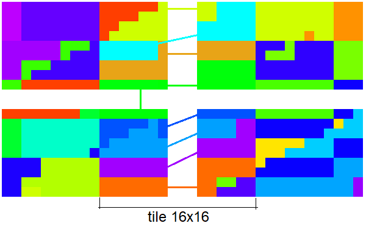
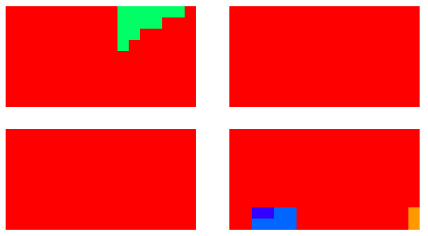
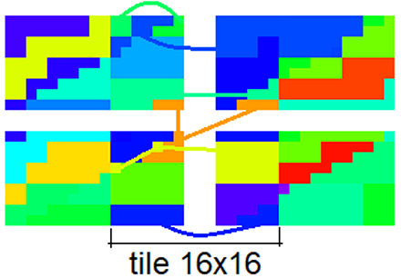
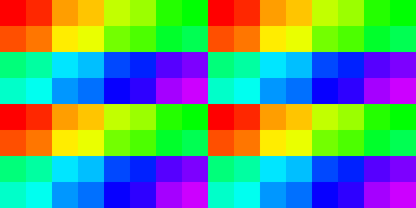

# Apple-M1

## Specs

* L2: 768K
* L3: 8M
* Cores: 8
* ALUs: 1024
* Execution units: 128
* Clock: 450 - 1278 MHz
* F16 GFLOPS: 2617 (2380 on FMA from tests)
* F32 GFLOPS: 2617 (2360 on FMA from tests)
* Memory: 16 GB, LPDDR4X-4266 DC 16bit, 2133 MHz, 128bit Bus, 68.25 GB/s (64.3 GB/s from tests)

## Shader

### Quads

* Quads on edge between 2 triangles are not merged, so 2 near pixels may execute up to 6 helper invocations.
* Test `subgroupQuadBroadcast( gl_HelperInvocation )` with/without texturing - helper invocations are executed. [[6](../GPU_Benchmarks.md#6-Subgroups)]
* Test `subgroupQuadBroadcast( constant )` with/without texturing - helper invocations are executed. [[6](../GPU_Benchmarks.md#6-Subgroups)]

### Subgroups

* Subgroup occupancy for single triangle. Helper invocations are executed and included as active thread. Red color - full subgroup. [[6](../GPU_Benchmarks.md#6-Subgroups)] 

* Result of `Rainbow( Hash( subgroupAdd( gl_FragCoord.xy )))` for 4 quads without instancing. [[6](../GPU_Benchmarks.md#6-Subgroups)] 
 
Subgroup occupancy, red - full subgroup (32 threads), green: ~16 threads per subgroup. 

	
* Result of `Rainbow( Hash( subgroupAdd( gl_FragCoord.xy )))` for 4 quads with instancing, first instance - first triangle in quad, second instance - second triangle. [[6](../GPU_Benchmarks.md#6-Subgroups)] 
Can fill multiple triangles with the same `gl_InstanceIndex` with single subgroup inside tile (16x16 pix) 
 
Subgroup occupancy, red - full subgroup (32 threads), green: ~16 threads per subgroup. 

### Subgroup threads order

Result of `Rainbow( gl_SubgroupInvocationID / gl_SubgroupSize )` in fragment shader, gl_SubgroupSize: 32. [[6](../GPU_Benchmarks.md#6-Subgroups)]

Result of `Rainbow( gl_SubgroupInvocationID / gl_SubgroupSize )` in compute shader, gl_SubgroupSize: 32, workgroup size: 8x8. [[6](../GPU_Benchmarks.md#6-Subgroups)]

### Instruction cost

* Shader instruction benchmark notes: [[4](../GPU_Benchmarks.md#4-Shader-instruction-benchmark)]
	- fp32 & i32 datapaths can execute in parallel in 2:1 rate
	- fp32 FastATan is x4.8 faster than native ATan
	- fp32 FastACos is x2.1 faster than native ACos
	- fp32 FastASin is x2.0 faster than native ASin
	- fp32 Pow uses MUL loop - performance depends on power
	- fp mediump has same performance as highp.
	
* Shader instruction benchmark results: [[4](../GPU_Benchmarks.md#4-Shader-instruction-benchmark)]
	- base is 1.3 TOp/s

	- **float point**
	
	| op \ type | fp32 | fp16 |
	|---|---|---|
	| Add           | 1   | 1 |
	| Mul           | 1   | 1 |
	| MulAdd        | 1   | 1 |
	| FMA           | 1   | 1 |
	| Div           | 4   |
	| Mod           | 8   |
	| Length        | 2   |
	| Distance      | 3   |
	| Normalize     | 3   |
	| BitCast       | 4   |
	| FloatToInt    | 1   |
	| IntToFloat    | 2   |
	| Abs           | 3   |
	| Min/Max       | 1   |
	| Clamp(x,0,1)  | 3   |
	| Clamp(x,-1,1) | 3   |
	| Clamp         | 3   |
	| Dot           | 3   |
	| Cross         | 3   |
	| Sign, SignOrZero | 3 |
	| Step          | 3   |
	| SmoothStep    | 4   |
	| InvSqrt       | 5   |
	| Sqrt          | 5   |
	| Cbrt          | 5.5 |
	| Lerp          | 5   |
	| Exp, Exp2     | 3   |
	| Log, Log2     | 3   |
	| Pow           | 3+  |
	| Floor, Fract, Ceil, RoundEven, Trunc | 3  |
	| Round         | 6   |
	| Sin, Cos      | 9   |
	| Tan           | 24  |
	| ATan          | 80  |
	
	- **integer**
	
	| op \ type | i32 | u32 | i16 | u16 |
	|---|---|---|---|---|
	| Add         | 1   | 1   | 1   | 1   |
	| Mul         | 2   | 2   | 2.5 | 2.5 |
	| MulAdd      | 2.5 | 2.5 | 2.5 | 2.5 |
	| Div         | 24  | 30  | 20  | 18  |
	| Mod         | 24  | 30  | 22  | 22  |
	| Shift const | 2   | 2   | 2   | 2   |
	| Shift       | 2   | 2   | 2   | 2   |
	| And         | 1   | 1   | 1   | 1   |
	| Or          | 1   | 1   | 1   | 1   |
	| Xor         | 1   | 1   | 1   | 1   |
	| Min/Max     | 1   | 1   | 1   | 1   |
	| Clamp const | 2   | 1   | 2   | 1   |
	| Clamp       | 2   | 1   | 2   | 2   |
	| BitCount    | 2   | 2   | -   | -   |
	| FindLSB     | 3   | 3   | 3   | 3   |
	| FindMSB     | 4   | 3   | -   | -   |
	| MulExtended | 6   | 6   | -   | -   |
	| AddCarry, SubBorrow | - | 3 | - | - |

	
* FP32 instruction performance: [[2](../GPU_Benchmarks.md#2-fp32-instruction-performance)]
	- Compute dispatch on  grid is faster.
	- Graphics render area  is faster.

	| Gop/s | op | GFLOPS |
	|---|---|---|
	| 950  | Add    | 950  |
	| 890  | MulAdd | 1780 |
	| 1180 | FMA    | **2360** |
	
* FP16 instruction performance: [[1](../GPU_Benchmarks.md#1-fp16-instruction-performance)]
	- scalar fp16.
	
	| Gop/s | op | GFLOPS |
	|---|---|---|
	| 1190 | Add, Mul    | 1190 |
	| 1190 | MulAdd, FMA | **2380** |

### NaN / Inf

* FP32, Mediump, FP16. [[11](../GPU_Benchmarks.md#11-NaN)]

	| op \ type | nan1 | nan2 | nan3 | nan4 | inf | -inf | max | -max |
	|---|---|---|---|---|---|---|---|---|
	| x | nan | nan | nan | nan | inf | -inf | max | -max |
	| Min(x,0) | 0 | 0 | 0 | 0 | 0 | -inf | 0 | -max |
	| Min(0,x) | 0 | 0 | 0 | 0 | 0 | -inf | 0 | -max |
	| Max(x,0) | 0 | 0 | 0 | 0 | inf | 0 | max | 0 |
	| Max(0,x) | 0 | 0 | 0 | 0 | inf | 0 | max | 0 |
	| Clamp(x,0,1) | 0 | 0 | 0 | 0 | 1 | 0 | 1 | 0 |
	| Clamp(x,-1,1) | -1 | -1 | -1 | -1 | 1 | -1 | 1 | -1 |
	| IsNaN | 1 | 1 | 1 | 1 | 0 | 0 | 0 | 0 |
	| IsInfinity | 0 | 0 | 0 | 0 | 1 | 1 | 0 | 0 |
	| bool(x) | 1 | 1 | 1 | 1 | 1 | 1 | 1 | 1 |
	| x != x | 0 | 0 | 0 | 0 | 0 | 0 | 0 | 0 |
	| Step(0,x) | 0 | 0 | 0 | 0 | 1 | 0 | 1 | 0 |
	| Step(x,0) | 0 | 0 | 0 | 0 | 0 | 1 | 0 | 1 |
	| Step(0,-x) | 0 | 0 | 0 | 0 | 0 | 1 | 0 | 1 |
	| Step(-x,0) | 0 | 0 | 0 | 0 | 1 | 0 | 1 | 0 |
	| SignOrZero(x) | 0 | 0 | 0 | 0 | 1 | -1 | 1 | -1 |
	| SignOrZero(-x) | 0 | 0 | 0 | 0 | -1 | 1 | -1 | 1 |
	| SmoothStep(x,0,1) | 0 | 0 | 0 | 0 | 1 | 0 | 1 | 0 |
	| Normalize(x) | nan | nan | nan | nan | nan | nan | 0 | -0 |

### Circle performance

* small circles. [[13](../GPU_Benchmarks.md#13-Circle-geometry)]
	- 64K objects
	- 22.9MPix

	| shape | exec time (ms) | diff |
	|---|---|---|
	| quad     | **0.62** | -   |
	| fan      | 1.61 | 2.6 |
	| strip    | 1.69 | 2.7 |
	| max area | 1.71 | 2.7 |

* 4x4 circles with blending. [[13](../GPU_Benchmarks.md#13-Circle-geometry)]
	- 6128 layers
	- 5.73MPix

	| shape | exec time (ms) | diff (%) |
	|---|---|---|
	| quad     | **10.1** | -  |
	| fan      | 8.2  | 23 |
	| strip    | 8.2  | 23 |
	| max area | 8.2  | 23 |

### Branching

* Mul vs Branch vs Matrix [[12](../GPU_Benchmarks.md#12-Branching)]
	- 16.7 MPix, 128 iter, 6 mul/branch ops.
	
	| op | exec time (ms) | diff |
	|---|---|---|
	| Mul uniform        | 57.0 | 1.1 |
	| Branch uniform     | **51.8** | - |
	| Matrix uniform     | 40.6 | 0.8 |
	| - |
	| Mul non-uniform    | 71.4 | 1.38 |
	| Branch non-uniform | 55.2 | 1.07 |
	| Matrix non-uniform | 90.4 | 1.75 |
	| - |
	| Mul avg            | 64.2 | 1.24 |
	| Branch avg         | 53.2 | 1.03 |
	| Matrix avg         | 65.5 | 1.26 |

## Render target compression

* RGBA8 268 MPix downsample 1/2, compressed/uncompressed access rate: [[3](../GPU_Benchmarks.md#3-Render-target-compression)]
	- read: 1074 MB

	| diff | exec time (ms) | approx traffic (GB/s) | name | comments |
	|---|---|---|------|----|
	| 1    | 16.7 | 64.3 | image storage |
	| 1.27 | 13.1 | 82   | 1x1 noise     |
	| 1.56 | 10.7 | 100  | 2x2 noise     |
	| 2.61 | 6.4  | 168  | 4x4 noise     |
	| 4.4  | 3.8  | 283  | 8x8 noise     | **same as block size** |
	| 4.4  | 3.8  | 283  | 16x16 noise   |
	| 4.4  | 3.8  | 283  | gradient      |
	| 4.4  | 3.8  | 283  | solid color   |
	
* RGBA16_UNorm 151 MPix downsample 1/2, compressed/uncompressed access rate: [[3](../GPU_Benchmarks.md#3-Render-target-compression)]
	- read: 1 207 MB

	| diff | exec time (ms) | approx traffic (GB/s) | name | comments |
	|---|---|---|------|----|
	| 1   | 23.9 | 50,5 | image storage |
	| 1.6 | 14.9 | 81   | 1x1 noise     |
	| 1.9 | 12.8 | 94.3 | 2x2 noise     |
	| 3.1 | 7.7  | 157  | 4x4 noise     |
	| 5.0 | 4.8  | 251  | gradient      |
	| 11  | 2.2  | 549  | 8x8 noise     | **same as block size** |
	| 11  | 2.2  | 549  | 16x16 noise   |
	| 11  | 2.2  | 549  | solid color   |
	
* RGBA32F 67.1 MPix downsample 1/2, compressed/uncompressed access rate: [[3](../GPU_Benchmarks.md#3-Render-target-compression)]
	- read: 1074 MB

	| diff | exec time (ms) | approx traffic (GB/s) | name | comments |
	|---|---|---|------|----|
	| 1   | 21.3 | 50.4 | image storage 1x1 noise |
	| 1.6 | 13.2 | 81   | 1x1 noise   |
	| 1.8 | 12.0 | 90   | 2x2 noise   |
	| 2.9 | 7.4  | 145  | 4x4 noise   |
	| 3.1 | 6.8  | 158  | gradient    |
	| 11  | 2.0  | 537  | 8x8 noise   | **same as block size** |
	| 11  | 2.0  | 537  | 16x16 noise |
	| 11  | 2.0  | 537  | solid color |

## Texture cache

* RGBA8_UNorm texture with random access [[9](../GPU_Benchmarks.md#9-Texture-cache)]
	- Measured cache size: 32K, 1MB.
	- dim: 6400x3584
	- 8 texels per pixel, 22.9MPix, 2 930 MB.

	| size (B) | dimension (px) | exec time (ms) | diff | approx bandwidth (GB/s) | comments |
	|---|---|---|---|---|---|
	| 64   | 4x4       | 2.74 | -    | 1070 |
	| 128  | 4x8       | 2.80 | 1.02 | 1046 |
	| 256  | 8x8       | 3.40 | 1.21 |  862 |
	| 512  | 8x16      | 3.68 | 1.08 |  796 |
	| 1K   | 16x16     | 3.82 | 1.04 |  767 |
	| 2K   | 16x32     | 5.09 | **1.33** |  576 |
	| 4K   | 32x32     | 6.21 | 1.22 |  472 |
	| 8K   | 32x64     | 6.76 | 1.09 |  433 |
	| 16K  | 64x64     | 7.03 | 1.04 |  417 |  
	| **32K** | 128x64 | 9.80 | 1.39 |  300 | L1 cache |
	| 64K  | 128x128   | 24.4 | **2.5** | 120 |
	| 128K | 256x128   | 31.9 | 1.31 | 92 |
	| 256K | 256x256   | 35.5 | 1.11 | 82 |
	| 512K | 512x256   | 37.4 | 1.05 | 78 |
	| **1M** | 512x512  | 49.3 | 1.32 | 59 | near to RAM bandwidth, should be L2 cache |
	| 2M   | 512x1024  | 95.4 | **1.93** | 31 |
	| 4M   | 1024x1024 | 120  | 1.26 | 24 |
