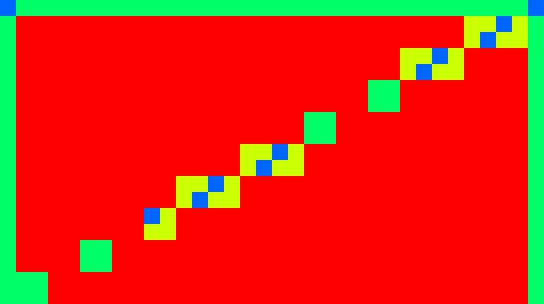

# Apple-M1

## Specs

* L2: 768K
* L3: 8M
* Cores: 8
* ALUs: 1024
* Execution units: 128
* Clock: 450 - 1278 MHz
* F16 GFLOPS: 2617 (2380 on FMA from tests)
* F32 GFLOPS: 2617 (2360 on FMA from tests)
* Memory: 16 GB, LPDDR4X-4266 DC 16bit, 2133 MHz, 128bit Bus, 68.25 GB/s

## Shader

### Quads

* Quads on edge between 2 triangles are not merged, so 2 near pixels may execute up to 6 helper invocations.
* Test `subgroupQuadBroadcast( gl_HelperInvocation )` with/without texturing - helper invocations are executed. [[6](../GPU_Benchmarks.md#6-Subgroups)]
* Test `subgroupQuadBroadcast( constant )` with/without texturing - helper invocations are executed. [[6](../GPU_Benchmarks.md#6-Subgroups)]

### Subgroups

* Subgroup occupancy for single triangle. Helper invocations are executed and included as active thread. Red color - full subgroup. [[6](../GPU_Benchmarks.md#6-Subgroups)] 

* Result of `Rainbow( Hash( subgroupAdd( gl_FragCoord.xy )))` for 4 quads without instancing. [[6](../GPU_Benchmarks.md#6-Subgroups)] 
 
Subgroup occupancy, red - full subgroup (32 threads), green: ~16 threads per subgroup. 

	
* Result of `Rainbow( Hash( subgroupAdd( gl_FragCoord.xy )))` for 4 quads with instancing, first instance - first triangle in quad, second instance - second triangle. [[6](../GPU_Benchmarks.md#6-Subgroups)] 
Can fill multiple triangles with the same `gl_InstanceIndex` with single subgroup inside tile (16x16 pix) 
 
Subgroup occupancy, red - full subgroup (32 threads), green: ~16 threads per subgroup. 

### Subgroup threads order

Result of `Rainbow( gl_SubgroupInvocationID / gl_SubgroupSize )` in fragment shader, gl_SubgroupSize: 32. [[6](../GPU_Benchmarks.md#6-Subgroups)]

Result of `Rainbow( gl_SubgroupInvocationID / gl_SubgroupSize )` in compute shader, gl_SubgroupSize: 32, workgroup size: 8x8. [[6](../GPU_Benchmarks.md#6-Subgroups)]

### Instruction cost

* Shader instruction benchmark notes: [[4](../GPU_Benchmarks.md#4-Shader-instruction-benchmark)]
	- fp32 & i32 datapaths can execute in parallel in 2:1 rate
	- fp32 FastATan is x4.8 faster than native ATan
	- fp32 FastACos is x2.1 faster than native ACos
	- fp32 FastASin is x2.0 faster than native ASin
	- fp32 Pow uses MUL loop - performance depends on power

	
* Shader instruction benchmark results: [[4](../GPU_Benchmarks.md#4-Shader-instruction-benchmark)]
	- base is 1.3 TOp/s

	- **float point**
	
	| op \ type | fp32 |
	|---|---|
	| Add           | 1   |
	| Mul           | 1   |
	| MulAdd        | 1   |
	| FMA           | 1   |
	| Div           | 4   |
	| Mod           | 8   |
	| Length        | 2   |
	| Distance      | 3   |
	| Normalize     | 3   |
	| BitCast       | 4   |
	| FloatToInt    | 1   |
	| IntToFloat    | 2   |
	| Abs           | 3   |
	| Min/Max       | 1   |
	| Clamp(x,0,1)  | 3   |
	| Clamp(x,-1,1) | 3   |
	| Clamp         | 3   |
	| Dot           | 3   |
	| Cross         | 3   |
	| Sign, SignOrZero | 3 |
	| Step          | 3   |
	| SmoothStep    | 4   |
	| InvSqrt       | 5   |
	| Sqrt          | 5   |
	| Cbrt          | 5.5 |
	| Lerp          | 5   |
	| Exp, Exp2     | 3   |
	| Log, Log2     | 3   |
	| Pow           | 3+  |
	| Floor, Fract, Ceil, RoundEven, Trunc | 3  |
	| Round         | 6   |
	| Sin, Cos      | 9   |
	| Tan           | 24  |
	| ATan          | 80  |
	
	- **integer**
	
	| op \ type | i32 | u32 | i16 | u16 |
	|---|---|---|---|---|
	| Add         | 1   | 1   | 1   | 1   |
	| Mul         | 2   | 2   | 2.5 | 2.5 |
	| MulAdd      | 2.5 | 2.5 | 2.5 | 2.5 |
	| Div         | 24  | 30  | 20  | 18  |
	| Mod         | 24  | 30  | 22  | 22  |
	| Shift const | 2   | 2   | 2   | 2   |
	| Shift       | 2   | 2   | 2   | 2   |
	| And         | 1   | 1   | 1   | 1   |
	| Or          | 1   | 1   | 1   | 1   |
	| Xor         | 1   | 1   | 1   | 1   |
	| Min/Max     | 1   | 1   | 1   | 1   |
	| Clamp const | 2   | 1   | 2   | 1   |
	| Clamp       | 2   | 1   | 2   | 2   |
	| BitCount    | 2   | 2   | -   | -   |
	| FindLSB     | 3   | 3   | 3   | 3   |
	| FindMSB     | 4   | 3   | -   | -   |
	| MulExtended | 6   | 6   | -   | -   |
	| AddCarry, SubBorrow | -   | 3   | - | - |

	
* FP32 instruction performance: [[2](../GPU_Benchmarks.md#2-fp32-instruction-performance)]
	- Compute dispatch on  grid is faster.
	- Graphics render area  is faster.

	| Gop/s | op | GFLOPS |
	|---|---|---|
	| 950  | Add    | 950  |
	| 890  | MulAdd | 1780 |
	| 1180 | FMA    | **2360** |
	
* FP16 instruction performance: [[1](../GPU_Benchmarks.md#1-fp16-instruction-performance)]
	- scalar fp16.
	
	| Gop/s | op | GFLOPS |
	|---|---|---|
	| 1190 | Add, Mul    | 1190 |
	| 1190 | MulAdd, FMA | **2380** |

### NaN / Inf

* FP32, Mediump, FP16. [[11](../GPU_Benchmarks.md#11-NaN)]

	| op \ type | nan1 | nan2 | nan3 | nan4 | inf | -inf | max | -max |
	|---|---|---|---|---|---|---|---|---|
	| x | nan | nan | nan | nan | inf | -inf | max | -max |
	| Min(x,0) | 0 | 0 | 0 | 0 | 0 | -inf | 0 | -max |
	| Min(0,x) | 0 | 0 | 0 | 0 | 0 | -inf | 0 | -max |
	| Max(x,0) | 0 | 0 | 0 | 0 | inf | 0 | max | 0 |
	| Max(0,x) | 0 | 0 | 0 | 0 | inf | 0 | max | 0 |
	| Clamp(x,0,1) | 0 | 0 | 0 | 0 | 1 | 0 | 1 | 0 |
	| Clamp(x,-1,1) | -1 | -1 | -1 | -1 | 1 | -1 | 1 | -1 |
	| IsNaN | 1 | 1 | 1 | 1 | 0 | 0 | 0 | 0 |
	| IsInfinity | 0 | 0 | 0 | 0 | 1 | 1 | 0 | 0 |
	| bool(x) | 1 | 1 | 1 | 1 | 1 | 1 | 1 | 1 |
	| x != x | 0 | 0 | 0 | 0 | 0 | 0 | 0 | 0 |
	| Step(0,x) | 0 | 0 | 0 | 0 | 1 | 0 | 1 | 0 |
	| Step(x,0) | 0 | 0 | 0 | 0 | 0 | 1 | 0 | 1 |
	| Step(0,-x) | 0 | 0 | 0 | 0 | 0 | 1 | 0 | 1 |
	| Step(-x,0) | 0 | 0 | 0 | 0 | 1 | 0 | 1 | 0 |
	| SignOrZero(x) | 0 | 0 | 0 | 0 | 1 | -1 | 1 | -1 |
	| SignOrZero(-x) | 0 | 0 | 0 | 0 | -1 | 1 | -1 | 1 |
	| SmoothStep(x,0,1) | 0 | 0 | 0 | 0 | 1 | 0 | 1 | 0 |
	| Normalize(x) | nan | nan | nan | nan | nan | nan | 0 | -0 |
