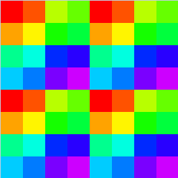

# Intel UHD 620 (Gen9)

## Specs

* Arch: Kaby Lake-R
* Clock: 300 / 1000 MHz
* Pixel Rate: 3.000 GPixel/s
* Texture Rate: 24.00 GTexel/s
* FP16 GFLOPS: **768.0** (825 GFLOPS from tests)
* FP32 GFLOPS: **384.0** (416 GFLOPS from tests)
* FP64 GFLOPS: **96.00**
* Execution Units: 24
* warp size: 16
* Memory: 8GB LPDDR3, 1867MHz, **29.8** GB/s (23 GB/s from tests)
* Driver: 0.404.2128

## Shader

### Quads

* Test `subgroupQuadBroadcast( gl_HelperInvocation )` with/without texturing - helper invocations are executed. [[6](../GPU_Benchmarks.md#6-Subgroups)]
* Test `subgroupQuadBroadcast( constant )` with/without texturing - helper invocations are executed. [[6](../GPU_Benchmarks.md#6-Subgroups)]

### Subgroups

* Subgroups in fragment shader can not fill multiple triangles. This leads to unused threads in subgroup. [[6](../GPU_Benchmarks.md#6-Subgroups)]

### Subgroup threads order

Result of `Rainbow( gl_SubgroupInvocationID / gl_SubgroupSize )` in fragment shader, gl_SubgroupSize: 16. [[6](../GPU_Benchmarks.md#6-Subgroups)]

Result of `Rainbow( gl_SubgroupInvocationID / gl_SubgroupSize )` in compute shader, gl_SubgroupSize: 16, workgroup size: 8x8. [[6](../GPU_Benchmarks.md#6-Subgroups)]

### Instruction cost

* [[2](../GPU_Benchmarks.md#2-fp32-instruction-performance)]:
	- Better loop unrolling if count <= 128.
	- Compute is 1.07x faster than graphics.
	- Compute dispatch on 512x512 grid is faster.
	
	| GOp/s | exec time (ms) | ops | max GFLOPS | comments |
	|---|---|---|
	| **397** | | Add              | 397 |
	| **208** | | Mul, MulAdd, FMA | **416** |

* [[1](../GPU_Benchmarks.md#1-fp16-instruction-performance)]:
	
	| GOp/s | exec time (ms) | ops | max GFLOPS | comments |
	|---|---|---|
	| **835** | | Add              | **825** |
	| **397** | | Mul, MulAdd, FMA | 794 |

### NaN / Inf

* Float32, Float16.

	| op | qnan | snan | inf | max*2 | max |
	|---|---|---|---|---|---|
	| min(x,0)          | 0  | 0  | 0       | 0       | 0   |
	| max(x,0)          | 0  | 0  | **inf** | **inf** | max |
	| clamp(x,0,1)      | 0  | 0  | 1       | 1       | 1   |
	| bool(x)           | 1  | 1  | 1       | 1       | 1   |
	| x != x            | 1  | 1  | 0       | 0       | 0   |
	| step(0,x)         | 1  | 1  | 1       | 1       | 1   |
	| step(0,-x)        | 1  | 1  | 0       | 0       | 0   |
	| sign(x)           | -1 | -1 | 1       | 1       | 1   |
	| sign(-x)          | -1 | -1 | -1      | -1      | -1  |
	| smoothstep(0,1,x) | 0  | 0  | 1       | 1       | 1   |
	| isnan             | 1  | 1  | 0       | 0       | 0   |
	| isinf             | 0  | 0  | 1       | 1       | 0   |

* Mediump - same as Float32, except:

	| op | qnan | snan | inf | max*2 | max |
	|---|---|---|---|---|---|
	| max(x,0)          | 0  | 0  | **inf** | **inf** | **inf** |
	| isnan             | 0  | 0  | 0       | 0       | 0       |
	| isinf             | 0  | 0  | 1       | 1       | **1**   |
	
* Double - same as Float32, except:

	| op | qnan | snan | inf | max*2 | max |
	|---|---|---|---|---|---|
	| max(x,0)          | 0  | 0  | **inf** | **inf** | **inf** |
	| isnan             | 0  | 0  | 0       | 0       | 0       |
	| isinf             | 0  | 0  | 1       | 1       | **0**   |

### Noise performance

| name | thread count | exec time (ms) | per thread (ns) |
|---|---|---|---|---|
| ValueNoise                    | 4.19M | 3.32 |  0.79 |
| PerlinNoise                   | 4.19M | 4.72 |  1.13 |
| SimplexNoise                  | 4.19M | 4.97 |  1.19 |
| Voronoi, 2D                   | 4.19M | 5.04 |  1.20 |
| GradientNoise                 | 4.19M | 5.09 |  1.21 |
| WaveletNoise                  | 4.19M | 5.07 |  1.21 |
| ValueNoiseFBM, octaves=4      | 1.05M | 3.04 |  2.89 |
| WarleyNoise                   | 1.05M | 3.83 |  3.65 |
| Voronoi, 3D                   | 1.05M | 3.82 |  3.84 |
| VoronoiCircles                | 1.05M | 4.2  |  4.0  |
| SimplexNoiseFBM, octaves=4    | 1.05M | 4.45 |  4.24 |
| PerlinNoiseFBM, octaves=4     | 1.05M | 4.49 |  4.28 |
| GradientNoiseFBM, octaves=4   | 1.05M | 4.89 |  4.66 |
| VoronoiContour2, 2D           | 1.05M | 7.41 |  7.06 |
| VoronoiContour3, 2D           | 1.05M | 7.52 |  7.16 |
| WarleyNoiseFBM, octaves=4     | 262K  | 3.77 | 14.4  |
| IQNoise                       | 262K  | 6.88 | 26.3  |
| VoronoiContour3, 3D           | 262K  | 9.89 | 37.7  |
| VoronoiContour2, 3D           | 262K  | 10.1 | 38.5  |
| IQNoiseFBM, octaves=4         | 262K  | 28.5 | 109   |
| VoronoiContourFBM, octaves=4  | 262K  | 41.5 | 158   |
| VoronoiContour3FBM, octaves=4 | 262K  | 41.5 | 158   |

## Resource access

* Buffer/Image storage 16bpp 9.4MPix 2x151MB [[7](../GPU_Benchmarks.md#7-BufferImage-storage-access)]

	| diff (%) | exec time (ms) | approx traffic (GB/s) | name | comments |
	|---|---|---|------|----|
	| 28  | 16.6  | 18.2 | Image load/store, workgroup 8x8, column major, group reorder | |
	| 28  | 16.6  | 18.2 | Image load/store, workgroup 8x8, column major | |
	| 15  | 15.0  | 20.1 | Image read/write input attachment, RGBA32F    | **RT decompression happens** |
	| 13  | 14.66 | 20.6 | Image fetch/sample from another, 1x1 noise    | |
	| 12  | 14.6  | 20.7 | Buffer load/store in FS, 16 bytes             | |
	|  9  | 14.2  | 21.3 | Image load/store, workgroup 16x16             | |
	|  8  | 14.0  | 21.6 | Buffer load/store, workgroup 128, 64 bytes    | |
	|  8  | 14.0  | 21.6 | Buffer load/store, workgroup 128, 16 bytes    | |
	|  5  | 13.7  | 22.0 | Buffer load/store, workgroup 8x8, 32 bytes    | |
	|  5  | 13.7  | 22.0 | Buffer load/store, workgroup 128, 128 bytes   | |
	|  3  | 13.45 | 22.5 | Image load/store, workgroup 8x8, row major    | |
	|  3  | 13.4  | 22.5 | Buffer load/store, workgroup 16x16, 32 bytes  | |
	|**0**| 13.0  | 23   | Buffer load/store, workgroup 128, 32 bytes    | 32 byte L2 cache line |
	| -20 | 10.8  | 28   | Image fetch/sample from another, 8x8 noise    | |

## Render target compression

* RGBA8 67.1MPix downsample 1/2, compressed/uncompressed access rate: [[3](../GPU_Benchmarks.md#3-Render-target-compression)]
	- expected read: 268.4MB, write: 67.1MB, total: 335MB per frame.
	- linear/nearest/fetch has same perf.
	- image storage linear/fetch/load has same perf.
	- graphics to compute 1x1 noise: load 20ms.
	- graphics to compute 8x8 noise: load 30ms. Decompression overhead?
	- graphics to compute 8x8 noise: linear sample 13ms (2.3x).

	| diff | exec time (ms) | approx traffic (GB/s) | name | comments |
	|---|---|---|------|----|
	| 1   | 20   | 16.8 | image storage | |
	| 1.4 | 14.5 | 23.1 | 1x1 noise     | |
	| 1.4 | 14.5 | 23.1 | 2x2 noise     | |
	| 1.6 | 12.5 | 26.8 | 4x4 noise     | |
	| 2.2 | 9.0  | 37.2 | 8x8 noise     | **same as block size** |
	| 2.3 | 8.5  | 39.4 | 16x16 noise   | |
	| 2.4 | 8.2  | 40.9 | gradient      | |
	| 2.4 | 8.2  | 40.9 | solid color   | |

* RGBA16_UNorm 16.8MPix downsample 1/2, compressed/uncompressed access rate: [[3](../GPU_Benchmarks.md#3-Render-target-compression)]
	- expected read: 134MB, write: 33.5MB, total: 168MB per frame.

	| diff | exec time (ms) | approx traffic (GB/s) | name | comments |
	|---|---|---|------|----|
	| 1    | 7.4 | 22.7 | image storage |
	| 1    | 7.4 | 22.7 | 1x1 noise     |
	| 1    | 7.4 | 22.7 | 2x2 noise     |
	| 1.5  | 5.0 | 33.6 | 4x4 noise     |
	| 1.8  | 4.1 | 41   | 8x8 noise     | **same as block size** |
	| 1.85 | 4.0 | 42   | 16x16 noise   |
	| 1.85 | 4.0 | 42   | gradient      |
	| 1.85 | 4.0 | 42   | solid color   |

* RGBA16F 16.8MPix downsample 1/2, compressed/uncompressed access rate: [[3](../GPU_Benchmarks.md#3-Render-target-compression)]
	- expected read: 134MB, write: 33.5MB, total: 168MB per frame.

	| diff | exec time (ms) | approx traffic (GB/s) | name | comments |
	|---|---|---|------|----|
	| 1    | 8   | 21   | image storage  |
	| 1.07 | 7.5 | 22.4 | 1x1 noise      |
	| 2    | 4   | 42   | 16x16 noise    |

## Texture cache

* RGBA8_UNorm texture with random access [[9](../GPU_Benchmarks.md#9-Texture-cache)]
	- Measured cache size: 64B, 8KB, 128K, 512K.
	- 8 texels per pixel, 1.44MPix, 184MB per frame for linear sampler.

	| size (B) | dimension (px) | exec time (ms) | diff | approx bandwidth (GB/s) | comments |
	|---|---|---|---|---|---|
	| 64       | 8x8       | 1.64 |  -   | 112 |
	| 128      | 8x16      | 2.1  | 1.3  |  88 |
	| 256      | 16x16     | 2.31 |  -   |  80 |
	| **8K**   | 64x128    | 2.8  |  -   |  66 |
	| 16K      | 128x128   | 3.8  | **1.35** |  48 |
	| 32K      | 128x256   | 4.8  | 1.26 |  38 |
	| 64K      | 256x256   | 5.3  | 1.1  |  35 |
	| **128K** | 256x512   | 6.7  | 1.26 |  28 |
	| 256K     | 512x512   | 12.1 | **1.8**  |  16 | less than RAM bandwidth |
	| **512K** | 512x1024  | 14.5 | 1.2  |  13 |
	| 1M       | 1024x1024 | 27.7 | **1.9**  |   7 |
