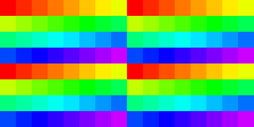

# NVidia RTX 2080 (Turing)

## Specs

* Pixel Rate: **109.4** GPixel/s
* Texture Rate: **314.6** GTexel/s
* Clock stable: **1515** MHz, boost from specs: 1710 MHz, boost measured: 1900+ MHz
* shaderSMCount: **46** [vk/specs]
* Driver: ?

### Memory

* Memory: 8GB, GDDR6, 256 bit, 1750 MHz, 448.0 GB/s (403 GB/s from tests (at 1515 MHz ?))
* Memory max power consumption: 25W (7.5 pJ/bit, 0.06 J/GB)  [calc]
* L2 cache: 4MB
* L1 Cache: 64 KB (per SM)

### Float point performance

* FP16: **20.14** TFLOPS at 1710 MHz
* FP32: **10.07** TFLOPS at 1710 MHz
* FP64: **314.6** GFLOPS at 1710 MHz
* ops per clock per SM: **64** fp32 FMA [compute capability 7.5]
* ops per clock per SM: **128** fp16 FMA [compute capability 7.5]
* FP32 FMA perf: **4.46** TOp/s at 1515 MHz (4.4 TOp/S from tests)
* FP16 FMA perf: **8.9** TOp/s at 1515 MHz (8.9 TOp/S from tests)

## Shader

### Quads

* Test `subgroupQuadBroadcast( gl_HelperInvocation )` with/without texturing - helper invocations are executed. [[6](../GPU_Benchmarks.md#6-Subgroups)]
* Test `subgroupQuadBroadcast( constant )` with/without texturing - helper invocations are executed. [[6](../GPU_Benchmarks.md#6-Subgroups)]

### Subgroups

* Subgroups in fragment shader can fill multiple triangles, but only with the same `gl_InstanceIndex`. [[6](../GPU_Benchmarks.md#6-Subgroups)]

### Subgroup threads order

Result of `Rainbow( gl_SubgroupInvocationID / gl_SubgroupSize )` in fragment shader, gl_SubgroupSize: 32. [[6](../GPU_Benchmarks.md#6-Subgroups)]

Result of `Rainbow( gl_SubgroupInvocationID / gl_SubgroupSize )` in compute shader, gl_SubgroupSize: 32, workgroup size: 8x8. [[6](../GPU_Benchmarks.md#6-Subgroups)]

### SM order

Result of `Rainbow( gl_SMIDNV / gl_SMCountNV )` in fragment shader. 
Tile size is 16x16, image size: 102x53, gl_SMCountNV: 46, gl_SMIDNV: 0 and 1 are bound to the first tile and changed every frame, same for other tiles. [[6](../GPU_Benchmarks.md#6-Subgroups)]

Result of `Rainbow( gl_SMIDNV / gl_SMCountNV )` in compute shader. 
Workgroup size is 8x8, image size: 102x53, gl_SMCountNV: 46. First set (from red to violet) has gl_SMIDNV = 0,2,4..., next set has gl_SMIDNV = 1,3,5... and next - again 0,2,4... [[6](../GPU_Benchmarks.md#6-Subgroups)]

### Instruction cost

* [[4](../GPU_Benchmarks.md#4-Shader-instruction-benchmark)]:
	- Fp16 is 2x faster in FAdd, FMul, FMA, but only for `half2`, `half4` types. Performance of this 3 operations are equal.
	- Fp32 FMul is slower than FAdd. FMA has the same perf as FMul.
	- fp32 & i32 datapaths can execute in parallel in 2:1 rate.

* [[2](../GPU_Benchmarks.md#2-fp32-instruction-performance)]:
	- Loop unrolling can double performance.
	- Loop unrolling works for less than 1536 count, on 2048 it lose 2.5x of performance.
	- Loop unrolling is too slow at pipeline creation stage.
	- Benchmarking in compute shader is only 1% faster.
	- Minimal dispatch size: 256x276 (1.5 of total thread count), lower size will lost performance.
	- Measured with fixed clock at 1515 MHz.

	| TOp/s | exec time (ms) | ops | max TFLOPS | comments |
	|---|---|---|
	| **8.8** | | F32Add                    | **8.8** |
	| **4.4** | | F32Mul, F32MulAdd, F32FMA | **8.8** |

* [[1](../GPU_Benchmarks.md#1-fp16-instruction-performance)]:
	- Measured with fixed clock at 1515 MHz.

	| TOp/s | exec time (ms) | ops | max TFLOPS | comments |
	|---|---|---|
	| **17.8** | | F16Add                                      | **17.8** | |
	| **8.9**  | | F16Mul, F16MulAdd, F16FMA, F16Add with deps | **17.8** | |
	| **4.4**  | | F16MulAdd with deps                         | 8.8      | 2x slow than F16x2FMA (TODO: check) |

## Resource access

* Texture access 105MPix: [[5](../GPU_Benchmarks.md#5-Texture-lookup-performance)]
	- expected read: 419MB per frame.
	- UV bias has no effect.

	| diff | exec time (ms) | approx traffic (GB/s) | name | comments |
	|---|---|---|-------|------|
	| 0.43 | 0.55  | 761 | sequential access, scale x0.5     | used texture cache |
	| 1    | 1.28  | 327 | sequential access, scale x1       | near to VRAM bandwidth |
	| 1.15 | 1.47  | 285 | random access, noise 16x16        | |
	| 1.19 | 1.52  | 276 | random access, noise 16x16, off 1 | 1px offset has effect only for 16x16 block size |
	| 1.52 | 1.94  | 216 | random access, noise 8x8          | |
	| 2.1  | 2.64  | 159 | sequential access, scale x1.5     | |
	| 2.2  | 2.83  | 148 | random access, noise 4x4          | |
	| 3.5  | 4.44  |  94 | sequential access, scale x2       | |
	| 5    | 6.4   |  65 | random access, noise 2x2          | |
	| 12.5 | 16    |  26 | random access, noise 1x1          | |

* Buffer/Image storage 16bpp 67.1MPix 2x1.073GB [[7](../GPU_Benchmarks.md#7-BufferImage-storage-access)]
	- image with 1GB size doesn't have RT compression. *Because metadata is too large?*
	- image input attachment is preferred because you don't need to reorder threads and RT compression is used to minimize bandwidth. 

	| diff (%) | exec time (ms) | approx traffic (GB/s) | name | comments |
	|---|---|---|------|----|
	| 26  | 6.7  | 320 | Buffer load/store in FS, 16 bytes                         | cache misses because of non-sequential read/write (?) |
	| 7.5 | 5.7  | 376 | Image load/store, workgroup size 8x8, row major           | |
	| 7   | 5.66 | 379 | Image load/store, workgroup size 8x8, column major        | |
	| 3   | 5.45 | 394 | Buffer load/store, 16 bytes                               | |
	| 3   | 5.45 | 394 | Image load/store, workgroup size 16x16, column major      | |
	| 2   | 5.4  | 397 | Image load/store, workgroup size 16x16, row major         | |
	| 2   | 5.4  | 397 | Image read/write input attachment RGBA32F, 1x1 noise      | RT compression is not enabled because of > 1GB size |
	| 2   | 2.7  | 397 | Image read/write input attachment 2xRGBA8, 1x1 noise      | has RT compression, but performance is low because of 8bpp |
	| 1   | 5.35 | 401 | Image load/store, group reorder, row major                | |
	| 1   | 5.35 | 401 | Buffer load/store, 32 bytes                               | |
	| 0   | 5.3  | 405 | Buffer load/store, 64 bytes                               | 64 byte L2 cache line |
	| -10 | 4.8  | 447 | Image read/write input attachment 2xRG32F,  1x1 noise     | |
	| -23 | 4.3  | 499 | Image read/write input attachment 4xRGBA8,  1x1 noise     | better compression for RGBA8 ? |
	| -72 | 2.35 | 699 | Image read/write input attachment RGBA32F,  2x2 noise, 7K | speedup on RT compression |
	| -77 | 3.0  | 715 | Image read/write input attachment 2xRG32F,  2x2 noise     | speedup on RT compression |
	| -77 | 3.0  | 715 | Image read/write input attachment 4xRGBA8,  2x2 noise     | speedup on RT compression |

## Render target compression

* RGBA8 205MPix downsample 1/2, compressed/uncompressed access rate: [[3](../GPU_Benchmarks.md#3-Render-target-compression)]
	- read: 822MB, write: 205MB, total: 1027MB per frame.
	- linear: 6.5ms, fetch: 6.6ms, nearest: 7.3ms.
	- image storage: load: 8ms, linear/fetch: 7.2ms. **Texture sampling is a bit faster because of texture cache.**
	- **Compression disabled when used storage usage flag.**

	| diff | exec time (ms) | approx traffic (GB/s) | name | comments |
	|---|---|---|------|----|
	| 0.97 | 2.79 |  368 | image storage 1x1 noise     |
	| 1    | 2.72 |  377 | image storage (other modes) |
	| 1.07 | 2.53 |  405 | 1x1 noise   |
	| 1.78 | 1.53 |  671 | 2x2 noise   |
	| 3.2  | 0.84 | 1223 | 4x4 noise   | **same as block size** |
	| 3.3  | 0.81 | 1268 | gradient    |
	| 3.4  | 0.79 | 1300 | 8x8 noise   | better compression for output (4x4 block) |
	| 3.4  | 0.79 | 1300 | 16x16 noise |
	| 3.4  | 0.79 | 1300 | solid color |

* RGBA16_UNorm 104.8MPix downsample 1/2, compressed/uncompressed access rate: [[3](../GPU_Benchmarks.md#3-Render-target-compression)]
	- read: 838MB, write: 209MB, total: 1048MB per frame.

	| diff | exec time (ms) | approx traffic (GB/s) | name | comments |
	|---|---|---|------|----|
	| 0.97 | 2.71 |  387 | image storage 1x1 noise, gradient    | ??? |
	| 1    | 2.63 |  398 | image storage 8x8 noise, solid color | ??? |
	| 1.02 | 2.57 |  408 | 1x1 noise   |
	| 1.79 | 1.47 |  713 | 2x2 noise   |
	| 2.0  | 1.30 |  806 | gradient    | less compression rate than in RGBA16F because of higher precision |
	| 4.2  | 0.62 | 1690 | 4x4 noise   | **same as block size** |
	| 4.2  | 0.62 | 1690 | 8x8 noise   |
	| 4.2  | 0.62 | 1690 | 16x16 noise |
	| 4.2  | 0.62 | 1690 | solid color |

* RGBA16F 104.8MPix downsample 1/2, compressed/uncompressed access rate: [[3](../GPU_Benchmarks.md#3-Render-target-compression)]
	- read: 838MB, write: 209MB, total: 1048MB per frame.

	| diff | exec time (ms) | approx traffic (GB/s) | name | comments |
	|---|---|---|------|----|
	| 0.95 | 2.75 |  381 | image storage 1x1 noise | ??? |
	| 1    | 2.63 |  398 | image storage 4x4 noise, gradient, solid color | ??? |
	| 1.03 | 2.55 |  411 | 1x1 noise   |
	| 1.8  | 1.46 |  718 | 2x2 noise   |
	| 3.4  | 0.77 | 1361 | gradient    |
	| 4.2  | 0.62 | 1690 | 4x4 noise   | **same as block size** |
	| 4.2  | 0.62 | 1690 | 8x8 noise   |
	| 4.2  | 0.62 | 1690 | 16x16 noise |
	| 4.2  | 0.62 | 1690 | solid color |

* RGBA32F 37.7MPix downsample 1/2, compressed/uncompressed access rate: [[3](../GPU_Benchmarks.md#3-Render-target-compression)]
	- read: 604MB, write: 151MB, total: 755MB per frame.

	| diff | exec time (ms) | approx traffic (GB/s) | name | comments |
	|---|---|---|------|----|
	| 1    | 1.89 |  399 | image storage 1x1 noise |
	| 1.03 | 1.84 |  410 | gradient    | low compression rate because of high precision |
	| 1.03 | 1.84 |  410 | 1x1 noise   |
	| 2.4  | 0.79 |  956 | 2x2 noise   |
	| 3.7  | 0.51 | 1480 | 4x4 noise   | **same as block size** |
	| 3.7  | 0.51 | 1480 | 8x8 noise   |
	| 3.7  | 0.51 | 1480 | 16x16 noise |
	| 3.7  | 0.51 | 1480 | solid color |

## Texture cache

* RGBA8_UNorm texture with random access [[9](../GPU_Benchmarks.md#9-Texture-cache)]
	- Measured cache size: 32 KB, 1 MB, 4MB.
	- 8 texels per pixel, dim ???
	- from specs: only 32KB of L1 cache is reserved for texture cache.

	| size (B) | dimension (px) | exec time (ms) | diff | approx bandwidth (GB/s) |
	|---|---|---|---|
	| 32K | 128x64    | 0.6 |  -  | TODO |
	| 64K | 128x128   | 1.5 | 2.5 | |
	| 1M  | 512x512   | 1.9 |  -  | |
	| 4M  | 1024x1024 | 4   | 2.1 | |
	| 8M  | 2048x1024 | 10  | 2.5 | |

