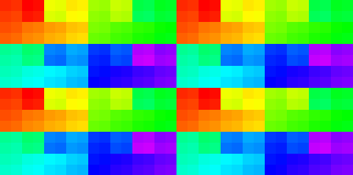
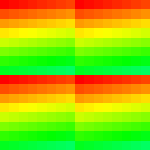

# Imagination Technologies PowerVR BXM-8-256

## Specs

* ALUs: 144
* Execution units: 8
* Clock: 950 MHz
* F16 GFLOPS: **460** (180 on MulAdd from tests)
* F32 GFLOPS: **230** (190 on FMA from tests)
* FP16 FLOPs/Clock: 512
* FP32 FLOPs/Clock: 256
* Memory: 8 GB, LPDDR5, QC 16bit, 3200 MHz, **51.2** GB/s (14.2 GB/s from tests)
* Device: Motorola G54 5G (Android 13, Driver 6133109)

## Shader

### Quads

* Quads on edge between 2 triangles are not merged, so 2 near pixels may execute up to 6 helper invocations.
* Test `subgroupQuadBroadcast( gl_HelperInvocation )` with/without texturing - helper invocations are executed. [[6](../GPU_Benchmarks.md#6-Subgroups)]
* Test `subgroupQuadBroadcast( constant )` with/without texturing - helper invocations are executed. [[6](../GPU_Benchmarks.md#6-Subgroups)]

### Subgroups

* Subgroups in fragment shader can fill multiple triangles, but only with the same `gl_InstanceIndex`. [[6](../GPU_Benchmarks.md#6-Subgroups)]
* Subgroups in fragment shader always execute all threads. *It cause a 128 threads to be executed which is bad for energy efficiency.* [[6](../GPU_Benchmarks.md#6-Subgroups)]

### Subgroup threads order

Result of `Rainbow( gl_SubgroupInvocationID / gl_SubgroupSize )` in fragment shader, gl_SubgroupSize: 128, image size: 32x32. [[6](../GPU_Benchmarks.md#6-Subgroups)]

Result of `Rainbow( gl_SubgroupInvocationID / gl_SubgroupSize )` in compute shader, gl_SubgroupSize: 128, workgroup size: 8x8. [[6](../GPU_Benchmarks.md#6-Subgroups)]

Result of `Rainbow( gl_SubgroupInvocationID / gl_SubgroupSize )` in compute shader, gl_SubgroupSize: 128, workgroup size: 16x16. [[6](../GPU_Benchmarks.md#6-Subgroups)]

### Instruction cost

* Shader instruction benchmark notes: [[4](../GPU_Benchmarks.md#4-Shader-instruction-benchmark)]
	- Loop unrolling is too slow at pipeline creation stage.
	- InvSqrt is much (2x) faster than Sqrt.
	- ClampUNorm is much faster than ClampSNorm.
	- Only fp32 FMA *(fp16 and mediump use same fp32 FMA)*.
	- Fp32 FMA is preferred than FMul or FMulAdd.
	- Length is a bit faster than Distance and Normalize.
	- Int32 FindMSB is much slower than FindLSB.
	- fp32 & i32 datapaths can execute in parallel in 1:1 rate
	- fp32 FastATan is x3.1 faster than native ATan
	- fp32 FastACos is x3.5 faster than native ACos
	- fp32 FastASin is x2.3 faster than native ASin
	- fp16 FastATan is x2.3 faster than native ATan
	- fp16 FastACos is x3.8 faster than native ACos
	- fp16 FastASin is x2.8 faster than native ASin
	- fp32 Pow uses MUL loop - performance depends on power
	
* FP32 instruction performance: [[2](../GPU_Benchmarks.md#2-fp32-instruction-performance)]
	- Loop unrolling doesn't increase performance.
	- Loop unrolling is too slow at pipeline creation stage.
	- Manual unrolling is slow too and performance is less than with unrolling attribute.
	- Compute and graphics has same performance.
	- Dispatch on 1024x1024 grid is much faster (1.3x).
	- Loop index with `int` is faster than `float`.
	- mediump has no effect.
	- Measured at 950 MHz with 87% shader load.
	
	| GOp/s | ops | max GFLOPS |
	|---|---|---|
	| 105 | Add         | 105 |
	| 95  | Mul         | 95  |
	| 95  | MulAdd, FMA | **190** |
	
* FP16 instruction performance: [[1](../GPU_Benchmarks.md#1-fp16-instruction-performance)]
	- Loop index with `int`, `short`, `half` has same performance.
	- Measured at 950 MHz
	
	| GOp/s | ops | max GFLOPS | comments |
	|---|---|---|---|
	| 110 | Add    | 110  |
	|  90 | Mul    | 90   |
	|  90 | MulAdd | **180** |
	|  58 | FMA    | 116  | less than F32FMA |
	
### NaN / Inf

* FP32, Mediump. [[11](../GPU_Benchmarks.md#11-NaN)]

	| op \ type | nan1 | nan2 | nan3 | nan4 | inf | -inf | max | -max |
	|---|---|---|---|---|---|---|---|---|
	| x | nan | nan | nan | nan | inf | -inf | max | -max |
	| Min(x,0) | 0 | 0 | 0 | 0 | 0 | -inf | 0 | -max |
	| Min(0,x) | 0 | 0 | 0 | 0 | 0 | -inf | 0 | -max |
	| Max(x,0) | 0 | 0 | 0 | 0 | inf | 0 | max | 0 |
	| Max(0,x) | 0 | 0 | 0 | 0 | inf | 0 | max | 0 |
	| Clamp(x,0,1) | 0 | 0 | 0 | 0 | 1 | 0 | 1 | 0 |
	| Clamp(x,-1,1) | -1 | -1 | -1 | -1 | 1 | -1 | 1 | -1 |
	| IsNaN | 1 | 1 | 1 | 1 | 0 | 0 | 0 | 0 |
	| IsInfinity | 0 | 0 | 0 | 0 | 1 | 1 | 0 | 0 |
	| bool(x) | 1 | 1 | 1 | 1 | 1 | 1 | 1 | 1 |
	| x != x | 0 | 0 | 0 | 0 | 0 | 0 | 0 | 0 |
	| Step(0,x) | 1 | 1 | 1 | 1 | 1 | 0 | 1 | 0 |
	| Step(x,0) | 1 | 1 | 1 | 1 | 0 | 1 | 0 | 1 |
	| Step(0,-x) | 1 | 1 | 1 | 1 | 0 | 1 | 0 | 1 |
	| Step(-x,0) | 1 | 1 | 1 | 1 | 1 | 0 | 1 | 0 |
	| SignOrZero(x) | nan | nan | nan | nan | 1 | -1 | 1 | -1 |
	| SignOrZero(-x) | nan | nan | nan | nan | -1 | 1 | -1 | 1 |
	| SmoothStep(x,0,1) | 0 | 0 | 0 | 0 | 1 | 0 | 1 | 0 |
	| Normalize(x) | nan | nan | nan | nan | nan | nan | 18446742974197923840 | -18446742974197923840 |

* FP16 diff:

	| op \ type | nan1 | nan2 | nan3 | nan4 | inf | -inf | max | -max |
	|---|---|---|---|---|---|---|---|---|
	| Normalize(x) | nan | nan | nan | nan | nan | nan | 0 | -0 |

### Circle performance

* small circles. [[13](../GPU_Benchmarks.md#13-Circle-geometry)]
	- 32K objects
	- 41.4 MPix
	- driver drop render passes which will be overriden by next render pass !!!  keep only 3 RPs

	| shape | exec time (ms) | diff (%) |
	|---|---|---|
	| quad     | **11.1** | - |
	| fan      | 14.9 |
	| strip    | 15.5 |
	| max area | 14.3 |

* 4x4 circles with blending. [[13](../GPU_Benchmarks.md#13-Circle-geometry)]
	- 10.4 MPix
	- 64 layers

	| shape | exec time (ms) | diff (%) |
	|---|---|---|
	| quad     | **83.5** | - |
	| fan      | 65.9 | 26.7 |
	| strip    | 65.3 | 27.9 |
	| max area | 65.9 | 26.7 |

### Branching

* Mul vs Branch vs Matrix [[12](../GPU_Benchmarks.md#12-Branching)]
	- 1.05 MPix, 128 iter, 6 mul/branch ops.
	
	| op | exec time (ms) | diff |
	|---|---|---|
	| Mul uniform        | 50.8 | 2.3 |
	| Branch uniform     | **22.3** | - |
	| Matrix uniform     | 34.4 | 1.5 |
	| - |
	| Mul non-uniform    | 59.0 | 2.6 |
	| Branch non-uniform | 78.1 | 3.5 |
	| Matrix non-uniform | 69.5 | 3.1 |
	| - |
	| Mul avg            | 54.9 | 2.46 |
	| Branch avg         | 50.2 | 2.25 |
	| Matrix avg         | 51.9 | 2.33 |

## Resource access

* Buffer/Image storage 16bpp 2.59MPix 2x41.4MB [[7](../GPU_Benchmarks.md#7-BufferImage-storage-access)]

	| diff | exec time (ms) | approx traffic (GB/s) | name | comments |
	|---|---|---|------|----|
	| 1.09 | 6.18 | 13.2 | Image load/store                          | |
	| 1    | 5.6  | 14.2 | Image read/write input attachment RGBA32F | a bit faster because of RT compression |
	| 2.7  | 15   | 3.8  | Buffer load/store                         | ??? |
	| 3.2  | 18   | 3.3  | Buffer load/store in FS                   | |

## Render target compression

* RGBA8 67.1MPix downsample 1/2, compressed/uncompressed access rate: [[3](../GPU_Benchmarks.md#3-Render-target-compression)]
	- expected read: 268MB, write: 67MB, total: 335MB per frame.
	- with solid color: linear: 19.4ms, fetch: 17.7ms, nearest: 17.7ms. Fetch/Nearest minimize bus load.
	- with gradient: linear/fetch/nearest has same perf.
	- graphics to compute r/w: 268MB / 66MB. Compression disabled when used storage usage flag.
	
	| diff (read) | read (MB) | write (MB) | name | comments |
	|---|---|---|------|----|
	| 1    | 268  | 66  | image storage |
	| 1.33 | 202  | 50  | 1x1 noise     |
	| 1.35 | 198  | 51  | 2x2 noise     |
	| 2.4  | 112  | 50  | 4x4 noise     |
	| 13   |  21  |  7  | gradient      |
	| 23   | 11.5 | 27  | 8x8 noise     | **same as block size** |
	| 23   | 11.5 | 3.5 | 16x16 noise   | less write traffic because output to 8x8 block |
	| 134  | 2    | 1   | solid color   | has metadata for large region or small metadata for block |

* RGBA16F 67.1MPix downsample 1/2, compressed/uncompressed access rate: [[3](../GPU_Benchmarks.md#3-Render-target-compression)]
	- expected read: 536.8MB, write: 134.2MB, total: 671MB per frame.
	- graphics to compute r/w: 530MB / 130MB. Compression disabled when used storage usage flag.
	- image storage read with linear filter: 45ms, nearest/load: 61.
	- 1x1 noise gradient: linear: 35ms, fetch/nearest: 50ms.
	
	| diff (read) | read (MB) | write (MB) | name | comments |
	|---|---|---|------|----|
	| 1   | 530 | 130 | image storage |
	| 1.3 | 410 | 90  | 1x1 noise     |
	| 1.4 | 390 | 105 | 2x2 noise     |
	| 2.6 | 205 | 92  | 4x4 noise     |
	| 9.8 | 55  | 17  | gradient      |
	| 24  | 22  | 55  | 8x8 noise     | **same as block size** |
	| 27  | 20  | 5.5 | 16x16 noise   | less write traffic because output to 8x8 block |
	| 134 | 4   | 1.5 | solid color   | has metadata for large region or small metadata for block |

* RGBA16_UNorm - same as RGBA16F.
* RGBA32F - has compression, but without linear filtering.

## Texture cache

* RGBA8_UNorm texture with random access [[9](../GPU_Benchmarks.md#9-Texture-cache)]
	- Measured cache size: 256 KB, 1 MB.
	
	| size (KB) | dimension (px) | external bandwidth (GB/s) | comment |
	|---|---|---|---|
	| 256  | 256x256 | 0.009 | **used only texture cache** |
	| 1024 | 512x512 | 13.9  | bottleneck on external memory |

