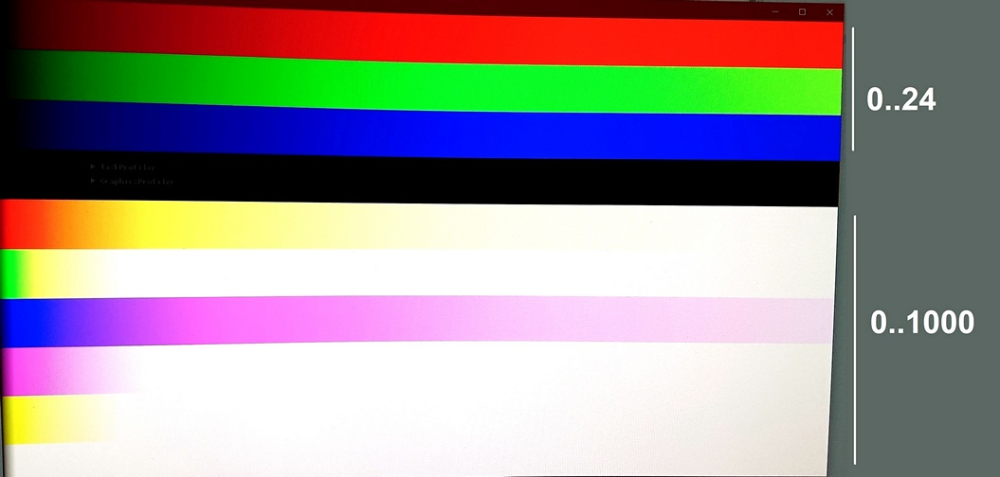
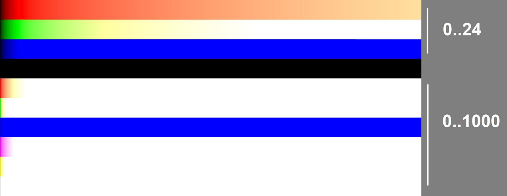

## Общие особенности

__Не HDR (RGB8 / RGB10A2 форматы)__

* Цвета больше 1.0 обрезаются до 1.0.

__HDR (RGBA16F формат)__

* Используется встроенный тонемаппинг, который преобразует цвета больше 1.0 в другие, чаще всего значение стремится к белому.
* Переход в белый цвет зависит от яркости, зеленый самый яркий и раньше становится белым.
* Нет способа программно узнать характеристики встроенного тонемапинга, поэтому лучше использовать свой, а значениями более 1.0 регулировать яркость экрана.

## Монитор

Монитор Samsung с VA матрицей с яркостью 1000 нит. Режим `RGBA16F_Extended_sRGB_linear`.

* Используется аналог ACES тонемапинга, поэтому синий переходит в розовый, а потом в белый.

## Смартфон

Смартфон ASUS с AMOLED экраном с яркостью 800 нит. Режим `RGBA16F_Extended_sRGB_linear`.

* На мониторе диапазон 0..100 примерно совпадает с 0..24 на смартфоне.
* На смартфоне используется более простой тонемапинг, который некорректно работает с чисто синим цветом.

## Режимы (ESurfaceFormat)

Исходники: [FeatureSetEnums.h - ESurfaceFormat](../../src/graphics/Public/FeatureSetEnums.h#L26)

### `RGBA16F_Extended_sRGB_linear`

Формат обратно совместим с sRGB на диапазоне (0,1), но также позволяет использовать и значения более 1.
Цвет (1.0, 1.0, 1.0) соответствует яркости в 80 нит, что очень мало, зато доступен диапазон до 125.0, что будет соответствовать 10 000 нит.

Требует Windows версии 10 и выше.

### `BGRA8_sRGB_nonlinear` и `RGBA8_sRGB_nonlinear`

Стандартный sRGB режим, в зависимости от платформы будет RGBA или BGRA порядок каналов.

### `RGB10A2_sRGB_nonlinear`

Стандартный sRGB режим, но с большей точностью (10бит).

