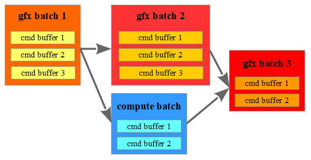

Система асинхронных задач для графики.

## Первичный командный буфер

`RenderTask`, `RenderTaskCoro` - используется для асинхронной записи командного буфера. Внутри метода `Run()` создается командный буфер, заполняется и добавляется в `CommandBatch` с помощью метода `Execute(cmdbuf)`.

`CommandBatch` - хранит массив командных буферов и семафоров для синхронизации с другими батчами и с ЦП. Аналогичен одному вызову vkQueueSubmit.

Исходник: [RenderTask.h](../../src/graphics/Private/RenderTask.h), [CommandBatch.h](../../src/graphics/Private/CommandBatch.h)

## Вторичный командный буфер

`DrawTask`, `DrawTaskCoro` - используется для асинхронной записи вторичного командного буфера, аналогично RenderTask.

`DrawCommandBatch` - хранит массив вторичных командных буферов, которые затем выполняются в `IGraphicsContext::ExecuteSecondary()`.

Исходник: [DrawTask.h](../../src/graphics/Private/DrawTask.h), [DrawCommandBatch.h](../../src/graphics/Private/DrawCommandBatch.h)

## Планировщик графических задач (RenderTaskScheduler)

#### Начало кадра
Метод `BeginFrame()` создает задачу, которая ожидает завершения кадра минус N, при двойной буферизации N=1, при тройной N=2.

Для каждого кадра передаются параметры в `BeginFrameConfig`, где можно установить лимиты на использование промежуточной памяти.
(TODO: ссылка на управление памятью)

#### Конец кадра
Метод `EndFrame()` создает задачу, которая ожидает завершения записи командных буферов и батчей команд, отправки результата на экран и тд.

#### Создание батча команд
Метод `BeginCmdBatch()` создает батч, в который будут записываться командные буферы текущего кадра.

#### Синхронизация на стороне ГП
Зависимости между батчами указываются вручную через методы CommandBatch: `AddInputDependency()`, `AddInputSemaphore()`, `AddOutputSemaphore()`, либо автоматически, через рендер граф ([RG](RenderGraph.md)).

#### Синхронизация на стороне ЦП
В зависимостях задачи передается указатель на батч `CommandBatchPtr`. Когда начинается новый кадр, проверяется какие батчи завершились и батчи помечаются как завершенные. 
Дополнительно есть вариант подписаться на момент отправки батча на ГП (вызов vkQueueSubmit), для этого используется зависимость `CmdBatchOnSubmit{batch}`.

Исходник: [RenderTaskScheduler.h](../../src/graphics/Private/RenderTaskScheduler.h)

## Контекст для записи команд

Запись команда в Vulkan И Metal имеют отличия - в Metal используются энкодеры, они нужны для лучшего распараллеливания команд и сортировки их встроенным рендер графом.
Переключение между graphics и compute дорогое, также и graphics и transfer, поэтому подход из Metal заставляет писать более оптимизированный код за счет своей архитектуры.

На Vulkan каждый контекст имеет свой набор этапов (pipeline stages), для лучшей производительности внутри контекста нужно минимизировать синхронизации. 

Вместо энкодеров в движке используются контексты: Draw, Graphics, Transfer, ASBuild, RayTracing и тд.

#### ITransferContext

Все команды копирования. 
На Vulkan часть команд может выполняться только в графических или вычислительных очередях (`EQueueType::Graphics`, `EQueueType::AsyncCompute`). 
На Metal нет разделения по типам очередей, но они могут эмулироваться для совместимости с Vulkan.

#### IComputeContext

Используется для запуска вычислительного шейдера (compute shader).

#### IGraphicsContext

Используется только для начала и завершения рендер пасса.

Поддерживается синхронный рендер пасс: 
`BeginRenderPass() -> DrawCtx -> EndRenderPass()`

Асинхронный рендер пасс `BeginMtRenderPass()` создает `DrawCommandBatch`, который создает задачи `DrawTask`.
Текущая задача должна дождаться заполнения вторичных командных буферов, затем записать их в первичный командный буфер через `ExecuteSecondary( drawBatch )` и завершить рендер пасс `EndMtRenderPass()`.

Пример [Test_RG_DrawAsync1.cpp](../../tests/graphics/RenderGraph/Test_RG_DrawAsync1.cpp)

#### IDrawContext

Все команды рисования.

#### IRayTracingContext

Только трассировка лучей. 
На Vulkan трассировка может запускаться в любой момент, даже внутри рендер пасса, выполняется на этапе `VK_PIPELINE_STAGE_2_RAY_TRACING_SHADER_BIT`. 
На Metal эмулируется через вычислительный энкодер.

#### IASBuildContext

Все команды построения ускоряющих структур для трассировки лучей, а также их обновление, копирование, сериализация в/из памяти, чтение свойств.
На Vulkan выполняется на этапах `VK_PIPELINE_STAGE_2_ACCELERATION_STRUCTURE_BUILD_BIT` и `VK_PIPELINE_STAGE_2_ACCELERATION_STRUCTURE_COPY_BIT`.
На Metal это отдельный энкодер.

Исходник: [CommandBuffer.h](../../src/graphics/Public/CommandBuffer.h)

## Программная эмуляция командного буфера

В Vulkan и Metal командный буфер может использоваться только в одном потоке. Если не ограничивать количество потоков рендера, то может создаться много командных буферов, и это особенно накладно, если записывается всего несколько команд. Оптимальнее записать команды в память в разных потоках, а потом в одном потоке записать их в нативный командный буфер.

## Нюансы реализации

При планировании архитектуры был выбор из двух вариантов:
 * Привязка к кадрам. Все команды отправляются для конкретного кадра, даже async compute не может выполняться несколько кадров - при двойной буферизации 2й кадр будет ждать завершения всех команд. Но это дает и преимущества - кадр более предсказуемый, что дает и более стабильное время кадра.
 * Без привязки к кадрам. Это позволяет делать долгие асинхронные вычисления или копирования, но делает поведение менее предсказуемым.

Был выбран вариант с привязкой к кадрам, таким образом:
 * Ресурсы не удаляются сразу, а с задержкой в 2 кадра.
 * Используется общий staging buffer, выделенная память гарантированно валидна в пределах кадра, это упростило работу с памятью. Например в при чтении из видеопамяти в `ITransferContext::ReadbackImage()`.
 * Ограничен максимальный размер staging buffer на кадр, так чтобы все данные успели передаться по шине PCI-E за время кадра. Таким образом ГП не простаивает в ожидании данных с ЦП и время кадра более стабильное.

