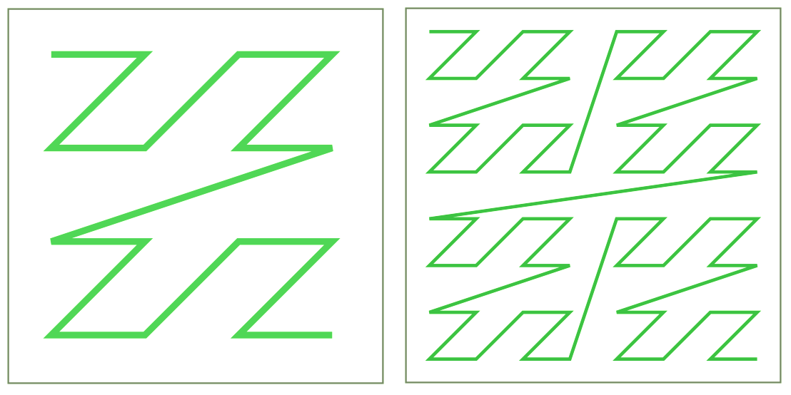
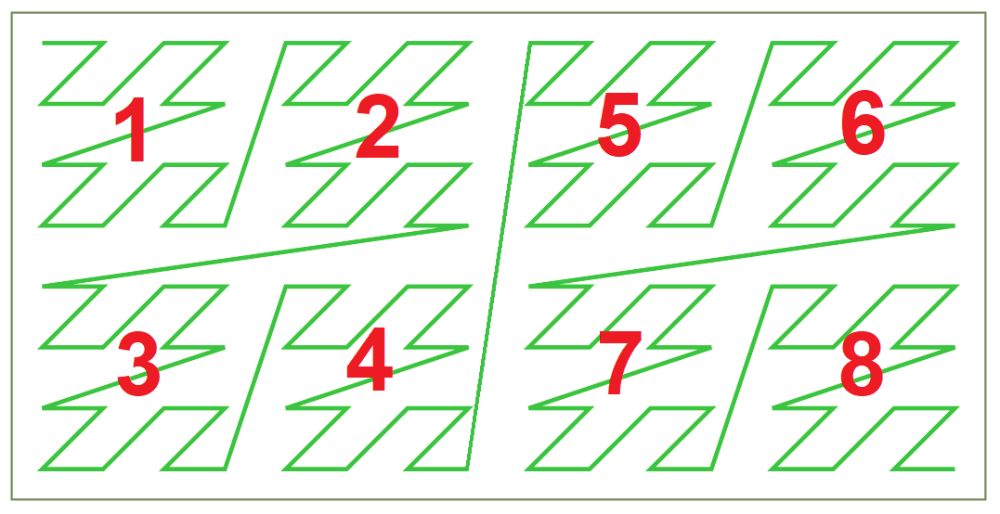

## Detect Image Z-curve (Vulkan only)


## Description

All GPUs store image memory in small tiles where pixels are reordered, it is made for cache friendly access for linear filtering.<br/>
This reordering looks like a Z-order curve ([wiki](https://en.wikipedia.org/wiki/Z-order_curve)).



In Vulkan, flag `VK_IMAGE_TILING_OPTIMAL` indicates that image is stored with reordered pixels.
The Z-order is implementation defined, because of this, you need to use a staging buffer/image with a linear memory layout, and then copy it to the optimal memory layout, during copying, the GPU will change the pixel order.

**Why is this important?**

When you access images without filtering, for example storage images or `texelFetch()` for sampled images, you need to change the access order, the same as the Z-curve for the current image, this will improve cache locality.

The best parameters:<br/>
`gl_WorkGroupSize` must be a multiple of the Z-curve tile size.<br/>
`gl_WorkGroupID` locations must follow to the Z-curve direction like in the image.



References:<br/>
[Optimizing Compute Shaders for L2 Locality](https://developer.nvidia.com/blog/optimizing-compute-shaders-for-l2-locality-using-thread-group-id-swizzling/)

## Program

This small program binds image with an optimal memory layout and a buffer with a linear memory layout to the same memory, so it allows to read reordered pixels from the buffer. Note that according to Vulkan specs, the buffer contents may be undefined, but it works on all tested platforms.


## Z-order curve for specific GPUs

Used RGBA8_UNorm format. All 32-bit per pixel formats have the same pattern.

### Without reordering

tile 4x4
```
[0,0] [1,0] [2,0] [3,0]
[0,1] [1,1] [2,1] [3,1]
[0,2] [1,2] [2,2] [3,2]
[0,3] [1,3] [2,3] [3,3]
```

tile 8x8
```
[0,0] [1,0] [2,0] [3,0] [4,0] [5,0] [6,0] [7,0]
[0,1] [1,1] [2,1] [3,1] [4,1] [5,1] [6,1] [7,1]
[0,2] [1,2] [2,2] [3,2] [4,2] [5,2] [6,2] [7,2]
[0,3] [1,3] [2,3] [3,3] [4,3] [5,3] [6,3] [7,3]
[0,4] [1,4] [2,4] [3,4] [4,4] [5,4] [6,4] [7,4]
[0,5] [1,5] [2,5] [3,5] [4,5] [5,5] [6,5] [7,5]
[0,6] [1,6] [2,6] [3,6] [4,6] [5,6] [6,6] [7,6]
[0,7] [1,7] [2,7] [3,7] [4,7] [5,7] [6,7] [7,7]
```

### Nvidia GTX 1070

tile 4x4
```
[0,2] [1,2] [2,2] [3,2]
[0,3] [1,3] [2,3] [3,3]
[0,0] [1,0] [2,0] [3,0]
[0,1] [1,1] [2,1] [3,1]
```

### Nvidia RTX 2080

tile 4x4
```
[0,0] [1,0] [2,0] [3,0]
[0,1] [1,1] [2,1] [3,1]
[0,2] [1,2] [2,2] [3,2]
[0,3] [1,3] [2,3] [3,3]
```

4 tiles (8x8)
```
[0,0] [1,0] [2,0] [3,0] [0,1] [1,1] [2,1] [3,1]
[0,2] [1,2] [2,2] [3,2] [0,3] [1,3] [2,3] [3,3]
[4,0] [5,0] [6,0] [7,0] [4,1] [5,1] [6,1] [7,1]
[4,2] [5,2] [6,2] [7,2] [4,3] [5,3] [6,3] [7,3]
[0,4] [1,4] [2,4] [3,4] [0,5] [1,5] [2,5] [3,5]
[0,6] [1,6] [2,6] [3,6] [0,7] [1,7] [2,7] [3,7]
[4,4] [5,4] [6,4] [7,4] [4,5] [5,5] [6,5] [7,5]
[4,6] [5,6] [6,6] [7,6] [4,7] [5,7] [6,7] [7,7]
```

### Intel UHD 620

tile 4x4
```
[0,0] [1,0] [2,0] [3,0]
[0,1] [1,1] [2,1] [3,1]
[0,2] [1,2] [2,2] [3,2]
[0,3] [1,3] [2,3] [3,3]
```

### AMD RX 570

tile 8x8
```
[0,0] [1,0] [2,0] [3,0] [0,1] [1,1] [2,1] [3,1]
[4,0] [5,0] [6,0] [7,0] [4,1] [5,1] [6,1] [7,1]
[0,2] [1,2] [2,2] [3,2] [0,3] [1,3] [2,3] [3,3]
[4,2] [5,2] [6,2] [7,2] [4,3] [5,3] [6,3] [7,3]
[0,4] [1,4] [2,4] [3,4] [0,5] [1,5] [2,5] [3,5]
[4,4] [5,4] [6,4] [7,4] [4,5] [5,5] [6,5] [7,5]
[0,6] [1,6] [2,6] [3,6] [0,7] [1,7] [2,7] [3,7]
[4,6] [5,6] [6,6] [7,6] [4,7] [5,7] [6,7] [7,7]
```