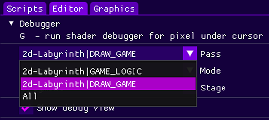
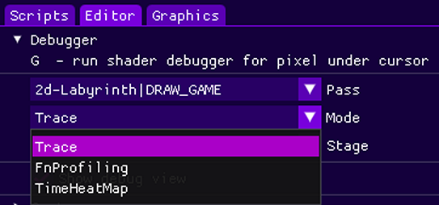
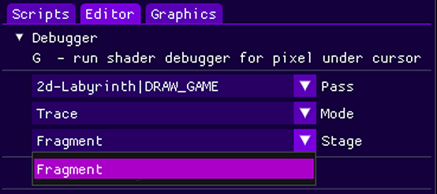
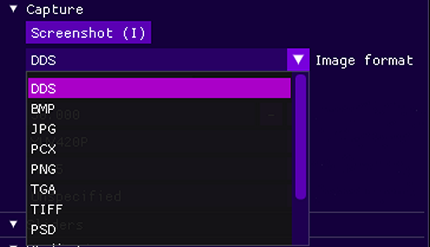
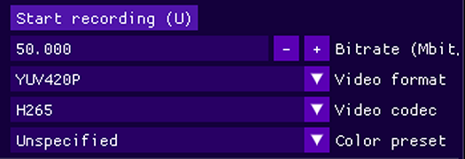
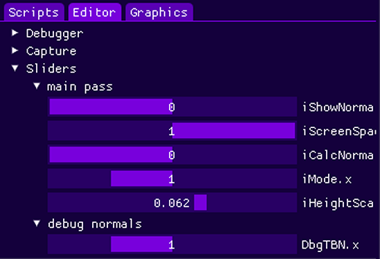
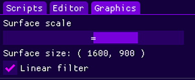
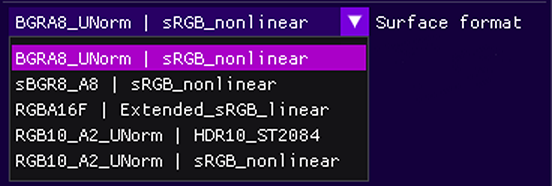
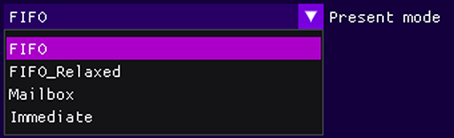

Content:
* [Scripts tab](#scripts-tab)
* [Editor tab](#editor-tab)
* [Graphics tab](#graphics-tab)
* [Profiler windows](#profiler-windows)

# Editor UI

## Scripts tab

Draws a file tree for the folder that is specified in the config:
```
cfg.ScriptDir( "folder" );
```
On click, the script will be compiled and will start rendering when it is ready. Resources will be loaded asynchronously.

## Editor tab

### Debugger

Allows to run shader debugger for the pixel under cursor.

Select graphics/compute pass:<br/>


Select debugging mode:<br/>


Select shader stage:<br/>


When the shader debugger is set up, you can press `G` to record the shader trace.

### Capture

Press `I` key to save screenshot with specified format.<br/>


Press `U` to begin/end video recording.<br/>
Hardware acceleration will be used automatically if it is supported.<br/>


### Sliders

All sliders for all passes that are defined in the current script will be added here.<br/>


### Statistics

Draw some statistics:
* Cursor position.
* Screen color under the cursor.

## Graphics tab

**Surface scale** - allows to change surface size, to regulate the workload on the fragment shader.<br/>
**Linear filter** - enable linear filter when blit the image to the surface, this will add a slight blur effect.<br/>


**Surface format** - allows to change window surface format, `RGBA16F` - enables [HDR output](https://github.com/azhirnov/as-en/blob/dev/AE/docs/papers/HDR_Display.md).<br/>


**Present mode** - allows to change present mode. `FIFO` - enable vertical synchronization.<br/>



# Profiler windows

See [Engine Profiling](https://github.com/azhirnov/as-en/blob/dev/AE/docs/engine/Profiling.md) docs.
