# Samples

Content:
* [2D](#2d)
* [3D](#3d)
* [Ray Tracing](#ray-tracing)
* [Order-Independent Transparency](#order-independent-transparency)
* [Games](#games)

## 2D

* [Bloom and tonemapping](https://github.com/azhirnov/as-en/blob/dev/AE/samples/res_editor/_data/scripts/samples-2d/Bloom.as) 
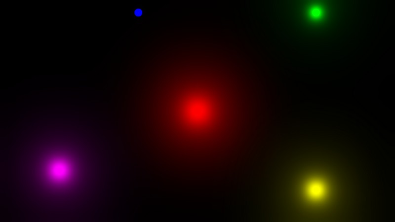
* [SDF and MSDF font with anti-aliasing](https://github.com/azhirnov/as-en/blob/dev/AE/samples/res_editor/_data/scripts/samples-2d/SdfFont.as)
* [Video texture](https://github.com/azhirnov/as-en/blob/dev/AE/samples/res_editor/_data/scripts/samples-2d/Video.as)

**Tests:**
* [Shadertoy default shader](https://github.com/azhirnov/as-en/blob/dev/AE/samples/res_editor/_data/scripts/samples-2d/ShadertoyDefault.as)
* [Compute pass](https://github.com/azhirnov/as-en/blob/dev/AE/samples/res_editor/_data/scripts/samples-2d/Compute.as)
* [Multiple passes](https://github.com/azhirnov/as-en/blob/dev/AE/samples/res_editor/_data/scripts/samples-2d/MultiPassTest.as)
* [NaN in shader](https://github.com/azhirnov/as-en/blob/dev/AE/samples/res_editor/_data/scripts/samples-2d/NaN.as)
* [White color spectrum](https://github.com/azhirnov/as-en/blob/dev/AE/samples/res_editor/_data/scripts/samples-2d/Spectrum.as)
* [Color interpolation](https://github.com/azhirnov/as-en/blob/dev/AE/samples/res_editor/_data/scripts/samples-2d/ColorLerp.as)

**Extensions:**
* [Subgroups](https://github.com/azhirnov/as-en/blob/dev/AE/samples/res_editor/_data/scripts/samples-2d/Subgroups.as) 
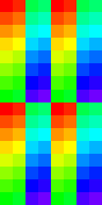
* [Draw to HDR display](https://github.com/azhirnov/as-en/blob/dev/AE/samples/res_editor/_data/scripts/samples-2d/HDR.as)
* [Binary tree with buffer reference](https://github.com/azhirnov/as-en/blob/dev/AE/samples/res_editor/_data/scripts/samples-2d/BufferReference.as) 
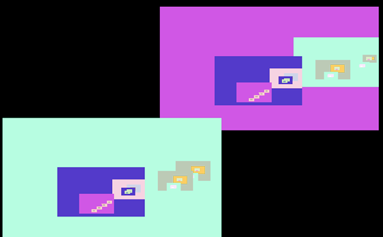

## 3D

**Relief mapping:** 
Supported precalculated TBN and screen-space TBN calculation. Debug drawing for TBN, UV, triangle border. 
* [Cube](https://github.com/azhirnov/as-en/blob/dev/AE/samples/res_editor/_data/scripts/samples-3d/Parallax-1.as) 
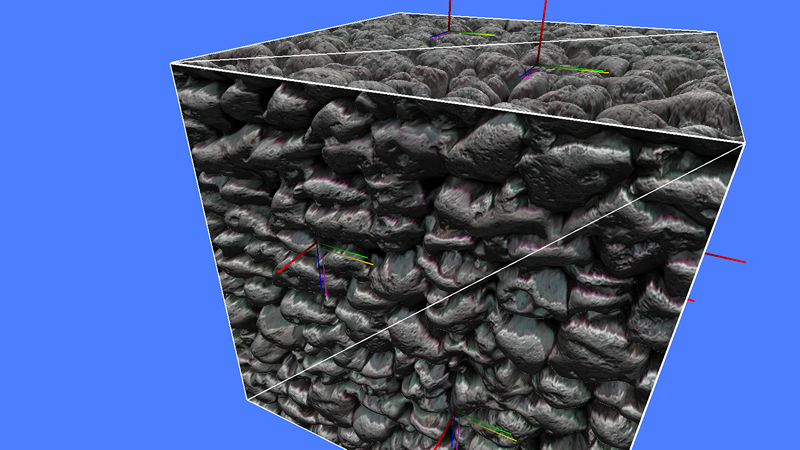
* [Cylinder inner side](https://github.com/azhirnov/as-en/blob/dev/AE/samples/res_editor/_data/scripts/samples-3d/Parallax-2.as)
* [Cylinder outer side](https://github.com/azhirnov/as-en/blob/dev/AE/samples/res_editor/_data/scripts/samples-3d/Parallax-3.as)

**Ray marching:**
* [Simple ray marching](https://github.com/azhirnov/as-en/blob/dev/AE/samples/res_editor/_data/scripts/samples-3d/SimpleRayMarching.as) 
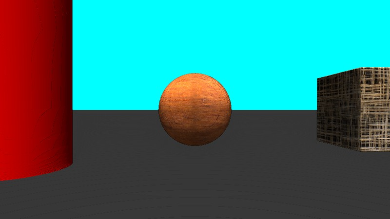
* [SDF used for collisions with camera](https://github.com/azhirnov/as-en/blob/dev/AE/samples/res_editor/_data/scripts/samples-3d/CameraCollision.as) 
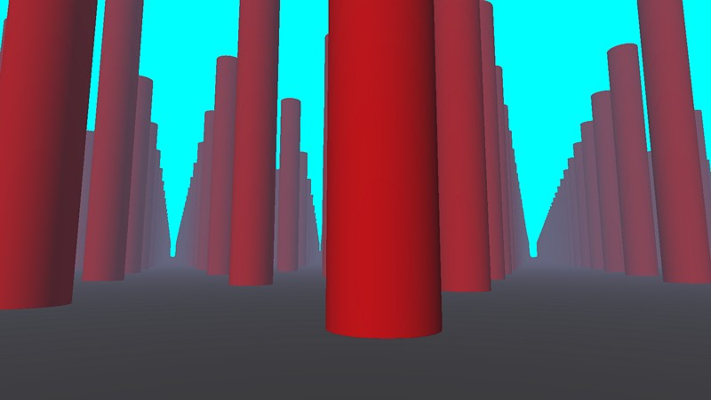
* [Simple volumetric](https://github.com/azhirnov/as-en/blob/dev/AE/samples/res_editor/_data/scripts/samples-3d/Volumetric-1.as)

**Shadows:**
* [Shadow mapping](https://github.com/azhirnov/as-en/blob/dev/AE/samples/res_editor/_data/scripts/samples-3d/ShadowMap.as)

**Spherical cube:**
* [Skybox](https://github.com/azhirnov/as-en/blob/dev/AE/samples/res_editor/_data/scripts/samples-3d/Cubemap-1.as)
* [Skybox with procedural generation](https://github.com/azhirnov/as-en/blob/dev/AE/samples/res_editor/_data/scripts/samples-3d/Cubemap-2.as)
* [Planet generation](https://github.com/azhirnov/as-en/blob/dev/AE/samples/res_editor/_data/scripts/samples-3d/Planet-1.as)
* [Planet with tessellation](https://github.com/azhirnov/as-en/blob/dev/AE/samples/res_editor/_data/scripts/samples-3d/Planet-2.as) 
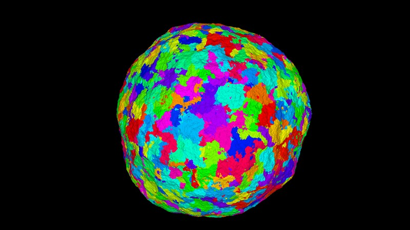

**Particles:**
* [Particles in gravimagnetic field](https://github.com/azhirnov/as-en/blob/dev/AE/samples/res_editor/_data/scripts/samples-3d/Particles-1.as) 
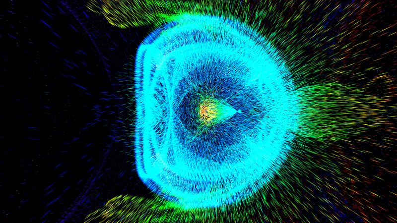

**Other:**
* [Reverse depth buffer](https://github.com/azhirnov/as-en/blob/dev/AE/samples/res_editor/_data/scripts/samples-3d/ReverseZ.as)
* [glTF scene rendering](https://github.com/azhirnov/as-en/blob/dev/AE/samples/res_editor/_data/scripts/samples-3d/Model-1.as)
* [glTF scene rendering with deferred texturing](https://github.com/azhirnov/as-en/blob/dev/AE/samples/res_editor/_data/scripts/samples-3d/DeferredTexturing.as)

**Extensions:**
* [Fragment barycentrics](https://github.com/azhirnov/as-en/blob/dev/AE/samples/res_editor/_data/scripts/samples-3d/FSBarycentric.as)
* [Simple mesh shader with frustum culling](https://github.com/azhirnov/as-en/blob/dev/AE/samples/res_editor/_data/scripts/samples-3d/MeshShader-Cubes.as)

## Ray Tracing

**Tests:**
* [Triangles with transformation](https://github.com/azhirnov/as-en/blob/dev/AE/samples/res_editor/_data/scripts/samples-rt/RayTracing-1.as)
* [Triangles, update instances every frame](https://github.com/azhirnov/as-en/blob/dev/AE/samples/res_editor/_data/scripts/samples-rt/RayTracing-2.as)
* [Animated grid, vertices updated every frame](https://github.com/azhirnov/as-en/blob/dev/AE/samples/res_editor/_data/scripts/samples-rt/RayTracing-3.as)
* [Multiple triangles, used `BuildRTSceneIndirect()`](https://github.com/azhirnov/as-en/blob/dev/AE/samples/res_editor/_data/scripts/samples-rt/RayTracing-4.as)
* [Animated grid, used `BuildRTGeometryIndirect()`](https://github.com/azhirnov/as-en/blob/dev/AE/samples/res_editor/_data/scripts/samples-rt/RayTracing-5.as)
* [Triangle in recursive ray tracing](https://github.com/azhirnov/as-en/blob/dev/AE/samples/res_editor/_data/scripts/samples-rt/RayTracing-6.as)
* [Callable shader](https://github.com/azhirnov/as-en/blob/dev/AE/samples/res_editor/_data/scripts/samples-rt/RayTracing-7.as)

**Samples:**
* [Simple geometry with dynamic shadows](https://github.com/azhirnov/as-en/blob/dev/AE/samples/res_editor/_data/scripts/samples-rt/RT-Shadow.as) 
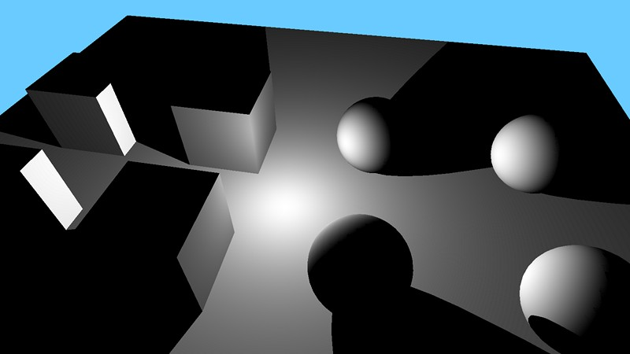
* [Cube with reflections and refractions](https://github.com/azhirnov/as-en/blob/dev/AE/samples/res_editor/_data/scripts/samples-rt/RT-MultiBounce-1.as) 
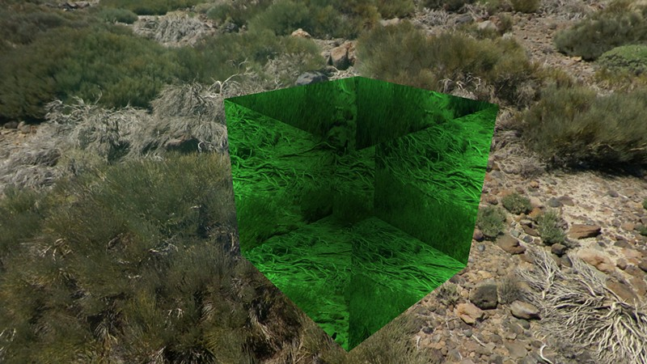

* [Dispersion in prism](https://github.com/azhirnov/as-en/blob/dev/AE/samples/res_editor/_data/scripts/samples-rt/Dispersion2D.as)
* [Dispersion in multiple prisms](https://github.com/azhirnov/as-en/blob/dev/AE/samples/res_editor/_data/scripts/samples-rt/Dispersion2DLayered.as) 
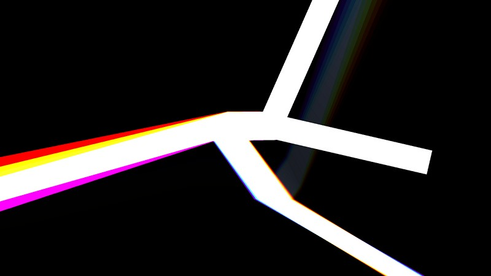

* [glTF scene tracing](https://github.com/azhirnov/as-en/blob/dev/AE/samples/res_editor/_data/scripts/samples-rt/RT-Model-1.as) 

## Order-Independent Transparency

**Approximated OIT:**
* not implemented yet

**Exact OIT, only front or back faces:** 
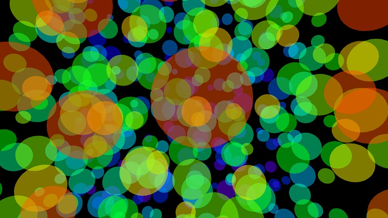
* [Linked List](https://github.com/azhirnov/as-en/blob/dev/AE/samples/res_editor/_data/scripts/samples-3d/OIT-LinkedList-1.as)
* [Ray tracing, back to front](https://github.com/azhirnov/as-en/blob/dev/AE/samples/res_editor/_data/scripts/samples-rt/OIT-1.as)
* [Ray tracing, front to back](https://github.com/azhirnov/as-en/blob/dev/AE/samples/res_editor/_data/scripts/samples-rt/OIT-2.as)
* [Ray tracing, using any-hit shader](https://github.com/azhirnov/as-en/blob/dev/AE/samples/res_editor/_data/scripts/samples-rt/OIT-3.as)

**Front and back faces with optical depth for volume:** 
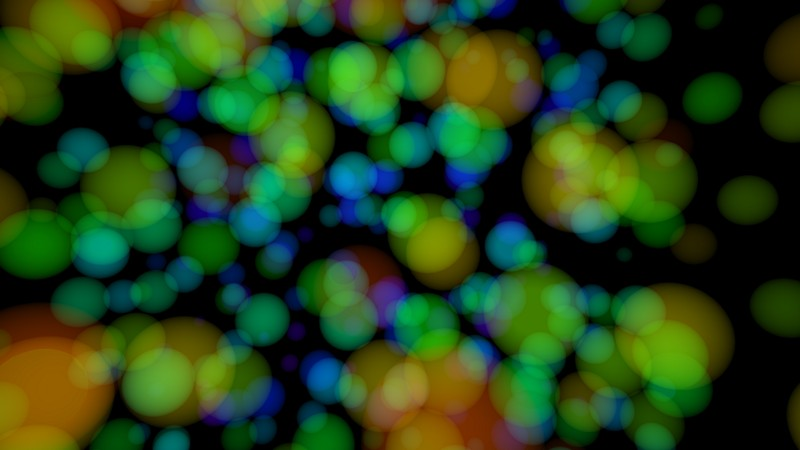
* [Linked List](https://github.com/azhirnov/as-en/blob/dev/AE/samples/res_editor/_data/scripts/samples-3d/OIT-LinkedList-2.as)
* [Ray tracing](https://github.com/azhirnov/as-en/blob/dev/AE/samples/res_editor/_data/scripts/samples-rt/OIT-4.as)

## Export

* [Image export](https://github.com/azhirnov/as-en/blob/dev/AE/samples/res_editor/_data/scripts/samples-3d/VolumetricExport.as)
* [Image import](https://github.com/azhirnov/as-en/blob/dev/AE/samples/res_editor/_data/scripts/samples-3d/VolumetricImport.as)
* [Buffer export](https://github.com/azhirnov/as-en/blob/dev/AE/samples/res_editor/_data/scripts/samples-2d/BufferExport.as)

## Games

ResEditor allows to create game prototypes.

* [2D Labyrinth](https://github.com/azhirnov/as-en/blob/dev/AE/samples/res_editor/_data/scripts/games/2d-Labyrinth.as)
* [Flight](https://github.com/azhirnov/as-en/blob/dev/AE/samples/res_editor/_data/scripts/games/3d-Flight.as) 
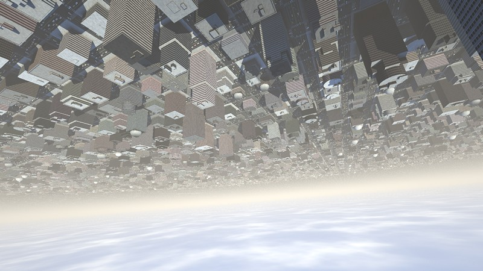
