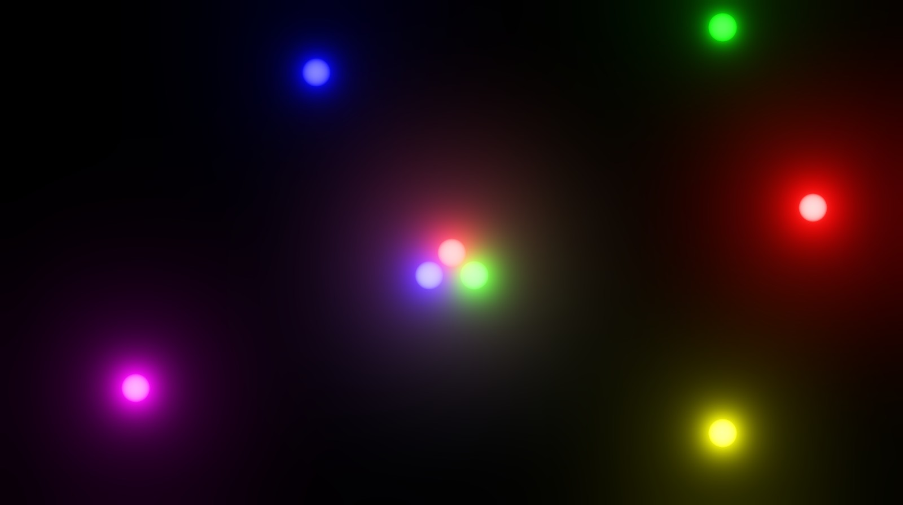

# Samples

Content:
* [2D](#2d)
* [3D](#3d)
* [Ray Tracing](#ray-tracing)
* [Order-Independent Transparency](#order-independent-transparency)
* [Games](#games)
* [Tools](#tools)
* [Tests](#tests)

## 2D

* [Bloom and tonemapping](https://github.com/azhirnov/as-en/blob/dev/AE/samples/res_editor/_data/scripts/samples-2d/Bloom.as) 

* [SDF and MSDF font with anti-aliasing](https://github.com/azhirnov/as-en/blob/dev/AE/samples/res_editor/_data/scripts/samples-2d/SdfFont.as)
* [Video texture](https://github.com/azhirnov/as-en/blob/dev/AE/samples/res_editor/_data/scripts/samples-2d/Video-1.as)
* [Video texture with multiplanar format](https://github.com/azhirnov/as-en/blob/dev/AE/samples/res_editor/_data/scripts/samples-2d/Video-2.as)
* [VR Video player](https://github.com/azhirnov/as-en/blob/dev/AE/samples/res_editor/_data/scripts/samples-2d/VRVideo-1.as)
* [VR Video player, texture with multiplanar format](https://github.com/azhirnov/as-en/blob/dev/AE/samples/res_editor/_data/scripts/samples-2d/VRVideo-2.as)
* [Material Depth Buffer](https://github.com/azhirnov/as-en/blob/dev/AE/samples/res_editor/_data/scripts/samples-2d/MaterialDepthBuffer.as)
* [Anti aliased grid](https://github.com/azhirnov/as-en/blob/dev/AE/samples/res_editor/_data/scripts/samples-2d/AA-Grid.as)
* [Gravity lens simulation](https://github.com/azhirnov/as-en/blob/dev/AE/samples/res_editor/_data/scripts/samples-2d/GravityLens.as) 

**Extensions:**
* [Draw to HDR display](https://github.com/azhirnov/as-en/blob/dev/AE/samples/res_editor/_data/scripts/samples-2d/HDR.as)
* [Binary tree with buffer reference](https://github.com/azhirnov/as-en/blob/dev/AE/samples/res_editor/_data/scripts/samples-2d/BufferReference.as) 

## 3D

**Relief mapping:** 
Supported precalculated TBN and screen-space TBN calculation. Debug drawing for TBN, UV, triangle border. 
* [Cube](https://github.com/azhirnov/as-en/blob/dev/AE/samples/res_editor/_data/scripts/samples-3d/Parallax-Cube.as) 

* [Cylinder inner side](https://github.com/azhirnov/as-en/blob/dev/AE/samples/res_editor/_data/scripts/samples-3d/Parallax-InnerCylinder.as)
* [Cylinder outer side](https://github.com/azhirnov/as-en/blob/dev/AE/samples/res_editor/_data/scripts/samples-3d/Parallax-Cylinder.as)
* [Sphere with 2D texture](https://github.com/azhirnov/as-en/blob/dev/AE/samples/res_editor/_data/scripts/samples-3d/Parallax-Sphere.as)
* [Sphere with cubemap](https://github.com/azhirnov/as-en/blob/dev/AE/samples/res_editor/_data/scripts/samples-3d/Parallax-Sphere2.as)

**Ray marching:**
* [Simple sphere tracing](https://github.com/azhirnov/as-en/blob/dev/AE/samples/res_editor/_data/scripts/samples-3d/SimpleSphereTracing.as) 

* [SDF used for collisions with camera](https://github.com/azhirnov/as-en/blob/dev/AE/samples/res_editor/_data/scripts/samples-3d/CameraCollision.as) 

* [Simple volumetric](https://github.com/azhirnov/as-en/blob/dev/AE/samples/res_editor/_data/scripts/samples-3d/Volumetric.as)

**Shadows:**
* [Shadow mapping](https://github.com/azhirnov/as-en/blob/dev/AE/samples/res_editor/_data/scripts/samples-3d/ShadowMap.as)

**Spherical cube:**
* [Skybox](https://github.com/azhirnov/as-en/blob/dev/AE/samples/res_editor/_data/scripts/samples-3d/Cubemap-1.as)
* [Skybox with procedural generation](https://github.com/azhirnov/as-en/blob/dev/AE/samples/res_editor/_data/scripts/samples-3d/Cubemap-2.as)
* [Planet generation](https://github.com/azhirnov/as-en/blob/dev/AE/samples/res_editor/_data/scripts/samples-3d/Planet-1.as)
* [Planet with tessellation](https://github.com/azhirnov/as-en/blob/dev/AE/samples/res_editor/_data/scripts/samples-3d/Planet-2.as) 

**Particles:**
* [Particles in gravimagnetic field](https://github.com/azhirnov/as-en/blob/dev/AE/samples/res_editor/_data/scripts/samples-3d/Particles-1.as) 

**Other:**
* [Reverse depth buffer](https://github.com/azhirnov/as-en/blob/dev/AE/samples/res_editor/_data/scripts/samples-3d/ReverseZ.as)
* [glTF scene rendering](https://github.com/azhirnov/as-en/blob/dev/AE/samples/res_editor/_data/scripts/samples-3d/Model.as)
* [glTF scene rendering with deferred texturing](https://github.com/azhirnov/as-en/blob/dev/AE/samples/res_editor/_data/scripts/samples-3d/DeferredTexturing.as)
* [SDF and MSDF font on 3D plane](https://github.com/azhirnov/as-en/blob/dev/AE/samples/res_editor/_data/scripts/samples-3d/SdfFont.as)
* [Frustum culling](https://github.com/azhirnov/as-en/blob/dev/AE/samples/res_editor/_data/scripts/samples-3d/FrustumCulling.as)
* [Render scene to the cubemap and apply different projections](https://github.com/azhirnov/as-en/blob/dev/AE/samples/res_editor/_data/scripts/samples-3d/RenderToCubemap.as) 

**Extensions:**
* [Fragment barycentrics](https://github.com/azhirnov/as-en/blob/dev/AE/samples/res_editor/_data/scripts/samples-3d/FSBarycentric.as)
* [Simple mesh shader with frustum culling](https://github.com/azhirnov/as-en/blob/dev/AE/samples/res_editor/_data/scripts/samples-3d/MeshShader-Cubes.as)
* [Fragment shading rate](https://github.com/azhirnov/as-en/blob/dev/AE/samples/res_editor/_data/scripts/samples-3d/ShadingRate.as)

## Ray Tracing

**Samples:**
* [Simple geometry with dynamic shadows](https://github.com/azhirnov/as-en/blob/dev/AE/samples/res_editor/_data/scripts/samples-rt/RT-Shadow.as) 

* [Cube with reflections and refractions](https://github.com/azhirnov/as-en/blob/dev/AE/samples/res_editor/_data/scripts/samples-rt/RT-MultiBounce.as) 

* [Dispersion in prism](https://github.com/azhirnov/as-en/blob/dev/AE/samples/res_editor/_data/scripts/samples-rt/Dispersion2D.as)
* [Dispersion in multiple prisms](https://github.com/azhirnov/as-en/blob/dev/AE/samples/res_editor/_data/scripts/samples-rt/Dispersion2DLayered.as) 

* [glTF scene tracing](https://github.com/azhirnov/as-en/blob/dev/AE/samples/res_editor/_data/scripts/samples-rt/RT-Model.as)

## Order-Independent Transparency

**Approximated OIT:**
* not implemented yet

**Exact OIT, only front or back faces:** 

* [Linked List](https://github.com/azhirnov/as-en/blob/dev/AE/samples/res_editor/_data/scripts/samples-3d/OIT-LinkedList-1.as)
* [Ray tracing, back to front](https://github.com/azhirnov/as-en/blob/dev/AE/samples/res_editor/_data/scripts/samples-rt/OIT-1.as)
* [Ray tracing, front to back](https://github.com/azhirnov/as-en/blob/dev/AE/samples/res_editor/_data/scripts/samples-rt/OIT-2.as)
* [Ray tracing, using any-hit shader](https://github.com/azhirnov/as-en/blob/dev/AE/samples/res_editor/_data/scripts/samples-rt/OIT-3.as)

**Front and back faces with optical depth for volume:** 

* [Linked List](https://github.com/azhirnov/as-en/blob/dev/AE/samples/res_editor/_data/scripts/samples-3d/OIT-LinkedList-2.as)
* [Ray tracing](https://github.com/azhirnov/as-en/blob/dev/AE/samples/res_editor/_data/scripts/samples-rt/OIT-4.as)

## Games

ResEditor allows to create game prototypes.

* [2D Labyrinth](https://github.com/azhirnov/as-en/blob/dev/AE/samples/res_editor/_data/scripts/games/2d-Labyrinth.as)
* [Flight](https://github.com/azhirnov/as-en/blob/dev/AE/samples/res_editor/_data/scripts/games/3d-Flight.as) 

## Tools

* [Image compression](https://github.com/azhirnov/as-en/blob/dev/AE/samples/res_editor/_data/scripts/tools/2d/ImageCompression.as)

**Function graphs**
* [Easing functions](https://github.com/azhirnov/as-en/blob/dev/AE/samples/res_editor/_data/scripts/tools/2d/Easing.as)
* [Sqrt, Exp, ...](https://github.com/azhirnov/as-en/blob/dev/AE/samples/res_editor/_data/scripts/tools/2d/Graph1.as)

**Gradient builder**
* [Lerp](https://github.com/azhirnov/as-en/blob/dev/AE/samples/res_editor/_data/scripts/tools/color/Grad1D-1.as)
* [Spline 2-segment](https://github.com/azhirnov/as-en/blob/dev/AE/samples/res_editor/_data/scripts/tools/color/Grad1D-2.as)
* [Spline 3-segment](https://github.com/azhirnov/as-en/blob/dev/AE/samples/res_editor/_data/scripts/tools/color/Grad1D-3.as)
* [Spline 4-segment](https://github.com/azhirnov/as-en/blob/dev/AE/samples/res_editor/_data/scripts/tools/color/Grad1D-4.as) 

**Hash functions**
* [Float32 Hash](https://github.com/azhirnov/as-en/blob/dev/AE/samples/res_editor/_data/scripts/tools/noise/HashFp32.as)
* [Float16 Hash](https://github.com/azhirnov/as-en/blob/dev/AE/samples/res_editor/_data/scripts/tools/noise/HashFp16.as)

**Noise functions**
* [Circle](https://github.com/azhirnov/as-en/blob/dev/AE/samples/res_editor/_data/scripts/tools/noise/Circle.as)
* [Terrain](https://github.com/azhirnov/as-en/blob/dev/AE/samples/res_editor/_data/scripts/tools/noise/Terrain.as) 

* [Sphere/Cubemap](https://github.com/azhirnov/as-en/blob/dev/AE/samples/res_editor/_data/scripts/tools/noise/Sphere.as)
* [Volume](https://github.com/azhirnov/as-en/blob/dev/AE/samples/res_editor/_data/scripts/tools/noise/Volume.as)

## Tests
**2D**
* [Color interpolation](https://github.com/azhirnov/as-en/blob/dev/AE/samples/res_editor/_data/scripts/tests/ColorLerp.as)
* [Compute pass](https://github.com/azhirnov/as-en/blob/dev/AE/samples/res_editor/_data/scripts/tests/Compute.as)
* [Cooperative matrix](https://github.com/azhirnov/as-en/blob/dev/AE/samples/res_editor/_data/scripts/tests/CoopMatrix.as)
* [Multiple passes](https://github.com/azhirnov/as-en/blob/dev/AE/samples/res_editor/_data/scripts/tests/MultiPassTest.as)
* [NaN in shader](https://github.com/azhirnov/as-en/blob/dev/AE/samples/res_editor/_data/scripts/tests/NaN.as)
* [Projections](https://github.com/azhirnov/as-en/blob/dev/AE/samples/res_editor/_data/scripts/tests/ScreenProjection.as)
* [Shadertoy default shader](https://github.com/azhirnov/as-en/blob/dev/AE/samples/res_editor/_data/scripts/tests/ShadertoyDefault.as)
* [White color spectrum](https://github.com/azhirnov/as-en/blob/dev/AE/samples/res_editor/_data/scripts/tests/Spectrum.as)
* [Derivatives in FS and CS](https://github.com/azhirnov/as-en/blob/dev/AE/samples/res_editor/_data/scripts/tests/Derivatives.as)
* [Normal packing](https://github.com/azhirnov/as-en/blob/dev/AE/samples/res_editor/_data/scripts/tests/NormalPacking.as)
* [Smooth normal calculation](https://github.com/azhirnov/as-en/blob/dev/AE/samples/res_editor/_data/scripts/tests/SmoothNormal.as)
* [TBN calculation](https://github.com/azhirnov/as-en/blob/dev/AE/samples/res_editor/_data/scripts/tests/SmoothTBN.as)

**3D**
* [Indirect draw test](https://github.com/azhirnov/as-en/blob/dev/AE/samples/res_editor/_data/scripts/tests/IndirectDraw.as)
* [Spherical Cube: triangle area](https://github.com/azhirnov/as-en/blob/dev/AE/samples/res_editor/_data/scripts/sphere/SphericalCube-1.as)
* [Spherical Cube: texture projection](https://github.com/azhirnov/as-en/blob/dev/AE/samples/res_editor/_data/scripts/sphere/SphericalCube-2.as)
* [Spherical Cube: circle distortion](https://github.com/azhirnov/as-en/blob/dev/AE/samples/res_editor/_data/scripts/sphere/SphericalCube-3.as)
* [Spherical Cube: 3D to texture](https://github.com/azhirnov/as-en/blob/dev/AE/samples/res_editor/_data/scripts/sphere/SphericalCube-4.as)
* [Procedural sphere](https://github.com/azhirnov/as-en/blob/dev/AE/samples/res_editor/_data/scripts/sphere/UVSphere-1.as)
* [Triangulation-1](https://github.com/azhirnov/as-en/blob/dev/AE/samples/res_editor/_data/scripts/tests/Triangulation-1.as)
* [Triangulation-2](https://github.com/azhirnov/as-en/blob/dev/AE/samples/res_editor/_data/scripts/tests/Triangulation-2.as)
* [Procedural grid](https://github.com/azhirnov/as-en/blob/dev/AE/samples/res_editor/_data/scripts/tests/ProceduralGrid.as)

**Export**
* [3D Image export](https://github.com/azhirnov/as-en/blob/dev/AE/samples/res_editor/_data/scripts/tests/ImageExport-3D.as), [import](https://github.com/azhirnov/as-en/blob/dev/AE/samples/res_editor/_data/scripts/tests/ImageImport-3D.as)
* [Cube Map export](https://github.com/azhirnov/as-en/blob/dev/AE/samples/res_editor/_data/scripts/tests/ImageExport-CubeMap.as), [import](https://github.com/azhirnov/as-en/blob/dev/AE/samples/res_editor/_data/scripts/tests/ImageImport-CubeMap.as)
* [Buffer export](https://github.com/azhirnov/as-en/blob/dev/AE/samples/res_editor/_data/scripts/tests/BufferExport.as)

**Ray tracing**
* [Triangles with transformation](https://github.com/azhirnov/as-en/blob/dev/AE/samples/res_editor/_data/scripts/tests/RayTracing-1.as)
* [Triangles, update instances every frame](https://github.com/azhirnov/as-en/blob/dev/AE/samples/res_editor/_data/scripts/tests/RayTracing-2.as)
* [Animated grid, vertices updated every frame](https://github.com/azhirnov/as-en/blob/dev/AE/samples/res_editor/_data/scripts/tests/RayTracing-3.as)
* [Multiple triangles, used `BuildRTSceneIndirect()`](https://github.com/azhirnov/as-en/blob/dev/AE/samples/res_editor/_data/scripts/tests/RayTracing-4.as)
* [Animated grid, used `BuildRTGeometryIndirect()`](https://github.com/azhirnov/as-en/blob/dev/AE/samples/res_editor/_data/scripts/tests/RayTracing-5.as)
* [Triangle in recursive ray tracing](https://github.com/azhirnov/as-en/blob/dev/AE/samples/res_editor/_data/scripts/tests/RayTracing-6.as)
* [Callable shader](https://github.com/azhirnov/as-en/blob/dev/AE/samples/res_editor/_data/scripts/tests/RayTracing-7.as)

**sRGB**
* [gamma-correct blending](https://github.com/azhirnov/as-en/blob/dev/AE/samples/res_editor/_data/scripts/tests/sRGB-Blend.as), [v2](https://github.com/azhirnov/as-en/blob/dev/AE/samples/res_editor/_data/scripts/tests/sRGB-Blend2.as)
* [gamma-correct upscale](https://github.com/azhirnov/as-en/blob/dev/AE/samples/res_editor/_data/scripts/tests/sRGB-Upscale.as) 

**Performance**
* [Render target compression](https://github.com/azhirnov/as-en/blob/dev/AE/samples/res_editor/_data/scripts/perf/RTCompression.as)
* [FP16 mul/add performance](https://github.com/azhirnov/as-en/blob/dev/AE/samples/res_editor/_data/scripts/perf/Inst-fp16.as)
* [FP32 mul/add performance](https://github.com/azhirnov/as-en/blob/dev/AE/samples/res_editor/_data/scripts/perf/Inst-fp32.as)
* [Subgroups in fullscreen](https://github.com/azhirnov/as-en/blob/dev/AE/samples/res_editor/_data/scripts/perf/Subgroups-1.as), [Subgroups with multiple triangles](https://github.com/azhirnov/as-en/blob/dev/AE/samples/res_editor/_data/scripts/perf/Subgroups-2.as) 

