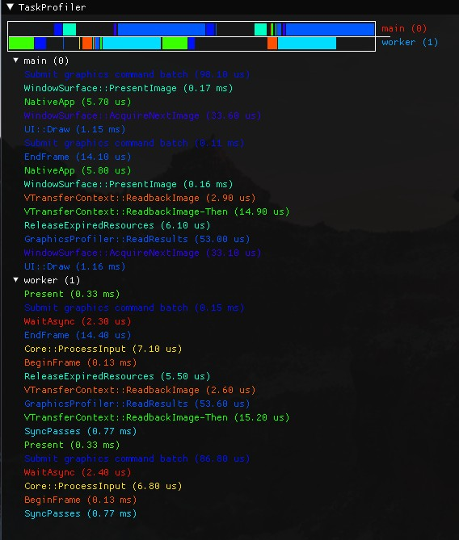
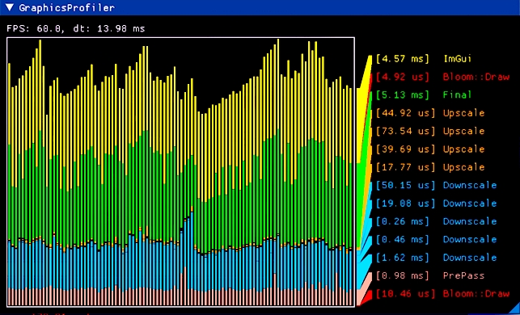
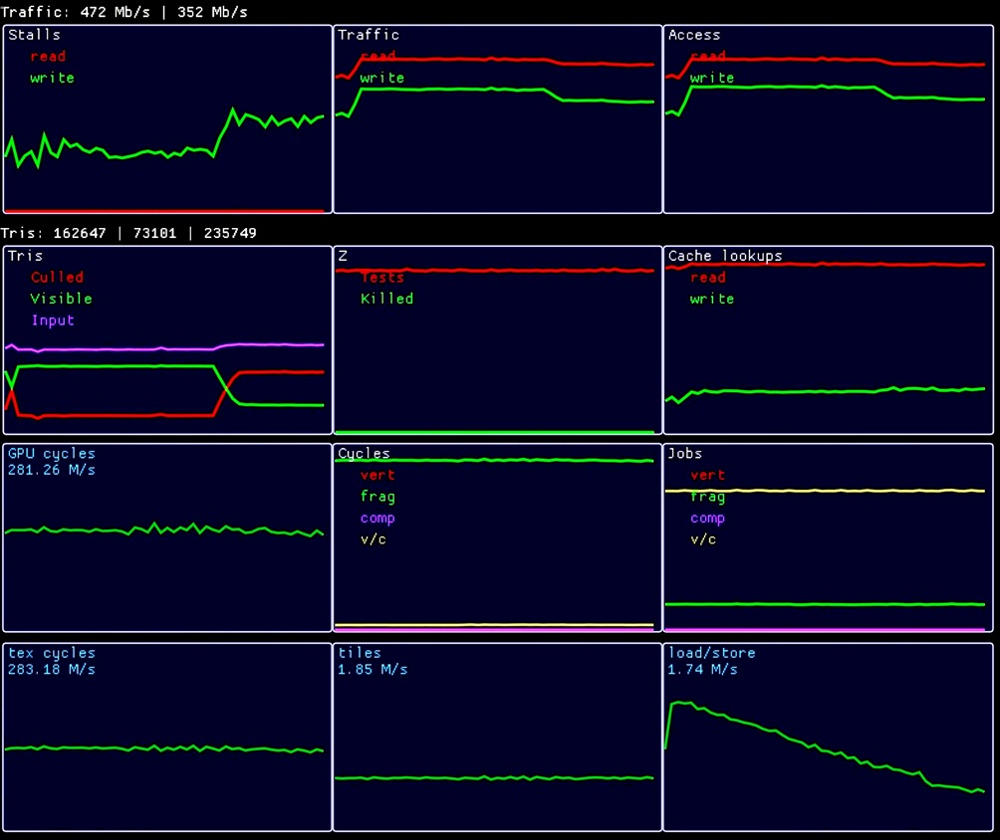

Builtin and external profiling & debugging tools.

## Task profiling

Measure task begin/end time and draw graph.




## Graphics profiling

Measure pass begin/end time and draw graph.




## HW Counters

Used hardware performance counters for ARM platform (Mali and Adreno).




## Shader trace

<details>
<summary>Example of shader trace</summary>

```cpp
//> gl_GlobalInvocationID: uint3 {8, 8, 0}
//> gl_LocalInvocationID: uint3 {0, 0, 0}
//> gl_WorkGroupID: uint3 {1, 1, 0}
no source

//> index: uint {136}
//  gl_GlobalInvocationID: uint3 {8, 8, 0}
11. index = gl_GlobalInvocationID.x + gl_GlobalInvocationID.y * gl_NumWorkGroups.x * gl_WorkGroupSize.x;

//> size: uint {256}
12. size = gl_NumWorkGroups.x * gl_NumWorkGroups.y * gl_WorkGroupSize.x * gl_WorkGroupSize.y;

//> value: float {0.506611}
//  index: uint {136}
//  size: uint {256}
13. value = sin( float(index) / size );

//> imageStore(): void
//  gl_GlobalInvocationID: uint3 {8, 8, 0}
//  value: float {0.506611}
14.     imageStore( un_OutImage, ivec2(gl_GlobalInvocationID.xy), vec4(value) );
```
The `//>` symbol marks the modified variable or function result.
</details>

<details>
<summary>Example of shader profiling output</summary>

```cpp
//> gl_GlobalInvocationID: uint3 {512, 512, 0}
//> gl_LocalInvocationID: uint3 {0, 0, 0}
//> gl_WorkGroupID: uint3 {64, 64, 0}
no source

// subgroup total: 100.00%,  avr: 100.00%,  (95108.00)
// device   total: 100.00%,  avr: 100.00%,  (2452.00)
// invocations:    1
106. void main ()

// subgroup total: 89.57%,  avr: 89.57%,  (85192.00)
// device   total: 89.56%,  avr: 89.56%,  (2196.00)
// invocations:    1
29. float FBM (in float3 coord)

// subgroup total: 84.67%,  avr: 12.10%,  (11504.57)
// device   total: 84.18%,  avr: 12.03%,  (294.86)
// invocations:    7
56. float GradientNoise (const float3 pos)

// subgroup total: 45.15%,  avr: 0.81%,  (766.86)
// device   total: 44.54%,  avr: 0.80%,  (19.50)
// invocations:    56
72. float3 DHash33 (const float3 p)
```
</details>

<details>
<summary>Example of shader profiling heatmap</summary>


</details>


## External tools

#### NSigh Graphics

 * Mesh shader debug/profile
 * Ray tracing debug/profile
 * Ray query debug/profile
 * Graphics debug/profile
 * Async compute debug/profile
 * Synchronizations debug/profile
 * [VNvPerf](../src/graphics/Vulkan/Utils/VNvPerf.h) class  for interaction

#### RenderDoc

 * Graphics debugging
 * Don't use for profiling!
 * [RenderDocApi](../src/platform/Utils/RenderDocApi.h) class for interaction
 * `IBaseContext::DebugMarker()`, `IBaseContext::PushDebugGroup()`, `IBaseContext::PopDebugGroup()` methods for interaction
 
#### Intel VTune / AMD uProf

 * CPU profiling
 * CPU cache profiling 

#### Visual Studio

 * CPU performance profiling (timings)
 * Memory debug/profile (mem leaks)

#### Vulkan validation layers

 * Vulkan debugging
 * Synchronizations debugging
 * [EDeviceValidation](../src/graphics/Public/GraphicsCreateInfo.h) flags for interaction

